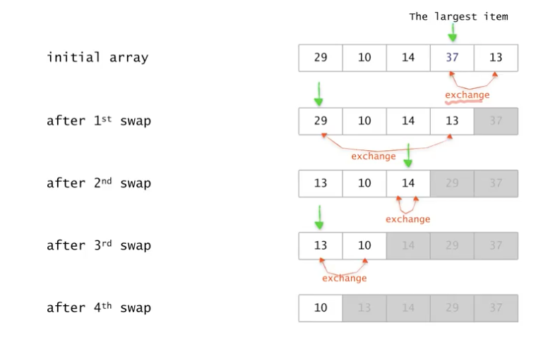
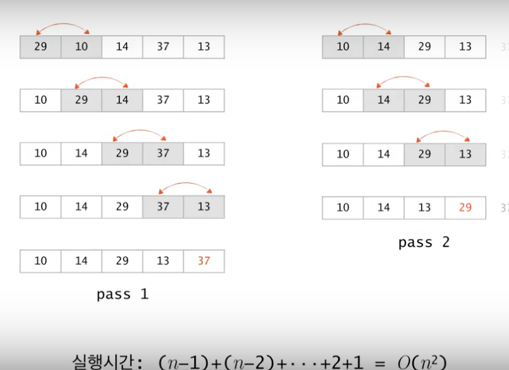
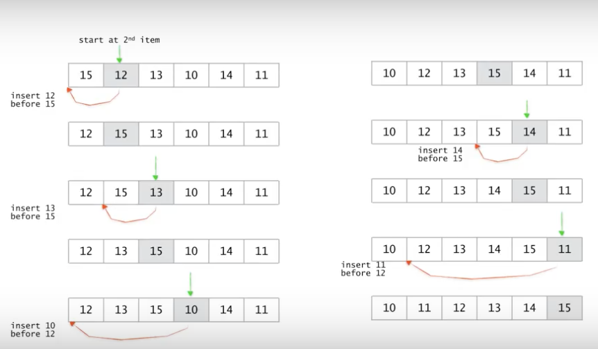
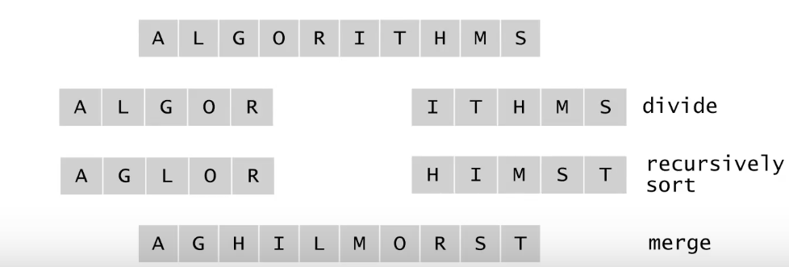
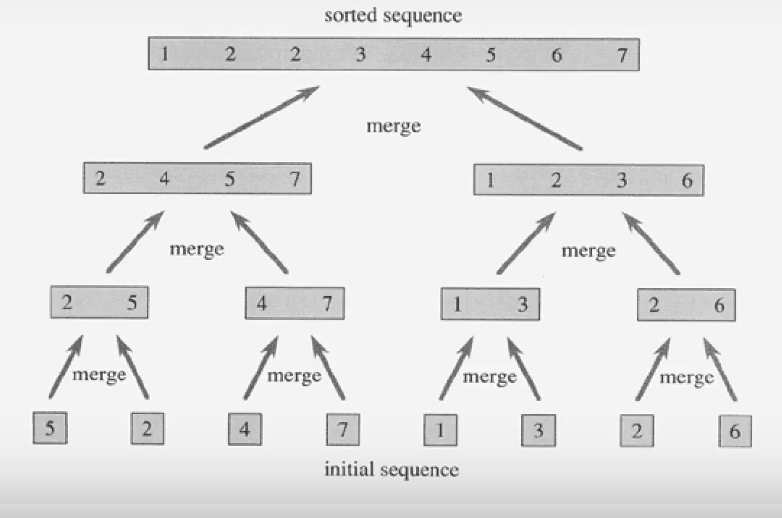
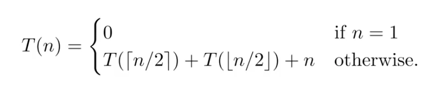
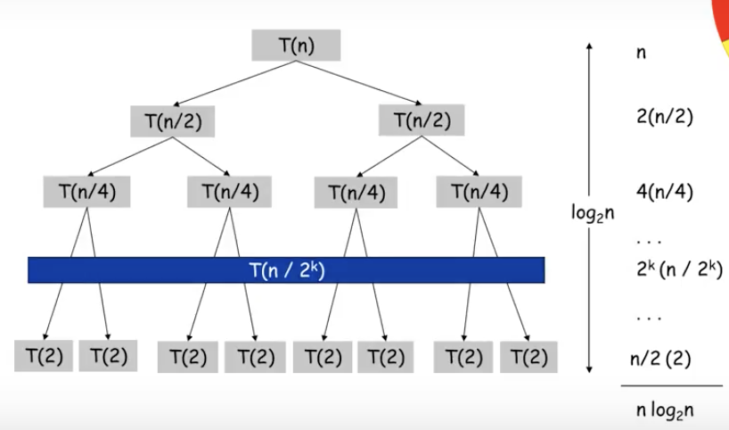

= 정렬(Updated)

=== 기본적인 정렬 알고리즘

===== 정렬 알고리즘
* Simple, Slow
** Bubble sort
** Insertion sort
** Selection sort
* Fast
** Quick sort
** Merge sort
** Heap sort
* O(N)
** Radix sort

=== Selection Sort

===== 순서
. 가장 큰 값을 찾음
. 마지막 자리와 이전 자리를 바꿈
. 다음 큰 값을 찾음
. 마지막 이전 자리와 자리를 바꿈
. 마지막 두개 데이터가 남을 때까지 반복함

===== 수도코드
* 실행시간
** # 1 => for 루프는 n-1번 반복
** # 2 => 가장 큰 수를 찾기 위한 비교횟수 -> n-1, n-2, ..., 2, 1
** # 3 => 교환은 상수시간 작업
** T(n) = (n-1) + (n-2) + ... + 2 + 1 = O(n^2)
** n^2 => 최악, 최선의 경우 평균임. 모든 경우를 따지기 때문

----
// 배열 A[1...n]을 정렬함
selectionSort(A[], n) {     
    for last <- n downto 2 {                    // # 1
        A[1...last] 중 가장 큰 수 A[k]를 찾음;  // # 2
        A[k] <-> A[list]; -> A[k]와 A[last]의 값을 교환   // # 3                    
    }
}
----

===== Class SelectionSort

[source, java]
----
public class SelectionSort {
    public static void main(String[] args) {
        int[] list = { 10, 44, 30, 20, 100, 87, 54, 34, 45, 22 };
        int n = list.length;

        selectionSort(list, n);

        for(int i=0 ; i<n ; i++) {
            System.out.print(list[i] + " ");
        }
    }

    public static void selectionSort(int[] list, int n) {
        int last, temp = 0;

        for(int i=0 ; i<n-1 ; i++) {
            last = i;

            for(int j=i+1 ; j<n ; j++) {
                if (list[j] < list[last]) {
                    last = j;
                }
            }

            if(i != last) {
                temp = list[i];
                list[i] = list[last];
                list[last] = temp;
            }
        }
    }
}
----

=== Bubble Sort

===== 순서
* Selection Sort 기본 아이디어는 비슷하지만 최대값을 마지막으로 보내는 세부적인 방법이 다름
. 첫번째 값을 두번째 값과 비교해서 첫번째 값이 크면 바꿈
. 두번째 값과 세번째 값을 비교하고 두번째 값이 크면 바꿈
. 1, 2, ..., n-1 과정을 반복함

===== 수도코드
* 실행시간
** # 1 => for 루프는 n-1번 반복
** # 2 => for 루피는 각각 n-1, n-2, ... , 2, 1번 반복 
** # 3 => 교환은 상수시간 작업
** T(n) = (n-1) + (n-2) + ... + 2 + 1 = O(n^2)
** 최악, 최선의 경우 평균

----
// 배열 A[1...n]을 정렬함
bubbleSort(A[], n) {
    for last <- n downto 2 {        // # 1
        for i <- 1 to last-1 {      // # 2
            if (A[i] > A[i+1]) then A[i] <-> A[i+1];    // # 3. 교환
        }
    }
}
----

===== Class BubbleSort

[source, java]
----
public class BubbleSort {
    public static void main(String[] args) {
        int[] list = { 10, 44, 30, 20, 100, 87, 54, 34, 45, 22 };
        int n = list.length;

        bubbleSort(list, n);

        for(int i=0 ; i<n ; i++) {
            System.out.print(list[i] + " ");
        }
    }

    public static void bubbleSort(int[] list, int n) {
        int temp = 0;

        for(int i=n-1 ; i>0 ; i--) {
            for(int j=0 ; j<i ; j++) {
                if(list[j] > list[j+1]) {
                    temp = list[j];
                    list[j] = list[j+1];
                    list[j+1] = temp;
                }
            }
        }
    }
}
----

=== Insertion Sort

===== 순서
. 첫번째와 두번째 값을 비교하여 정렬함
. 세번째 값을 앞에 정렬이 된 값들과 비교하여 정렬이 된 값들 사이에 끼워넣어 정렬된 상태로 만듦
. 네번째 값을 앞에 정렬이 된 값들과 비교하여 정렬이 된 값들 사이에 끼워넣어 정렬된 상태로 만듦
. 마지막 값을 앞에 정렬이 된 값들과 비교하여 정렬이 된 값들 사이에 끼워넣어 정렬된 상태로 만듦
. n-1번째까지 정렬된 값들을 비교하여 n번째 데이터를 끼워넣어서 정렬된 상태로 만듦
** 앞에서부터 값을 비교하여 사이에 끼워넣음
** 뒤에서부터 값을 비교하여 사이에 끼워넣음
** 앞에서부터 값을 비교하고 사이에 넣으면 모든 데이터를 한번씩 건드려야 함. 정렬하고자 하는 데이터가 배열로 저장되어 있기 때문임
** 뒤에서부터 값을 비교하고 사이에 넣으면 앞에 있는 데이터를 건드릴 필요 없이 뒤에 있는 데이터만 건드리면 됨

===== 수도코드
* 실행시간
** # 1 => for 루프는 n-1번 반복
** # 2 => 삽입은 최악의 경우 i-1번 비교함
** 최악의 경우
*** T(n) = (n-1) + (n-2) + ... + 2 + 1 = O(n^2)

----
// 배열 A[1...n]을 정렬함
insertionSort(A[], n) {
    for <- 2 to n {     // # 1
        A[1...i]의 적당한 자리에 A[i]를 삽입함 // # 2
    }
}
----

===== Class InsertionSort

[source, java]
----
public class InsertionSort {
    public static void main(String[] args) {
        int[] list = { 10, 44, 30, 20, 100, 87, 54, 34, 45, 22 };
        int n = list.length;

        insertionSort(list, n);

        for(int i=0 ; i<n ; i++) {
            System.out.print(list[i] + " ");
        }
    }

    public static void insertionSort(int[] list, int n) {
        int key, j = 0;

        for(int i=1 ; i<n ; i++) {
            key = list[i];

            for(j=i-1 ; j>=0 && list[j]>key ; j--) {
                list[j+1] = list[j];
            }

            list[j+1] = key;
        }
    }
}
----

=== Merge Sort

===== 분할정복법
* 분할 => 해결하고자 하는 문제를 _작은 크기의 동일한 문제들로 분할_
* 정복 => 각각 작은 문제를 _순환적_ 으로 해결
* 합병 => 작은 문제의 해를 합하여(merge) 원래 문제에 대한 해를 구함

===== Merge Sort
* 데이터가 저장된 배열을 절반으로 나눔
* 각각을 순환적으로 정렬
* 정렬된 두 개의 배열을 합쳐 전체를 정렬함
* 실행시간

===== 수도코드

----
// A[p...r]를 정렬함
mergeSort(A[], p, r) {
    if(p < r) then {
        q <- (p+q)/2;           // # 1. p, q의 중간지점 계산
        mergeSort(A, p, q);     // # 2. 전반부 정렬
        mergeSort(A, q+1, r);   // # 3. 후반부 정렬
        merge(A, p, q, r);      // # 4. 합병
    }
}

merge(A[], p, q, r) {
    정렬되어 있는 두 배열 A[p, ... ,q]와 A[q+1,...,r]을 합하여
    정렬된 하나의 배열 A[p, ... ,q]를 만듬
}
----

===== Class MergeSort

[source, java]
----
public class MergeSort {
    private final static int MAX_SIZE = 10;
    private static int[] sortedItems = new int[MAX_SIZE];

    public static void main(String[] args) {
        int[] list = { 10, 44, 30, 20, 100, 87, 54, 34, 45, 22 };

        mergeSort(list, 0,  list.length-1);

        for(int i=0 ; i<list.length ; i++) {
            System.out.print(list[i] + " ");
        }
    }

    private static void mergeSort(int[] list, int begin, int end) {
        int middle = 0;

        if(begin < end) {
            middle = (begin + end) / 2;                 // 중간지점 계산
            mergeSort(list, begin, middle);             // 전반부 정렬
            mergeSort(list,middle + 1, end);            // 후반부 정렬
            merge(list, begin, middle, end);            // 합병
        }
    }

    /*
        10 44 0 0 0 0 0 0 0 0
        10 30 44 0 0 0 0 0 0 0
        10 30 44 20 100 0 0 0 0 0
        10 20 30 44 100 0 0 0 0 0
        10 20 30 44 100 54 87 0 0 0
        10 20 30 44 100 34 54 87 0 0
        10 20 30 44 100 34 54 87 22 45
        10 20 30 44 100 22 34 45 54 87
        10 20 22 30 34 44 45 54 87 100
     */
    private static void merge(int[] list, int begin, int middle, int end) {
        int i = begin;		// 정렬된 왼쪽 리스트 Index
        int j = middle + 1;	// 정렬된 오른쪽 리스트 Index
        int k = begin;		// 정렬된 리스트 Index

        while(i <= middle && j <= end) {
            if(list[i] <= list[j]) {
                sortedItems[k++] = list[i++];
            } else {
                sortedItems[k++] = list[j++];
            }
        }

        if(i > middle) {
            for(int l=j ; l<=end ; l++) {
                sortedItems[k++] = list[l];
            }
        } else {
            for(int l=i; l<=middle ; l++) {
                sortedItems[k++] = list[l];
            }
        }

        for(int l=begin ; l<=end ; l++) {
            list[l] = sortedItems[l];
        }
    }
}
----

=== 참고
* https://www.inflearn.com/course/%EC%95%8C%EA%B3%A0%EB%A6%AC%EC%A6%98-%EA%B0%95%EC%A2%8C/[인프런 - 영리한 프로그래밍을 위한 알고리즘 강좌]