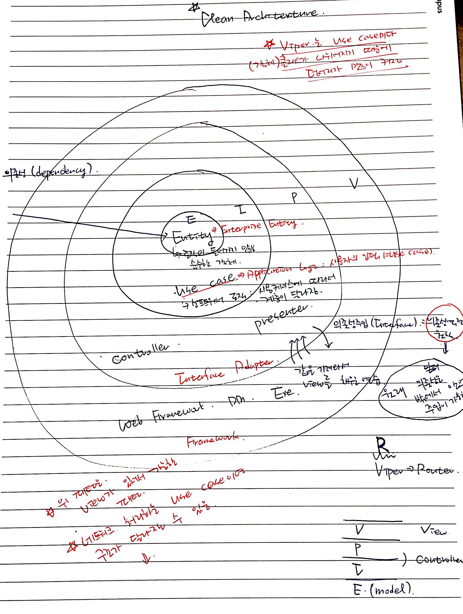
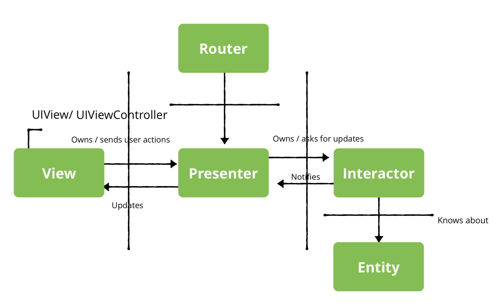

# Clean Architecture in iOS

### Clean Architecture 

##### 특징
* 유연성
* 유지 보수성
* 테스트 가능성
* 계층화 아키텍처를 만들기 위한 메타 아키텍처
* 관심사 분리

##### Meta Architecture
* 개인적인 생각은 아래 링크에서 이 부분이 핵심인 것 같음. _내부, 외부 상호작용 덕분에 발생하는 요구사항을 시스템에 어떻게 반영할 것인가_ 
* [Deep Thinking on The Architecture of Architecture: Meta-Architecture](https://blogs.msdn.microsoft.com/zen/2013/02/20/deep-thinking-on-the-architecture-of-architecture-meta-architecture/) 

##### Clean Architecture를 위한 기준
* UI, 프레임워크, 서비스가 각각 독립적으로 움직여야 함
* 테스트가 유연해야 함

### Viper

##### View
* Presenter에게 사용자 입력을 전달함
* Presenter가 어떤 데이터를 보여줄 것인지 View에게 알려줌
* View, View Controller는 수동적임

##### Interator
* 비즈니스 로직이 모두 모여있음
* 한 개의 Use Case를 나타냄
* Entity 변화를 Presenter에게 알려줌
* _PONSO(Plain Old NSObject) ?_
* PONSO은 `Pojo` 와 비슷함
* 특정 규약(contract)에 종속되지 않음 (언어와 꼭 필요한 API 외에 종속되지 않음)
* 특정 환경에 종속되지 않음
* PONSO 사용하는 이유?
* 코드의 간결함 (비즈니스 로직과 특정 환경/low 레벨 종속적인 코드를 분리하므로 단순함)
* 자동화 테스트에 유리 (환경 종속적인 코드는 자동화 테스트가 어렵지만, POJO는 테스트가 매우 유연함
* 객체 지향적 설계의 자유로운 사용
* UI 독립적이어야 함. 다른 iOS 앱이나 Mac 앱에 가져다 놓더라도 동작해야 함

##### Presenter
* PONSO(Plain Old NSObject)
* UI 동작과 관련된 로직이 있음
* View와 분리됨. 즉, View가 UIButton이나 UILabel 등 어떤 요소를 가졌는지 모름
* Interator에서 전달된 데이터를 View에 업데이트함
* 언제 어떤 화면으로 가는지 알고 있어야 함
* 사용자 입력에 반응하고 관련 반응에 대해 업데이트할지 물어봄

##### Router
* 지금 화면에서 어떤 화면으로 갈지 다룸
* 어떻게 화면 간 이동을 해야 하는지 알고 있어야 함
* View와 View Controller를 생성하고 현재 장면을 보여줌
* 모든 화면 처리에서 애니메이션을 유지해야 함
* UIWindow, UIView, UIViewController를 가지고 있음

##### 참고
* [RWDevCon 2018](http://rwdevcon.com)
* [The Clean Architecture](https://8thlight.com/blog/uncle-bob/2012/08/13/the-clean-architecture.html)