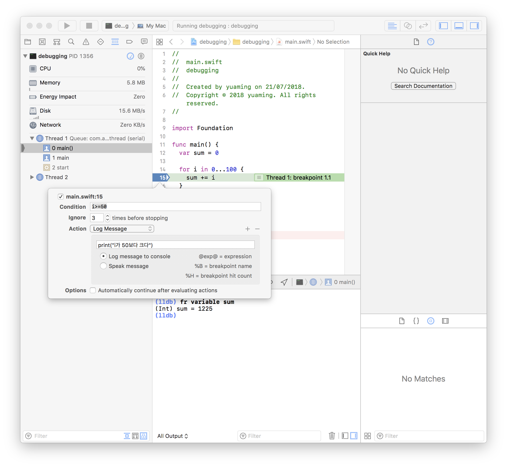
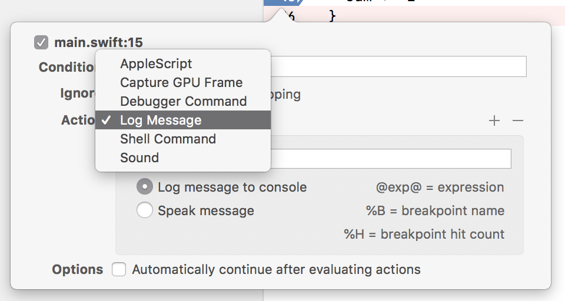

= let us: Go 2018!

=== XCode에서 디버깅하기

===== Breakpoint
* General Breakpoint

===== LLDB
* http://lldb.llvm.org[The LLDB Debugger]
* 변수선언
** e let S$a = 2
** p/x 16 => 10진수 
** p/o 16 => 8진수
** p/t 16 => 2진수
* Closure
** `fr v $0`
* expr
** e self.view.backgroundColor = .red 
** 이용하면 컴파일 없이 배경화면을 바꿀 수 있음

===== Symbolicate
* 버전에 해당하는 dSYMS 파일을 받아서 크래시를 확인할 수 있음
* Archive에서 두 번째 탭에서 확인할 수 있음
* https://possiblemobile.com/2015/03/symbolicating-your-ios-crash-reports/[Symbolicating your iOS crash reports]

===== 기타
* #DEBUG
** other swift flag
** Relase 버전에서 이 코드를 사용하고 싶지 않지만 Dev에만 필요함 

[source, swift]
----
#if DEBUG

#endif
----

=== 코드 응집도 높이기

===== 단순하게 이야기하려고 함 :)
* Disk Defragment = Code Defragment

===== 장점
* 읽기가 편해짐
* 흐름 파악하기 좋음
* 코드 이해하기 좋음
* 쉽게 찾을 수 있음
* 유지보수가 쉬움

===== 목표
* *분산되어 있는 코드를 관련 있는 코드끼리 모아두는 것이 목표임*

===== Cases
* Data, Logic, UI
* Data Setter
** 값을 바뀌는 부분을 한 군데다가 둠
* Overrides 
** 구현해야 할 위치가 정해져 있음. Navigation 관련된 코드가 파편화 되어 있음
** BaseViewController를 만들고 BaseViewController 안에 관련 클로저를 호출하도록 만듦
** 라이프 사이클 관리하기 힘들지 않냐? 코드 응집도를 이야기 함
* Selector 
** keyboardEventWrapper를 만듦
* Delegate
** Wrapper를 만듦
* *Wrapper를 만들어서 관련된 코드를 모으고 Wrapper 함수를 호출함*

===== Advanced Cases
* Data, Logic, UI
** 단위별로 응집도를 올림
* DataSetter
** RxSwift, RxCocoa를 이용함
** *관련된 코드를 한 곳으로 모으는 것도 있지만, 불필요한 코드를 제거하는 것도 중요함*
* Overrides
** RxViewController를 사용함
* Selector, Delegate
** Rx를 사용하면 간단해짐

===== Proxy
* Subject를 통해서 Subject 이벤트를 연결해주는 방식을 취함
* BaseViewController를 만들고 BaseViewController 안에 관련 클로저를 호출하도록 만듦

===== Summary
* View
* ViewController 
* Context => Business Logic, View Model
* Model

=== RxSwift Operator 적재적소 사용하기

===== FlatMap
* API 콜할 때, API 관련 Observable 리턴할 때 
* 연속으로 클릭할 때 이벤트가 섞임
* FlatMapFirst  
** 먼저 생성된 옵저버블이 끝나기 전까지 들어오는 이벤트를 무시함
** 스크롤를 통해 처음 내용을 불러올 때
** API가 끝나기 전까지 다른 API를 부르지 않음
* FlatMapLatest => 이벤트가 들어오면 앞에 생성된 옵저버블을 무시함
** 카톡에서 서버랑 유저의 정합성이 맞아야 하는 API는 아님. 빠르게 누르는 것이 중요함. 결론은 API 호출을 빠르게 하는 것이 중요함

===== Side Effect
* 댓글 작성

[source, swift]
----
// Side Effect가 발생할 수 있음
sendButton.rx.tap.flatmap { [weak self] in
    // 클로저 외부를 직접 전급
    send(message: self?.textField.text)
}

// withLatestFrom: Side Effect 해소
sendButton.rx.tap
    // 인자로 넣음
    .withLatestFrom(textField.rx.text)
    .flatMap { message in 
        // 텍스트 매개변수로 받아옴
        send(message: message)
    }
----

* Side Effect가 있으면 안되는 곳
** map
** flatMap
** 다른 형태로 바꾸는 것이기 때문에 Side Effect가 발생하면 안됨
* Side Effect가 있어도 괜찮은 곳
** do
** subcribe => subscribe이기 때문에 `self` 접근이 가능함

===== window
* 이벤트 합치기 용도
* 앞부분에서 subscibe, 뒷부분에서 completed. 그래서 시작과 끝부분을 이용할 수 있음
* window 단위로 끊어짐. window를 작은 Observable를 생각하면 됨

===== scan
* 이전 이벤트와 현재 들어온 이벤트를 가지고 현재 발행할 새 이벤트를 만듦
* answer => 이전 값
* element => 현재 값
* window로 비밀번호 자리수로 확인 할 수 있음. `scan + window 조합`

===== Switch
* 여러 옵저버블을 하나의 옵저버블로 만듦. 내부 옵저버블을 새 옵저버블로 갈아치움
* subscribe 한 상태에서 아이디가 바뀐다면?

[source, swift]
----
// 이전 상황
EmotionKeyboardService.instance.rx.emotions(id: 100)
    .subscribe()
    .disposed(by: disposeBag)

// 아이디가 바뀐다면 ?

disposeBag = DisposeBag()

EmotionKeyboardService.instance.rx.emotions(id: 101)
    .subscribe()
    .disposed(by: disposeBag)
----

=== iOS TDD 실무에 적용하기

===== 전제조건
* 팀 설득 
** "익숙하지 않는 것", " 새로운 것", "모르는 것"에 대한 두려움 
* 거부감 해소
** 지식 전달 하는 방법

===== 흔히 하는 실수
* 동료들의 실력이 부족해
* 우리 팀은 진보적이지 않아
* 설득에 필요한 충분한 개발적 역량을 가지고 있는가?
* 그 역량이 동료들에게 신뢰를 주고 있는가?

===== 동료 설득(다양한 타입의 개발자 설득하기)
* 가르치는 느낌이 들면 안됨. 존중 받는 느낌이 들게:)
* 함께 베스트 프랙티스를 찾아보자고 제안
* 페어코딩, 몹코딩
** 구성원 모두 실무에 적용할 만한 지식과 경험이 필요함
* 신뢰하는 관계

===== 상사 설득
* 상사보다 동료들 먼저 설득
** 테스트 주도 개발 TDD 실천법과 도구
* 더 정확한 일정 산출할 수 있음
* 기술적 완성도가 높아짐
* 신뢰하는 관계
* 평소에 잘하고 노력해야 하는 모습을 만들어야 함
* 안드로이드 개발자 설득하기

===== 다른 직군 설득하기
* 버그가 반복되지 않을 것
** 같은 버그가 같은 원인으로 반복되지 않을 것이다
** 다른 곳을 고쳤을 때, 이전 버그가 재발생하지 않을 것이다

===== 공통점
* 신뢰
* 카카오의 일하는 방식
** 신충헌
** 신뢰, 충돌, 헌신

===== 어떤 것을 신뢰해야 하나?
* 동기에 대한 신뢰
* 역량에 대한 신뢰
* 우리 회사에 들어왔으니까?
* 일관성 있게 솔직한 태도
* *윗분들은 조직 개편을 통해 효율을 올리고 싶어하지만..? 글세요..?*

===== 신뢰 유지하기
* 끊임없는 커뮤니케이션
* 중간 공유를 잘해야 함
* 일관성 => 확인하는 습관이 중요함
* 인간 관계
* 뻥치지 말것
* 다른 직군에게도 가능하면 자세하게 설명하기

===== TMI
* 자세히 알 수록 공포는 줄어듦

===== 계획하기 > 계획 유지하기
* eXtreme Programming 도입까지 힘듦 => 쉽게 시작해야함
* 가능하면 자세하게
* 빼먹지 말것
** 서버에서 어떻게 줄지 프론트가 몰라도 어떻게든 대응할 수 있겠지?
** 우리가 생각한 것보다 다른 형태로 나옴
** DTO를 중간에 두었기 때문에 일을 수월하게 끝낼 수 있었음
* 유지하기, 지속적인 계획 업데이트 하기
* 생각치 못한 부분
* 변경되는 기획 => 기획은 변경되기 마련임. 기획이 바뀌어도 계획을 유지하고 업데이트 하는 것이 중요함
* 예상치 못한 디자인
* 내 맘 같지 않은 API => DTO로 컨버팅 하는 과정이 필요함
* 디자인, 기획, 서버가 완전히 끝나야 개발을 시작할 수 있다고 생각해서 안됨

===== iOS TDD 실무 적용하기
* 환경 셋팅
** 유닛테스트 할 수 있는 환경을 만들어야 함
** `cmd + u`
** 주기가 빨라야 함
** 덩치가 큰 프로젝트는 유닛 테스트 실행이 느림 => 시뮬레이터에 앱이 실행, 종료되는 과정이 포함됨
** Targets => Testing => Host Application 꺼야함
** WWDC 2018. 417. Edit Scheme -> Argumnets -> Test Target 표시 / Info -> Tests -> Options -> Ex~, Ran~ 
** 각 테스트는 연관성이 없게 만들어야 함
* 레거시 코드가 아니라 레거시 코드에 덧붙이는 작업
** Image Picker, Image Upload

===== Massive VC
* 뷰상태
* 데이터
* 비즈니스 로직
* 좌표계산
* 레이아웃
* 디자인 디테일
* 통신
* 이벤트 핸들링
* 응집도가 높아지고, 결합도가 낮음 => 친한 애들끼리 모여 있어야 함

===== MVVM 도입
* 책임 나누기

=== Texture

===== Texture?
* Image Decoding, Text Sizing, Rendering은 메인 쓰레드를 피하는 것이 좋음

===== 단점
* 제한적인 RxCocoa 
* ASControlNode

=== 미리보는 Marzipan

===== Marzipan App
* iOSMac
* Sneak Peek
* News App, 음성메모앱, 주식앱, 홈 앱

===== Advanced Marzipan App
* UIKitSystem 프로세스가 생김
* 시스템 폴더 들어가면 iOSSupport 폴더가 생김

===== 우리가 만든 iOS 앱을 모하비에서 돌려볼 수 있을까?
* Marzipanify