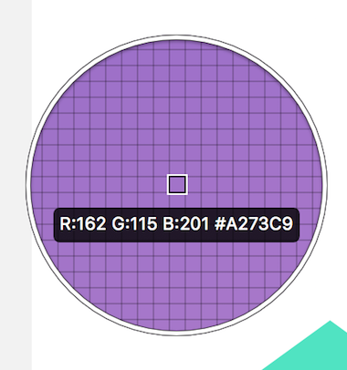

= 1wn

=== 스케치 인터페이스
* Toolbar
* Canvas
* Inspector
* Layout List

image:./image/sketch-1.png[]

=== Insert
* 도형, 아트보드 등 삽입 관련 부분은 이 메뉴에 다 모여있음

=== 아트보드

===== 아트보드 생성하기
* 아트보드를 스케치북에 비유하면 스케치북 안에 있는 종이로 생각하면 됨
* 단축키 `A` 를 누르거나 `Insert` 메뉴로 생성할 수 있음

===== 아트보드 삭제하기
* 아트보드를 선택하고 단축키 `Shift + Delete` 를 누르거나 오른쪽 마우스를 클릭하고 `Delete` 메뉴로 삭제할 수 있음

image:./image/sketch-2.png[]

===== 아트보드 선택하기
* 아트보드 선택할 때 보여지는 선을 `포커스 라인` 이라고 함
* 아트보드가 그룹처럼 움직이지만 엄연히 그룹은 아님

===== Tip
* 단축키 `Command + 0` 을 누르면 캔버스 영역이 100% 맞춰짐
* 단축키 `Command + 1` 을 누르면 Canvas 영역의 아트보드들이 View 영역으로 한 눈에 볼 수 있음
* 단축키 `Command + 2` 을 누르면 선택한 아트보드나 작업물 영역으로 포커스가 이동함
* 단축키 `Command + +` 을 누르면 Zoom In
* 단축키 `Command + -` 을 누르면 Zoom Out

=== 도형

===== 라인
* 단축키 `L`

===== 원
* 단축키 `O`

===== 사각형
* 단축키 `R`

===== 다각형
* 6을 설정하면 육각형, 7을 설정하면 칠각형 등 # 숫자를 입력하면 #각형이 됨

===== 별
* Radius
** 모서리 둥근 정도
* Points
** Points는 중심점부터 돌출된 부분까지 길이를 말함
** # 숫자를 입력하면 #별이 됨
** 8로 설정하였을 경우, 두 번째 이미지처럼 바뀌는 것을 확인할 수 있음

image:./image/sketch-11.png[]

===== 도형 옵션
* 기존에 알고 있던 옵션은 정리 안함. 새롭게 알게 된 옵션만 정리함
* `Boader`
** 단축키 `B`
** Boader Position은 도형 기준
* `Boader -> 톱니바퀴` 모양을 선택하면 아래 이미지와 같은 창을 확인할 수 있음
** Ends => 변
** Joins => 모서리
** 첫 번째 Dash는 첫 번째 점선길이, 첫 번째 Gap은 첫 번째 점선과 다음 점선의 간격 길이, 두 번째 Dash는 두 번째 점선길이, 두 번째 Gap은 두 번째 점선과 다음 점선 간격 길이

image:./image/sketch-5.png[]

image:./image/sketch-6.png[]

* `Fills`
** 단축키 `F`
** 옵션을 중첩시킬 수 있고 체크 해제해서 효과 적용을 뺄 수도 있음. 몇 개의 옵션도 이와 비슷함

image:./image/sketch-7.png[]

image:./image/sketch-8.png[]

===== 도형 편집
* `Toolbar` 를 이용하거나 `도형을 선택하여 더블클릭` 하면 도형을 편집할 수 있음

===== 레이어 복사
* `Option + 드레그`
* `Command + D`

===== 레이어 정렬 
* 레이어 정렬은 픽셀 단위
* 오브젝트를 그릴 때 벡터 기반
* 해당 질문은 정렬 옵션을 사용했을 때 픽셀 값이 변경되는데 괜찮냐고 물어보는 내용. 픽셀이 조금 맞지 않더라도 유지하는 쪽으로 선택하는 것이 좋음

image:./image/sketch-17.png[]

===== 배열
* 세 개 이상의 도형에서 사용할 수 있음

image:./image/sketch-16.png[]

===== 도형 합치기
* 왼쪽에서부터 오른쪽 순서대로 누른 결과

image:./image/sketch-18.png[]

image:./image/sketch-19.png[]

image:./image/sketch-20.png[]

image:./image/sketch-21.png[]

image:./image/sketch-22.png[]

===== Tip
* `Shift` 키를 누른 채 도형을 그리면 정사각형, 정다각형 등 각 변의 길이가 같은 도형을 그릴 수 있음
* 아래 이미지에서 자물쇠가 잠금 모양이 되면 각 변의 길이가 같은 사이즈으로 도형이 커짐

* 도형 선택 후, `Control + C` 누르면 제일 위에 있는 옵션으로 스포이트 활성화 함

= 2주

=== Layer List

===== Page
* 캔버스는 무제한
* 하나 페이지로 모든 디자인을 관리하면 찾는데 시간이 오래 걸림
* 페이지를 구분함. 인덱싱이랑 비슷함
* 페이지를 구분 짓는 기준은 기획단에서 넘어오는 덩어리(기능별 테스트 단위)

===== Layer 숨기기
* 레이어 숨기기
* cmd + shift + h

===== Layer 잠그기
* option 키 => 자물쇠 아이콘이 보임
* cmd + shift + l

===== Layer Type
* 화면 단위로 인식되는 아트보드
* 기본 도형 삽입을 이용한 레이어
* Vector, Pencil를 이용한 레이어
* 레이어들의 그룹
* 일반 텍스트
* 비트맵 레이어

===== Layer Group
* group cmd + g
* ungroup cmd + shift + g
* 그룹을 열지 않고도 바로 오브젝트 클릭하는 방법 => cmd + 도형 클릭
* select ~ 체크함 => 그룹처럼 관리하지만 개별 오브젝트를 사용할 수 잇음

===== 레이어 선택
* 드래그
* 복수 선택 => Shift + 클릭
* 겹쳐진 레이어 선택 => 오른쪽 클릭 : Select Layer
* cmd + option + 클릭 => 이동할 수 있음

=== Canvas

===== Canvas
* 공간은 무제한
* 멀티해상도를 쉽게 대응할 수 있음

===== 캔버스 이동
* space + 클릭 => 드래그, 트랙패드나 매직 마우스 이용할 수 있음
* fn + 상하 화살표

===== 화면 모드
* ctrl + p
* 픽셀 그리드 => View => Canvas => show pixel grid => ctrl + x
* 눈금자 => ctrl + r. 

===== 안내선 추가
** 원하는 오브젝트를 선택하고 눈금자를 오버하면 됨

===== 안내선 삭제
* 위치 재조정
* 화면 밖으로 벗어나면 됨
* 오른쪽 마우스 => Remove Guide

===== View -> Canvas -> Grid Setting. 치수 셋팅할 수 있음
* ctrl + g

===== View -> Canvas -> Layout Grid Setting
* 로고 작업, 인쇄 작업을 할 수 있음. 웹 작업도 할 수 있음
* ctrl + l
* toolbar => View 아이콘으로 통해 접근할 수 있음

=== Layer

===== Layer
* 원하는 오브젝트를 선택하면 오브젝트가 가지고 있는 속성을 인스팩터 영역에 확인할 수 있음

===== Size
* 사칙연산을 적용할 수 있음
* CMD + 화살표(상하, Height, 좌우 Width) => 1px 단위로 조정할 수 있음
* CMD + Shift + 화살표 => 10px

===== Radius
* 10;0;5;20 (좌측 상단 기준으로 시계방향)
* 각각 다른 Radius를 적용할 수 있음

===== 도형 그리기
* 중앙에서 그리는 방법
* option 키를 누르면 중앙으로 기준으로 그림
* 도형을 그리는 상태에서 space를 누르면서 도형을 움직일 수 있음

===== 아이콘 
* Path 같은 비율로 유지하면서 사이즈를 키우는 방법 => 그냥 사이즈를 늘리게 되면 원래 패스값을 가진 채로 사이즈가 커짐
* cmd + k
** scale
** pixel 값으로도 조정할 수 있음
** 기준점
* 그래도 아이콘은 왠만하면 사이즈를 유지하는 것이 중요함 => 벡터 기반으로 봤을 때 괜찮지만 픽셀단위는 깨짐
* Lancher 아이콘일 때 사용하는 것은 괜찮음

=== Vector

===== 포인트 추가
* Tap키로 시계방향으로 선택할 수 있음
* cmd + a => 모든 점을 선택할 수 있음(Edit 모드일때만)

===== 포인트 유형
* position
** 각 점이 가지고 있는 위치
* straight
** 직선값 
* 곡선유형
* mirrored
* disconnected
* Asymmetric
** 숫자키로 순서대로 이동할 수 있음
* 거리가 멀어질수록 곡선의 정도가 심해짐

===== 다중선택
* 더블 클릭한 오브젝트만 편집할 수 있음
* 다중 레이어 선택한 후, Toolbar => Edit를 선탥해야 함

===== 자르기
* Layer -> path -> 가위

===== Open path : 열린 선 편집
* Layer -> path -> open path
* cmd + shift + o

===== 선의 순서 변경
layer -> path -> reverse order

===== 반복 회전
* layer -> path -> copies
* 편집 종료되고 다시 편집이 되지 않음. 다시 그려야 함

===== Boolean operation. 모양 만들기
* 재편집 가능
* 해제 하는 방법
** 레이어 밖으로 가져다 놓거나
layer -> combine -> split

=== 텍스트

===== 텍스트 삽입
* `T`
* 텍스트 편집이 완료 되면 cmd + enter / cmd + 클릭

===== 선 위에 텍스트 삽입
* Text -> path on text

===== 텍스트 속성
* option + cmd + +
* option + cmd + -
* cmd + [
* cmd + ]
* cmd + \
* character => 자간 조정
* default 값이 들어감 => delete로 삭제함
* alignment
** 더미 데이터를 넣음
** auto => 무한대로 커짐
** Fixed

===== Text Detail Option

===== Text 벡터로 변환
* layer -> convert to outline
* 텍스트 레이어 수정 할 수 없기 때문에 최종이라고 생각이 들 때 다시 수정해야 함
* cmd + shift + o : text -> 면 레이어로 변령
* 텍스트를 너무 많이 벡터로 변환하면 boolean operation으로 작동하기 때문에 해당 페이지는 느림

=== Image

===== Layer => Image => Mini~
* 이것을 이용해서 이미지 사이즈를 줄이면 해상도 한단계가 떨어짐
* 원래대로 돌아갈 수 없기 때문에 조심해야 함

===== Layer => Image => replace
* 대체하고자 하는 이미지를 선택함

===== 이미지 편집 모드
* magic wond
** 비슷한 컬러값을 선택함

===== Color Adjust
* Hue
* 채도
* 밝기
* 대비
* 원래대로 돌아가는 방법

===== Blending
* Darken 
** 어두운 부분만 어두워짐
* 색감을 곱하는 개념
* 어두운 곳은 어둡게, 밝은 곳은 밝게. 대비를 강조함
* 이미지 밝은 곳만 밝아짐
* 빛을 비춰주는 듯한 효과로 합성함
* 아래 이미지가 위 이미지의 대비를 강화시키면서 밝기를 더 밝게 해줌
* 오버레이 => 합성하는 색깔의 그레이 스케일 기준으로 색감을 강화시켜줌. 그레이를 기준으로 50%. 그레이보다 어두우면 색감 어둡게, 그레이보다 밝으면 색감 밝게
* 오버레이와 비슷함
* 스포트라이트 효과를 더 강화시킴

=== 아이콘
* 명확한 메타포 선택
* 시각적 규모의 통일
* 일관된 스타일 적용

===== Tab bar Icon Design
* 좁은 영역 컴포넌트 
* 기준
** 상태값의 표현
*** 아이콘 색상을 바꾸거나 스타일을 바꿔줌(선 => 면)
*** 선택된 아이콘의 가독성
*** 노멀한 상태와 선택한 아이콘의 상태가 어떤지 확인이 필요함
** 시각적 규모의 통일
*** 무게감 통일
** 일관된 스타일
*** 기준 역할을 할 아이콘을 정하고 다른 아이콘을 개발함
** 아이콘의 정렬
*** 안내선 기준으로 높이 확인함

=== GUI DESIGN PROCESS

===== 디자인 접근법?
* 글을 어떻게 쓸 것인가?
** 서론 -> 본론 -> 결론
** 기승전결
** 이런 방법을 정하는 것

===== 더블 다이아몬드 접근법

===== 디자인 방법론?

===== 디자인 방법론의 역할과 기능

===== Discover
* 리서치를 통해 문제점과 인사이트를 발견하는 방법
** 개선 프로젝트
** AS-IS 분석
** 도메인 분석
*** 각 플랫폼(TV, 모바일, 웹)마다 가지고 있는 사용성이 다르기 떄문에 분석이 필요함

===== Define
* 앱 개선이나 만들 때 세부적인 부분보다 개선하고자 하는 전체적인 디자인 방향성을 정해야 함
* 세부적인 부분
** 정보 시각화
** 아이콘이 별로에요
** 폰트가 마음에 들지 않아요

===== 디자인 방법론 주의점
* 서비스를 위한 방법론을 사용해야 함. 방법론을 위한 방법론을 지양해야 함
* 전체 프로젝트 중 현재 위치, 상태?
** 무엇이 필요한가? 검토 과정이 필요함
* 무엇이 필요한지 도출되면 어떤 방법론을 사용할지?
** 왜 사용해야 하는지 ?
** 얻고자 하는 결과가 무엇인지 예측해야 함

AS-IS Research / TO-BE
1. 무엇을 볼 것인가?
개선하고자 하는 서비스, 경쟁 서비스, 유사 서비스
2. 어디까지 볼 것인가?
핵심 기능, 서비스 구조 / 메인 화면, BI, 키스크린(= 핵심화면), 스타일 
3. 어떤 기준으로 볼 것인가?
GUI : 시안성, 간결성, 시각적 일관성, 밸런스 및 조화성
감성, 전달력, 완성도, Bi와 GUI의 연결성

wireframe 스케치 작업
* 와이퍼프레임 색깔은 안 입혀지는 것이 좋음

지금 읽고 있는 책
나의 책장
자료실
통계
설정

= 서비스 소개
* 주요 타겟층
* 타 서비스와의 자별점

* Key feature(기능) => 커뮤니티 기능
* Service Value(사용자가 얻을 수 있는 가치로 변환) => 광고성 리뷰. _생성한_ 정보를 제공받을 수 있음. _손쉬운_ 정보를 제공받을 수 있음
* Visual keyword(형용사적 단어로 변환) => Vivid, Braight(진정성, 생생함). UI Concept

= 서비스 컨셉
* 변환을 통해 나온 코드는 신속(Rapid), 생생한(Vivid), 쉬운(Easy)

= 3주 

=== Mask

=== Layer Effect

===== Shadow
* Layer Opacity
** Opacity
*** 레이어 자체 투명도
*** 단축키는 이미지를 선택하고 원하는 숫자를 입력하면 됨
** Inspector 순서대로 Opacity가 적용됨
** Alpha 값으로 투명도를 적용해야 함

===== Blurs
* 가우시안 블러
** 모든 방향으로 동일한 값이 적용됨
* Motion Blur
** Angle => 특정 방향으로 흐림 효과를 적용하는데, 이때 어떤 방향인가?? x축 방향 기준
* Zoom Blur
** 특정한 한 방향으로 어그러짐 효과를 줌
** Origin: 현재 기준이 되고 있는 지점을 정함
* Background Blur
** 깔려 있는 레이어가 있어야 효과를 줄 수 있음
** 효과를 줄려는 레이어에 투명도를 조절해야 함
* 블러는 성능에 영향을 줌

=== Layer Style

===== 여러 오브젝트에 동일한 스타일 적용하기
* 스타일 복사 => option + cmd + c
* 스타일 붙여넣기 => option + cmd + v

===== 누락된 글꼴을 모두 교체하는 방법
* 알람으로 뜨고 난 뒤 바꿀 수 있음
* 그 서체를 그대로 유지하는 것이 중요하다면 폰트를 깔면 스케치가 연결해줌

===== 색상 변경
* Edit => Find and replace color
* cmd + option + f

=== Layer Style