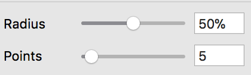
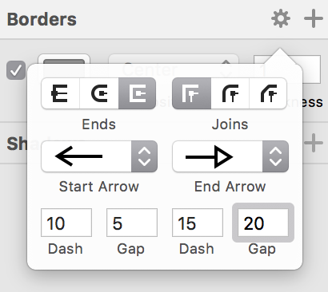
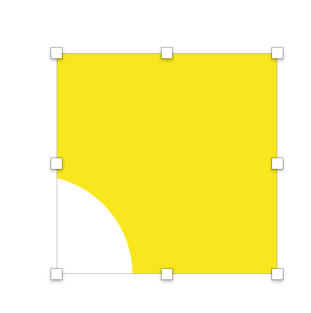

= 1주

=== 스케치 인터페이스
* Toolbar
* Canvas
* Inspector
* Layout List

image:./image/sketch-1.png[]

=== Insert
* 도형, 아트보드 등 삽입 관련 부분은 이 메뉴에 다 모여있음

=== 아트보드

===== 아트보드 생성하기
* 아트보드를 스케치북에 비유하면 스케치북 안에 있는 종이로 생각하면 됨
* 단축키 `A` 를 누르거나 `Insert` 메뉴로 생성할 수 있음

===== 아트보드 삭제하기
* 아트보드를 선택하고 단축키 `Shift + Delete` 를 누르거나 오른쪽 마우스를 클릭하고 `Delete` 메뉴로 삭제할 수 있음

image:./image/sketch-2.png[]

===== 아트보드 선택하기
* 아트보드 선택할 때 보여지는 선을 `포커스 라인` 이라고 함
* 아트보드가 그룹처럼 움직이지만 엄연히 그룹은 아님

image:./image/sketch-3.png[]

===== Tip
* 단축키 `Command + 0` 을 누르면 캔버스 영역이 100% 맞춰짐
* 단축키 `Command + 1` 을 누르면 Canvas 영역의 아트보드들이 View 영역으로 한 눈에 볼 수 있음
* 단축키 `Command + 2` 을 누르면 선택한 아트보드나 작업물 영역으로 포커스가 이동함
* 단축키 `Command + +` 을 누르면 Zoom In
* 단축키 `Command + -` 을 누르면 Zoom Out

=== 도형

===== 라인
* 단축키 `L`

===== 원
* 단축키 `O`

===== 사각형
* 단축키 `R`

===== 다각형
* 6을 설정하면 육각형, 7을 설정하면 칠각형 등 # 숫자를 입력하면 #각형이 됨

image:./image/sketch-10.png[]

===== 별
* Radius
** 모서리 둥근 정도
* Points
** Points는 중심점부터 돌출된 부분까지 길이를 말함
** # 숫자를 입력하면 #별이 됨
** 8로 설정하였을 경우, 두 번째 이미지처럼 바뀌는 것을 확인할 수 있음

image:./image/sketch-12.png[]

===== 도형 옵션
* 기존에 알고 있던 옵션은 정리 안함. 새롭게 알게 된 옵션만 정리함
* `Boader`
** 단축키 `B`
** Boader Position은 도형 기준
* `Boader -> 톱니바퀴` 모양을 선택하면 아래 이미지와 같은 창을 확인할 수 있음
** Ends => 변
** Joins => 모서리
** 첫 번째 Dash는 첫 번째 점선길이, 첫 번째 Gap은 첫 번째 점선과 다음 점선의 간격 길이, 두 번째 Dash는 두 번째 점선길이, 두 번째 Gap은 두 번째 점선과 다음 점선 간격 길이

* `Fills`
** 단축키 `F`
** 옵션을 중첩시킬 수 있고 체크 해제해서 효과 적용을 뺄 수도 있음. 몇 개의 옵션도 이와 비슷함

image:./image/sketch-7.png[]

image:./image/sketch-8.png[]

===== 도형 편집
* `Toolbar` 를 이용하거나 `도형을 선택하여 더블클릭` 하면 도형을 편집할 수 있음

image:./image/sketch-13.png[]

image:./image/sketch-14.png[]

===== 레이어 복사
* `Option + 드레그`
* `Command + D`

===== 레이어 정렬 
* 레이어 정렬은 픽셀 단위
* 오브젝트를 그릴 때 벡터 기반
* 해당 질문은 정렬 옵션을 사용했을 때 픽셀 값이 변경되는데 괜찮냐고 물어보는 내용. 픽셀이 조금 맞지 않더라도 유지하는 쪽으로 선택하는 것이 좋음

===== 배열
* 세 개 이상의 도형에서 사용할 수 있음

===== 도형 합치기
* 왼쪽에서부터 오른쪽 순서대로 누른 결과

image:./image/sketch-19.png[]

image:./image/sketch-21.png[]

===== Tip
* `Shift` 키를 누른 채 도형을 그리면 정사각형, 정다각형 등 각 변의 길이가 같은 도형을 그릴 수 있음
* 아래 이미지에서 자물쇠가 잠금 모양이 되면 각 변의 길이가 같은 사이즈으로 도형이 커짐

image:./image/sketch-4.png[]

* 도형 선택 후, `Control + C` 누르면 제일 위에 있는 옵션으로 이트 활성화 함

image:./image/sketch-15.png[]

= 2주

=== Layer List

===== Page
* 캔버스는 무제한
* 하나 페이지로 모든 디자인을 관리하면 찾는데 시간이 오래 걸림
* 페이지를 구분함. 인덱싱이랑 비슷함
* 페이지를 구분 짓는 기준은 기획단에서 넘어오는 덩어리(기능별 테스트 단위)

===== Layer 숨기기
* 레이어 숨기기
* cmd + shift + h

===== Layer 잠그기
* option 키 => 자물쇠 아이콘이 보임
* cmd + shift + l

===== Layer Type
* 화면 단위로 인식되는 아트보드
* 기본 도형 삽입을 이용한 레이어
* Vector, Pencil를 이용한 레이어
* 레이어들의 그룹
* 일반 텍스트
* 비트맵 레이어

===== Layer Group
* group cmd + g
* ungroup cmd + shift + g
* 그룹을 열지 않고도 바로 오브젝트 클릭하는 방법 => cmd + 도형 클릭
* select ~ 체크함 => 그룹처럼 관리하지만 개별 오브젝트를 사용할 수 잇음

===== 레이어 선택
* 드래그
* 복수 선택 => Shift + 클릭
* 겹쳐진 레이어 선택 => 오른쪽 클릭 : Select Layer
* cmd + option + 클릭 => 이동할 수 있음

=== Canvas

===== Canvas
* 공간은 무제한
* 멀티해상도를 쉽게 대응할 수 있음

===== 캔버스 이동
* space + 클릭 => 드래그, 트랙패드나 매직 마우스 이용할 수 있음
* fn + 상하 화살표

===== 화면 모드
* ctrl + p
* 픽셀 그리드 => View => Canvas => show pixel grid => ctrl + x
* 눈금자 => ctrl + r. 

===== 안내선 추가
** 원하는 오브젝트를 선택하고 눈금자를 오버하면 됨

===== 안내선 삭제
* 위치 재조정
* 화면 밖으로 벗어나면 됨
* 오른쪽 마우스 => Remove Guide

===== View -> Canvas -> Grid Setting. 치수 셋팅할 수 있음
* ctrl + g

===== View -> Canvas -> Layout Grid Setting
* 로고 작업, 인쇄 작업을 할 수 있음. 웹 작업도 할 수 있음
* ctrl + l
* toolbar => View 아이콘으로 통해 접근할 수 있음

=== Layer

===== Layer
* 원하는 오브젝트를 선택하면 오브젝트가 가지고 있는 속성을 인스팩터 영역에 확인할 수 있음

===== Size
* 사칙연산을 적용할 수 있음
* CMD + 화살표(상하, Height, 좌우 Width) => 1px 단위로 조정할 수 있음
* CMD + Shift + 화살표 => 10px

===== Radius
* 10;0;5;20 (좌측 상단 기준으로 시계방향)
* 각각 다른 Radius를 적용할 수 있음

===== 도형 그리기
* 중앙에서 그리는 방법
* option 키를 누르면 중앙으로 기준으로 그림
* 도형을 그리는 상태에서 space를 누르면서 도형을 움직일 수 있음

===== 아이콘 
* Path 같은 비율로 유지하면서 사이즈를 키우는 방법 => 그냥 사이즈를 늘리게 되면 원래 패스값을 가진 채로 사이즈가 커짐
* cmd + k
** scale
** pixel 값으로도 조정할 수 있음
** 기준점
* 그래도 아이콘은 왠만하면 사이즈를 유지하는 것이 중요함 => 벡터 기반으로 봤을 때 괜찮지만 픽셀단위는 깨짐
* Lancher 아이콘일 때 사용하는 것은 괜찮음

=== Vector

===== 포인트 추가
* Tap키로 시계방향으로 선택할 수 있음
* cmd + a => 모든 점을 선택할 수 있음(Edit 모드일때만)

===== 포인트 유형
* position
** 각 점이 가지고 있는 위치
* straight
** 직선값 
* 곡선유형
* mirrored
* disconnected
* Asymmetric
** 숫자키로 순서대로 이동할 수 있음
* 거리가 멀어질수록 곡선의 정도가 심해짐

===== 다중선택
* 더블 클릭한 오브젝트만 편집할 수 있음
* 다중 레이어 선택한 후, Toolbar => Edit를 선탥해야 함

===== 자르기
* Layer -> path -> 가위

===== Open path : 열린 선 편집
* Layer -> path -> open path
* cmd + shift + o

===== 선의 순서 변경
layer -> path -> reverse order

===== 반복 회전
* layer -> path -> copies
* 편집 종료되고 다시 편집이 되지 않음. 다시 그려야 함

===== Boolean operation. 모양 만들기
* 재편집 가능
* 해제 하는 방법
** 레이어 밖으로 가져다 놓거나
layer -> combine -> split

=== 텍스트

===== 텍스트 삽입
* `T`
* 텍스트 편집이 완료 되면 cmd + enter / cmd + 클릭

===== 선 위에 텍스트 삽입
* Text -> path on text

===== 텍스트 속성
* option + cmd + +
* option + cmd + -
* cmd + [
* cmd + ]
* cmd + \
* character => 자간 조정
* default 값이 들어감 => delete로 삭제함
* alignment
** 더미 데이터를 넣음
** auto => 무한대로 커짐
** Fixed

===== Text Detail Option

===== Text 벡터로 변환
* layer -> convert to outline
* 텍스트 레이어 수정 할 수 없기 때문에 최종이라고 생각이 들 때 다시 수정해야 함
* cmd + shift + o : text -> 면 레이어로 변령
* 텍스트를 너무 많이 벡터로 변환하면 boolean operation으로 작동하기 때문에 해당 페이지는 느림

=== Image

===== Layer => Image => Mini~
* 이것을 이용해서 이미지 사이즈를 줄이면 해상도 한단계가 떨어짐
* 원래대로 돌아갈 수 없기 때문에 조심해야 함

===== Layer => Image => replace
* 대체하고자 하는 이미지를 선택함

===== 이미지 편집 모드
* magic wond
** 비슷한 컬러값을 선택함

===== Color Adjust
* Hue
* 채도
* 밝기
* 대비
* 원래대로 돌아가는 방법

===== Blending
* Darken 
** 어두운 부분만 어두워짐
* 색감을 곱하는 개념
* 어두운 곳은 어둡게, 밝은 곳은 밝게. 대비를 강조함
* 이미지 밝은 곳만 밝아짐
* 빛을 비춰주는 듯한 효과로 합성함
* 아래 이미지가 위 이미지의 대비를 강화시키면서 밝기를 더 밝게 해줌
* 오버레이 => 합성하는 색깔의 그레이 스케일 기준으로 색감을 강화시켜줌. 그레이를 기준으로 50%. 그레이보다 어두우면 색감 어둡게, 그레이보다 밝으면 색감 밝게
* 오버레이와 비슷함
* 스포트라이트 효과를 더 강화시킴

=== 아이콘
* 명확한 메타포 선택
* 시각적 규모의 통일
* 일관된 스타일 적용

===== Tab bar Icon Design
* 좁은 영역 컴포넌트 
* 기준
** 상태값의 표현
*** 아이콘 색상을 바꾸거나 스타일을 바꿔줌(선 => 면)
*** 선택된 아이콘의 가독성
*** 노멀한 상태와 선택한 아이콘의 상태가 어떤지 확인이 필요함
** 시각적 규모의 통일
*** 무게감 통일
** 일관된 스타일
*** 기준 역할을 할 아이콘을 정하고 다른 아이콘을 개발함
** 아이콘의 정렬
*** 안내선 기준으로 높이 확인함

=== GUI DESIGN PROCESS

===== 디자인 접근법?
* 글을 어떻게 쓸 것인가?
** 서론 -> 본론 -> 결론
** 기승전결
** 이런 방법을 정하는 것

===== 더블 다이아몬드 접근법

===== 디자인 방법론?

===== 디자인 방법론의 역할과 기능

===== Discover
* 리서치를 통해 문제점과 인사이트를 발견하는 방법
** 개선 프로젝트
** AS-IS 분석
** 도메인 분석
*** 각 플랫폼(TV, 모바일, 웹)마다 가지고 있는 사용성이 다르기 떄문에 분석이 필요함

===== Define
* 앱 개선이나 만들 때 세부적인 부분보다 개선하고자 하는 전체적인 디자인 방향성을 정해야 함
* 세부적인 부분
** 정보 시각화
** 아이콘이 별로에요
** 폰트가 마음에 들지 않아요

===== 디자인 방법론 주의점
* 서비스를 위한 방법론을 사용해야 함. 방법론을 위한 방법론을 지양해야 함
* 전체 프로젝트 중 현재 위치, 상태?
** 무엇이 필요한가? 검토 과정이 필요함
* 무엇이 필요한지 도출되면 어떤 방법론을 사용할지?
** 왜 사용해야 하는지 ?
** 얻고자 하는 결과가 무엇인지 예측해야 함

AS-IS Research / TO-BE
1. 무엇을 볼 것인가?
개선하고자 하는 서비스, 경쟁 서비스, 유사 서비스
2. 어디까지 볼 것인가?
핵심 기능, 서비스 구조 / 메인 화면, BI, 키스크린(= 핵심화면), 스타일 
3. 어떤 기준으로 볼 것인가?
GUI : 시안성, 간결성, 시각적 일관성, 밸런스 및 조화성
감성, 전달력, 완성도, Bi와 GUI의 연결성

wireframe 스케치 작업
* 와이퍼프레임 색깔은 안 입혀지는 것이 좋음

= 서비스 소개
* 주요 타겟층
* 타 서비스와의 자별점

* Key feature(기능) => 커뮤니티 기능
* Service Value(사용자가 얻을 수 있는 가치로 변환) => 광고성 리뷰. _생성한_ 정보를 제공받을 수 있음. _손쉬운_ 정보를 제공받을 수 있음
* Visual keyword(형용사적 단어로 변환) => Vivid, Braight(진정성, 생생함). UI Concept

= 서비스 컨셉
* 변환을 통해 나온 코드는 신속(Rapid), 생생한(Vivid), 쉬운(Easy)

= 3주 

=== Mask

=== Layer Effect

===== Shadow
* Layer Opacity
** Opacity
*** 레이어 자체 투명도
*** 단축키는 이미지를 선택하고 원하는 숫자를 입력하면 됨
** Inspector 순서대로 Opacity가 적용됨
** Alpha 값으로 투명도를 적용해야 함

===== Blurs
* 가우시안 블러
** 모든 방향으로 동일한 값이 적용됨
* Motion Blur
** Angle => 특정 방향으로 흐림 효과를 적용하는데, 이때 어떤 방향인가?? x축 방향 기준
* Zoom Blur
** 특정한 한 방향으로 어그러짐 효과를 줌
** Origin: 현재 기준이 되고 있는 지점을 정함
* Background Blur
** 깔려 있는 레이어가 있어야 효과를 줄 수 있음
** 효과를 줄려는 레이어에 투명도를 조절해야 함
* 블러는 성능에 영향을 줌

=== Layer Style

===== 여러 오브젝트에 동일한 스타일 적용하기
* 스타일 복사 => option + cmd + c
* 스타일 붙여넣기 => option + cmd + v

===== 누락된 글꼴을 모두 교체하는 방법
* 알람으로 뜨고 난 뒤 바꿀 수 있음
* 그 서체를 그대로 유지하는 것이 중요하다면 폰트를 깔면 스케치가 연결해줌

===== 색상 변경
* Edit => Find and replace color
* cmd + option + f

=== Shared Style

===== Shared Layer Style
* Text, Object Style -> Create ~
* 빠르게 적용하기 위해. 팀원간의 디자인 규칙을 적용하기 위해

=== Constraint

===== 리사이징 조건 걸기
* 조건부 리사이징
** 조건 걸려고 하는 오브젝트를 선택하고 인스펙터 영역 Resizing에 조건을 검
** 여백 비율 유지
** 너비, 높이 유지

=== Symbol

===== 심볼 만들기
* Layer -> Create symbol

===== 심볼 편집하는 방법
* 심볼에서 더블클릭해서 마스터 편집을 할 수 있음
* 심볼 재정의
** 인스팩터 영역에 Override가 존재함
** 아이콘 오버라이드 할 때 리스트업으로 가져오는 기준은 동일한 너비값과 높이값

===== 일반 레이어 재정의
* 인스펙터 영역 -> Detach from Symbol

=== 통일성이란?
* 디자인에서 통일성이란 ? 형태, 색상, 양식 등 시각적 요소들 간의 질서

=== 통일성이 왜 중요한가?

=== 시각적 통일성을 유지하기 위한 요소들

===== Color

===== Icon

===== Contents Style
* 라인
* Shadow 스타일 등

===== Text Color + Size

===== Graphic

= 4주 

=== Components
* 인터페이스를 구성하는 기본 단위

=== 화면

===== Splash Screen
* 사용성에 대한 제한을 받지 않음. GUI Identity를 강하게 나타날 수 있음

===== Coach Marks
* 가이드화면. 반투명 화면으로 사용자가 어떻게 사용하는지 알려주는 화면
* 사용자가 3 - 4회정도 보여준다던지, 다시 보기 버튼으로 보여주지 않음

===== Empty Data
* 초기 데이터가 없는 상태

===== Walkthroughs
* Coach Marks 와 비슷해보이지만, Coach Marks는 사용자 가이드 라인을 제공하지만 이 화면은 서비스 소개를 함

===== Drawer/Slider Menu
* 화면의 부가적인 정볼르 담음

=== 컴포넌트

===== Status bar
* 디바이스의 현재 상태에 대한 정보를 표시하는 역할
* 최상단에 위치함

===== App Bar / Navigation Bar / Title Bar
* 안드로이드 => App Bar
* iOS => Navigation Bar
* 사용자가 뎁스 개념을 인지할 수 있도록 도와줌

===== Tab Bar, Tabs
* 안드로이드 => Tabs
** App Bar 밑에다가 Tabs을 위치함
* iOS => Tab Bar

=== List

===== List View, List
* One line list, Single line list
* Three line list, Thumbnail list

===== List Index
* 같은 속성끼리 그룹핑된 리스트의 경우. 인덱스를 제공함
* 리스트를 시각적으로 분리하고 사용자 인지를 돕는 역할을 함

===== List Scrollbars

=== Grid View, Thumbnail

=== Dialog, Popup

===== Alert
* 경고 및 문제를 알려주는 기능
* 취소/확인

===== Toast
* 사용자가 진행한 동작에 대해 가벼운 피드백 내용을 제공해주는 기능

===== Popup
* Alert, Toast 형태를 제외하고 모든 것이 팝업임

=== Picker
* 사용자 메뉴에서 사용자가 고를 수 있는 컨트롤러

===== DatePicker

===== ColorPicker

=== Slider, Progress Bar

===== Slider 
* 좌우, 상화로 움직여 동작의 범위나 정도를 조절하는 컨트롤러
* Slider thumb이 반드시 있어야 함. 빠지면 Progress Bar가 됨

===== Progress Bar
* 작업이 얼마나 진행되었는지 표시해줌. 사용자가 컨트롤 할 수 없음. 진행 중인 정보만 제공
* 정보 시각화

=== Drop-down List
* 디폴트 값이 항상 있어야 함

=== Radio Button, Check Box

===== Radio Button
* 선택 항목들 중 1개만 선택할 수 있음

===== Check Box
* 선택 항목들 중 여러 개를 선택할 수 있는 경우 사용함

=== Toggle Button, Switch

===== Toggle Button

===== Switch

=== Symbol 심화

===== 실무에서의 심볼 활용
* 어떻게 사용해야 효과적으로 사용할 수 있는지 경험담을 공유함
* 심볼을 사용하는 예
** 컬러 시스템, 레이아웃 시스템
** 공통 컴포넌트
** 각종 아이콘
*** 로그인, 회원가입 타이틀
*** 약관 타이틀
*** 리스트에서도 글만 있는 경우
*** 리스트에서도 글와 화살표가 같이 있는 경우
* 심볼 단위
** 가장 최소 단위의 컴포넌트
* 심볼 목적
** 디자인의 재사용
* 심볼 제작 시기 
** 전체 화면에서 40, 50% 정도 디자인이 나왔을 시점에 제작하는 것이 효과적임

===== 심볼만들 때 주의할 점
* 라인 오브젝트의 경우
** 라인을 가지고 있는 오브젝트도 심볼로 만들면 사이즈가 벗어남
** Boarder 옵션을 Center를 inside로 바꾸거나
** 아트 보드 사이즈를 늘림
* 그림자를 포함하는 경우
** 그림자를 가지고 있는 오브젝트를 심볼로 만들면 그림자가 사이즈로 벗어남
** 사각형의 레이어를 깔고 같이 심볼로 전환하거나 아트보드의 사이즈를 늘림
* 아이콘을 심볼로 만드는 경우
** 임의의 박스를 깔고 아이콘을 그리게 한 이유 ?
*** 사각형 안으로 그릴 수 있도록 
*** 아이콘 사이즈 통일하기 위해서 => 아이콘 사이즈를 통일 시키는 이유?
**** 동일한 사이즈를 가지고 있어야만 오버라이드 할 때 다시 재정의 할 수 있음
**** 개발자를 위해서 박스를 까는 것이 좋음 => 아이콘 사이즈가 제각각이면 개발자가 수치를 일일히 입력해야 함

=== Daynamic Icons => 아이콘 + 컬러
* color/blue, color/orange

===== Icon 심볼 작업
* icon/search, icon/add
** 아이콘을 convert to outline으로 변경해야 함
** symbol로 만든 color를 아이콘 위로 마스킹하면 원하는 컬러로 바꿀 수 있음
** 심볼 편집상태에서 마스킹 하려는 컬러 + 아이콘을 선택하고 `cmd + ctrl + m` 누름
** 이것을 사용하는 이유는 아이콘 색깔을 편하게 바꿀 수 있음

=== Library

===== Library
* 하나의 링크를 통해서 업데이트된 디자인을 공유받으면서 작업할 수 있도록 해줌

===== 라이브러리 추가
* 라이브러리 추가하고 난 뒤 디자인이 변경되면 변경되었다는 것을 알림으로 알려줌

===== 라이브러리 추가 한 뒤 심볼 편집
* 라이브러리 심볼로 추가 했지만, 심볼로 바꾸지 않았지만 수정한다면 2가지 대답을 선택할 수 있음
** 오른쪽 => 오리지널 파일로 편집하겠음
** 왼쪽 => 오리지널 파일의 링크를 깨고 현재 파일에 심볼로 바꿈
** 심볼로 만들어져야만 오버라이드 할 수 있음

=== Cloud
* 클라우드를 이용하면 라이브러리에 연결되서 사용할 수 있음

=== 플러그인

===== Runner
* cmd + '

===== Clipboard fill, Unsplash itI
* 원하는 이미지를 복사하고 플러그인에서 clipboard fill 선택하면 복사된 이미지가 붙여지는 것을 확인할 수 있음
* image1[cat]

===== Symbol Organizer
* 심볼 정리해줌
* 심볼을 어떻게 정리할 것인지 옵션 설정에 따라 할 수 있음
** 세로방식
** 6th
** display group titles

===== Merge duplicate symbols
* 필요하지 않은 심볼을 통합할 수 있음

===== Library Symbol Replacer

===== AutoLayout
* AutoLayout
* Pin 기능 추천
** 상,하,좌,우 여백값 재조정
** 수치로 재조정

===== MagicMirror

===== Paddy
* 가운데 정렬 c
* 우측 정렬 r 등등 레이어 이름을 바꿔서 정렬을 이용할 수 있음

=== 시안 준비

===== 기획문서 내용 충분히 이해하기
* 디자인 시안을 잡을 때 화면에 대한 이해가 충분히 해야 함

===== 리서치! 리서치! 리서치!!!
* 내가 관점이나 방향을 설정하고 그에 맞게 리서치하기!
* 리서치한 자료를 버려지지 않고 유용하게 쓰이도록 자료 정리해두기
** 디테일보다 전체적인 느낌을 봄
*** 아이콘이 달라진다고 해서 전체적인 느낌이 달라지지 않는 것
*** 전체적인 느낌을 무너뜨리는 아이를 찾아봄
** 좋아보이는 이유 확실하게 분석해보기
*** 좋아보이는 요소를 먼저 생각해봄
*** 정확하게 분석하기

===== 테스트는 빠르게 많이!
* 전체적인 느낌에 집중하기
* 완성도에 대한 집착 버리기
* 테스트 안들은 모아서 비교하고 발전시키기
** 적용할 수 있는 디자인을 찾아봄

===== https://sketchapp.com/docs/

= 5주

=== OS 
* 하드웨어를 제어하는 응용 소프트웨어 기반 환경 및 운영 체제

===== iOS
* 크기 단위 pixcl
* 3가지 축적 계수를 사용함
** 1배수 => 디자이너가 그린 원래 사이즈. image.png
** 2배수 => 원래 그린 사이즈의 2배. image@2x.png
** 3배수 => 원래 그린 사이즈의 3배. image@3x.png
* 가변 리소스 대응 방식 차이
** 예를 들어 카드 포스트
** 콘텐츠에 따라 높이가 달라진다면 세 개의 등분으로 나눠서 개발자에게 제공함. 원하는 높이 값만큼 가운데 리소스를 늘림
** 콘텐츠에 따라 너비가 달라진다면 세 개의 등분으로 나눠서 개발자에게 제공함. 원하는 너비 값만큼 가운데 리소스를 늘림 
* HIG
* https://developer.apple.com/design/resources/

===== Android
* dp, dip based(= Dots per inch) 
** 1인치 안으로 들어가는 점의 개수. 점의 개수가 높아질수록 고해상도
* 다양한 해상도를 지원하기 위해 축적 계수를 사용
** ldpi, mdpi, hdpi .. => 저밀도, 중밀도, 고밀도.. 
** 밀도의 범위를 의미함
** ldpi => 1인치 x 1인치. 120개 이하
** mdpi => 1인치 x 1인치. 120개 초과, 160개 이하
** 1 x 1 inch에 들어가는 도트 개수에 따라 해상도를 나눔
* Material Design Guide

=== 본격적인 실무 투입 전 어떤 것을 체크해야 할까?
* 대응 OS
* 타켓 디바이스(대표 해상도)
** iOS => 2x 해상도
** 스케치에서 1배수 해상도를 아트보드로 생성되는 이유 => 2x 해상도로 만들었을 때 요소가 소수점이 되는 것을 막기 위한 것. 벡터 기반이기에 배수가 늘어나더라도 리소스의 깨짐현상을 최소화 할 수 있음
** Android => Xxxhdpi(mdpi x 4)
** 스케치에서 mdpi로 아트보드가 생성하는 이유 => 1px = 1dp인 계산하였을 때 mdpi로 나오기 때문에 가이드라인을 정함
** http://www.suiux.com/gui_specification/[참고]
* 멀티 스크린 대응
** 일반적으로 타켓 디바이스 해상도 배수를 늘려서 사용함

=== Sketch Export
* Layer -> Make Exportable
* size => 축적계수. 오른쪽 + 를 눌러서 설정할 수 있음
* 프리셋을 이용할 수 있음
* PNG
* Slicing은 Make Exportable이랑 다름
** Slicing => 특정 영역을 Export 하겠음
** Make Exportable => 오브젝트를 Export 하겠음
*** Export의 영역을 없애는 방법 => ctrl + e, 
** Object 선택 후 cmd + R로 이름 바꾸기

=== Arrange 영역

===== Round to Pixel: 픽셀 맞추기
* 정수에 맞춰주는 기능을 스케치에서 제공함
* 복잡한 외형을 가지고 있는 오브젝트는 => 레이어에서 구체적인 도형을 선택하고 Round to pixel 메뉴를 사용함

===== 픽셀 맞추기

===== 리소스 출력 해보기
* 종류_화면_이름_상태(btn_home_start_n)

= 6주

=== Sketch 

===== 컬러 심볼 전환
* 마스킹 개념으로 이용해서 컬러 심볼을 바꿈
* 그러나, 블랜딩 모드를 이용해서도 컬러를 바꿀 수 있음
* 마스킹으로 적용하지 않으면 배경색깔이 보임. 두개를 포함할 수 있는 배경을 만들어서 마스킹 모드를 적용함

===== Export
* 너비 28을 가진 아이콘을 출력하려고 함
** Insert Slice => 원하는 사이즈를 자를 수 있음

===== 제플린
* cmd + ctrl + e
* Section 나누기

* 스타일 가이드 라인
** Make exportable 설정하지 않으면 Resource로 파일을 다운로드 받을 수 없음
** Add Tag
** Add Communication
*** 코멘트를 달 수 있음

===== Sketch Prototyping은 심플함
* 링크(w)
* 핫스팟 선택
* 핫스팟 레이어(h)를 심볼로 관리할 수 있음

===== 추가적인 Prototype 타입 툴
* Marvel App
** Hotspot Destination 설정
** Screen Transition
** Action
*** move to last View
*** 중복되는 요소에 대해 핫스팟을 복사하고 적용하는 방법
*** 앱으로도 사용할 수 있음
* inVision
