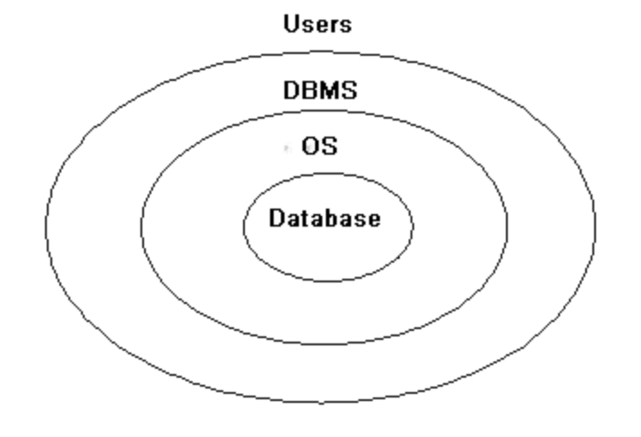
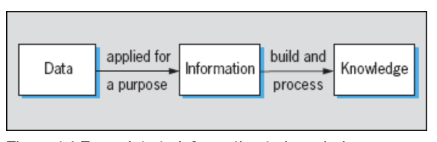

= DB 기본

=== Data, Database, DBMS?

===== Data
* 컴퓨터에 적합한 형태를 가진 모든 것 

> Data is anything in a **form suitable for use with a computer** .

===== Database
* 정보의 집합

> **A database is a collection of information** that is organized so that it can easily be accessed, managed, and updated. In one view, databases can be classified according to types of content.

===== DBMS
* 모든 데이터베이스들을 관리하는 시스템

> The database management system (DBMS), is a computer software program that is designed as the means of **managing all databases that are currently installed on a system hard drive or network**.

=== Data, Information, Knowledge?

===== Data
* 가공되지 않은 사실이나 수치
* "The price of crude oil is $80 per barrel."

> Data is unprocessed facts and figures without any added interpretation or analysis.

===== Information
* 사용자에게 의미가 있도록 해석한 데이터
* "The price of crude oil has risen from $70 to $80 per barrel" gives meaning to the data and so is said to be information to someone who tracks oil prices.

> Information is data that has been interpreted so that it has meaning for the user. 

===== Knowledge
* 개인이나 조직에게 도움이 되는 경험, 통찰력, 정보
*  "When crude oil prices go up by $10 per barrel, it's likely that petrol prices will rise by 2p per litre" is knowledge.

> Knowledge is a combination of information, experience and insight that may benefit the individual or the organisation.

=== RDBMS
* Relational Database Management System
* E.F. Codd, "A Relational Model of Data for Large Shared Data Banks"
** IBM System R
** Berkeley Postgres
* 데이터를 읽고 쓰기 기능함
** 조회
*** 인덱스(B-Tree)
*** Join
** 저장 
*** 순차적으로 데이터를 추가함
*** 최소한으로 필요한 데이터만 저장함

=== SQL
* Structured Query Language
* 국제 표준
* 선언적 언어 => cf. 절차적 언어
* RDMBS 제어하기 위해 사용함

=== NOSQL
* Not Only SQL
* RDBMS가 아닌 나머지

=== 데이터베이스 관련 용어

===== CAP
* Consistency, Availability, Partition Tolerence

===== ACID
* Atomicity, Consistency, Isolation, Durability

===== 확장성
* 수평확장 VS 수직확장

=== 데이터베이스의 종류

===== 관계형 디비(RDBMS)
* 오라클, MySQL, MS-SQL

===== 비관계형 디비(NoSQL)
* 문서 디비
** MongoDB
** json 기반 레코드 저장
** 아무거나 막 저장
** 비교적 빠르고 사용이 간단함
* 그래프 디비
** Neo4J
** 복잡한 관계 처리 지원
** 친구 추천 알고리즘, SNS 등에 적합
* Key-Value DB
** Redis, Mem-cached
** 엄청 빠름
** 단순 데이터 처리
** 캐시 / 데이터 분산용
* Cloud DB
** AWS DyanmoDB
** KV Store + Document Store
** 설치가 필요없음
** 고성능, 고가용성, 내구도
** 저렴하지 않은 비용
* 네트워크 모델, 계층 모델
* 분산 데이터 시스템(Hadoop) 등

=== 참고
* http://searchdatamanagement.techtarget.com/feature/Defining-data-information-and-knowledge[Data, Information, Knowledge?]
* http://www.databasecompare.com/what-is-data-database-(db)-dbms-and-dbs.html[What is data, database (DB), DBMS and DBS?]
* https://db-engines.com/en/ranking[DB-Engines Ranking]