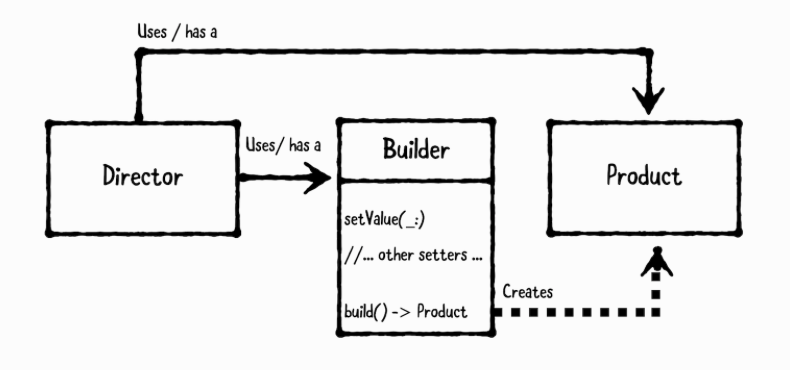

= Builder Pattern

===== 개념
* Director
** Director 객체는 View 또는 View Controller에서 Coordinates나 입력값을 받아 Builder에게 넘김
* Builder
** 입력값을 단계별 처리하고 Product 객체 생성를 담당함
* Product
** 실제 로직을 가지고 있으며 생성될 객체

===== 참고
* Design Patterns By Tutorials
