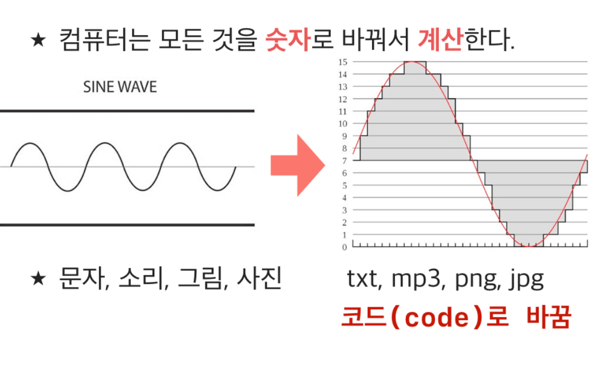
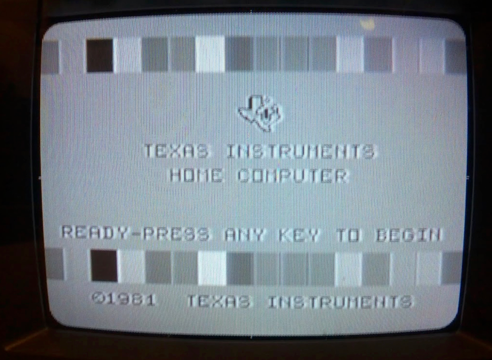

= 코드

=== 프로그래밍과 코드

===== Code
* 하드웨어와 소프트웨어를 표현하는 언어
* 같은 문자를 사용하지만 누가 그것을 해석하느냐에 따라 다른 의미를 나타냄
* 프로그래밍 세계에서도 여러 사람들이 만든 다양한 의미를 갖는 코드가 존재함
* 전원이 꺼진 상태와 켜진 상태를 각각 - False, True로 표현하다고 가정하며, 이러한 방식을 _논리 대수(Boolean Algebra)를 창안한 수학자 조지 부울의 이름을 따서 부울린 타입_ 이라고 부름
* Boolean Type은 디지털 시스템을 구성하는 하드웨어와 소프트웨어의 가장 기본적인 타입
** 이 개념을 확장하여 2진수로 모든 숫자를 대신 표현할 수 있음. 10진수를 2진수 코드로 표현할 수 있음
** 1 bit => 0, 1. 2의 1승(2개)
** 2 bit => 0-3. 2의 2승(4개)
** 8 bit => 0-255. 2의 8승(256개) 

===== 논리회로를 만들 수 있는 기본적인 부품
* 논리 연산, 비트 연산이랑 관계 있음. 논리 연산의 조합
** AND => 논리곱. A, B가 모두 참일 때 참, 나머지 거짓
** OR => 논리합. A, B가 둘 중 하나만 참이어도 참. 둘 다 거짓이면 거짓
** XOR => 베타 논리함. A, B가 서로 다른 경우만 참. 같은 값이면 거짓
** Invertor => 논리부정. A가 참이면 거짓, A가 거짓이면 참으로 바뀜
** NAND => 부정논리곱. 논리곱 반대. A, B가 모두 참일 때 거짓이고 나머지 참
** NOR => 부정논리합. 논리합 반대. A, B가 모두 거짓일 때 참이고 나머지 거짓
** XNOR => 베타 부정논리합. 베타논리합과 반대. A, B가 같으면 참이고 나머지 거짓
* AND, OR, Invertor 부품으로 조합해서 세상의 모든 디지털 시스템 부품을 만들 수 있음

=== 데이터

===== 정의
* 세상 모든 신호 => 시계, 온도, 말, 보는 사진, 이미지 등등
* 아날로그 특징을 가짐. 시간 흐름에 따라 끊임없이 값이 달라짐

===== 아날로그 vs 디지털
* Analog 
** Continuous
* Digital
** Discrete. x축, y축 구간을 잘게 나눠서 아날로그와 비슷한 근사치를 만들어 표현함
** x축 => 시간, y축 => 크기

===== A/D Converter
* 아날로그 신호를 디지털 신호로 바꾸는 장치
* 컴퓨터는 세상의 모든 아날로그 신호를 A/D Converter를 거쳐서 일정한 시간 간격으로 일정한 단위 값을 가지는 디지털 신호를 바꿔서 처리함
* 이진수 형식으로 계산함
* 예를 들어 알파벳, 한글 같은 아날로그 문자도 이진수 숫자로 바꿔서 계산함 => ASCII 코드, 유니코드

=== 비디오 카드와 모니터
* 320 x 200 해상도
* 8 x 8 비트맵 폰트
* 40 x 25 Text
* 1000자 표현 가능
* TV나 컴퓨터 화면 출력도 정해진 코드를 사용함

