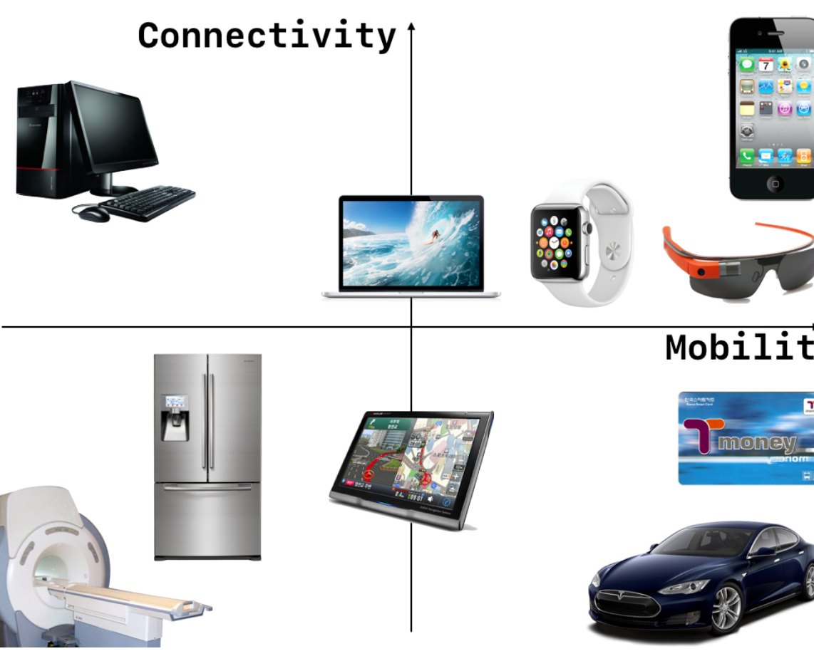

= 모바일 컴퓨팅

===== 모바일 컴퓨팅
* _언제든지 어디서나 어떤 것이든 네트워크에 연결되어 사용할 수 있는 컴퓨팅 환경_
* 모바일 컴퓨팅은 이동성과 연결성 모두 만족해야 함
* 휴대폰 앱만 있는 것이 아님. 휴대폰 앱을 대체할 수 있는 부분이 많음
* 허브 역할을 해주는 장치가 생겨남
** Apple TV, Apple Watch 연결을 돕는 장비
** 맥킨토시 전략 => 디지털 허브
* 인터넷이 연결하고 있는 시대
** 점점 Connectivity가 늘어나고 있음

===== 앨런 케이
* `앨런 케이 링크 참고`
* `제록스 연구소 링크 참고`
* DynaBook

===== IoT
* 모바일 개발자라면 단지 스마트폰 앱을 개발하는 것이 아니라 사물을 연결하고 데이터를 수집하고 _모바일 컴퓨터 환경에서 어떤 사용자 경험을 제공하게 되는지 넓은 시각을 가져야 함_
* 연결성과 이동성이 탁월하게 좋은 스마트 폰이 점차 IoT를 연결하는 핵심 기술 요소로 자리매김하고 있음
* 기존 인터넷 영역 네트워크 뿐만 아니라 Personal Area 영역을 포함한 _다양한 네트워크 방식에 대해 공부해야 함_

===== Human Computer 
* 불과 50년 전까지 계산사가 존재함
* 체스나 바둑은 이미 기계가 앞선 시대
* 패러다임이 바뀌고 있음 => 얘가 맞나? 안 맞나? 의심해봐야 함

===== 참고
* http://www.venturesquare.net/47938[앨런 케이]
* https://namu.wiki/w/PARC[제록스 연구소]