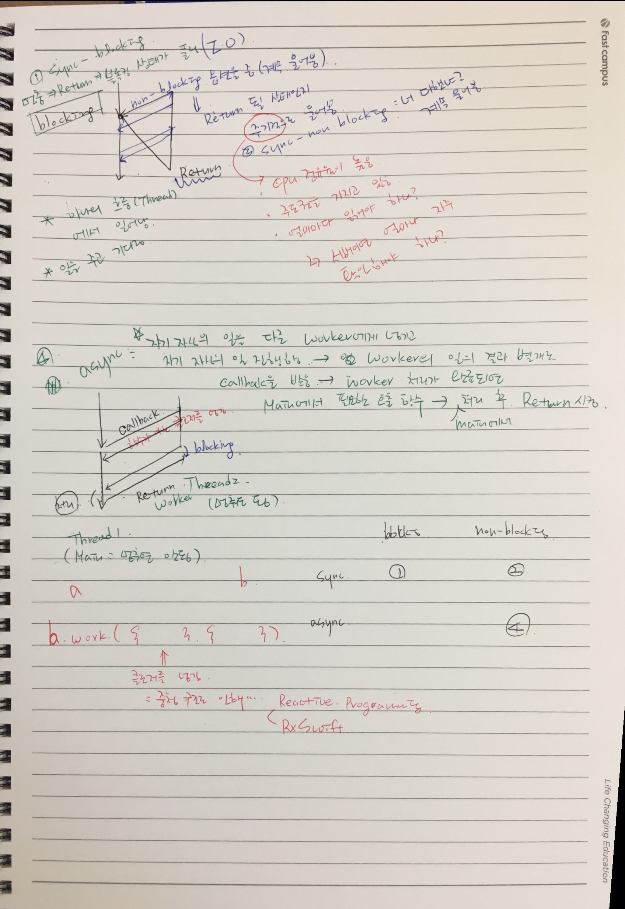

= Sync, Async, Blocking, Non-Blocking

=== 추가 정리
* Async로 작성할 경우 상태 관리를 잘해야 함
* Sync 함수인 경우 Async로 감싸고 코드로 작성해야 함
* @escaping => 이 함수가 끝나도 실행될 수 있음. RxSwift의 DisposeBag도 비슷한 역할
* Http Status 관리를 잘해야 함
** 3xx, 4xx, 5xx 에러는 명확하기 때문에 당연한 에러 처리가 필요하지만 모바일 내 에러는 2xx 으로 처리하는 경우도 있음
* 여러 개의 스레드 환경에 있는 값 타입 객체의 내부에서 mutating 함수가 문제가 될 소지가 있는 이유가 이 때 호출하고 있는 상태에서 Read-Read 관계일 때 괜찮지만
Write한 경우가 생기면 순서가 뒤바뀔 수 있기 때문에 Read-Read한 관계가 지향해야 함
