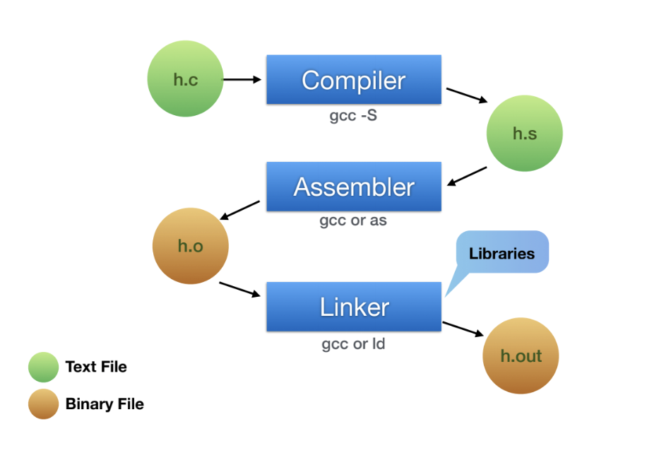
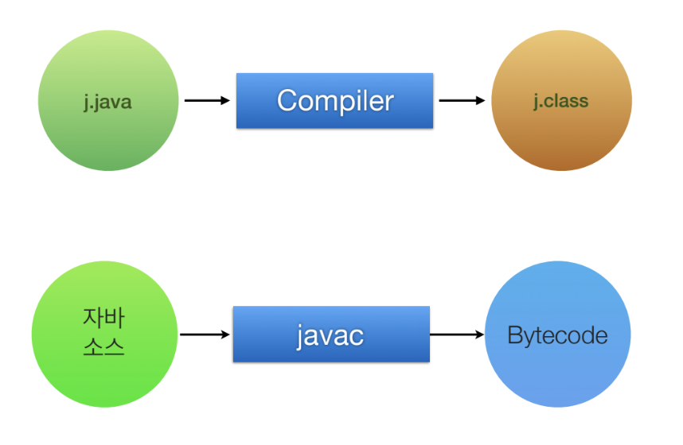
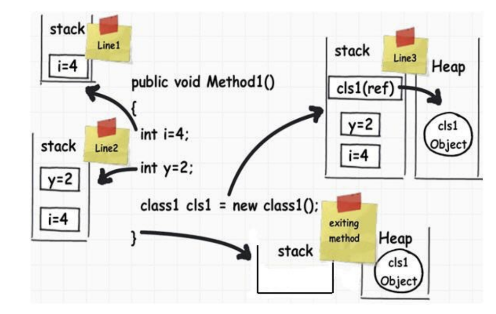

= Target, Host

=== Raspberry PI

===== 설명
* 모바일 환경과 유사함
* 원격으로 접속 가능함
** 안드로이드나 아이폰도 권한을 풀면 가능함

=== 운영체제

===== 설명
* 안드로이드
** 리눅스
* iOS
** 유닉스에 가까움. iOS는 유닉스 인증을 받지 못함. MacOS는 유닉스 인증을 받음

=== 컴파일

===== C Programming
* h.c -> Compiler(gcc -S) -> h.s -> Assembler(gcc or as) -> h.o → Linker(Libraries, gcc or ld) -> h.out

===== Text File(Assembly Language)
* 사람이 읽을 수 있는 파일
* Mnemonic Code보다 좀 더 편리하고 이해하기 쉽도록 가상의 명령를 추가한 언어

===== Binary File(기계어)
* 기계가 읽을 수 있는 파일
* 프로세서가 이해하기 편하지만 사람이 작성하기 불편함
* 프로세서가 이해하고 처리할 수 있는 2진수로 표현된 명령

===== 시뮬레이터와 에뮬레이터 차이
* 시뮬레이터 => Host 아키텍처로 돌아감
* 에뮬레이터 => 실행 타겟으로 돌아감
* 그렇기 때문에 시뮬레이터는 빠르지만 에뮬레이터는 느림

===== 실습
* `target-host-example 링크 참고`

[source, bash]
----
# Generate Assembly
# -S(Host)
# Host => Mac
$ gcc main.c -S

# Generate Target Assembly 
# -arch armv7(Target)
# 실행 타겟을 정해줘야 함 => iOS나 시뮬레이터
$ gcc main.c -S -arch armv7

# Generate Target Obejct
$ gcc -c main.s -arch armv7

# Link Executable Binary
# main.o, -lLibrary(Linker)
$ ld -o main main.o printf.o

$ gcc -o main main.c -lLibrary

# Raspberry -pi로 실습
# 내 컴퓨터(= 호스트)
# ssh ios@192.168.1.xxx(= 타켓)
# ls -l -rwxr-xr-x => x가 있어야 실행파일임

$ gcc sum.c -S
$ gcc -c sum.s
$ gcc main.c -S
$ gcc -c main.s
$ gcc -o sum sum.o main.o
----

* 결과물 

----
// main.c
        .arch armv6
        .eabi_attribute 27, 3
        .eabi_attribute 28, 1
        .fpu vfp
        .eabi_attribute 20, 1
        .eabi_attribute 21, 1
        .eabi_attribute 23, 3
        .eabi_attribute 24, 1
        .eabi_attribute 25, 1
        .eabi_attribute 26, 2
        .eabi_attribute 30, 6
        .eabi_attribute 34, 1
        .eabi_attribute 18, 4
        .file   "main.c"
        .section        .rodata
        .align  2
.LC0:
        .ascii  "total = %d\012\000"
        .text
        .align  2
        .global main
        .type   main, %function
main:
        @ args = 0, pretend = 0, frame = 8

// sum.c
        .arch armv6
        .eabi_attribute 27, 3
        .eabi_attribute 28, 1
        .fpu vfp
        .eabi_attribute 20, 1
        .eabi_attribute 21, 1
        .eabi_attribute 23, 3
        .eabi_attribute 24, 1
        .eabi_attribute 25, 1
        .eabi_attribute 26, 2
        .eabi_attribute 30, 6
        .eabi_attribute 34, 1
        .eabi_attribute 18, 4
        .file   "sum.c"
        .text
        .align  2
        .global sum
        .type   sum, %function
sum:
        @ args = 0, pretend = 0, frame = 16
        @ frame_needed = 1, uses_anonymous_args = 0
        @ link register save eliminated.
        str     fp, [sp, #-4]!
        add     fp, sp, #0
----

===== Java Compile

=== Running a program

===== 설명
* h.out 파일 
* 운영체제 실행파일 규격
* 장비에서 실행하는 기계어도 맞아야 함

===== Memory Model
* Text
* Gvar, BSS
** Enum, Static
* Heap
** Class
* Stack
** 서브루틴 => Stack에 쌓았다가 다음 함수에다가 넘겨서 비움
** 재귀 => 쌓았던 것을 버리지 못하면 스택오버 플로우가 발생함

===== Stack Variable, Heap Object
* Link 3 
** 포인터 변수 => CPU가 사용하는 비트
** Heap => 인스턴스의 크기

=== CPU
* Memory => 명령어 한줄씩 복사함
** 명령어 한줄씩 실행하는데 4클락이 필요함
** Address -> 등록 -> 분석 -> 실행
* 프로그래밍 카운터를 체크하면서 메모리의 명령어를 몇 번째까지 실행하였는지 확인함

=== Cross Compile Toolchain

===== Cross Compiler
* 실행 파일을 실행할 수 있는 2가지 조건으로 규격이 맞아야 함
* 어떤 OS에서 실행하나?
* 어떤 장비에서 실행하나?
* 결국 Target을 알아야 빌드가 됨
* 임베디드 시스템 인 경우 Target을 알지 못해도 실행할 수 있음

=== 정리
* Host와 Target 개념을 이해하고 Target 환경에서 개발하기 불편하기 때문에 Host에서 개발하고 Target 환경을 빌드하기 위해 크로스 컴파일를 통해 각 실행 규격에 맞는 실행파일을 만듬
* 시뮬레이터와 에뮬레이터 차이점 이해하기
* iOS는 어디서 빌드 하냐에 따라 Shared Object File이 없기 때문에 앱 배포할 때 포함해서 배포해야 함. 앱 번들 파일에다가 넣으면 됨
* -.app에 있음

=== 참고 
* https://github.com/yuaming/wiki/tree/master/etc/target-host-example[Target, Host Example]
