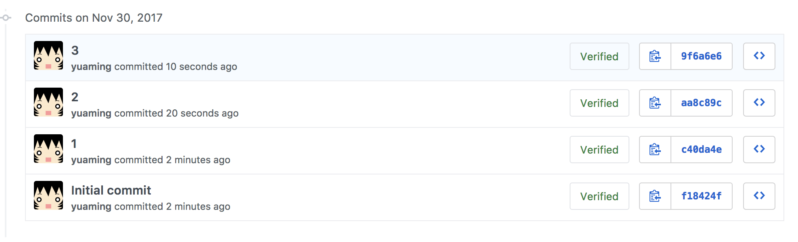
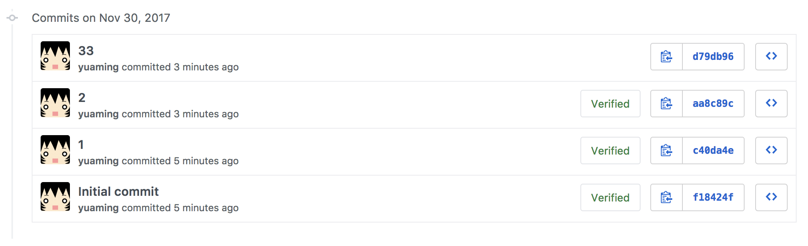
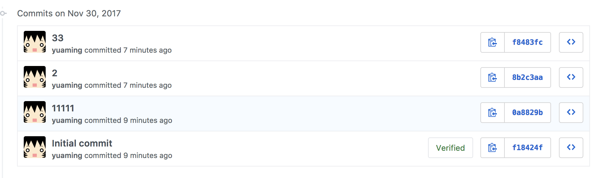

= Git Commit 메세지 변경하기

===== 문제
* Git Commit 메세지를 변경하고 싶은데 어떻게 해야 할까?

===== 해결
* 마지막 커밋 메세지를 "3" -> "33" 으로 바꾸고 싶음
* 아래 이미지와 같이 커밋 내역이 있음

[source, bash]
----
# amend를 이용해서 메세지를 바꾸면 git commit id도 바뀜
# 보이지 않지만 커밋내역이 저장소 어딘가에 쌓이고 있음

$ git commit --amend -m "33"

$ git push -f
----

* 아래에서 두 번째 커밋 메세지를 "1" -> "1111"으로 바꾸고 싶음

[source, bash]
----
$ git rebase -i HEAD~3
----

[source, bash]
----
# edit으로 설정합니다.
edit 0a8829b 1
pick 8b2c3aa 2
pick f8483fc 33

# Rebase f18424f..f8483fc onto f18424f (3 commands)
#
# Commands:
# p, pick = use commit
# r, reword = use commit, but edit the commit message
# e, edit = use commit, but stop for amending
# s, squash = use commit, but meld into previous commit
# f, fixup = like "squash", but discard this commit's log message
# x, exec = run command (the rest of the line) using shell
# d, drop = remove commit
#
# These lines can be re-ordered; they are executed from top to bottom.
#
# If you remove a line here THAT COMMIT WILL BE LOST.
#
# However, if you remove everything, the rebase will be aborted.
#
# Note that empty commits are commented out
----

[source, bash]
----
$ git commit --amend 

# 편집하고자 하는 내용을 작성함
1 

# Please enter the commit message for your changes. Lines starting  
# with '#' will be ignored, and an empty message aborts the commit.  
#  
# Date: Sun Feb 25 17:18:30 2018 +0900  
#  
# interactive rebase in progress; onto ff1bccd  
# Last command done (1 command done):  
# edit 0a8829b 1
# No commands remaining.  
# You are currently editing a commit while rebasing branch 'master' on 'ff1bccd'.  
#  
# Changes to be committed:  

# 커밋이 바뀌는 파일
----

[source, bash]
----
$ git rebase --continue

Successfully rebased and updated refs/heads/master.

$ git push -f
----

* "11111", "33"으로 변경된 메세지를 확인할 수 있음

* *git rebase - 사용에 주의하자!*
** 개인 로컬에서만 사용하자 => 이미 Push한 작업에다가 사용하지 말자
** 왜냐하면 Rebase 작업하는 동안 다른 커밋이 발생하면 충돌 문제가 발생할 수 있음
** 히스토리 내역에 남지 않기 떄문에 다른 사람이 작업 내역을 확인하기 힘듬

=== 참고
* https://help.github.com/articles/changing-a-commit-message/[Git Commit 메세지 변경]
* https://git-scm.com/book/ko/v1/Git-%EB%8F%84%EA%B5%AC-%ED%9E%88%EC%8A%A4%ED%86%A0%EB%A6%AC-%EB%8B%A8%EC%9E%A5%ED%95%98%EA%B8%B0[Git 도구 - 히스토리 단장하기]