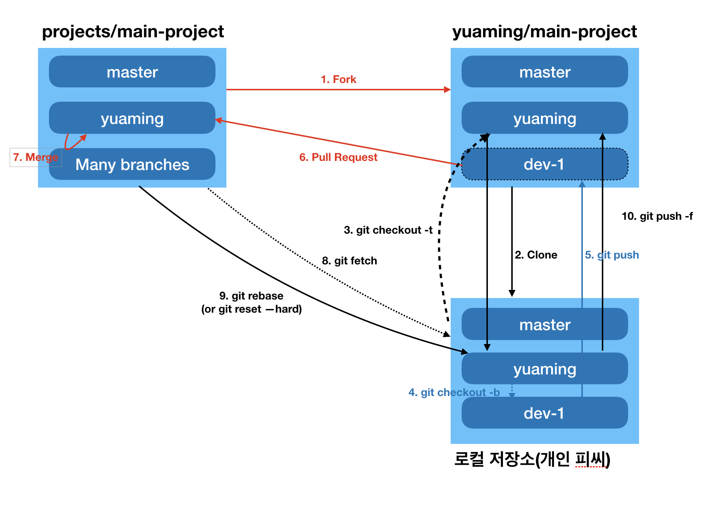

= Github Pull-request 보내기

===== 1. Fork
* 타켓 저장소의 프로젝트를 자신의 계정으로 fork함

===== 2. Clone
* fork한 프로젝트를 내 컴퓨터로 클론함

[source, bash]
----
$ git clone https://github.com/yuaming/main-project
----

===== 3. git checkout -t
* Clone한 프로젝트 이동하고 본인 아이디로 브랜치를 만들기 위한 Checkout
* -t, --track
** When creating a new branch, set up "upstream" configuration. See "--track" in git-branch[1] for details.

[source, bash]
----
$ git checkout -t origin/yuaming
----

===== 4. git checkout -b
* 기능 구현을 위한 브랜치 생성

[source, bash]
----
$ git checkout -b dev-1
----

* 아래 명령어를 이용해 작업 후 커밋

[source, bash]
----
$ git status

# 특정 파일 삭제
$ git rm 파일명

# 파일 추가
$ git add 파일명(or * 모두)

# 커밋
$ git commit -m "메세지"
----

===== 5. git push
* 본인 원격 저장소 푸시, 현재 브랜치 연결함

[source, bash]
----
$ git push --set-upstream origin dev-1
----

===== 6. Pull Request
* Github 에서 Pull Request 보내기
** `base: projects/main-project yuaming -> compare : yuaming/main-project dev-1`
* 코드 리뷰, 기능 개선 및 푸시

===== 7. Merge
* 코드 리뷰하고 난 뒤, project/main-projects 코드가 Merge됨
* 기본(upstream) 브랜치 전환 및 base 저장소 추가(시작 단계에서 1회만 하면 됨)

[source, bash]
----
$ git checkout yuaming
$ git remote add upstream https://github.com/projects/main-project.git

# 원격 저장소 브랜치 목록 확인
$ git remote -v 
----

===== 8. git fetch
* 기본 base 저장소와 sync

[source, bash]
----
$ git fetch upstream
----

===== 9. git rebase
* PR 보낸 내용을 자신의 기본 저장소와 합침

[source, bash]
----
# projects/main-project(=upstream) yuaming 브랜치 작업 내역을 yuaming/main-project 의 yuaming 브랜치로 작업내용을 합침
$ git rebase upstream/yuaming 
$ git push -f 
----

===== 유의사항
* _upstream 저장소 브랜치에 자신의 github 아이디에 해당하는 브랜치가 존재해야 함_
* _자신의 github 아이디에 해당하는 브랜치가 있는지 확인해야 함_

=== 참고
* https://milooy.wordpress.com/2017/06/21/working-together-with-github-tutorial/[초심자를 위한 Github협업]