= Animating Constraints

===== Animating Constraint Constants
* _Auto Layout Constant_
* _UIView.animate_
* `self.view.layoutIfNeeded()` 사용하지 않으면 View 애니메이션 진행하는 동안 Text Label 사이즈가 깨지는 이유 ?

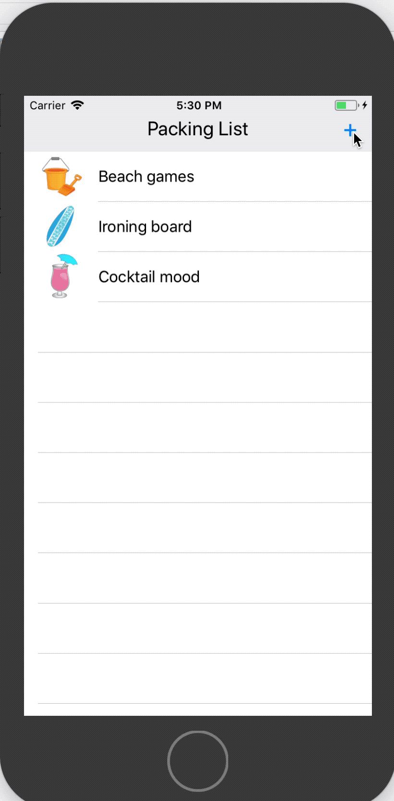
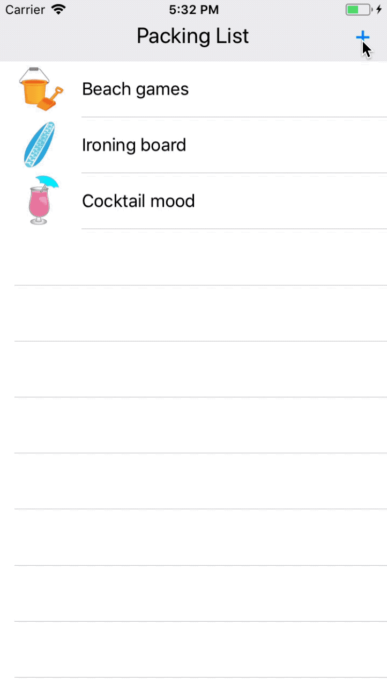

[source, swift]
----
@IBAction func toggleMenu(_ sender: AnyObject) {
    menuIsOpen = !menuIsOpen

    //TODO: Build your first constraint animation!
   titleLabel.text = menuIsOpen ? "Select Item" : "Package List"
   self.view.layoutIfNeeded()

    menuConstant.constant = menuIsOpen ? 200.0 : 60.0

    UIView.animate(
        withDuration: 0.33,
        delay: 0.0,
        options: .curveEaseIn,
        animations: {
        self.view.layoutIfNeeded()
        },
        completion: nil
    )
}
----

===== Animate Position with Constants
* _CGAffineTransform_

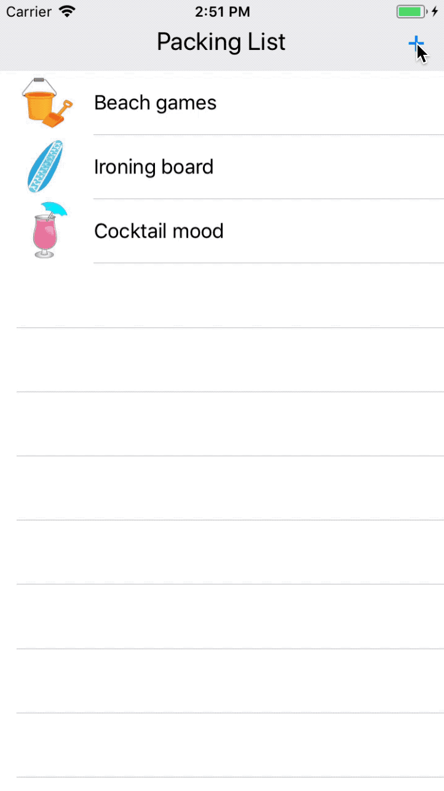

[source, swift]
----
@IBAction func toggleMenu(_ sender: AnyObject) {
    // ...

    titleLabel.text = menuIsOpen ? "Select Item" : "Packing List"
    view.layoutIfNeeded()
		
    menuHeightConstraint.constant = menuIsOpen ? 200.0 : 60.0
    closedButtonConstraint.constant = menuIsOpen ? 18.0 : 6.0
		
    UIView.animate(
      withDuration: 0.33,
      delay: 0.0,
      options: .curveEaseIn,
      animations: {
        let angle: CGFloat = self.menuIsOpen ? .pi / 4 : 0.0
        self.buttonMenu.transform = CGAffineTransform(rotationAngle: angle)
        self.view.layoutIfNeeded()
      },
      completion: nil
    )
  }

  // ...
}
----

* _UIViewAnimationOptions_
* Playground에서 확인 가능함

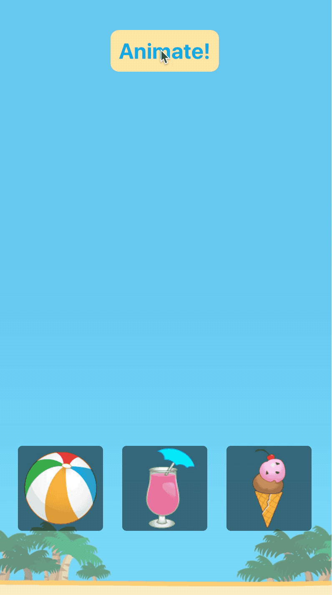

[source, swift]
----
import PlaygroundSupport
import UIKit

let view = OptionsView(frame: CGRect(
  x: 0, y: 0,
  width: 400, height: 800
))

PlaygroundPage.current.liveView = view

view.duration = 2.0

let beachballOptions: UIViewAnimationOptions = [.curveEaseIn]
let drinkOptions: UIViewAnimationOptions = [.curveEaseOut]
let icecreamOptions: UIViewAnimationOptions = [.curveEaseInOut]

extension OptionsView {
  @objc func animate() {
    UIView.animate(
      withDuration: duration, delay: 0.0,
      options: beachballOptions, animations: {
        view.beachballConY.constant = view.beachballConY.constant * -1
        view.layoutIfNeeded()
      }, completion: nil
    )
    UIView.animate(withDuration: duration, delay: 0.0,
      options: drinkOptions, animations: {
        view.drinkConY.constant = view.drinkConY.constant * -1
        view.layoutIfNeeded()
      }, completion: nil
    )
    UIView.animate(withDuration: duration, delay: 0.0,
      options: icecreamOptions, animations: {
        view.icecreamConY.constant = view.icecreamConY.constant * -1
        view.layoutIfNeeded()
      }, completion: nil
    )
  }
}

view.button.addTarget(view, action: #selector(view.animate), for: .touchUpInside)
----

===== Dynamically Created Views

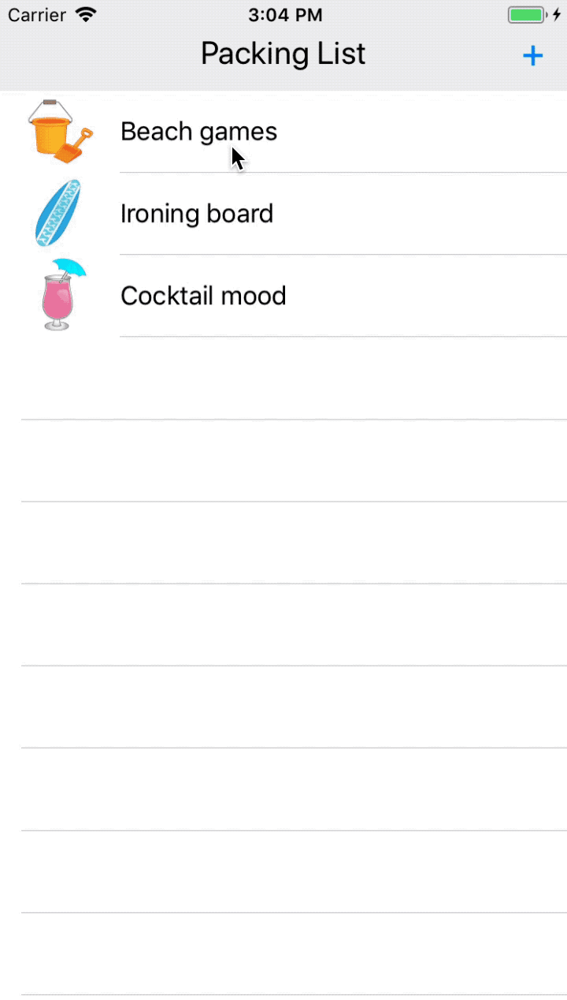

[source, swift]
----
func showItem(_ index: Int) {
  let imageView = makeImageView(index: index)
  view.addSubview(imageView)				//Create constraints
  let conX = imageView.centerXAnchor.constraint(equalTo: view.centerXAnchor)
  let conBottom = imageView.bottomAnchor.constraint(equalTo:view.bottomAnchor, constant: imageView.frame.height)
  let conWidth = imageView.widthAnchor.constraint(equalTo: view.widthAnchor multiplier: 0.33, constant: -50.0)
  let conHeight = imageView.heightAnchor.constraint(equalTo:imageView.widthAnchor)
  
  NSLayoutConstraint.activate([conX, conBottom, conWidth, conHeight])
  view.layoutIfNeeded()
  
  //Animate in
  UIView.animate(
    withDuration: 0.8,
    delay: 0.0,
    animations: {
      conBottom.constant = -imageView.frame.size.height / 2
      conWidth.constant = 0.0
      self.view.layoutIfNeeded()
    },
    completion: nil
  )
  
  //Animate out
  UIView.animate(
    withDuration: 0.67,
    delay: 2.0,
    animations: {
      conBottom.constant = imageView.frame.size.height
      conWidth.constant = -50.0
      self.view.layoutIfNeeded()
    },
    completion: {_ in
      // Removing a super view
      imageView.removeFromSuperview()
    }
  )
}
----

===== Animating Constraint Multipliers
* multiplier는 Read-Only Property 만 있음. 어떻게 변경해야 할까?
* Code, Interface Builder를 통해 변경할 수 있음

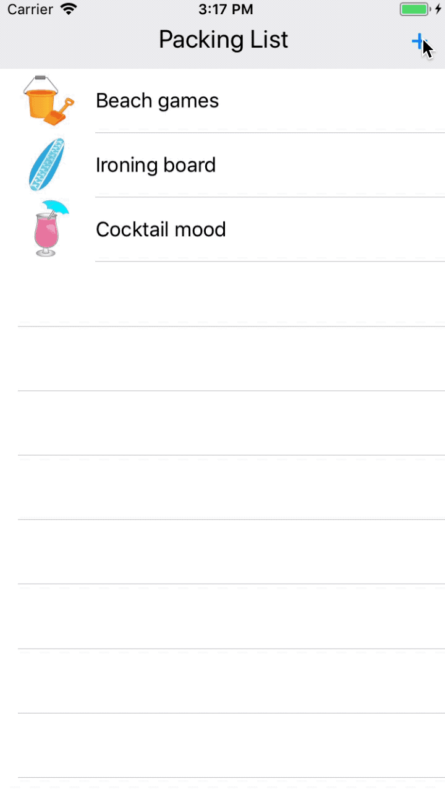

[source, swift]
----
// Code
@IBAction func toggleMenu(_ sender: AnyObject) {
    menuIsOpen = !menuIsOpen

    titleLabel.text = menuIsOpen ? "Select Item" : "Packing List"
    view.layoutIfNeeded()

    titleLabel.superview?.constraints.forEach { constraint in
        if constraint.firstItem === titleLabel &&
            constraint.firstAttribute == .centerX {
            constraint.constant = menuIsOpen ? -100.0 : 0.0
            return
        }

        if constraint.identifier == "TitleCenterY" {
            constraint.isActive = false

            let newConstraint = NSLayoutConstraint(
                item: titleLabel,
                attribute: .centerY,
                relatedBy: .equal,
                toItem: titleLabel.superview!,
                attribute: .centerY,
                multiplier: menuIsOpen ? 0.67 : 1.0,
                constant: 5.0
            )
            newConstraint.identifier = "TitleCenterY"
            newConstraint.isActive = true
        }
    }

    // ... 
}

// Interface Builder
// * Installed 체크박스 설정
// * Priority 설정
@IBOutlet weak var titleCenterY: NSLayoutConstraint!
@IBOutlet weak var titleCenterY_Open: NSLayoutConstraint!

@IBAction func toggleMenu(_ sender: AnyObject) {
    menuIsOpen = !menuIsOpen

    titleLabel.text = menuIsOpen ? "Select Item" : "Packing List"
    view.layoutIfNeeded()

    titleCenterY.isActive = !menuIsOpen
    titleCenterY_Open.isActive = menuIsOpen

    titleLabel.superview?.constraints.forEach { constraint in
        if constraint.firstItem === titleLabel &&
            constraint.firstAttribute == .centerX {
            constraint.constant = menuIsOpen ? -100.0 : 0.0
            return
        }
    }

    // ...
}
---- 

===== Spring Animation
* _usingSpringWithDamping_ => Ratio 0 ~ 1
* _initialSpringVelocity_ => View의 초기 속도를 Point를 초 단위로 나누어 계산함. 0은 속도 없음. 1은 1초동안 이동하는데 필요한 속도와 동일함
* 첫 번째 이미지는 usingSpringWithDamping: 0.1 / initialSpringVelocity: 10
* 두 번째 이미지는 usingSpringWithDamping: 1.0 / initialSpringVelocity: 10
* 세 번째 이미지는 usingSpringWithDamping: 1.0 / initialSpringVelocity: 100

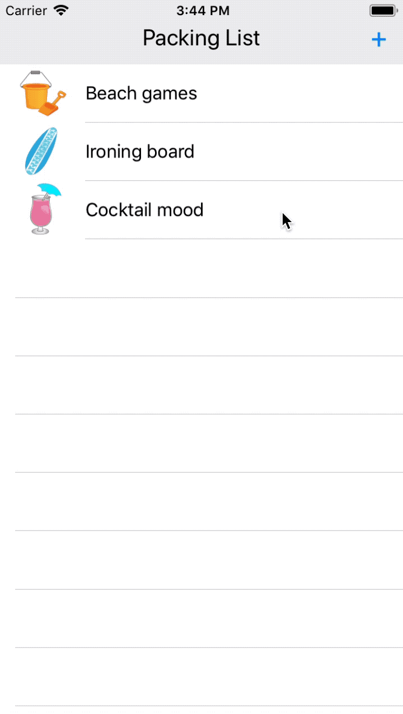
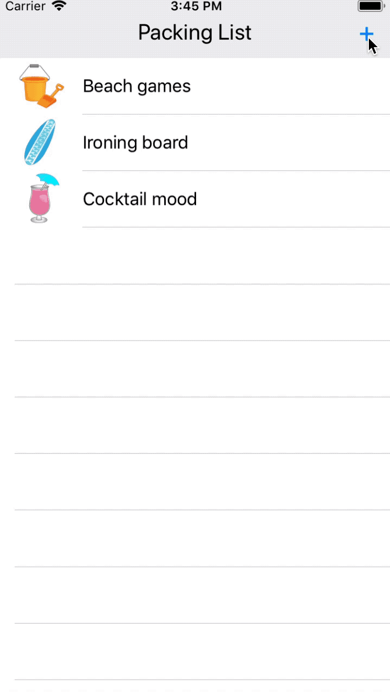
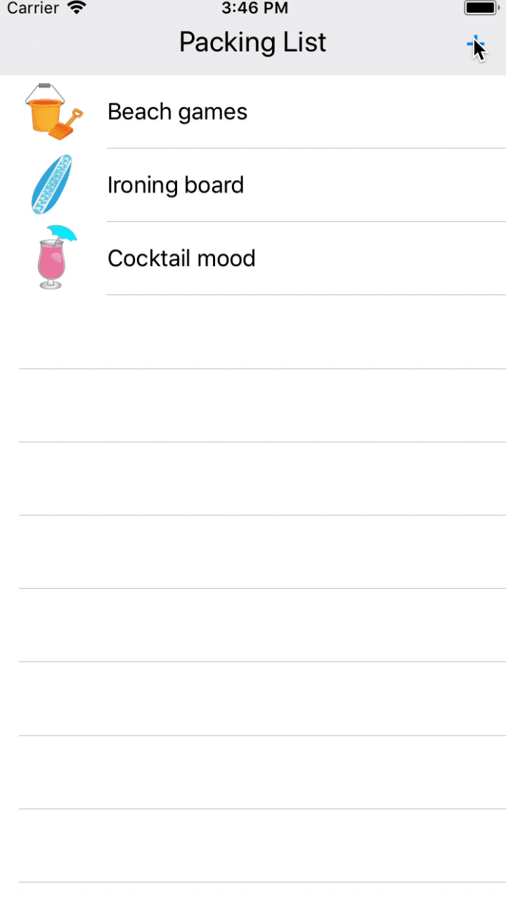

[source, swift]
----
UIView.animate(
  withDuration: 1.0,
  delay: 0.0,
  // 0 to 1
//      usingSpringWithDamping: 0.1,
  usingSpringWithDamping: 1.0,
  initialSpringVelocity: 100.0,
  options: [],
  animations: {
    let angle: CGFloat = self.menuIsOpen
      ? .pi / 4
      : 0.0
    self.buttonMenu.transform = CGAffineTransform(rotationAngle: angle)
    self.view.layoutIfNeeded()
  },
  completion: nil
)
----

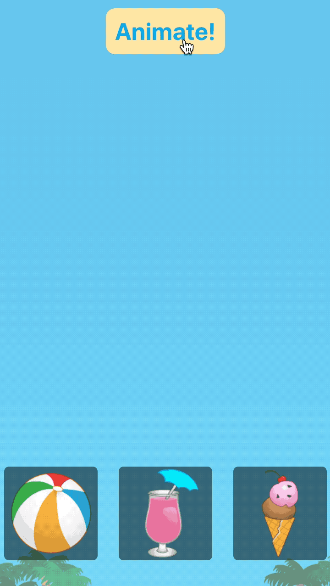

[source, swift]
----
import PlaygroundSupport
import UIKit

let view = SpringsView(frame: CGRect(
  x: 0, y: 0,
  width: 400, height: 800
))

PlaygroundPage.current.liveView = view

view.duration = 2.0

view.beachballSpringDamping = 0.1
view.beachballSpringInitialVelocity = 0.0

view.drinkSpringDamping = 0.5
view.drinkSpringInitialVelocity = 0.0

view.icecreamSpringDamping = 1.0
view.icecreamSpringInitialVelocity = 0.0

extension SpringsView {
  @objc func animate() {
    UIView.animate(
      withDuration: duration, delay: 0.0,
      usingSpringWithDamping: beachballSpringDamping,
      initialSpringVelocity: beachballSpringInitialVelocity,
      options: [], animations: {
        view.beachballConY.constant = view.beachballConY.constant * -1
        view.layoutIfNeeded()
      }, completion: nil
    )
    UIView.animate(withDuration: duration, delay: 0.0,
      usingSpringWithDamping: drinkSpringDamping,
      initialSpringVelocity: drinkSpringInitialVelocity,
      options: [], animations: {
        view.drinkConY.constant = view.drinkConY.constant * -1
        view.layoutIfNeeded()
      }, completion: nil
    )
    UIView.animate(withDuration: duration, delay: 0.0,
      usingSpringWithDamping: icecreamSpringDamping,
      initialSpringVelocity: icecreamSpringInitialVelocity,
      options: [], animations: {
        view.icecreamConY.constant = view.icecreamConY.constant * -1
        view.layoutIfNeeded()
      }, completion: nil
    )
  }
}

view.button.addTarget(view, action: #selector(view.animate), for: .touchUpInside)
----

===== View Transitions
* Transition Triggers
** `isHidden`
** `addSubview()`
** `removeFromSuperview()`
* Transitions

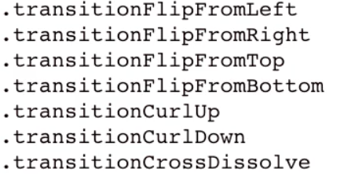

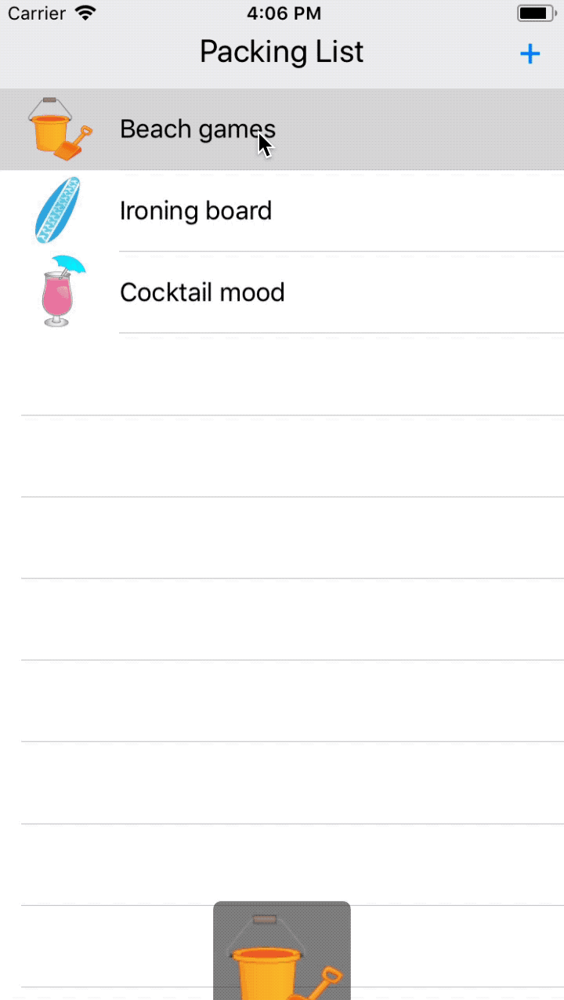

[source, swift]
----
delay(seconds: 1.0, completion: {
  UIView.transition(
    with: imageView,
    duration: 1.0,
    options: [
      .curveEaseIn,
      .transitionFlipFromBottom
    ],
    animations: {
      imageView.isHidden = true
    },
    completion: {_ in
      imageView.removeFromSuperview()
    }
  )
})
----

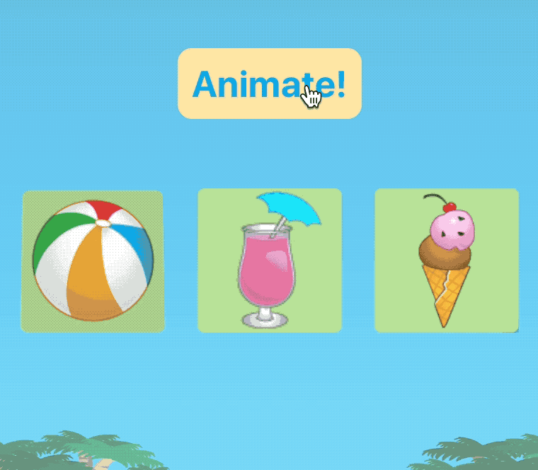

[source, swift]
----
let view = TransitionsView(frame: CGRect(
  x: 0, y: 0,
  width: 400, height: 400
))

PlaygroundPage.current.liveView = view

view.duration = 2.0

let beachballOptions: UIViewAnimationOptions = [.transitionFlipFromTop]

let drinkOptions: UIViewAnimationOptions = [.transitionCrossDissolve]

let icecreamTransitionIn: UIViewAnimationOptions = [.transitionCurlUp]
let icecreamTransitionOut: UIViewAnimationOptions = [.transitionCurlDown]

extension TransitionsView {
  @objc func transition() {
    let shouldHide = self.beachball.isHidden ? false : true
    
    UIView.transition(
      with: beachball,
      duration: duration,
      options: beachballOptions,
      animations: {
        self.beachball.isHidden = shouldHide
      },
      completion: nil
    )
    
    UIView.transition(
      with: drink,
      duration: duration,
      options: drinkOptions,
      animations: {
        self.drink.isHidden = shouldHide
      },
      completion: nil
    )
    
    UIView.transition(
      with: icecream,
      duration: duration,
      options: shouldHide ? icecreamTransitionIn : icecreamTransitionOut,
      animations: {
        self.icecream.isHidden = shouldHide
      },
      completion: {_ in
//        self.icecream.isHidden = true
      }
    )
  }
}

view.button.addTarget(view, action: #selector(view.transition), for: .touchUpInside)
----

===== 참고
* https://videos.raywenderlich.com/courses/104-beginning-ios-animations[Beginning iOS Animations]