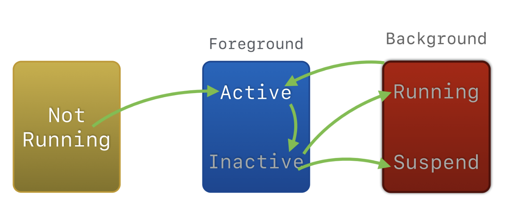
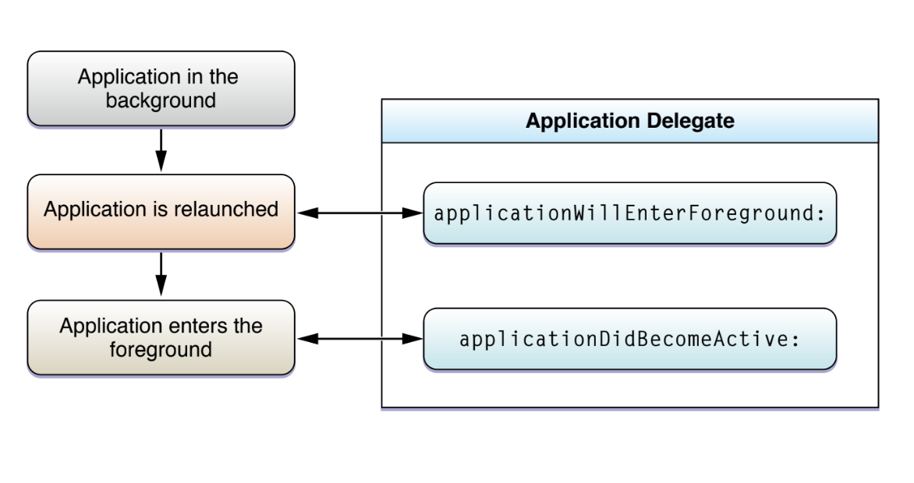
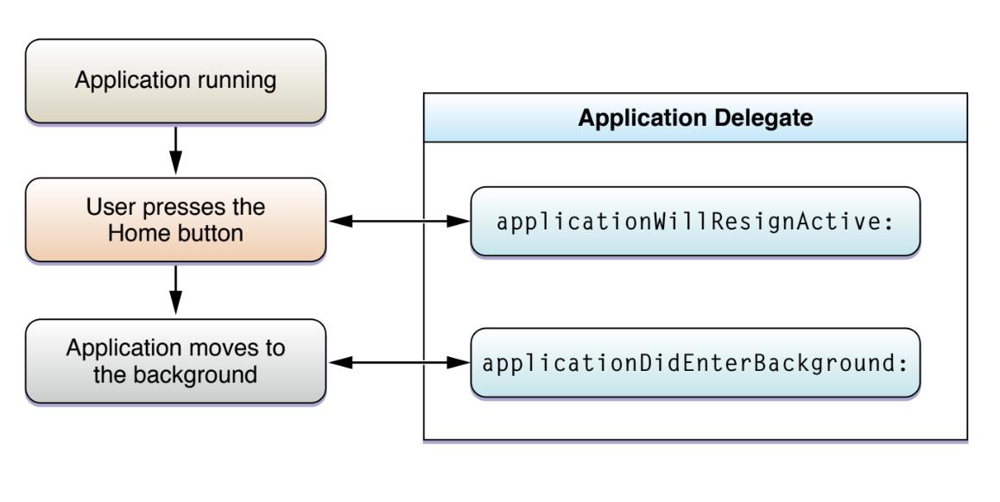
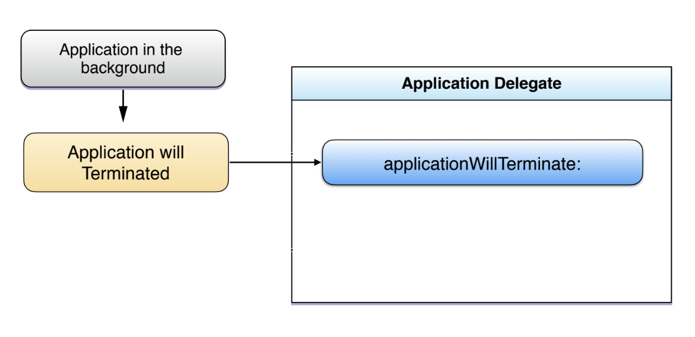

= App Life Cycle

===== 3가지 실행모드, 5가지 상태

===== Launching an app into the foreground 

image:./image/launching-app-into-foreground.png[]

===== Launching an app into the background

image:./image/launching-app-into-background.png[]

===== App interruptions

image:./image/handling-alert-based-interruptions.png[]

===== Background to foreground

===== Foreground to background

===== Termination

===== 참고
* https://developer.apple.com/library/content/documentation/iPhone/Conceptual/iPhoneOSProgrammingGuide/Introduction/Introduction.html[App Programming for iOS]