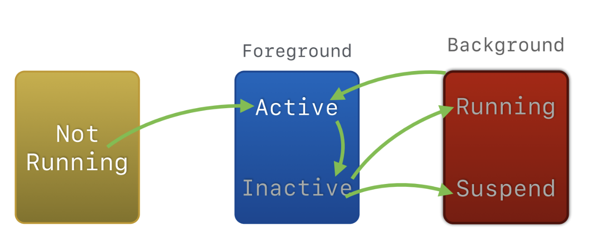
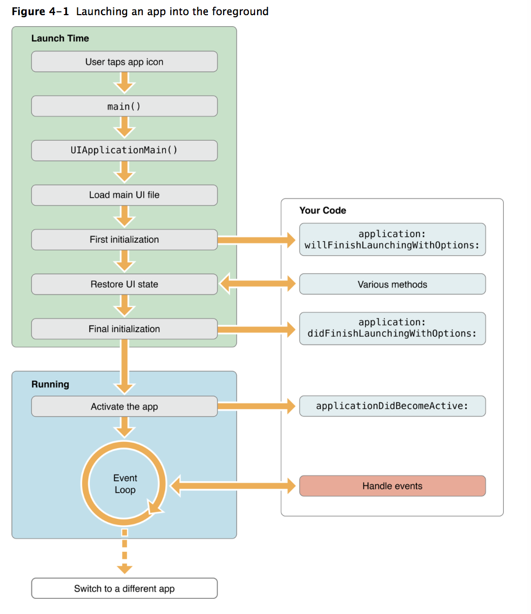
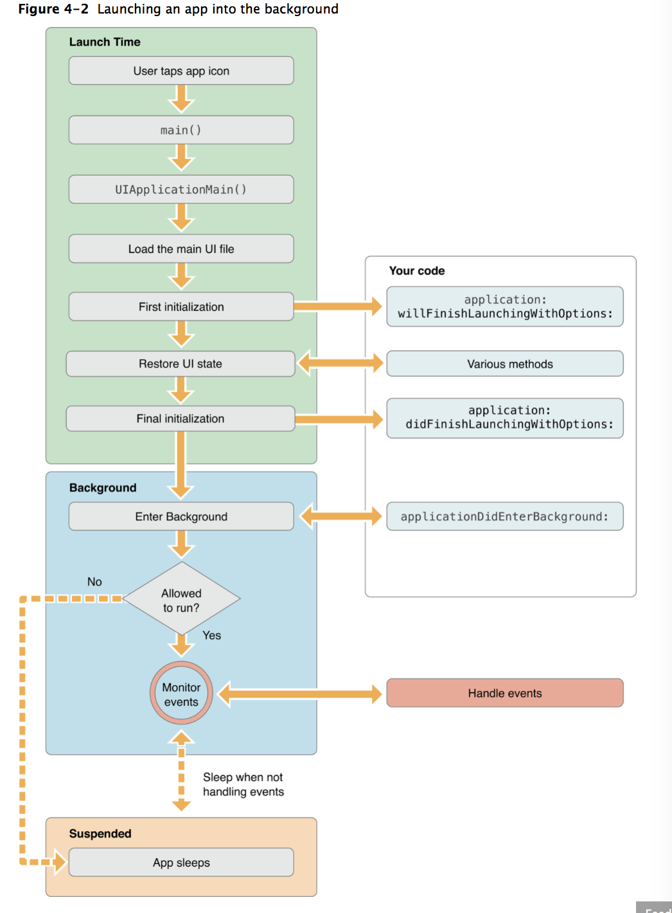
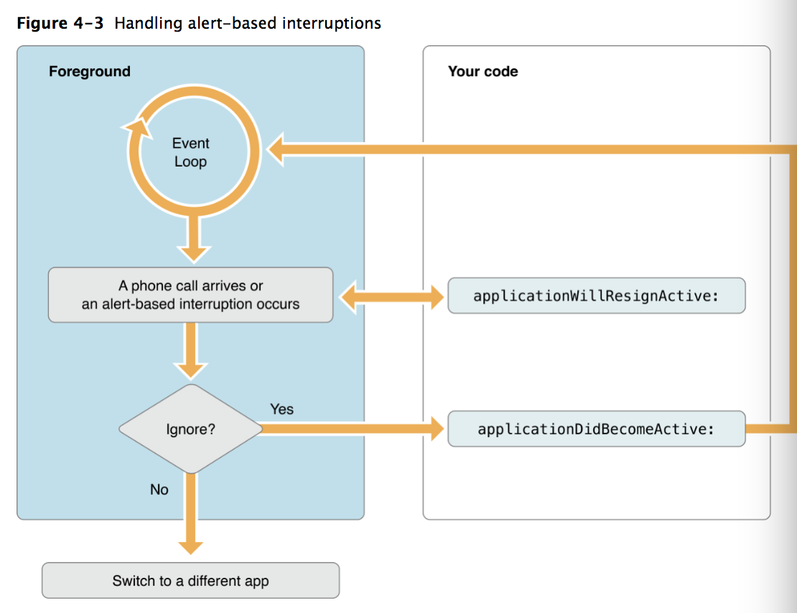
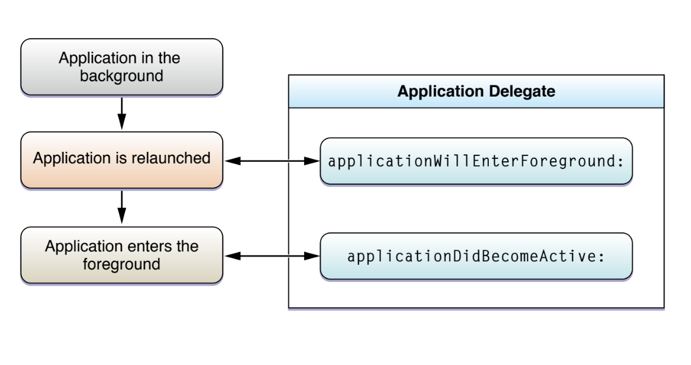
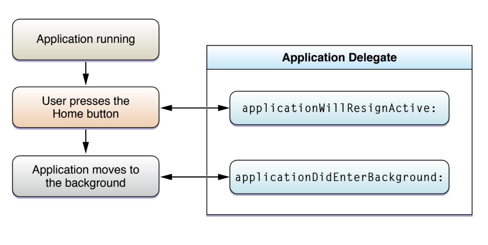
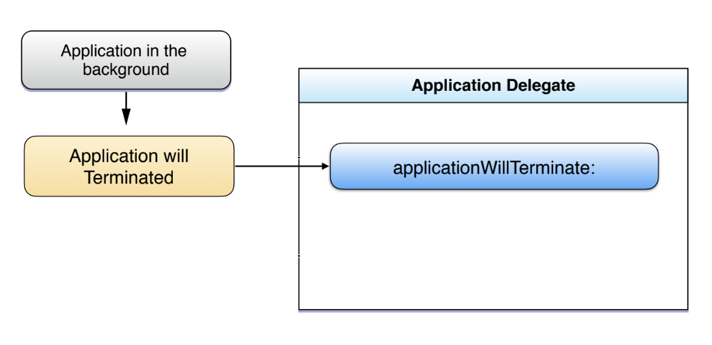

= App Life Cycle

===== 3가지 실행모드, 5가지 상태

===== Launching an app into the foreground 

===== Launching an app into the background

===== App Interruptions

===== Background to Foreground

===== Foreground to Background

===== Termination

===== 참고
* https://developer.apple.com/library/content/documentation/iPhone/Conceptual/iPhoneOSProgrammingGuide/Introduction/Introduction.html[App Programming for iOS]