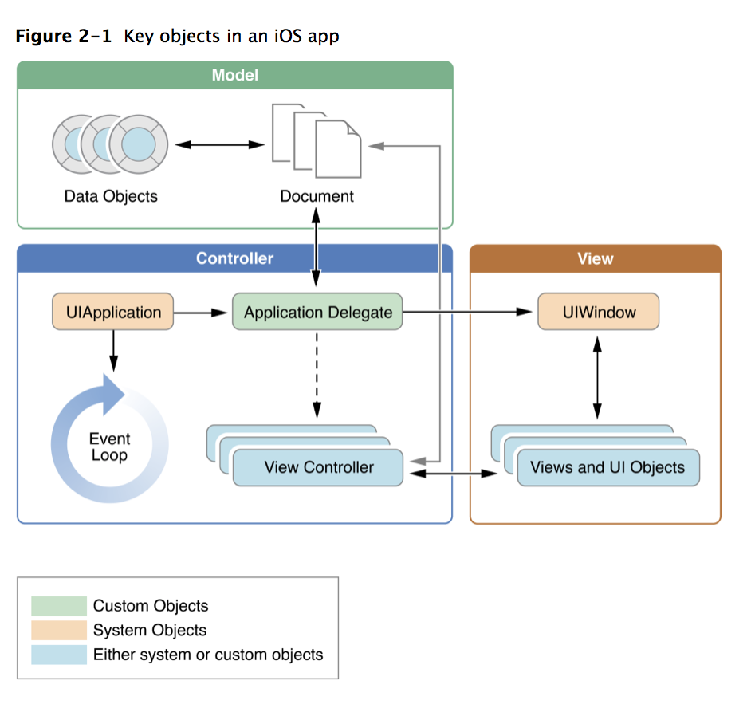
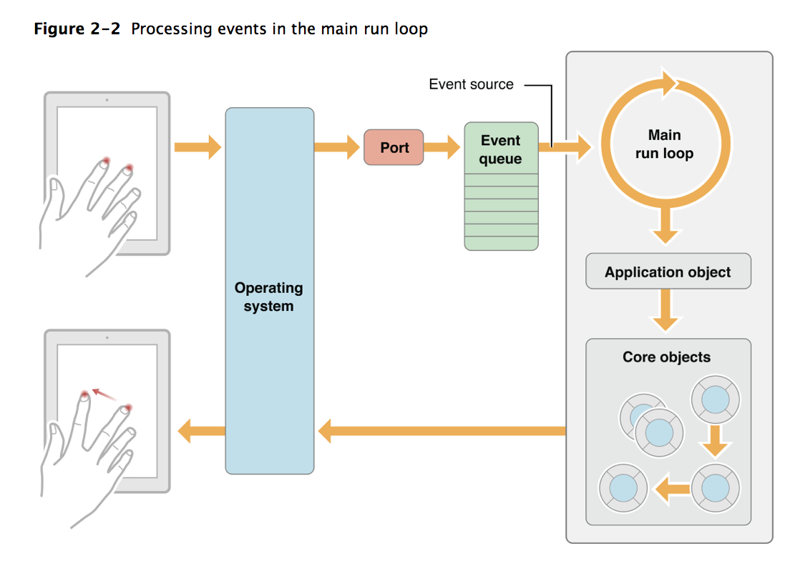
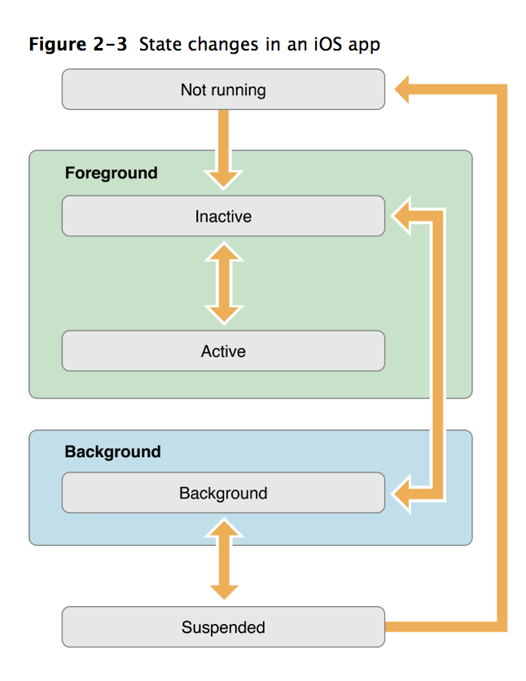
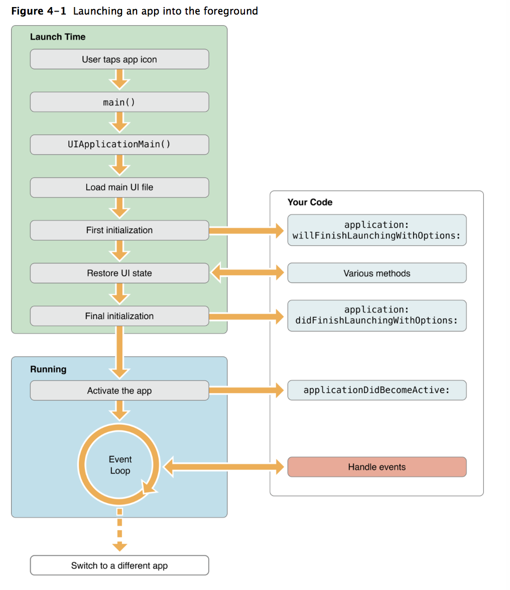
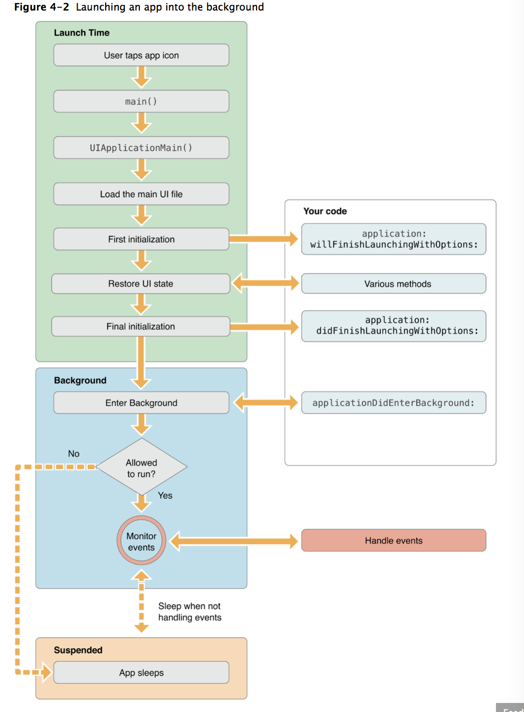
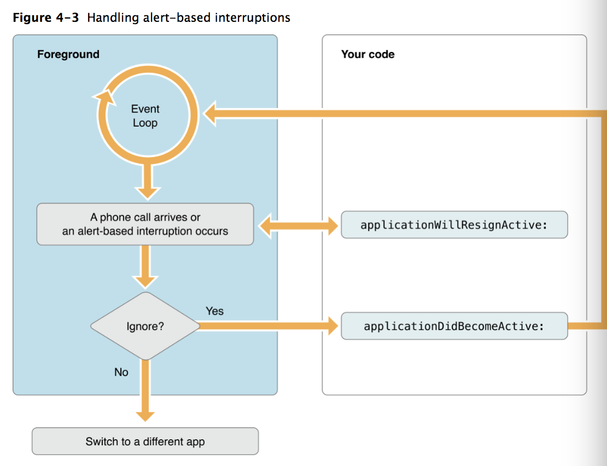

= App Programming for iOS

> 이 글은 https://developer.apple.com/library/content/documentation/iPhone/Conceptual/iPhoneOSProgrammingGuide/Introduction/Introduction.html[App Programming for iOS] 을 
개인 학습 및 핸드북으로 이용하려는 목적으로 번역하였기 때문에 잘못된 번역이나 의역이 포함되어 있습니다. 잘못된 부분은 메일로 보내주시면 감사하겠습니다 :)

=== 카테고리 소개
. Introduction
. Expected App Behaviors => 앱 구동 및 배포에 필요한 리소스, 개인정보 보호, 앱 현지화 가이드 라인에 대한 설명
. The App Life Cycle => 앱 기본 작동 구조 및 생명 주기에 대한 설명
. Backgorund Excution => Background 실행과 권한 요청, Background 이동할 때 지켜야 할 지침에 대한 설명
. Stragegies for Handling App Stage Transitions => 앱 실행 상태 변화에 따른 역할과 메서드 설명
. Strategies for Handling App Features => 여러 iOS 버전 대응하기, 앱 상태 보존, 복원하기
. Inter-App Communication => AirDrop 등 앱 간 통신 방법, 데이터 송/수신 방법에 대한 설명
. Performance Tips => 앱 성능 향상에 대한 설명

- - -

=== Introduce
* 앱 개발을 처음 시작하는 사람이 아닌 이미 앱을 개발하여 향상하려는 개발자를 위한 가이드

=== Expected App Behaviors
* XCode를 이용하여 제작된 프로젝트는 즉각 장비에서 실행되지만 App Store를 등록할 수 있는 것은 아님
* 모든 앱은 사용자에게 좋은 경험을 전달하기 위해 어느 정도 시스템 설정이 필요함
* 앱 초기 단계에서 고려해야 할 앱의 기본 형태 및 구동에 대해 알아볼 예정

==== Providing the Requred Resources
* 내가 만든 앱은 아래 리소스 및 파일들을 포함해야 함
** `Info.plist`
*** 정보 속성 목록 파일, 앱에 대한 메타 정보
*** `The Information Property List File` 내용 참고
** 앱 실행에 필요한 하드웨어 기능 및 필수 기능
*** `Declaring the Required Device Capabilities` 내용 참고
** 하나 이상 아이콘
*** 사용자 기기의 홈 화면에 아이콘이 보임
*** `App Icons` 내용 참고
** 하나 이상 런처 이미지
*** `App Launch (Default) Images` 내용 참고

===== The App Bundle
* iOS 앱을 만들면 XCode는 앱을 _Bundle_ 로 묶음
* _Bundle_ 은 앱과 관련된 리소스를 그룹화한 파일 시스템
* _Bundle_ 에 앱 실행 파일, 앱 아이콘, 이미지 파일 및 현지화(Localize)된 내용 등 리소스 파일이 포함되어 있음
* 아래 내용은 일반적인 iOS 앱 Bundle 내용을 보여줌
* `Bundle Programming Guide, Resource Programming Guide` 링크 참고

|===
| File | Example | 설명
| App Executable | My App | 컴파일된 코드가 있음. 앱 이름과 같은 실행파일이 있음 .app. 필수 파일
| The information property list file | info.plist | 앱에 대한 설정 파일이 있음. 앱과 상호작용하는 방법을 정함. 필수적임
| App Icons | Icon.png, Icon@2x.png, Icon-Small.png, Icon-Small@2x.png | 기기 홈 화면에 아이콘을 사용함. @2x이 파일명에 있으면 레티나 화면에 대응함. 앱 아이콘도 필수적임
| Launch Images | Default.png, Default-Portrait.png, Default-Landscape.png | 앱이 실행될 동안 배경에서 사용하는 파일임. 앱이 실행할 준비가 끝나면 이미지가 사라짐. 적어도 하나 이상 이미지가 필요함
| Storyboard files(or nib files) | MainBoard.storyboard | 스토리보드는 View, View Controller이 있음. 앱에서 스토리보드 파일 대신 Nib files을 사용할 수 있음. _NSMainNibFile_ 과 _UIMainStoryboardFile_ 는 스토리보드를 대체할 수 있음. 스토리보드를 사용해도 그만, 안 사용해도 그만이지만 사용하는 것을 추천함
| Ad hoc distribution icon | iTunesArtwork | 임시 배포할 경우 512x512 픽셀 단위로 앱 아이콘이 필요함. 아이콘 이름은 iTunesArtwork 이여야 하며 파일 이름 확장명을 포함하면 안 됨. 이 파일은 선택적임
| Settings bundle | Settings.bundle | 앱 설정을 커스텀하여 노출하고 싶다면 Settings.bundle이 필요함. `Preferences and Settings Programming Guide` 링크 참고
| Nonlocalized resource files | sun.png, mydata.plist | 지역화하지 않은 리소스는 앱에서 사용하는 이미지, 사운드 파일, 동영상 및 데이터 파일은 같은 항목에 포함됨. 이 파일들은 App Bundle 최상위에 있어야 함
| Subdirectories for localized resources | en.lproj, fr.lproj, es.lproj | 지역화된 리소스는 언어별 프로젝트 디렉토리에 위치해야 함. 이름은 ISO 639-1와 .lproj 접미사로 구성됨. 지역화된 버전을 제공하는 것 외에도 언어별 프로젝트 폴더와 같은 이름의 파일을 위치하여 앱 아이콘, 실행 이미지 및 설정 아이콘을 현지화할 수 있음
|===

===== The Information Property List File
* info.plist 파일은 앱 구성에 관한 중요한 정보가 포함되어 있으며 구조화된 파일
* App Store, iOS에서 앱의 기능을 확인하고 리소스를 찾는 데 사용함
* 모든 앱은 info.plist를 포함해야 함
* 기본으로 제공하는 필수 항목에 대한 기본값은 설정되어 있음. 그러나 기능을 위해 설정 추가나 변경을 할 수 있음 
* 가능하면 General, Capabilities 탭을 이용하여 앱의 구성 정보를 선택하는 것이 좋지만 특정한 환경 설정은 Info나 다른 탭에서 설정할 수 있음 
** Info 탭에서 하드웨어 사양을 설정할 수 있음
** Wi-Fi 연결, Custom URL 스키마, 사진 앨범 접근 등을 위해서 info.plist에 해당 사항에 맞는 키를 설정해줘야 함
** `Document-Based App Programming Guide for iOS, Using URL Schemes to Communicate with Apps.` 링크 참고
** info.plist의 다양한 키와 값에 관해서 확인하려면 `Information Property List Key Reference - Info.plist Keys and Values` 링크 참고

===== App Icons
** 모든 앱은 기기의 홈 화면과 앱 스토어에 보여줄 아이콘을 제공해야 함
** 앱 아이콘은 Image Assets에 포함됨
** 아이콘 디자인 가이드는 `HIG - iOS Design Themes` 링크 참고

===== App Launch (Default) Images
* 앱이 처음 시작할 때 잠깐 보여주는 이미지
* 앱 실행할 준비가 끝나면 런치 이미지가 사라짐
* 앱이 Foreground에서 Background로 들어갈 때 사용 중인 앱의 스냅샷이 생성되고 다시 Foreground로 다시 돌아올 때 런치 이미지가 아닌 스냅샷을 활용함
* 오랫동안 앱을 실행하지 않으면 스냅샷을 삭제하고 기존 런치 이미지를 활용함
* 런치 이미지 가이드는 `HIG - iOS Design Themes` 링크 참고

==== Supporting User Privacy
* 사용자 개인 정보 보호는 매우 중요함. 대부분 iOS 장비는 개인 정보를 포함하고 있음
* 개인 정보를 사용하기 위해 각 나라의 해당 법률에 준수하고 사용자 동의를 얻은 후 접근해야 함
* 데이터에 대한 접근 요청해야 함. 앱의 info.plist 파일에 접근하려고 하는 데이터나 리소스가 필요한 이유를 제공해야 함
* 사용자 필요에 따라 접근 권한을 비활성화할 수 있는 설정도 제공해야 함
* 접근 요청이 필요한 항목은 여러 유형이 있음
** 블루투스, 캘린더, 카메라, 접근, 건강 정보, 홈킷, 위치, 모션, 음악 및 동영상 라이브러리, 사진, Siri , 음성, TV 등
* 자료를 수집하여 저장할 때 로컬이면 암호화된 형식으로 저장해야 함. 네트워크를 통해 데이터를 보낼 때 App Transport Security를 사용함
** `Strategies for Implementing Specific App Features - Protecting Data Using On-Disk Encryption 내용이나 NSAppTransportSecurity 링크 참고`
* 앱에서 _ASIdentifierManager_ 사용하는 경우 `advertisingTrackingEnabled 프로퍼티` 의 값을 준수해야 함
** NO => 제한된 광고 목적에만 사용해야 함 
* 장치 식별자를 사용하면 안 됨. iOS 5.0 이상부터 사용할 수 없으며 해당 식별자를 사용하는 새로운 앱이나 업데이트를 허용하지 않음
** `UIDevice의 identifierForVendor 프로퍼티나 ASIdentifierManager의 advertisingIdentifier 프로퍼티`
* _앱에서 보호된 항목에 접근하려면 시스템에서 사용자에게 접근 권한을 요청하는 Alert를 표시함. iOS 10부터 info.plist에 각각 개인 정보를 활용하려는 목적 문구를 보여주며 접근 권한 요청 Alert에 보이도록 해야함_

==== Internationalizing Your App
* iOS 앱은 여러 나라에 배포할 수 있기 때문에 앱 내용을 지역화하면 많은 사용자에게 다가갈 수 있음
* 내용을 현지화 하는 과정은 간단함
** 모든 사용자가 지향하는 내용을 현지화할 수 있는 리소스 파일로 분리하고 해당 내용을 저장할 수 있는 언어별 프로젝트(.lproj) 폴더를 제공함
** Locale 별로 작업할 때 날짜 및 숫자 형식 등을 사용하는 것을 의미함
** 현지화할 수 있는 리소스 유형
*** 스토리보드 또는 Nib file
*** .strings 확장명으로 끝나는 파일. 문자열 파일
*** 이미지 파일 => 저작권, 문화권에 관한 확인이 필요함
*** 비디오 및 오디오 파일 => 언어, 문화별 내용이 포함되어 있지 않다면 멀티미디어 파일은 지역화하지 않음

=== The App Life Cycle
* 앱은 개발자가 작성한 코드와 시스템 프레임워크 간의 정교한 상호작용임
* 시스템 프레임워크는 모든 앱의 실행에 필요한 기본적인 인프라를 제공함. 개발자는 앱에 어울리는 모양과 느낌을 코드로 구현함
* 상호작용을 효과적으로 하기 위해서 iOS 인프라 구조와 어떻게 돌아가는지 이해가 필요함
* iOS 프레임워크는 `Model-View-Controller, Deletgate 패턴` 과 같은 것에 구현하는데 의존함. 이러한 디자인 패턴을 이해하는 것도 중요함

==== The Main Function
* 모든 C 기반의 프로그램과 같이 iOS 진입점도 main 함수. 다만, 차이점은 iOS 앱은 main 함수를 직접 작성하지 않는다는 것
* 대신 XCode가 대신 만들며 XCode가 제공한 main 함수는 절대 변경하면 안됨
* main 함수의 유일한 역할은 UIKit 프레임워크에 제어권을 넘김
* _UIApplicationMain_ 함수는 앱의 핵심 객체를 만들고 스토리보드 파일로부터 UI를 로드하고 초기 설정을 위한 코드를 호출하고 앱의 실행 루프를 동작함
* 개발자는 스토리보드 파일들과 초기화 코드를 제공하면 됨

==== The Structure of an App
* 앱을 시작하는 동안 _UIApplicationMain_ 함수는 여러 핵심 객체를 설정하고 앱 실행을 준비함
* _UIApplication_ 객체는 모든 iOS 앱의 핵심. 시스템과 앱의 객체들 사이의 상호 작용을 원할하게 함
* 아래 이미지를 통해 알아야 할 점은 iOS 앱은 *View-Model-Controller* 아키텍처를 사용한다는 것
* MVC 패턴은 앱의 데이터와 비즈니스 로직을 시각적인 표현으로부터 분리함
* MVC 패턴은 화면 크기가 다른 여러 장치에서 실행할 수 있는 앱을 만들 수 있도록 중요한 역할을 함

===== The role of objects in an iOS app
* `UIApplication` 객체
** _UIApplication_ 객체는 이벤트 루프와 상위 수준의 앱 동작을 관리함
** 앱 전환과 특별한 이벤트(수신 알림 등)의 담당 Delegate에게 알려줌 
** 서브 클래스없이 _UIApplication_ 객체를 그대로 사용해야 함
* `App delegate` 객체
** _UIApplication_ 과 함께 동작하여 앱의 초기화, 상태 전환과 많은 앱 이벤트를 처리함
** 모든 앱에서 존재할 수 있는 유일한 객체이기 때문에 앱의 데이터 초기화할 때 많이 사용함
* `Documents and data model` 객체
** 앱의 내용을 저장하며 앱에만 적용됨
** `Document-Based Applications in iOS` 링크 참고
* `View Controller` 객체
** _View Controller_ 객체는 화면에서 앱 콘텐츠의 프레젠테이션을 관리함
** 단일 View와 View의 하위 View를 관리함
** _UIViewController_ 클래스는 모든 View Controller 객체의 기본 클래스임
** View 로딩, 프리젠테이션, 화면 회전에 대한 응답 그리고 몇 가지 시스템 표준 동작을 기본으로 제공함
** UIKit과 다른 프레임워크는 Picker, Tab Bar, Navigation 인터페이스를 구현할 수 있도록 추가적으로 View Controller 클래스들을 정의함
** `View, View Controller(The Role of View Controllers를 번역함)` 링크 참고 
* `UIWindow` 객체
** _UIWindow_ 객체는 화면에서 하나 이상 View의 프리젠테이션 표현을 조정함 
** 대부분 앱은 콘텐츠를 제공하는 Window는 하나지만 다른 앱에서 Window가 여러 개 일 수 있음
** 앱 콘텐츠를 변경하려면 Window에 대응하여 보여지는 View를 View Controller 사용해서 바꿔야 함
** View를 소유하는 것 외에도 Window는 _UIApplication_ 객체와 함께 동작하여 View와 View Controllr까지 이벤트를 전달함
* `View 객체(UIView)와 Control 객체(UIControl), Layer 객체`
** _View와 Control은 앱 콘텐츠의 시각적인 표현을 제공함_
** _View_ 는 지정된 영역에 내용을 그리고 그 영역 내의 이벤트에 응답하는 객체
** _Control_ 은 Button, Textfield, Toggle Switch 같은 View의 특수한 유형
** UIKit 프레임워크는 다양한 유형의 콘텐츠를 보여주기 위해 표준 View를 제공함
** _UIView 의 서브클래스_ 를 통해 Custom View도 정의할 수 있음

==== The Main Run Loop
* 앱의 _Main Run Loop_ 는 모든 사용자 관련 이벤트를 처리함
* UIApplication 객체를 실행할 때 Main Run Loop를 설정함
* 이를 사용해 이벤트 처리하고 UI를 업데이트함
* Main Run Loop는 앱의 Main Thread에서 실행되고 _사용자 이벤트가 입력되면 차례대로 처리함_

* iOS에서 다양한 이벤트를 제공함
* 대부분 이벤트는 앱의 Main Run Loop를 통해 전달되지만, 일부 이벤트는 그렇지 않음
* 일부 이벤트는 _Delegate_ 객체를 통해 보내거나 개발자가 제공한 Block을 통해 전달됨
* 터치, 원격 제어, 모션, 가속도계 및 자이로 스코프 이벤트 등이 있음. `Event Handling Guide for UIKit Apps` 링크 참고

|===
| Event Type | Delivered To.. | 설명
| Touch | 이벤트를 발생한 View 객체 | View는 Responder 객체. View에 의해 처리되지 않은 모든 Touch 이벤트를 처리하기 위해 Responder Chain으로 전달됨
| Remote control, Shake motion events | First `Responder Object` | 원격 제어 이벤트는 미디어 재생을 제어하기 위한 것. 헤드폰 및 기타 악세사리에 의해 발생함
| Accelerometer, Magnetometer, Gyroscope | 사용자가 지정한 객체 | 가속도계, 자력계, 자이로 스코프 하드웨어는 사용자가 지정한 객체로 전달됨
| Location | 사용자가 지정한 객체 | Core Location Framework를 사용하여 위치 이벤트를 수신할 수 있도록 위치를 등록해야 함. `Location and Maps Programming Guide` 링크 참고
| Redraw | 업데이트가 필요한 View | Redraw 이벤트는 이벤트 객체를 포함하지 않지만, View를 그리기 위해 View 자체를 호출함. `Drawing and Printing Guide for iOS` 링크 참고
|===

* 터치, 원격 제어 같은 일부 이벤트는 _Reponder Object_ 에 의해 처리됨
* Responder Object 는 앱 어디에나 있음. _UIApplication_ 객체, View 객체, View Controller는 모두 Responder 객체
* 대부분 이벤트는 특정 Responder 객체를 대상이 되지만 처리되지 않은 일부 이벤트를 처리하기 위해 다른 Responder 객체(Responder Chain)에 의해 전달됨
** 예를 들어 View에서 처리되지 않은 이벤트를 Superview나 View Controller로 전달됨
* Control 객체(Button, Toggle Switch)에서 발생하는 터치 이벤트는 View에서 발생하는 터치 이벤트와 다르게 처리됨
* Control 과 상호작용 하는 방법이 제한적이므로 상호작용에 대한 Action 메세지를 다시 포장하여 적절한 Target 객체에 배달됨
* `Target-Action` 디자인 패턴은 앱에서 작성한 코드의 실행을 위해 Control를 쉽게 이용할 수 있게 해줌

==== Execution States for Apps
* 앱은 아래 상태 중 하나를 가짐
* iOS 시스템은 전체 시스템을 통해 일어나는 작업에 대한 응답으로 앱을 여러 가지 상태로 이동시킴
** 예를 들어 사용자가 홈 버튼을 누르거나 전화가 걸려 오거나 다른 여러 번 중단이 발생하면 현재 실행 중인 앱을 비활성으로 바꿈
* App 상태
** _Not running_ => 앱이 실행되지 않았거나 시스템에 의해 종료된 상태
** _Inactive_ => 앱이 Foreground에서 실행하지만, 사용자 이벤트를 받지 못하는 상태
** _Active_ => 앱이 Foreground에서 실행되고 사용자 이벤트를 받을 수 있는 상태
** _Background_ => 앱이 Background에서 실행되고 있는 상태. `Background Execution` 참고
** _Suspended_ => Background에 있는 앱이 더 실행하지 않고 정지한 상태

* 대부분 상태 전환은 App Delegate의 메서드를 호출함. 상태 변화에 대해 대응할 수 있음
** `application:willFinishLaunchingWithOptions` => 앱에서 처음으로 코드를 실행함
** `applicationDidBecomeActive` => 앱이 Foreground로 전환되는 시점을 알려줌
** `applicationWillResignActive` => 앱이 Foreground 상태에서 Inactive 되는 시점
** `applicationDidEnterBackground` => 앱이 Background에서 실행되고 있으며 언제든지 정지될 수 있음을 알림
** `applicationWillEnterForeground` => 앱이 Background에서 Foreground로 진입하고 있지만, 아직 Active 상태는 아님
** `applicationWillTerminate` => 앱이 종료되고 있음을 알리는 메소드. 하지만 앱이 시스템에 의해 정지되었을 때 호출되지 않음

==== App Termination
* 앱은 언제든지 종료될 수 있어야 함. 종료되기 전 사용자 정보를 저장하거나 특별한 기능을 수행하기 위해 기다리지 않음
* 시스템에 의한 앱 종료는 앱 수명 주기에서 정상적인 부분이며 시스템이 사용하지 않은 메모리를 회수하여 다른 앱을 실행할 수 있는 공간을 확보하기 위해 종료함
* 그러나 오작동하거나 앱이 응답하지 않은 경우에도 앱이 종료될 수 있음. 중지된 앱은 종료될 때까지 알림을 받지 않음. 시스템은 종료하고 해당 메모리를 회수함
* 앱이 현재 Background에서 실행 중이며 일시 중지되지 않고 종료 전이라면 _AppDelegate의 applicationWillTerminate_ 호출함

==== Threads and Concurrency
* 시스템은 기본적으로 앱의 Main Thread를 생헝성함. 필요에 따라 추가 Thread를 생성하여 다른 작업을 수행할 수 있음
* iOS 앱은 개발자가 직접 Thread를 만들고 관리하는 대신 `Grand Central Dispatch(GCD), Operation Objects, Asynchronous Programming` 을 사용하는 것을 권장함
* GCD를 이용하면 수행하고 싶은 작업과 작업 순서를 정할 수 있음. 그러나 시스템이 사용 가능한 CPU에서 해당 작업을 가장 효과적으로 수행할 수 방법을 결정하는 게 좋음. 시스템이 Thread를 관리하면 개발자가 작성해야 할 코드가 단순해지고 정확성을 높일 수 있으며 전반적인 성능이 향상됨
* Thread와 동시성을 생각할 때 다음을 고려해야 함
** View, Core Animation, UIKit과 관련된 클래스들은 Main Thread에서 실행되어야 함. 하지만 이것에도 예외가 있음. Image 조작은 Background Thread에서 발생할 수 있음
** 오래 걸리는 작업은 Background Thread에서 수행해야 함. 네트워크 접근, 파일 접근, 대용량 데이터를 처리할 때 GCD를 이용하여 비동기로 수행해야 함
** Main Thread에서 사용자 인터페이스 설정과 관련한 작업만 해야 함. 이외에 작업은 비동기적으로 실행해야 하며 처리가 완료되는 즉시 사용자에게 보여줘야 함

=== Background Execution
* 사용자가 앱을 사용하지 않으면 시스템은 앱을 Background 상태로 전환함
* 일반적으로 Background 상태는 Suspend(정지) 상태로 이어짐
* 앱을 정지시키는 일은 배터리 수명을 향상하는 일이며 다른 앱이 Foreground에서 실행될 수 있는 리소스를 제공함
* 하지만 모든 앱이 Backgorund에서 정지하는 것은 아님
** 예를 들어 하이킹 앱은 시간 경과에 따라 Background에서도 사용자 위치를 추적해야 하며 오디오 앱은 잠금화면에서 음악을 계속 재생할 수 있어야 함. 그리고 Background에서 콘텐츠를 내려받을 때도 있음
* Background에서 앱을 실행하는 것이 필요하다고 생각이 들면 iOS는 배터리를 많이 사용하지 않고 효율적으로 수행할 수 있도록 다음과 같은 기술을 제공하며 크게 3가지로 나눌 수 있음
** Foreground에서 짧은 시간의 작업을 하는 앱은 Background로 전환할 때 해당 작업의 완료할 시간을 요청할 수 있음
** Foreground에서 다운로드를 시작하는 앱은 다운로드 관리를 시스템에서 전달할 수 있으므로 다운로드 하는 동안 앱이 중지되거나 종료될 수 있음
** 특정 유형의 작업을 지원하기 위해 Background에서 실행하는 앱은 하나 이상 Background 실행 모드에 대한 지원을 선언할 수 있음
* 사용자가 다른 앱을 실행하였거나 사용자가 기기를 잠그고 바로 사용하지 않는 경우 앱이 의미 있는 작업을 하지 않는다는 신호
* Background에서 계속 앱을 실행하면 배터리가 소모되고 완전히 종료될 수 있기 때문에 가능하면 Background 작업은 피해야 함

==== Executing Finite-Length Tasks
* Background로 이동한 앱이 작업을 완료하기 위해 약간의 시간이 필요하다면 _UIApplication의 beginBackgroundTaskWithName:expirationHandler:, beginBackgroundTaskWithExpirationHandler:_ 메서드를 호출하여 작업을 완료할 수 있을 때까지 시간을 요청할 수 있음
* 이 메서드 중 하나를 호출하면 일시적으로 앱의 일시 중지가 지연되어 작업을 완료할 수 있음
* 작업이 끝나면 _endBackgroundTask_ 메서드를 호출하여 작업이 끝난 것을 시스템에 알림
** _beginBackgroundTaskWithName:expirationHandler: 또는 beginBackgroundTaskWithExpirationHandler:_ 메서드를 호출할 때마다 유일한 토큰을 생성하고 해당 작업과 연관됨. 작업이 완료되면 해당 토큰과 함께 _endBackgroundTask_ 메서드를 호출하여 완료되었음을 시스템에 알림
* _UIApplication의 backgroundTimeRemaining_ 를 통해 작업의 남은 시간을 확인할 수 있음
* Expiration Handler를 사용하면 작업을 종료하기 전에 코드를 추가할 수 있지만, 코드를 실행하는데 너무 오래 걸리지 말아야 함

==== Downloading Content in the Background
* 파일 다운로드 할 때 _NSURLSession(URLSession)_ 객체를 이용해 다운로드 해야 앱이 중지되거나, 종료될 경우 시스템에서 다운로드 과정을 제어할 수 있음
* Background 다운로드 지원하는 객체를 만드는 과정은 아래와 같음
** _NSURLSessionConfiguration의 backgroundSessionConfigurationWithIdentifier:_ 메서드를 사용해 설정 객체를 만듬
** _sessionSendsLaunchEvents_ 프로퍼티 값을 YES로 설정
** Foreground 있을 때 앱이 전송을 시작하면 설정 객체의 임의 속성을 YES로 설정하는 것이 좋음
** 설정 객체의 속성값을 설정함
** _NSURLSession_ 객체를 만들기 위해 설정 객체를 사용함
* 앱이 실행 중이면 작업이 완료되었을 때 세션 객체는 일반적인 방식으로 delegate에게 알려줌
* 작업이 끝나지 않은 상태에서 시스템이 앱을 종료하면 시스템은 Background 작업을 계속 관리함
* 사용자가 강제로 앱을 종료하면 보류 중인 작업을 취소함

==== Implementing Long-Running Tasks
* 구현하기 위해 많은 시간이 필요한 경우, Backgorund에서 실행할 수 있는 권한을 요청해야 함
** Backgorund에서 음이 들리는 콘텐츠가 재생되는 앱. 예를 들어 음악 플레이어 앱
** Backgorund에서 오디오 콘텐츠를 녹음하는 앱
** 매시간 사용자 위치 정보를 알려주는 앱. Navigation 앱
** VoIP에서 음성을 지원하는 앱
** 주기적으로 새로운 내용을 내려받고 처리해야 하는 앱
** 외부 악세사리를 주기적으로 업데이트 받아야 하는 앱
* XCode에서 `Project Settings -> Capabilities tab -> Background Modes` 활성화함
* Info.plist에서 _UIBackgroundMode_ 키가 추가됨

|===
| XCode Background Mode | UIBackgroundModes Value 
| Audio and AirPlay | audio
| Location updates | location
| Voice over IP | voip
| Newsstand downloads | newsstand-content
| External accessory communication | external-accessory
| Uses Bluetooth LE accessories | bluetooth-central
| Acts as a Bluetooth LE accessory | bluetooth-peripheral
| Background fetch | fetch
| Remote notifications | remote-notification
|===

* 구현하는 방법은 `[Background Execution] Tracking the User’s Location -> Communicating with a Bluetooth Accessory` 본문 내용 참고

==== Getting the User’s Attention While in the Background
* 앱이 Background에 있거나 실행 중이지 않을 때 앱이 관심을 끄는 방법 중 _Notification_ 하나
** 로컬 알림 사운드
** 배지
** 알림 기능
* 위 3가지 기능을 조합하여 사용자에게 알릴 수 있으며 사용자가 Foreground로 앱을 되돌려 놓을지 결정해야 함
* Foreground에서 이미 앱이 실행 중이라면 로컬 알림은 사용자에게 전달되지 않음
* Notification 구현하는 방법
** 로컬 알림을 예약하려면 _UILocalNotification_ 클래스 인스턴스를 만들고 알림 매개변수를 구현함
** _UIApplication_ 클래스의 메서드를 이용해 일정을 예약할 수 있음
** 로컬 알림 객체는 알림 유형(사운드, 경고, 배지) 또는 알림 시간에 대한 정보가 들어있음
** _UIApplication_ 클래스의 메서드는 바로 전달하거나 예약된 시간에 알림 기능을 제공함
** App Delegate의 `application:didReceiveLocalNotification:` 메서드로 호출할 수 있음
** 로컬 알림으로 지원할 수 있는 사운드 파일 유형은 _PCM, MA4, μ-Law, or a-Law_ 이며 기본 경고 소리는 _UILocalNotificationDefaultSoundName_ 클래스를 이용할 수 있음
** _UIApplication_ 클래스의 메서드를 통해 알림 목록을 가져오거나 예약된 알림 일정을 취소할 수 있음
* `Local and Remote Notification Programming Guide` 링크 참고

==== Understanding When Your App Gets Launched into the Background
* Backgorund에서 실행을 지원하는 앱은 시스템이 이벤트 처리를 위해 재실행시킬 수 있음
* 사용자가 앱을 강제종료시킨 것 이외에 앱이 종료되었을 때 시스템은 아래 목록 중 이벤트가 발생한다면 재실행시킬 수 있음
** 위치 앱
*** 시스템이 기준에 충족하는 위치 업데이트를 받음
*** 장치가 등록된 영역에 들어갔거나 나감
** 오디오 앱
*** 일부 데이터를 처리함
*** 음악을 재생하거나 마이크를 사용하는 앱
** 블루투스 앱
*** 앱에 연결된 주변 기기에서 데이터를 수신함
*** 앱이 중앙에서 명령을 받음
** Backgorund에서 다운로드하는 앱
*** 푸시 알림이 앱에 도착하고 값이 1로 가지고 있는 콘텐츠 키를 포함하고 있는 알림 Payload
*** 새로운 콘텐츠를 다운로드 하기 위해 
*** _NSURLSession(URLSession)_ 클래스를 사용하여 Backgorund에서 콘텐츠를 다운받는 앱일 때, 해당 세션 객체가 다운로드가 성공하거나 실패함
* 사용자가 강제 종료한 앱은 시스템이 재시작하지 않음. 그러나 한 가지 예외가 있음. iOS 8 이후, 위치 앱이 강제종료되었을 때 재실행함
* 기기에서 비밀번호로 보호되어 있다면 먼저 기기 잠금을 해제해야 Background 앱을 실행할 수 있음

==== Being a Responsible Background App
* Foreground 앱이 시스템 리소스, 하드웨어 사용과 관련해서 항상 Backgorund 앱보다 우선순위가 높음
* Backgorund에서 실행되는 앱은 이러한 차이에 준비하고 Background에서 작동할 때 행동을 맞춰야 함
* 앱이 Background에서 이동할 때 지켜야 할 몇 가지 지침이 준수해야 함
** 코드에서 OpenGL ES를 부르면 안 됨
*** Backgorund에서 실행하는 동안 _EAGLContext_ 객체를 만들거나 OpenGL ES 드로잉 명령어를 날리면 안됨
*** 앱이 바로 죽어버림. 그래서 앱이 Background로 이동하기 전에 위 내용을 처리해야 함
*** Background에서 OpenGL ES 다루는 방법은 `OpenGL ES Programming Guide > implementing a Multitasking-aware OpenGL ES Application` 링크 참고
** 앱이 정지되기 전까지 Bonjour 관련 서비스를 취소해야 함
*** 앱이 Backgorund 이동해 정지하기 전에 Bonjour에서 등록 취소하고 네트워크 서비스와 관련된 수신 대기 소켓을 닫아야 함
*** 정지된 앱은 Request에 응답할 수 없음
*** 만약 Bonjour 서비스를 직접 종료하지 않으면 서비스가 자동으로 종료됨
** 네트워크 기반 소켓의 연결 오류를 처리할 수 있는 준비해야 함
*** 시스템은 여러 가지 이유로 앱이 정지된 동안 소켓 연결을 끊을 수 있음
*** 신호 손실이나 네트워크 전환 오류 등 다른 네트워크 오류에 준비해야 예상치 못한 문제가 발생하지 않음
*** 앱을 다시 시작해 소켓을 사용한다면 연결만 다시 설정해주면 됨
** 앱이 Background 상태로 이동하기 전에 앱을 저장해야 함
*** 메모리가 부족할 때 정지한 앱을 먼저 제거함
*** 정지된 앱의 메모리가 해제되기 전에 앱에서 알림이 제공되지 않기 때문에 iOS 6 이상부터 상태보존 메커니즘을 활용해 앱의 인터페이스 상태를 디스크에 저장해야 함
*** `Preserving Your App’s Visual Appearance Across Launches` 참고
** Background 이동할 때 불필요한 Strong 참조는 없애야 함
*** 앱에서 객체(특히 이미지)의 In-memory 캐시를 많이 유지하는 경우, Backgorund로 이동할 때 해당 캐시에 대한 Strong 참조는 제거해야 함
*** `Reduce Your Memory Footprint` 참고
** 정지되기 전에 공유 시스템 자원 사용을 중지해야 함
*** 주소록이나 캘린더 같은 공유 시스템 리소스와 상호 작용하는 앱은 정지되기 전에 해당 리소스 사용을 중지해야 함
*** Foreground 앱에 리소스 사용에 우선순위가 있음
*** 앱이 정지된 동안 리소스를 사용하는 것이 발견되면 그 앱을 종료시킴
** Window와 View 업데이트하면 안 됨
*** 앱이 Background에 있을 경우 View 표시가 되지 않기 때문에 업데이트하는 것을 피해야 함
*** 그러나 앱의 스냅 샷을 만들기 전 Window 내용을 업데이트 해야 하는 경우는 Backgorund에서 업데이트가 필요함
** 외부 악세사리에 대한 연결 알림 및 연결 해제 알림에 응답해야 함
*** 외부 악세사리와 통신하는 앱은 앱이 Backgorund로 이동할 때 시스템에서 자동으로 연결 해제 알림을 보냄
*** 앱은 이 알림에 대해 등록해야 하며 현재 악세사리 세션을 종료하는 데 사용해야 함
*** 앱이 Foreground로 다시 이동하면 연결 알림이 전달되어 앱을 다시 연결할 수 있음
*** `External Accessory Programming Topics` 링크 참고
** Background로 이동할 때 활성화된 경고 창을 정리해야 함
*** 앱이 Backgorund로 전환할 때 시스템이 자동으로 _UIActionSheet 또는 UIAlertView_ 를 닫지 않기 때문에 Backgorund 이동 전에 적절한 처리가 필요함
** Backgorund로 이동하기 전에 View에 민감한 정보를 제거해야 함
*** 앱이 Backgorund로 이동할 때 시스템은 앱 Main Window의 스냅 샷으로 찍은 다음, 다시 Foreground로 옮겨질 때 Main Window에 표시함
*** _applicationDidEnterBackground:_ 메서드가 돌아오기 전에 비밀번호나 다른 민감한 개인정보를 숨겨야 함
** Backgorund에 있는 동안 최소한 작업을 수행해야 함
*** Background에게 처리할 수 있는 시간이 많지 않음. 만약 Backgorund 처리로 시간을 많이 쓴다면 시스템이 종료하거나 조절함
* 메모리가 부족하여 앱을 종료할 때, 종료하기 전에 App Delegate는 _applicationWillTerminate:_ 메서드를 호출하여 최종 작업을 완료함

==== Opting Out of Background Execution 
* Backgorund에서 앱이 실행되는 것이 원하지 않다면 `Info.plist > UIApplicationExitsOnSuspend 키, 값을 YES` 로 설정하면 됨
* 앱의 옵션을 해제하면 Not-running, Inactive, Actvie 상태로 순환하거나 Backgorund나 정지된 상태로 들어가지 않음
* 사용자가 앱을 종료하기 위해 홈 버튼을 누를 때, _App Delegate의 applicationWillTerminate:_ 메서드는 앱이 종료되기 전에 5초간 정리하고 난 뒤 Not-running 상태가 됨
* Backgorund 실행하는 옵션을 해제하는 것은 권장하지 않지만 특정 상황에서 기본 옵션이 될 수 있음
** 코딩을 통해 앱의 복잡성이 커지는 경우 앱을 종료하는 것이 더 나은 방법일 수 있음
** 또한 앱이 메모리를 많이 사용하고 쉽게 해제할 수 없을 때 시스템이 앱을 종료하여 다른 앱 실행을 위해 메모리를 확보할 수 있음

=== Strategies for Handling App State Transitions
* 앱의 런타임 상태에 따라 시스템은 다른 기대치를 가지고 있음. 상태가 바뀌면 시스템은 앱의 App Delegate에게 알림
* `UIApplicationDelegate 프로토콜` 은 상태 전이 메서드를 통해 상태 변화를 감지하고 적절히 대응할 수 있음
** 예를 들어 Foreground에서 Backgorund로 이동할 때 저장하지 않은 데이터를 저장하고 진행중인 작업을 중지 할 수 있음
* 상태 전환에 대한 코드 구현 방법과 팁, 가이드 라인을 제공함

==== What to Do at Launch Time
* 앱이 시작되면(Foreground나 Background) App Delegate의 _application:willFinishLaunchingWithOptions나 application:didFinishLaunchingWithOptions:_ 메서드를 사용하여 다음과 같은 내용을 할 수 있음
** 앱의 런치 옵션을 확인하고 시작한 이유를 확인하고 적절하게 대응해야 함
** 앱의 중요한 데이터 구조를 초기화해야 함
** 앱으로 보여줄 Window, View를 준비해야 함
*** OpenGL ES를 사용하는 앱은 드로잉 환경을 준비하기 위해 위 메서드 사용하면 안 됨. 대신 _applicationDidBecomeActive:_ 메서드를 이용해 OpenGL ES 드로잉 호출을 지연해야 함
*** _application:willFinishLaunchingWithOptions:_ 의하여 앱의 Window 보여줘야 함. UIKit은 _application:didFinishLaunchingWithOptions_ 메서드가 반환될 때까지 Window 표시되는 것을 지연함
* 런칭 때, 시스템은 자동으로 Main 스토리보드와 초기 View Controller를 로드함. 상태 복원(State Restoration)을 지원하는 앱이면 _application:willFinishLaunchingWithOptions 및 application:didFinishLaunchingWithOptions_ 메서드 사이에서 인터페이스의 이전 상태를 복원함
** _application:willFinishLaunchingWithOptions_ => 앱 Window를 표시하고 상태 복원이 일어나는지에 대해 판단할 때 사용함
** _application:didFinishLaunchingWithOptions_ => 앱 UI를 최종적으로 만들 때 사용함
** 두 가지 메서드는 런치 타임에서 최대한 가벼워야 함
* 앱은 5초 이내에 실행하고 초기화하고 이벤트 처리하기 원함. 시간 내에 완료하지 못하면 시스템은 응답없음으로 여기고 앱을 종료시킴
* 네트워크 접근과 같이 앱의 시작 속도를 늦추는 작업은 Secondary Thread에서 수행하도록 조정해야 함

===== The Launch Cycle
* 앱이 시작되면 Not-running에서 Backgorund나 Active 상태로 이동하고 일시적이지만 Inactive 상태로 전이함
* 앱이 시작할 때, 시스템은 Main Thread를 생성하고 앱이 main 함수를 호출함
* 기본 main 함수는 XCode 프로젝트와 UIKit 프레임워크를 제어함. UIKit 프레임워크는 앱을 초기화하고 실행 준비함
* 아래 이미지는 App Delegate의 메서드를 포함하고 Foreground로 시작할 때 발생하는 이벤트 순서를 보여줌

* Background에서 앱이 시작할 때(특정 유형의 Background 이벤트를 처리하기 위해) 두 번째 이미지처럼 약간 달라짐
* 큰 차이점은 앱이 Active 상태 대신 이벤트를 처리하기 위해 Background 상태로 들어가고 그 이후 정지될 수 있음
* Background로 실행하면 UI 파일은 로드하지만 화면에 표시하지 않음

* Foreground나 Backgorund로 시작되는 여부는 _UIApplication의 applicationState_ 프로퍼티로 확인함
** Foreground에서 시작하면 이 프로퍼티가 _UIApplicationStateInactive의 값_ 을 가지고 있음
** Backgorund에서 시작하면 이 프로퍼티가 _ UIApplicationStateBackground의 값_ 을 가지고 있음
* URL 요청하는 처리로 앱으로 시작할 때 위 이미지와 시작 순서도가 다름. URL 요청처리는 `Handling URL Requests` 참고

===== Launching in Landscape Mode
* UI를 가로 방향만 사용하는 앱은 시스템이 해당 방향으로 실행하도록 명시적으로 설정해야 함
* 일반적으로 앱은 세로 방향으로 실행하며 필요한 경우에 기기 방향에 맞게 UI를 회전함
* 세로, 가로 방향을 모두 지원하는 앱은 항상 세로 방향의 View를 구성한 다음 View Controller가 회전에 대한 처리함
* 앱이 가로 방향의 View만 지원하는 경우 아래와 같은 작업을 수행하여 설정하면 됨
** Info.plist에서 `UIInterfaceOrientation 키를 추가하고 UIInterfaceOrientationLandscapeLeft나 UIInterfaceOrientationLandscapeLeft UIInterfaceOrientationLandscapeRight` 둘 중 하나를 설정함
** `Layout이나 Autosizing` 옵션이 설정되어 있는지 확인함
** _shouldAutorotateToInterfaceOrientation:_ 메서드가 YES로 반환하도록 오버라이드함. NO인 경우 세로모드 지원함
* *중요! 앱은 Window 내용을 다루기 위해서 View Controller를 사용해야 함*
* _applicationDidFinishLaunching:_ 메서드를 실행 초기에 _UIApplication의 setStatusBarOrientation:animated:_ 메서드를 호출하는 것과 같음

===== Installing App-Specific Data Files at First Launch
* 앱이 실행할 때 요구되는 데이터나 설정 값에 대한 설정을 위해 _First Launch Cycle_ 를 이용할 수 있음
* 특정 데이터 파일은 `Library/Application Support/<BundleID>/directory` 에 위치해야 함
* _<BundleID>_ 는 앱의 Bundle 식별자임. 이 디렉토리를 세분화하여 필요에 따라 데이터 파일을 구성할 수 있거나 앱의 iCloud 컨테이너 디렉토리 같은 디렉토리 파일을 만들 수 있음
* 앱의 Bundle에 수정해야 할 데이터 파일이 있는 경우 복사한 파일을 수정해야 함
* iOS 앱에서 코드로 서명되어 있기 때문에 앱 Bundle 외에서 수정하면 앱을 실행할 수 없음
* 앱 관련 데이터 파일에 대해서 `File System Programming Guide` 링크 참고

==== What to Do When Your App Is Interrupted Temporarily
* 시스템 알림이 전달되면 앱은 한때 제어권을 잃게 됨
* 앱은 Foreground에서 계속 실행하지만, 터치 이벤트를 받지 못함. 이러한 사항을 대비해 앱은 _applicationWillResignActive_ 메서드에서 아래와 같은 작업을 해야 함
** 상태와 연관된 정보와 데이터를 저장함
** 다른 주기적인 일과 타이머를 정지함
** 메타데이터 쿼리를 중지함
** 새로운 작업을 생성하면 안 됨
** 동영상 실행을 정지함(AirPlay는 예외)
** 앱이 게임일 때 중지 상태로 바뀜
** OpenGL ES 프레임 속도를 조절함
** Inactive 상태에서 네트워크 요청과 같은 시간에 민감한 작업은 계속 처리할 수 있음
* 앱이 Active 상태로 돌아오면 _applicationWillResignActive_ 메서드에서 했던 작업을 _applicationDidBecomeActive_ 메서드는 수행한 단계를 모두 취소해야 함
** 따라서 타이머를 시작하고 Dispatch Queue 다시 시작하고 OpenGL ES 프레임 속도를 다시 조절해야 함. 그러나 게임은 자동으로 시작하지 않음. 사용자가 다시 시작할 때까지 정지 상태를 유지해야 함
* 사용자가 Sleep/Wake 버튼을 누르면 _NSFileProtectionComplete_ 보호 옵션으로 설정된 파일을 가진 앱은 해당 파일의 참조를 모두 닫아야 함
* 암호로 구성된 장치인 경우, Sleep/Wake 버튼으로 화면으로 잠그고 시스템에서 보호하고 있던 파일은 암호 해독 키를 버림. 그래서 화면이 잠겨있는 동안 해당 파일로 접근하려고 하면 실패함
* 따라서 _applicationWillResignActive_ 메서드에서 해당 파일에 대한 참조를 모두 닫고 _applicationDidBecomeActive_ 메서드에서 새로운 참조를 열어야 함
* 배너 알림은 알림 기반의 중지처럼 Inactive 상태가 되지 않음. 그러나 배너는 앱 상단에 위치하며 이전처럼 앱은 터치 이벤트를 계속 받음
* 그러나 사용자가 배너를 내려놓을 경우 알림 기반의 중지처럼 앱이 Inactive 상태가 됨. 사용자가 알림 센터를 닫거나 다른 앱을 시작할 때까지 이 상태는 계속 유지함
* *중요! 사용자 데이터는 앱의 적절한 포인트에서 저장해야 함. 앱 상태 전환을 통해 객체가 저장하지 않은 변경 사항을 디스크에 강제로 저장할 수 있지만, 앱 상태 전환은 데이터를 저장하기 위해 기다리지 않음*

===== Responding to Temporary Interruptions
* 전화 통화가 걸려올 때처럼 알림 기반의 중지가 발생하면 앱은 한때 Inactive 상태로 전환되고 사용자에게 시스템은 진행 방법을 알 수 있음
* 사용자가 알림을 닫을 때까지 앱은 이 상태를 유지함
* 이 시점에서 앱은 Active 상태로 돌아가거나 Background 상태로 이동함
* 아래 이미지는 알림 기반의 중단 상황이 발생하면 이벤트 흐름을 보여줌

==== What to Do When Your App Enters the Foreground
* Foreground로 돌아올 때 Background 상태로 이동하면서 중지한 작업을 다시 시작할 수 있음
* _applicationWillEnterForeground:_ 메서드는 _applicationDidEnterBackground_ 메서드에서 수행한 작업을 원래 상태로 되돌려야 함
* _applicationDidBecomeActive_ 메서드는 앱 런칭때와 같은 작업의 수행을 계속해야 함
* _UIApplicationWillEnterForegroundNotification_ 알림은 앱이 Foreground로 다시 들어올 때 추적할 수 있음. 앱의 객체는 기본 알림 센터를 사용해 알림을 등록할 수 있음

image:./image/app-enter-foreground.png[]

===== Be Prepared to Process Queued Notifications
* 정지 상태의 앱은 Foreground나 Background로 돌아갈 때 Queue에 있는 알림을 처리할 준비가 되어있어야 함
* 정지된 앱은 코드를 실행하지 않기 때문에 앱의 모드나 상태에 영향을 주는 화면 변화, 시간 변경, 환경 설정 등과 같은 알림을 처리할 수 없음
* 이러한 변경 사항이 손실되지 않기 위해 시스템은 알림을 Queue에 쌓아두고 앱이 시작하는(= Backgorund나 Foreground에서) 즉시 앱에 전달됨. 앱이 시작할 때 알림으로 앱이 겹치지 않게 시스템은 앱을 중지한 후부터 실행하기 전까지 이벤트를 합치고 여러 알림을 하나의 알림으로 전달함
* 병합할 수 있고 앱에 전달되는 알림의 목록. 대부분 알림은 등록된 옵저버에게 직접 전달이 됨. 세로, 가로 모드 같은 화면 변경 사항과 같은 일부분은 시스템 프레임워크에 의해 차단되고 앱에 다른 방식으로 전달됨

|===
| Event | 알림
| 악세사리 연결 등록, 해제 | EAAccessoryDidConnectNotification, EAAccessoryDidDisconnectNotification
| 디바이스 화면 방향 변화 | UIDeviceOrientationDidChangeNotification. 이 알림은 View Controller에서 UI 방향을 자동으로 업데이트함
| 시간 변화 | UIApplicationSignificantTimeChangeNotification
| 배터리 잔량 변화 | UIDeviceBatteryLevelDidChangeNotification, UIDeviceBatteryStateDidChangeNotification
| 근접 상태 변화 | UIDeviceProximityStateDidChangeNotification
| 보호된 파일의 상태 변화 | UIApplicationProtectedDataWillBecomeUnavailable, UIApplicationProtectedDataDidBecomeAvailable
| 외부 화면 연결 여부 | UIScreenDidConnectNotification, UIScreenDidDisconnectNotification 
| 화면 스크린 모드 변화 | UIScreenModeDidChangeNotification
| 설정을 통해 앱의 변경 가능한 값의 변화 | NSUserDefaultsDidChangeNotification
| 현재 언어 및 Locale 설정 변화 | NSCurrentLocaleDidChangeNotification
| iCloud 계정상태 변화 | NSUbiquityIdentityDidChangeNotification
|=== 

* Queue에 있는 알림은 사용자 입력 값이나 터치 이벤트가 전달되기 전에 Main Run Loop로 전달됨
* Foreground로 돌아오는 앱은 마지막 업데이트 후, View 업데이트 알림을 받음
* Background에서 실행 중인 앱은 _setNeedsDisplay, setNeedsDisplayInRect_ 메서드를 통해 View 업데이트 요청할 수 있음. 그러나 View가 보이지 않기 때문에 시스템은 요청을 통합하고 Foreground로 돌아온 후의 View만 업데이트함

===== Handle iCloud Changes
* iCloud의 상태가 변경되면 시스템은 앱에 _NSUbiquityIdentityDidChangeNotification_ 알림을 전달함
* iCloud의 상태가 변경된다는 의미는 iCloud 계정에 로그인하거나 로그아웃하거나 문서나 데이터를 동기화를 활성화하거나 비활성화한다는 의미는
* 앱에서 iCloud에 파일 저장 여부를 묻는 메세지가 이미 있다면 iCloud 상태가 변경된다고 다시 메세지를 띄우면 안됨
* 관련 설정은 앱 환경 설정이나 시스템 설정에서 사용자가 설정할 수 있도록 해야 함

===== Handle Locale Changes
* 앱을 정지한 상태에서 사용자가 Locale을 변경한다면 _NSCurrentLocaleDidChangeNotification_ 알림을 이용해 앱이 Foreground로 돌아갈 때 날짜, 시간 등 모든 View를 강제로 업데이트할 수 있음
* Locale 관련 문제를 피할 수 있는 가장 좋은 방법은 View를 쉽게 업데이트할 수 있도록 코드를 작성하는 것
** NSLocale 객체를 검색할 때 _autoupdatingCurrentLocale_ 메서드를 사용하면 변경되는 Locale 객체를 반환하기 때문에 코드를 수정할 필요 없음. 그러나 Locale이 변경되면 현재 Locale과 관련된 콘텐츠, View는 새로 고쳐야 함
** 현재 Locale 정보가 변경할 때마다 캐시된 날짜와 숫자 포맷 객체를 만듦
* `Internationalization and Localization Guide` 링크 참고

===== Handle Changes to Your App’s Settings
* 앱에서 설정 앱에서 관리하는 옵션이 있는 경우 _NSUserDefaultsDidChangeNotification_ 알림을 준수해야 함
* 앱이 Suspend 하거나 Background 상태에서 설정을 수정할 수 있으므로 해당 알림을 사용하면 설정 변경에 대해 적절한 반응을 할 수 있음
* _NSUserDefaultsDidChangeNotification_ 알림을 받고 앱에서 관련 설정을 다시 로드해야 하는 경우 UI를 적절하게 재설정해야 함. 암호 또는 보안 관련 정보가 변경된 경우 이전에 보여주던 정보를 숨기고 사용자가 새 암호를 입력하도록 해야 함

==== What to Do When Your App Enters the Background
* Foreground에서 Background 실행으로 바뀔 때 App Delegate의 _applicationDidEnterBackground:_ 메서드를 사용하여 다음과 같은 작업을 수행할 수 있음
** 앱 스냅샷 준비
*** _applicationDidEnterBackground_ 메서드가 반환되면 시스템은 앱의 UI를 켑쳐하여 애니메이션 전환하기 위해 캡처한 이미지를 사용할 수 이씅ㅁ
*** View의 인터페이스에 중요한 정보가 있다면 _applicationDidEnterBackground_ 메서드가 반환하기 전에 해당 정보를 숨기거나 수정해야 함
*** `Prepare for the App Snapshot` 참고
** 앱의 상태와 관련된 정보 저장
*** Background 전환할 때 앱 상태에 대한 마지막 변경된 정보를 저장해야 함
** 메모리 확보함
*** 캐시된 데이터 중 사용하지 않은 데이터의 메모리는 해제하고 정리를 통해 메모리 사용량을 줄일 수 있음
*** 메모리 사용량이 많은 앱은 시스템에서 가장 먼저 종료되므로 이미지 리소스, 캐시된 데이터 등 사용하지 않는 객체는 해제함
*** `Reduce Your Memory Footprint` 참고
* _App Delegate의 applicationDidEnterBackground_ 메서드는 모든 작업을 5초 이내로 처리하고 메서드를 반환해야 함. 그렇지 않으면 앱이 종료되거나 메모리에서 제거됨
* 작업을 수행하는데 더 많은 시간이 필요한 경우 _beginBackorundTaskWithExpirationHandler_ 메서드를 호출하여 Secondary Thread에서 처리해야 함
* Background의 작업 시작 여부와 상관없이 _applicationDidEnterBackground_ 메서드는 5초 이내로 작업을 끝내야 함
* 시스템은 _applicationDidEnterBackground_ 메서드 호출외에도 _ UIApplicationDidEnterBackgroundNotification_ 알림을 보냄. 이 알림을 통해 다른 객체에게 정리 작업를 할당하는데 사용할 수 있음
* Background으로 이동할 때 할 수 있는 일의 목록에 대해서 `Being a Responsible Background App` 참고

===== The Background Transition Cycle
* Home 버튼을 누르거나 Sleep/Wake 버튼을 누르거나 시스템에서 다른 앱을 실행할 때 Foreground에 있는 앱은 Inactive 상태나 Background 상태로 전환함
* 이러한 전환을 통해 App Delegate의 _applicationWillResignActive: 와 applicationDidEnterBackground:_ 메서드를 호출함
* _applicationDidEnterBackground_ 메서드가 돌아온 후, 대부분 앱은 일시 중지 상태가 됨
* 음악 재생 같은 특정 Background 작업이나 시스템에서 실행 시간을 조금 더 요청하는 앱은 오래동안 실행될 수 있음

===== Prepare for the App Snapshot
* App Delegate의 _applicationDidEnterBackground:_ 메서드가 반환되고 잠시 후, 시스템은 앱의 Window 스냅 샷을 촬영함
* 앱이 Backgorund 작업을 위해 실행되면 시스템은 관련 변경 사항을 반영하기 위해 새로운 스냅 샷을 찍음
* 멀티 테스킹 UI에서 스냅샷 이미지를 이용해 앱 상태를 보여줌
* Background로 진입할 때 View의 변화가 생기면 _snapshotViewAfterScreenUpdates:_ 메서드를 호출해 변경 사항을 강제로 렌더링할 수 있음
* View에서 _setNeedsDisplay_ 메서드를 호출하면 다음 드로잉 주기 전에 스냅 샷을 호출하여 변경 사항에 대한 렌더링이 없기 때문에 비효율적임
* _snapshotViewAfterScreenUpdates:_ 메서드를 YES 값으로 호출하면 강제로 스냅 샷을 업데이트함

===== Reduce Your Memory Footprint
* 시스템은 최대한 많은 메모리를 유지하려고 하며 메모리가 부족한 경우 정지된 앱을 종료하여 메모리를 회수함. Background에서 많은 메모리를 소비하는 앱은 첫 번째로 해제함
* 결론적으로 더 이상 필요없는 객체에 대한 Strong 참조는 제거해야 함. Strong 참조를 제거하면 컴파일러가 해당 메모리를 다시 사용할 수 있도록 객체의 메모리를 즉시 회수함 
* 그러나 일부 객체는 캐시해서 성능을 향상시켜야 하는 경우도 있으므로 참조를 없애기 전까지 Backgorund 상태로 전환되는 것을 기다려야 함
* Strong 참조를 빨리 제거해야 하는 경우
** 이미지 객체(`UIImage Overview` 참고)
** 디스크에서 다시 로드할 수 있는 대용량 미디어나 데이터 파일
** 앱에 당장 필요하지 않으며 다시 쉽게 만들 수 있는 모든 객체

image:./image/app_bg_life_cycle.png[]

=== 참고
* https://developer.apple.com/library/content/documentation/iPhone/Conceptual/iPhoneOSProgrammingGuide/Introduction/Introduction.html[App Programming for iOS]
* https://developer.apple.com/library/content/referencelibrary/GettingStarted/DevelopiOSAppsSwift/index.html#//apple_ref/doc/uid/TP40015214[Start Developing iOS Apps (Swift)]
* https://developer.apple.com/documentation/#//apple_ref/doc/uid/TP40007898[Apple Developer Documentation]
* https://developer.apple.com/library/content/documentation/iPhone/Conceptual/iPhoneOSProgrammingGuide/ExpectedAppBehaviors/ExpectedAppBehaviors.html#//apple_ref/doc/uid/TP40007072-CH3-SW9[Bundle 설명]
* https://developer.apple.com/library/content/documentation/Cocoa/Conceptual/UserDefaults/Introduction/Introduction.html#//apple_ref/doc/uid/10000059i[Preferences and Settings Programming Guide]
* https://developer.apple.com/library/content/documentation/iPhone/Conceptual/iPhoneOSProgrammingGuide/ExpectedAppBehaviors/ExpectedAppBehaviors.html#//apple_ref/doc/uid/TP40007072-CH3-SW4[Nib file 설명]
* https://developer.apple.com/library/content/documentation/CoreFoundation/Conceptual/CFBundles/Introduction/Introduction.html#//apple_ref/doc/uid/10000123i[Bundle Programming Guide]
* https://developer.apple.com/library/content/documentation/Cocoa/Conceptual/LoadingResources/Introduction/Introduction.html#//apple_ref/doc/uid/10000051i[Resource Programming Guide]
* https://developer.apple.com/library/content/documentation/DataManagement/Conceptual/DocumentBasedAppPGiOS/Introduction/Introduction.html#//apple_ref/doc/uid/TP40011149[Document-Based Applications in iOS]
* https://developer.apple.com/library/content/documentation/General/Reference/InfoPlistKeyReference/Introduction/Introduction.html#//apple_ref/doc/uid/TP40009247[Information Property List Key Reference - Info.plist Keys and Values] 
* https://developer.apple.com/ios/human-interface-guidelines/overview/themes/[HIG - iOS Design Themes]
* https://developer.apple.com/library/content/documentation/General/Reference/InfoPlistKeyReference/Articles/CocoaKeys.html#//apple_ref/doc/uid/TP40009251-SW33[NSAppTransportSecurity]
* https://developer.apple.com/library/content/documentation/iPhone/Conceptual/iPhoneOSProgrammingGuide/TheAppLifeCycle/TheAppLifeCycle.html#//apple_ref/doc/uid/TP40007072-CH2-SW1[Model-View-Controller 설명]
* https://developer.apple.com/library/content/documentation/iPhone/Conceptual/iPhoneOSProgrammingGuide/TheAppLifeCycle/TheAppLifeCycle.html#//apple_ref/doc/uid/TP40007072-CH2-SW1[Storyboard 설명]
* https://developer.apple.com/documentation/uikit/uiapplication[UIApplication]
* https://developer.apple.com/library/content/documentation/iPhone/Conceptual/iPhoneOSProgrammingGuide/TheAppLifeCycle/TheAppLifeCycle.html#//apple_ref/doc/uid/TP40007072-CH2-SW1[App Delegate 설명]
* https://wiki.yuaming.com/ios/view-view-controller.html[View, View Controller]
* https://developer.apple.com/library/content/documentation/iPhone/Conceptual/iPhoneOSProgrammingGuide/TheAppLifeCycle/TheAppLifeCycle.html#//apple_ref/doc/uid/TP40007072-CH2-SW1[View Object 설명]
* https://developer.apple.com/library/content/documentation/iPhone/Conceptual/iPhoneOSProgrammingGuide/TheAppLifeCycle/TheAppLifeCycle.html#//apple_ref/doc/uid/TP40007072-CH2-SW1[Control Object 설명]
* https://developer.apple.com/documentation/uikit/#//apple_ref/doc/uid/TP40009541[Event Handling Guide for UIKit Apps]
* https://developer.apple.com/library/content/documentation/iPhone/Conceptual/iPhoneOSProgrammingGuide/TheAppLifeCycle/TheAppLifeCycle.html#//apple_ref/doc/uid/TP40007072-CH2-SW1[Responder Object 설명]
* https://developer.apple.com/library/content/documentation/UserExperience/Conceptual/LocationAwarenessPG/Introduction/Introduction.html#//apple_ref/doc/uid/TP40009497[Location and Maps Programming Guide]
* https://developer.apple.com/library/content/documentation/2DDrawing/Conceptual/DrawingPrintingiOS/Introduction/Introduction.html#//apple_ref/doc/uid/TP40010156[Drawing and Printing Guide for iOS]
* https://developer.apple.com/library/content/documentation/iPhone/Conceptual/iPhoneOSProgrammingGuide/TheAppLifeCycle/TheAppLifeCycle.html#//apple_ref/doc/uid/TP40007072-CH2-SW14[Target-Action 설명]
* https://developer.apple.com/library/content/documentation/NetworkingInternet/Conceptual/RemoteNotificationsPG/index.html#//apple_ref/doc/uid/TP40008194[Local and Remote Notification Programming Guide]
* https://developer.apple.com/library/content/documentation/3DDrawing/Conceptual/OpenGLES_ProgrammingGuide/ImplementingaMultitasking-awareOpenGLESApplication/ImplementingaMultitasking-awareOpenGLESApplication.html#//apple_ref/doc/uid/TP40008793-CH5[OpenGL ES Programming Guide > mplementing a Multitasking-aware OpenGL ES Application]
* https://developer.apple.com/library/content/featuredarticles/ExternalAccessoryPT/Introduction/Introduction.html#//apple_ref/doc/uid/TP40009502[External Accessory Programming Topics]
* https://developer.apple.com/library/content/documentation/FileManagement/Conceptual/FileSystemProgrammingGuide/Introduction/Introduction.html#//apple_ref/doc/uid/TP40010672[File System Programming Guide]
* https://developer.apple.com/library/content/documentation/MacOSX/Conceptual/BPInternational/Introduction/Introduction.html#//apple_ref/doc/uid/10000171i[Internationalization and Localization Guide]
* https://developer.apple.com/documentation/uikit/uiimage[UIImage Overview]