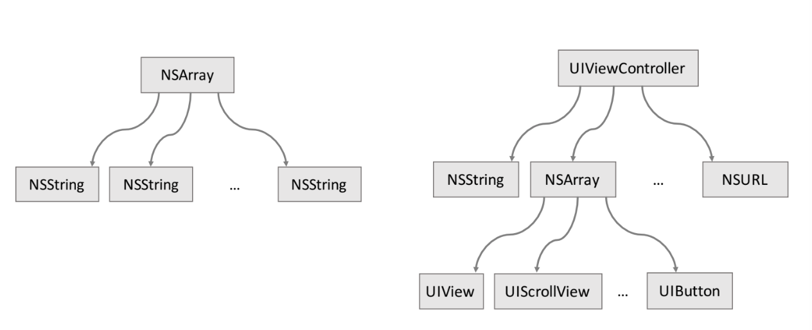
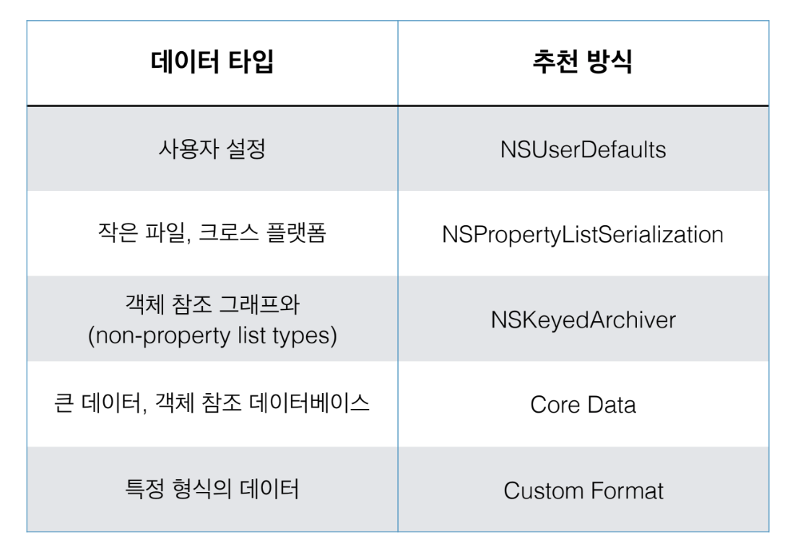

= 아카이빙과 직렬화

=== 아카이브

===== 정의
* 코코아 프레임워크에서 객체 그래프를 탐색해서 깊은 복사를 구현방법

===== 구현 방법
* Core Data 활용하는 방법
** `Core Data Programming Guide 링크 참고`
* NSCoding 프로토콜과 Keyed-Archive 클래스를 이용해 객체를 인코딩 하는 방법

===== 객체 직렬화와 아카이브 차이
* Serializations
** 아카이브처럼 객체 그래프를 따라 객체의 데이터 내용을 저장하는 방식은 같음
** 직렬화는 주로 문자열, 배열이나 사전 컬렉션에 담긴 계층 구조와 참조하는 객체 데이터만 직접 저장함
** 하나의 객체에서 다중 참조하고 있으면 참조마다 동일한 내용의 객체를 여러 개 저장함
** 다시 객체화할 때 가변 객체인지 불변 객체인지 판단해서 제대로 복원할 수 없음
* NSPropertyList Serializations
* `Property List Programming Guide 링크 참고`

=== NSCoding 프로토콜
* 객체 관계가 복잡하거나 일정 규모 이상으로 커지면 plist 방식이 부적합함
* plist 타입은 클래스 타입을 모두 지원하지 않으며 복원하였을 때 제대로 복원하지 못하는 문제가 발생하기 때문에
* NSCoding 프로토콜을 이용해야 함
* NSCoder => 인터페이스를 선언한 추상화한 클래스
* NSKeyedArchiver, NSKeyedUnarchiver => 실제 구현 클래스
** 객체 그래프 그대로 저장
** 상위, 하위 호환성 유지
** 인코딩, 디코딩 과정에서 대체 가능
** 객체가 Plist 지원하도록 강제할 필요 없음

===== 객체 그래프와 아카이브
* NSCoder가 정확하게 저장하고 복원하기 위해 Root Objects, Conditional Objects 두 가지 개념을 사용함
* Root Objects => 객체 그래프 시작점
* Conditional Objects => 객체 그래프에서 반드시 아카이브하지 않아도 되는 참조 객체. 소유권이 명확해서 다시 인코딩할 필요가 없는 객체

===== NSCoding

[source, swift]
----
struct Product {
    var title: String
    var price: Double
    var quantity: Int
}

class Product: NSObject, NSCoding {
    var title: String
    var price: Double
    var quantity: Int

    enum Key: String {
        case title = "title"
        case price = "price"
        case quantity = "quantity"
    }

    init(title: String, price: Double, quantity: Int) {
        self.title = title
        self.price = price
        self.quantity = quantity
    }

    func encode(with aCoder: NSCoder) {
        aCoder.encode(title, forKey: Key.title.rawValue)
        aCoder.encode(price, forKey: Key.price.rawValue)
        aCoder.encode(quantity, forKey: Key.quantity.rawValue)
    }
        
    convenience required init?(coder aDecoder: NSCoder) {
        let price = aDecoder.decodeDouble(forKey: Key.price.rawValue)
        let quantity = aDecoder.decodeInteger(forKey: Key.quantity.rawValue)
        guard let title = aDecoder.decodeObject(forKey: Key.title.rawValue) as? String else { return nil }
        self.init(title:title,price:price,quantity:quantity)
    }
}

func storeProducts() {
    let success = NSKeyedArchiver.archiveRootObject(products, toFile: productsFile.path)
    print(success ? "Successful save" : "Save Failed")
}

func retrieveProducts() -> [Product]? {
    return NSKeyedUnarchiver.unarchiveObject(withFile: productsFile.path) as? [Product]
}
----

===== Codable

[source, swift]
----
class Product: Codable {
    var title: String
    var price: Double
    var quantity: Int

    init(title: String, price: Double, quantity: Int) {
        self.title = title
        self.price = price
        self.quantity = quantity
    }
}

func storeProducts() {
    do {
        let data = try PropertyListEncoder().encode(products)
        let success = NSKeyedArchiver.archiveRootObject(data, toFile: productsFile.path)
        print(success ? "Successful save" : "Save Failed")
    } catch {
        print("Save Failed")
    }
}

func retrieveProducts() -> [Product]? {
    guard let data = NSKeyedUnarchiver.unarchiveObject(withFile: productsFile.path) as? Data else { return nil }

    do {
        let products = try PropertyListDecoder().decode([Product].self, from: data)
        return products
    } catch {
        print("Retrieve Failed")
        return nil
    }
}
----

=== Persistence 

=== 참고
* Cocoa Internals
* https://developer.apple.com/library/content/documentation/Cocoa/Conceptual/CoreData/index.html[Core Data Programming Guide]
* https://developer.apple.com/library/content/documentation/Cocoa/Conceptual/PropertyLists/Introduction/Introduction.html[Property List Programming Guide]
* https://craiggrummitt.com/2017/10/04/migrating-to-codable-from-nscoding/[Migrating to Codable from NSCoding]