= Auto Layout 기초

=== Overview

===== 기기별 화면 사이즈

image:./image/auto-layout-15.png[]

===== 화면 사이즈 변화
* iPhone 4에서 Retina Display로 인해 Point 단위, 스케일 사용
** `Pixel과 Point 차이 참고` 
* iPhone 5가 나오면서 파편화가 심해짐 
** `Auto Layout 도입` 
** 기존 Frame-based Layout에서 다른 View 관계를 이용하여 View의 위치와 크기를 자동하는 조정하는 Layout 시스템
* *기기별 해상도를 외울 필요 없음. Auto Layout 개념을 익혀서 View 구성하는 것이 중요함*

=== View 구성

===== Frame-based Layout
* 상위 View 좌표 시스템에서 특정 View 좌표를 나타냄. 개발자가 일일히 계산해야함
* 상위 View의 Frame 변화에 따라 하위 View의 Frame이 변경되는 시스템을 지정함 => `Auto Resizing Mask`

===== Auto Layout
* Frame-based Layout, Auto Resizing Mask가 필요함. Auto Layout으로 계산하지 못하는 View에서 필요함
* UI를 구성하는 View의 크기와 위치를 다른 요소 관계를 나타내는 `특별한 규칙을 통해(Constraints)` 자동으로 계산하고 배치하는 기술
* 개발자는 Constraints를 주고 View를 직접 계산하지 않음

===== Adaptive Layout
* Auto Layout
* Size Class
* Trait Collection
* Universal Storyboard

=== Auto Layout Interface Builder 

===== Prototyping Constraints
* 인터페이스 빌더를 통해 아무런 제약을 주지 않은 상태
* `What are prototyping constraints? 참고`

===== Interface Builder를 통해 제약 추가하기
* _Canvas Menu 이용하기_
* _Control + 드래그_ 
** 드래그 방향과 각도에 따라 추가할 수 있는 제약이 달라짐
** Document Outline에서도 사용할 수 있음
** View의 현재 프레임을 기준으로 제약이 추가됨

===== Canvas Menu
* _Update Frames_
** 디자인 프레임과 런타임 프레임과 다를 때 활성화 됨.
* _Embed In Stack_
** 새로운 StackView가 추가됨
** 균등하게 화면 분할할 때 사용함
* _Align_
** 정렬 관련 제약
* _Add New Constraints_
** 사이즈 관련 제약
* _Resolve Auto Layout Issues_

===== 제약 추가 원리
* 다른 View와 연관성이 없는 Width, Height, Aspect Ratio는 선택한 View에 제약이 추가됨
* 다른 View와 연관된 제약은 연관된 제약이 관련되어 있는 인접한 상위 View에 추가됨
* 예제
** A View 넓이 제약 추가하면 A View에 제약이 추가됨
** C, D View 사이에 Equal Width를 추가하면 두 개 View와 인전합 상위 View인 A에 제약이 추가됨
** D, E View 사이에 Equal Width를 추가하면 두 개 View와 인접한 상위 View인 Root View에 제약이 추가됨
* 제약 추가할 때 개요로 나타남. `제약 이름을 보고 종류를 파악하는 연습해보기:)`

image:./image/auto-layout-1.png[45%, 45%]
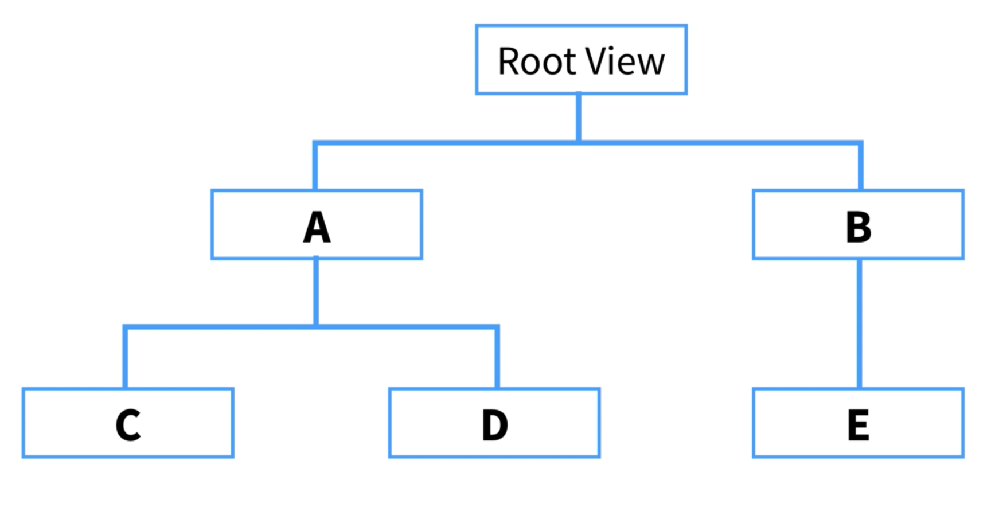

===== 제약 Identifier
* 디버깅 할 때 쉬움
* 유일한 값

===== 제약의 우선 순위 1000보다 작으면 ?
* 우선 순위가 1000은 필수 제약
* 우선 순위가 1000보다 작은 제약은 점선으로 표시되며 선택적 제약

===== 제약 결과를 미리보기 하는 방법
* XCode의 시뮬레이터를 통해 매번 확인하는 것이 힘듬
* _Command + Option + Enter_ 를 통해 보조 편집기를 열고 Auto Layout Preview를 확인할 수 있음

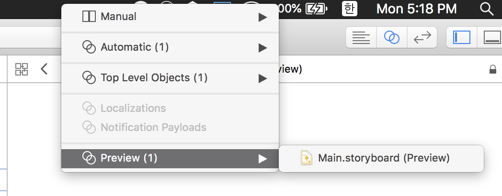
image:./image/auto-layout-3.png[45%, 45%]

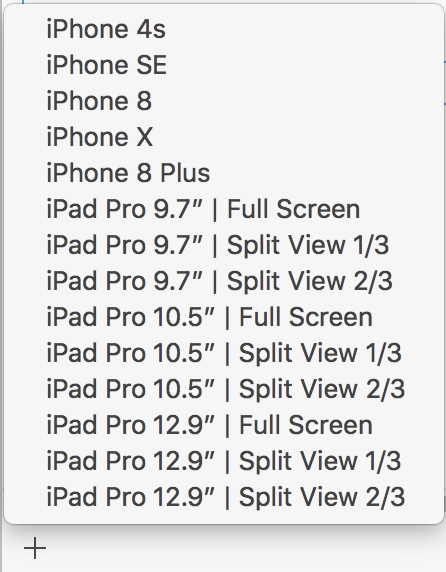

=== Constraints

===== Equation
* Button 제약 공식
** button.leading = 1.0 x view.leading + 76
** button.top = 1.0 x view.top + 72
* 제약 공식
** `item1.attr = multiplier * item2.attr + constant`
** 넓이나 높이를 지정할 때 item2.attr을 지정하지 않을 수도 있음
** leading, top, trailing, bottom, left, right
** leading => 글의 시작 시점. left, right를 많이 사용하지 않음

===== Leading, Top, Bottom, Trailing
* Canvas Menu에서 Add New Constraints로 제약을 설정할 때, 인접한 View로 설정되어 있음. 기준이 되는 View바꿀 수 있음
* Document Outline에서 Root View의 제약 개요를 통해 공식과 비교하여 파악하면 보다 빠르게 이해할 수 있음

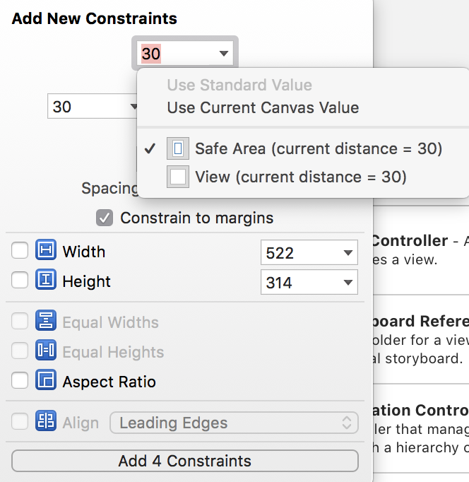
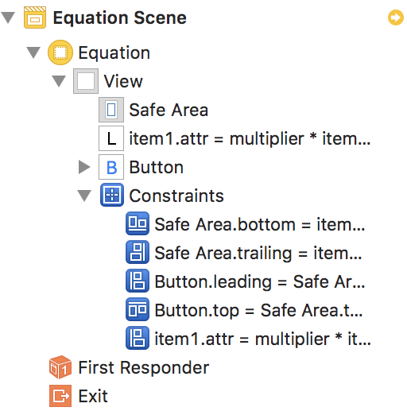

===== Width, Height
* _Control + 드래그_ 한 후, _Shift_ 버튼을 누르면 여러 개 제약을 추가할 수 있음

===== centerX, centerY
* 정렬 제약
* Label와 같은 요소는 내용으로 크기가 유추되기 때문에 너비, 높이 제약을 생략할 수 있음. 그렇지 않은 요소는 높이와 너비 제약을 추가해야 함
* centerX, centerY는 인접한 상위 View에 제약이 추가됨

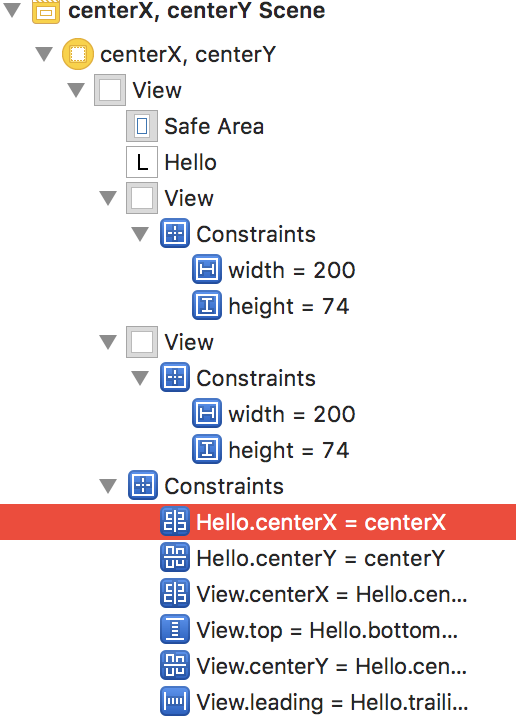

===== AspectRatio
* 기준이 되는 너비나 높이가 있어야 함

===== BaseLine
* Leading, Trailing, Top, Bottom은 Frame 기준으로 정렬이 됨
* BaseLine은 Label 내용을 기준으로 정렬이 됨
* 노락색 Indicator가 보인다면 Update Frames 메뉴를 선택함

===== Relation
* Equal 뿐만 아니라 Less Then Equal, More Then Equal로 추가할 수 있음

===== Multiplier
* 비율은 정수로 계산하는 것이 좋음

===== Constant
* 런타임에서 제약을 업데이트할 때 사용함
* 0이나 양수로 입력하는 것이 좋음
* Frame 속성을 통해 임시로 변경 가능하지만, 화면 회전 이벤트가 발생할 때 Auto Layout에서 설정한 제약이 적용됨

[source, swift]
----
@IBAction func updateFrame(_ sender: Any) {
    var frame = redView.frame
    frame.size.width = 100
    frame.size.height = 100
}
----

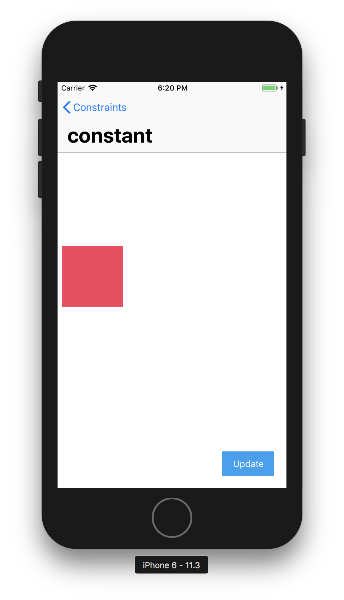
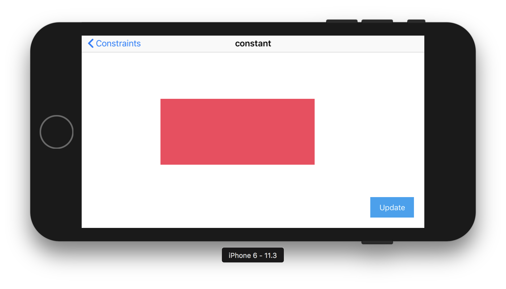

* 원하는 결과를 얻기 위해서 아래와 같이 수정이 필요함

[source, swift]
----
@IBOutlet weak var heightConstraint: NSLayoutConstraint!
@IBOutlet weak var widthConstraint: NSLayoutConstraint!

@IBAction func updateFrame(_ sender: Any) {
    widthConstraint.constant = 100
    heightConstraint.constant = 100
}
----

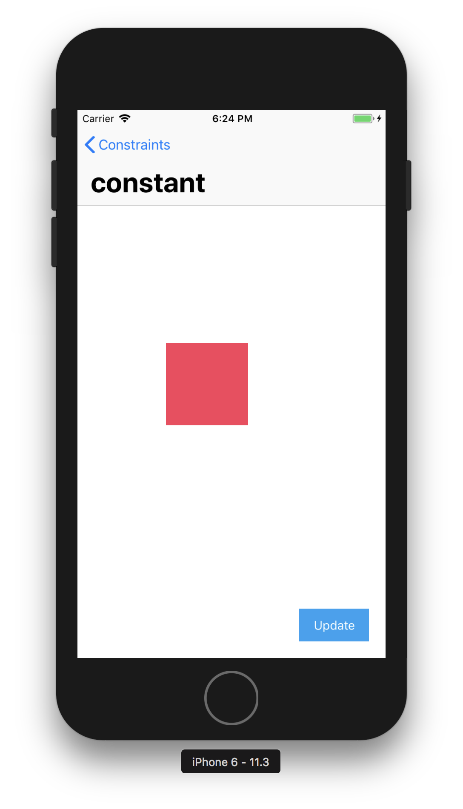
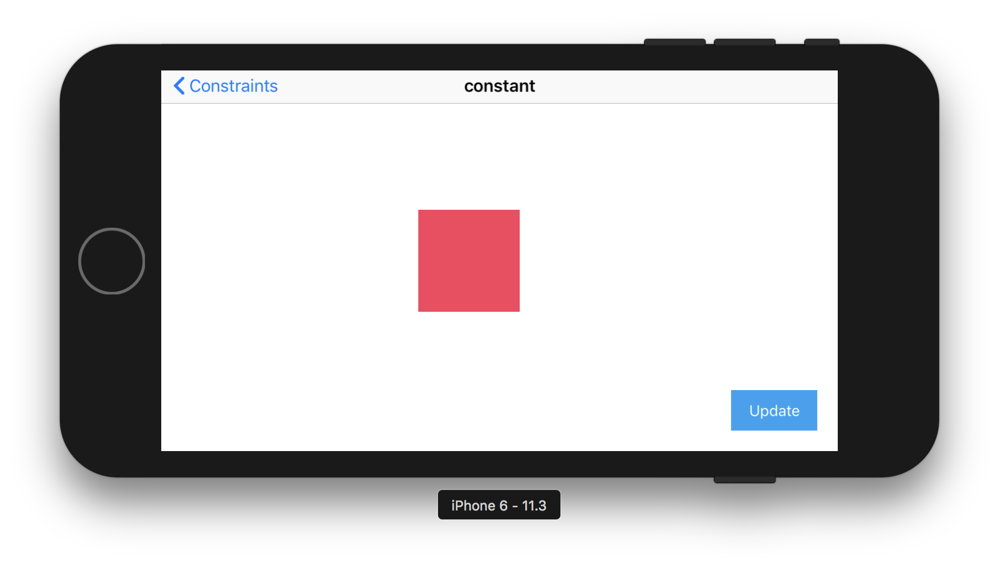

===== Priority

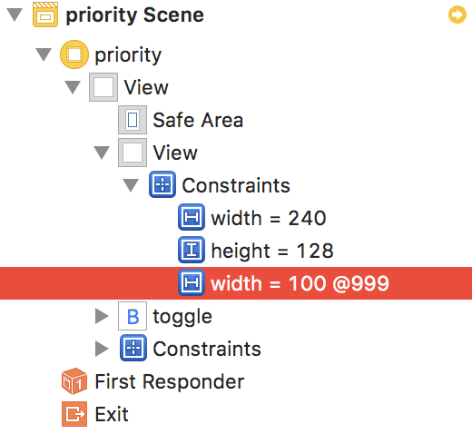

[source, swift]
----
/* 
    * 'NSInternalInconsistencyException', reason: 'Mutating a priority from required to not on an installed constraint (or vice-versa) is not supported.  You passed priority 1000 and the existing priority was 800.'
*/

// 아래 코드로 UI Crash가 발생함
@IBAction func togglePriority(_ sender: Any) {
    width1.priority = width1.priority.rawValue < 1000 ? UILayoutPriority(rawValue: 1000) : UILayoutPriority(rawValue: 800)
    width2.priority = width2.priority.rawValue < 1000 ? UILayoutPriority(rawValue: 1000) : UILayoutPriority(rawValue: 800)
}

// Priority는 구조체로 되어있기 때문에 아래와 같이 적용해야 함
// 첫 번째 길이 Size Inspector에서 Priority를 999으로 변경함
// 첫 번째 길이 Size Inspector에서 Priority를 800으로 변경함

@IBAction func togglePriority(_ sender: Any) {
    width1.priority = width1.priority.rawValue < 999 ? UILayoutPriority(rawValue: 999) : UILayoutPriority(rawValue: 800)
    width2.priority = width2.priority.rawValue < 999 ? UILayoutPriority(rawValue: 999) : UILayoutPriority(rawValue: 800)
}
---- 

=== 참고
* https://cocoacasts.com/what-are-prototyping-constraints[What are prototyping constraints?]
* https://kxcoding.com[KXCoding]
* https://developer.apple.com/library/content/documentation/UserExperience/Conceptual/AutolayoutPG/[Auto Layout Guide]
* https://www.raywenderlich.com/160527/auto-layout-tutorial-ios-11-getting-started[Auto Layout Tutorial in iOS 11: Getting Started]
* https://developer.apple.com/ios/human-interface-guidelines/visual-design/adaptivity-and-layout/[Adaptivity and Layout]
* https://videos.raywenderlich.com/courses/100-beginning-auto-layout/lessons/1[Beginning Auto Layout]
* https://videos.raywenderlich.com/courses/75-mastering-auto-layout/lessons/1[Mastering Auto Layout]
* https://github.com/yuaming/practice-swift/tree/master/Constraints[Constraints]
* https://github.com/yuaming/practice-swift/tree/master/BasicConstraints[BasicConstraints]