= Auto Layout

=== 화면 사이즈 변화

===== 화면 사이즈 변화
* iPhone 4에서 Retina Display로 인해 Point 단위, 스케일 사용함
** `Pixel과 Point 차이 링크 참고` 
* iPhone 5가 나오면서 파편화가 심해짐 
** `Auto Layout 도입` 
** 기존 Frame-based Layout에서 다른 View 관계를 이용하여 View의 위치와 크기를 자동하는 조정하는 Layout 시스템
* *기기별 해상도를 외울 필요 없음. Auto Layout 개념을 익혀서 View 구성하는 것이 중요함*

===== 기기별 화면 사이즈

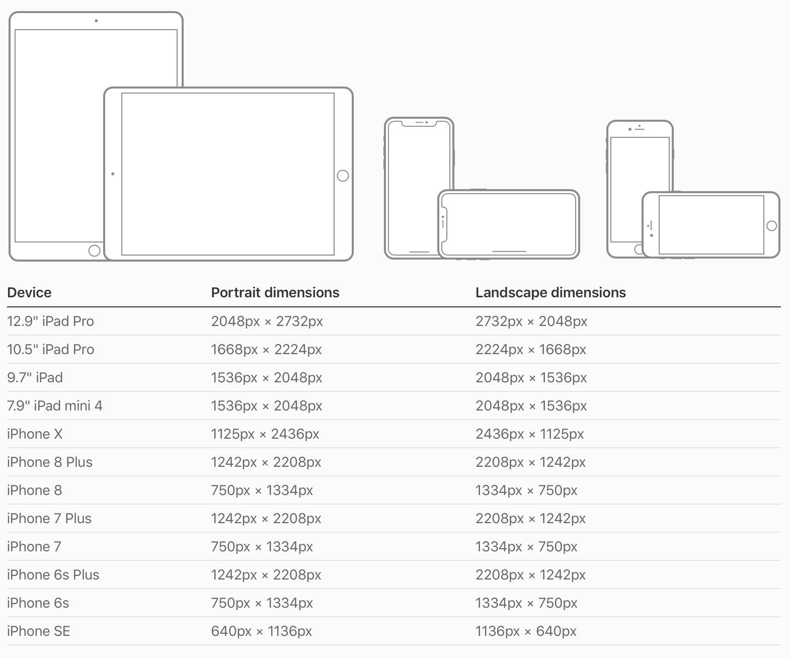

=== Layout 변화

===== Frame-based Layout
* 상위 View 좌표 시스템에서 특정 View 좌표를 나타냄. 개발자가 일일히 계산해야함
* 상위 View의 Frame 변화에 따라 하위 View의 Frame이 변경되는 시스템을 지정함 => `Auto Resizing Mask`

===== Auto Layout
* Frame-based Layout, Auto Resizing Mask가 필요함. Auto Layout으로 계산하지 못하는 View에서 필요함
* UI를 구성하는 View의 크기와 위치를 다른 요소 관계를 나타내는 `특별한 규칙을 통해(Constraints)` 자동으로 계산하고 배치하는 기술
* 개발자는 Constraints를 주고 View를 직접 계산하지 않음

===== Adaptive Layout
* Auto Layout
* Size Class
* Trait Collection
* Universal Storyboard

=== Constraints

===== Auto Layout Formular
* `item1.attr = multiplier * item2.attr + constant`
* Document Outline에서 Root View의 Constraints를 통해 공식과 비교하여 파악하면 보다 빠르게 이해할 수 있음

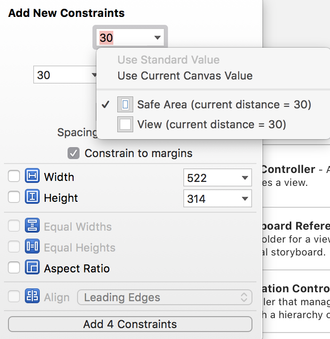
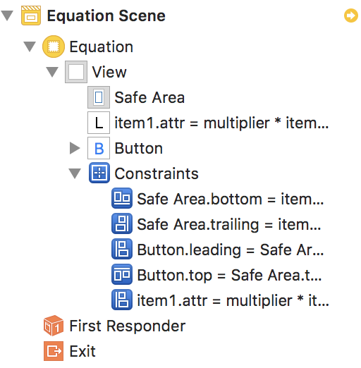

* `view.top = 1 x superview.top + 20`
* `textField.leading = 1 x label.trailing + 8`
* `view.height = 0.5 x superview.height + 0`
* `button.height = 1 x NSLayoutAttribute.notAnAttribute (0) + 50`

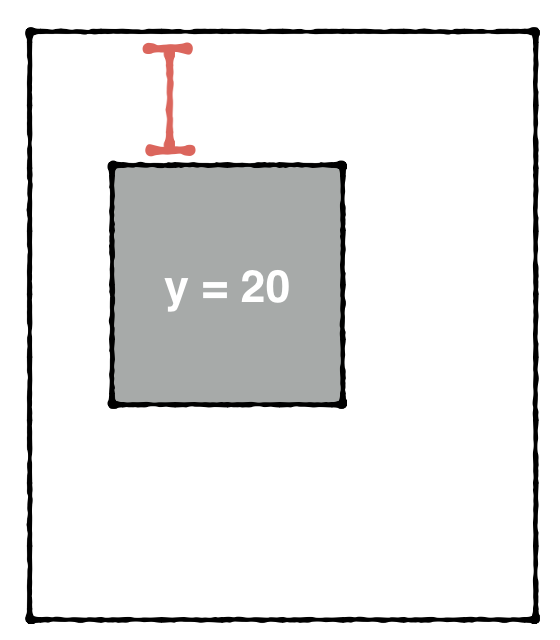
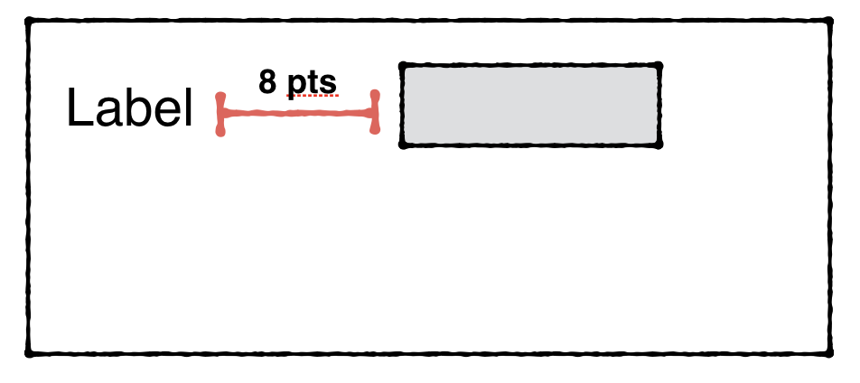
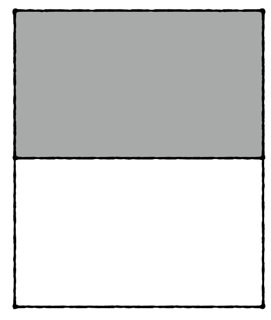
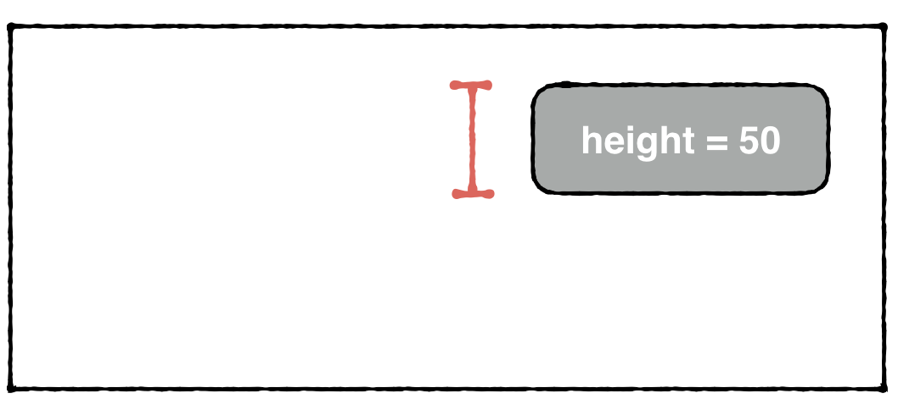

===== Constraints 추가 원리
* 다른 View와 연관성이 없는 Width, Height, Aspect Ratio는 선택한 View에 제약이 추가됨
* 다른 View와 연관된 제약은 연관된 제약이 관련되어 있는 인접한 상위 View에 추가됨
* 예제
** A View 넓이 제약 추가하면 A View에 제약이 추가됨
** C, D View 사이에 Equal Width를 추가하면 두 개 View와 인전합 상위 View인 A에 제약이 추가됨
** D, E View 사이에 Equal Width를 추가하면 두 개 View와 인접한 상위 View인 Root View에 제약이 추가됨
* 제약 추가할 때 개요로 나타남. `제약 이름을 보고 종류를 파악하는 연습해보기:)`

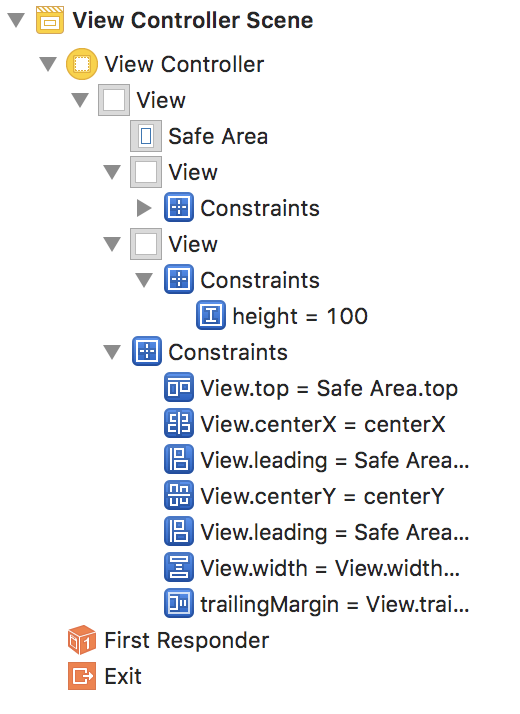
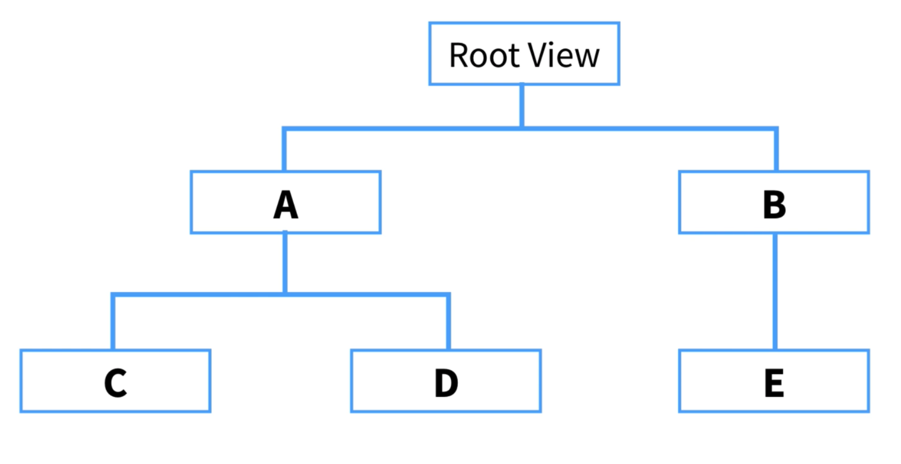

===== 용어
* Width, Height
* Leading, Top, Trailing, Bottom, Left, Right
** Leading, Trailing
** 왼쪽에서 오른쪽이나 오른쪽에서 왼쪽으로 언어를 쓰는 나라에 맞게 화면이 왼쪽에서 오른쪽, 오른쪽에서 왼쪽으로 바뀜
* Layout Guide
** 화면에 보이지 않지만 Layout을 쉽게 사용할 수 있는 간격
** iOS 11에서 Safe Area Layout Guide 라는 용어로 바뀜. 기존 Top, Bottom Layout Guide 대체하며 하위 버전에서도 호환하여 작동함
* Margin
** View 가장 자리와 Subview 사이 공간 
* Aspect Ratio
** 기준이 되는 너비나 높이가 있어야 함
* BaseLines
** Leading, Trailing, Top, Bottom은 Frame 기준으로 정렬함
** BaseLine은 내용을 기준으로 정렬함
* Center X, Center Y
** 수평 중심, 수직 중심
* Horizontal, Vertical
** 수평, 수직
* `오토 레이아웃이란? 링크 참고`

=== Auto Layout Interface Builder

===== Prototyping Constraints
* `What are prototyping constraints? 링크 참고`

===== AutoResizing Mask 추가하기
* Size Inspector > Autoresizing

===== Constraints 추가하기
* _Canvas Menu 이용하기_
** Update Frames
*** Designed Frame과 Runtime Frame이 다를 때 활성화 됨
** Embed In Stack
*** 새로운 StackView 추가
*** 균등하게 화면 분할할 때 사용함
** Align
*** 정렬 관련 Constraints
** Add New Constraints
*** 사이즈 관련 Constraints
** Resolve Auto Layout Issues
* _Control + 드래그_ 
** 드래그 방향, 각도에 따라 추가할 수 있는 제약이 달라짐
** View의 현재 Frame을 기준으로 제약이 추가됨
* _Control + 드래그_ 한 후, _Shift_ 버튼을 누르면 여러 개 제약을 추가할 수 있음
* _Document Outline에서 Control + 드래그_

===== Constraints 편집하기
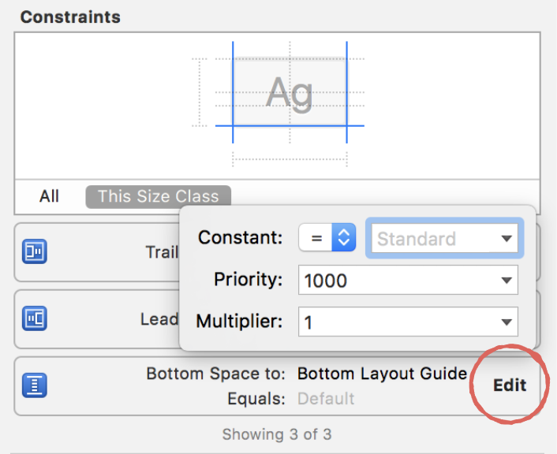
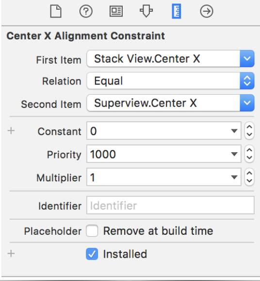
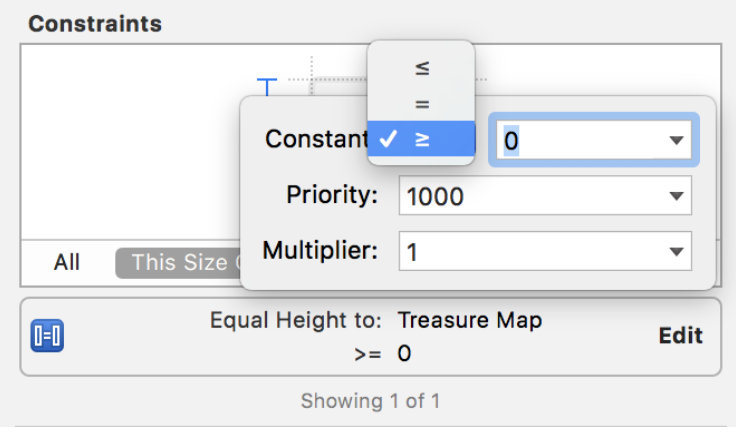

===== Auto Layout Preview
* 시뮬레이터를 통해 매번 확인하는 것이 힘듦
* _Command + Option + Enter_ 이나 보조편집기 아이콘을 통해 보조 편집기를 열고 Auto Layout Preview를 확인할 수 있음

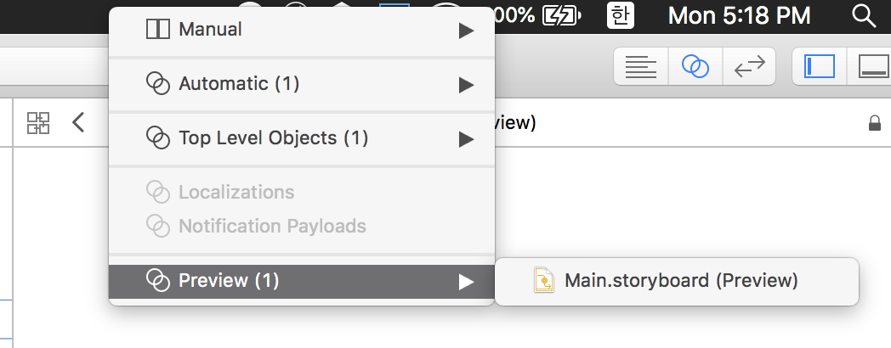
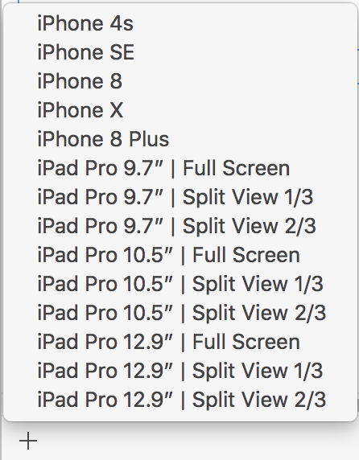

=== AutoResizing

===== 속성
* Top, Bottom, Left, Right, Width, Height
* Margin
** View 가장자리와 Super View 사이 공간

===== AutoResizing Mask
* `var autoresizingMask: UIViewAutoresizing { get set }`

[source, swift]
----
// # 1 
UIView.AutoresizingFlexibilities.leftMargin
UIView.AutoresizingFlexibilities.width
UIView.AutoresizingFlexibilities.rightMargin

UIView.AutoresizingFlexibilities.topMargin
UIView.AutoresizingFlexibilities.height
UIView.AutoresizingFlexibilities.bottomMargin

// # 2
UIViewAutoresizing.flexibleLeftMargin.rawValue    
UIViewAutoresizing.flexibleWidth.rawValue         
UIViewAutoresizing.flexibleRightMargin.rawValue   
UIViewAutoresizing.flexibleTopMargin.rawValue     
UIViewAutoresizing.flexibleHeight.rawValue        
UIViewAutoresizing.flexibleBottomMargin.rawValue  

// # 3
extension UIView {
  typealias AutoresizingOptions = UIViewAutoresizing
}

UIView.AutoresizingOptions.flexibleLeftMargin
UIView.AutoresizingOptions.flexibleWidth
UIView.AutoresizingOptions.flexibleRightMargin

UIView.AutoresizingOptions.flexibleTopMargin
UIView.AutoresizingOptions.flexibleHeight
UIView.AutoresizingOptions.flexibleBottomMargin
----

===== translatesAutoresizingMaskIntoConstraints
* translatesAutoresizingMaskIntoConstraints
** View가  AutoResizing Mask가 Auto Layout 제약으로 변할지 판단함
* `self.view.translatesAutoresizingMaskIntoConstraints = false 가 의미하는 것?` 
** AutoResizing Mask가 View의 크기와 위치를 완전히 지정하기 때문에 Auto Layout으로 제약을 추가하면 에러가 남. 그래서 Auto Layout을 이용하여 동적인 제약을 추가적으로 주기 위해서 translatesAutoresizingMaskIntoConstraints 프로퍼티에서 false 설정이 필요함

=== Stack View

===== Stack View
* Non-Rendering View. 즉 시각적 요소나 배경이 없음. Subview의 Layout을 관리하는 것이 목적

===== 속성
* Axis
** Horizontal
** Vertical
* Alignment
* Distribution
* Spacing
** StackView 안에 있는 Subview마다 간격

===== Intrinsic Content Size
* Label, Button 요소 등 내용이 있으며 정확한 크기를 가지고 있음
* Stack View와 Subview의 우선 순위는 더 중요한지, Auto Layout 설정에 따라 달라짐

===== Constraint Priorities
* `오토 레이아웃으로 iOS 앱 쉽게 개발하기 링크 참고`

image:./images/horizontal-hugging.png[30%, 30%]
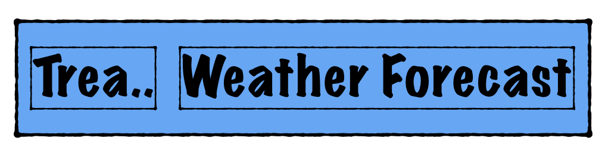
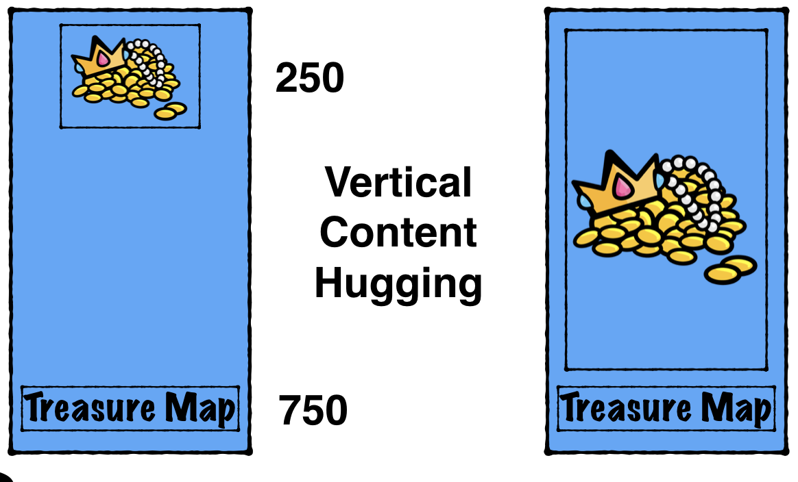

===== Nesting Stack View
* 복잡한 Layout에서 Stack View를 중첩해서 Layout을 구성할 수 있음

===== Alignment

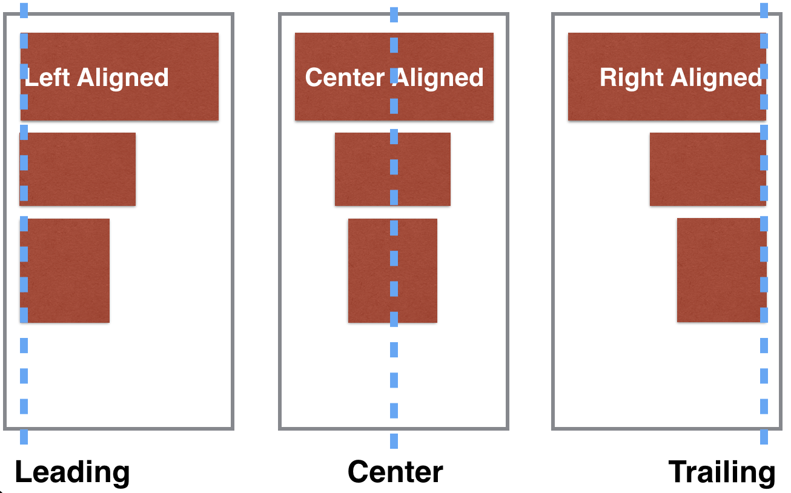
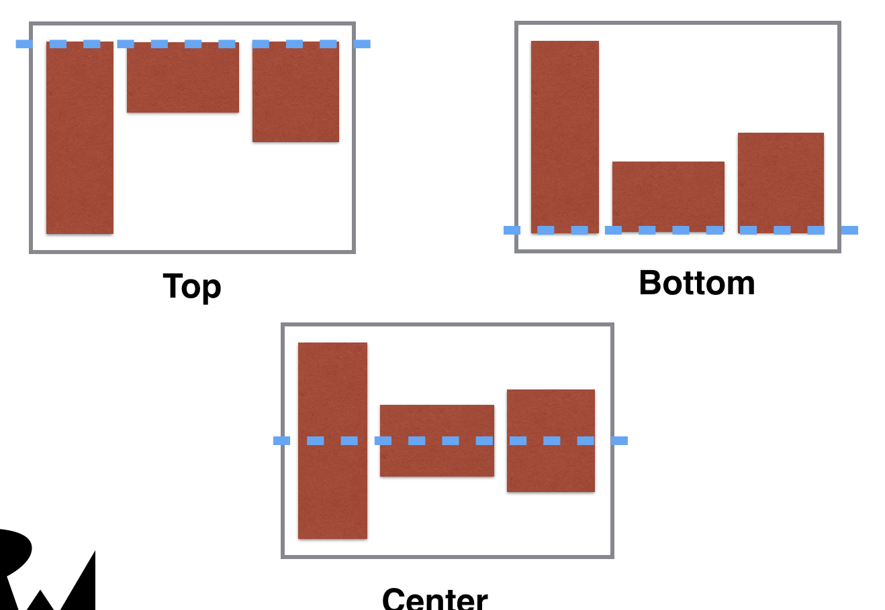
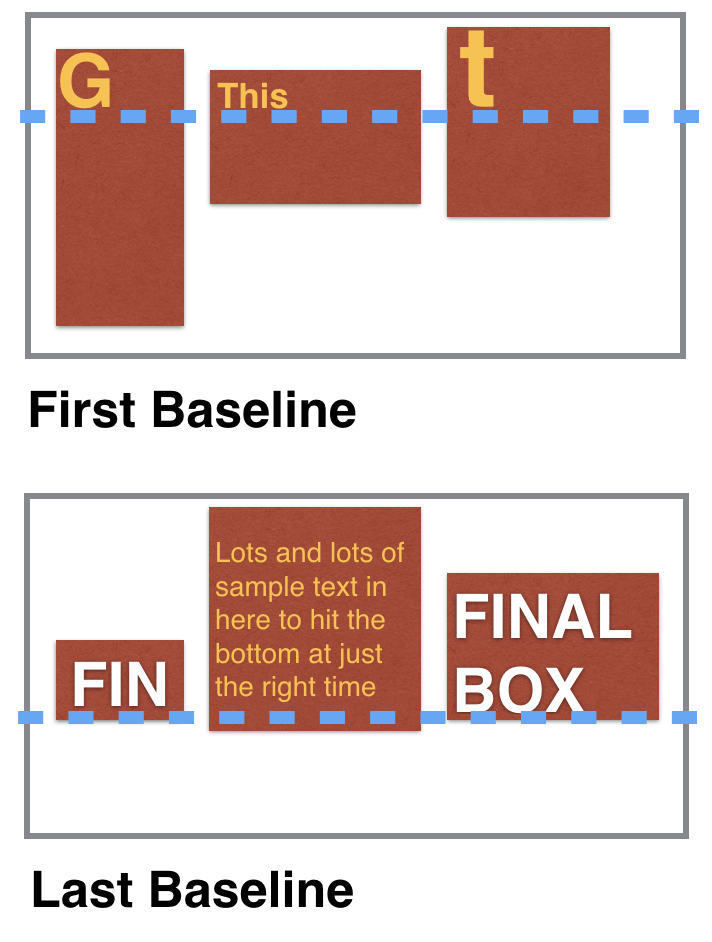

===== Distribution

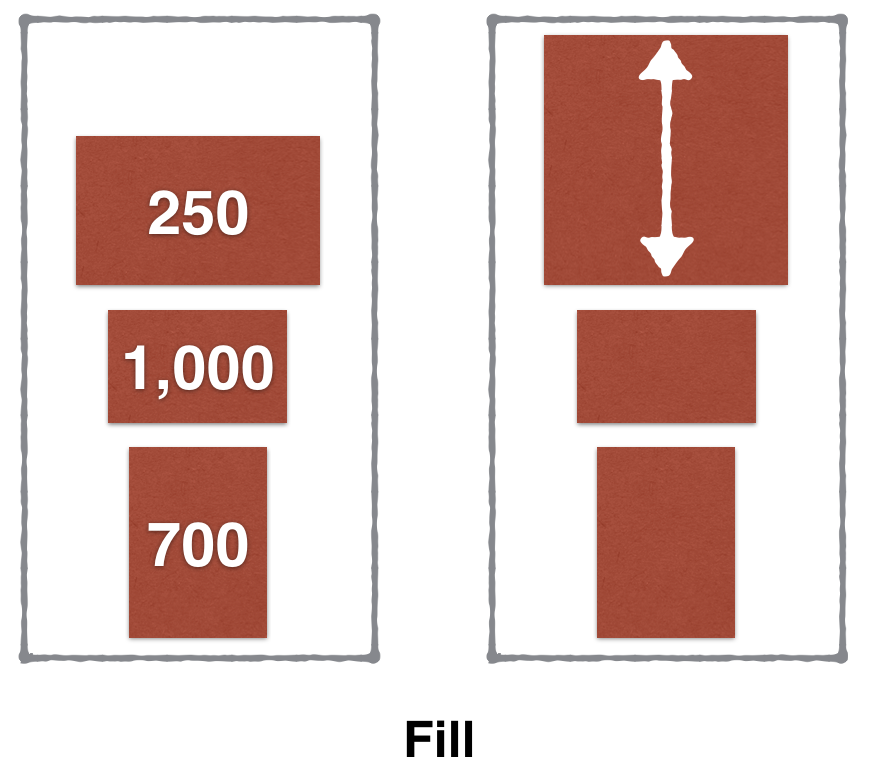
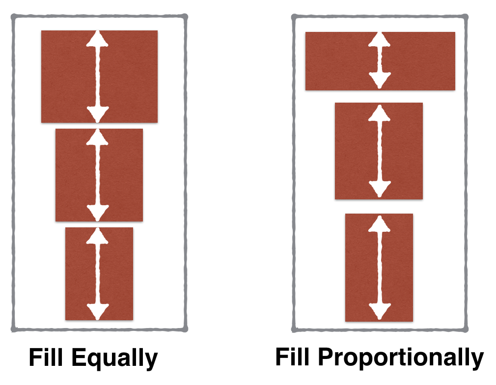
image:./images/distribution-3.png[45%, 45%]
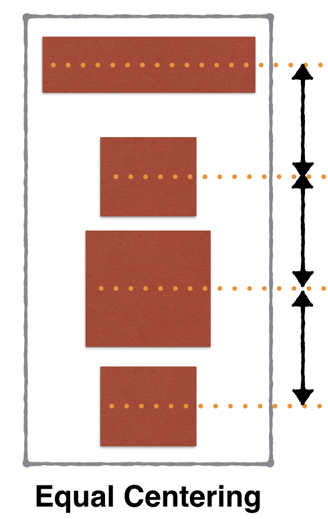

=== Tips

===== Q1.
* prepareForResue(), layoutSubviews() 에서 Auto Layout을 코드로 작성할 경우, 스크롤 할 때마다 호출이 되는 것이 문제가 됨. 즉 Auto Layout 코드로 작성할 경우, 어느 시점에서 작성하는 것이 좋은가?

[source, swift]
----
override func prepareForReuse() { 
    super.prepareForReuse()

    addSubview(foodImageView) 
    updateConstraintsOfFoodImageView(isActive: true) 
     
    addSubview(titleLabel) 
    updateCostraintsOfTitleLabel(isActive: true) 
     
    addSubview(descriptionLabel) 
    updateConstraintsOfDescriptionLabel(isActive: true) 

 
    addSubview(pricesStackView) 
    updateConstraintsOfPricesStackView(isActive: true) 
     
    addSubview(badgesStackView) 
    updateConstraintsOfBadgesStackView(isActive: true) 
} 

override func layoutSubviews() { 
    super.layoutSubviews()

    addSubview(foodImageView) 
    updateConstraintsOfFoodImageView(isActive: true) 
     
    addSubview(titleLabel) 
    updateCostraintsOfTitleLabel(isActive: true) 
     
    addSubview(descriptionLabel) 
    updateConstraintsOfDescriptionLabel(isActive: true) 

 
    addSubview(pricesStackView) 
    updateConstraintsOfPricesStackView(isActive: true) 
     
    addSubview(badgesStackView) 
    updateConstraintsOfBadgesStackView(isActive: true) 
} 
----

===== A1.

[source, swift]
----
// ViewController
override func viewDidLoad() {
    // ...

    storeItemTableView.register(StoreItemCell.self, forCellReuseIdentifier: cellIndentifier) 

    // ...
}

// StoreItemCell
override init(style: UITableViewCellStyle, reuseIdentifier: String?) { 
    super.init(style: style, reuseIdentifier: reuseIdentifier) 
     
    initializeLayout() 
} 

func initializeLayout() {
    addSubview(foodImageView) 
    addSubview(titleLabel) 
    addSubview(descriptionLabel) 
    addSubview(pricesStackView) 
    addSubview(badgesStackView) 

    updateConstraintsOfFoodImageView(isActive: true) 
    updateCostraintsOfTitleLabel(isActive: true) 
    updateConstraintsOfDescriptionLabel(isActive: true) 
    updateConstraintsOfPricesStackView(isActive: true)
    updateConstraintsOfBadgesStackView(isActive: true) 
----

===== A2.
* Content Hugging, Compression Resistance 안 쓴다는 생각을 버려라!
* translatesAutoresizingMaskIntoConstraints 아니면 Auto Layout
* Visual Format Language 사용함
* 제약을 적용 하기 위해서 두 객체의 x, y 좌표를 알아야 함
* 노락색 Indicator가 보인다면 Update Frames 메뉴를 선택함
* Copyright 같은 문구는 UILabel의 _AutoShrink_ 과 Add New Constraints의 _Constraint to margin 체크 박스, Bottom Margin의 Use Standard Value_ 를 이용하여 어느 기기에도 대응할 수 있음
* 고정된 너비와 높이 값은 피해야 함
* Subview들의 제약 조건을 개발자가 직접 관리하는 것보다 StackView를 이용할 수 있다면 이용하는 것이 좋음
* Multiplier의 비율은 정수로 계산하는 것이 좋음
* Priority가 1000은 필수 제약 조건, 1000보다 작으면 점선으로 표시되며 선택적 제약 조건

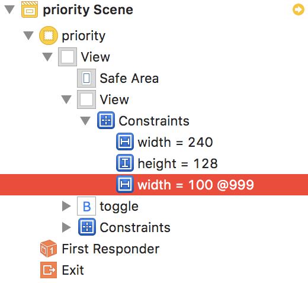

[source, swift]
----
/* 
    * 'NSInternalInconsistencyException', reason: 'Mutating a priority from required to not on an installed constraint (or vice-versa) is not supported.  You passed priority 1000 and the existing priority was 800.'
*/

// 아래 코드로 UI Crash가 발생함
@IBAction func togglePriority(_ sender: Any) {
    width1.priority = width1.priority.rawValue < 1000 ? UILayoutPriority(rawValue: 1000) : UILayoutPriority(rawValue: 800)
    width2.priority = width2.priority.rawValue < 1000 ? UILayoutPriority(rawValue: 1000) : UILayoutPriority(rawValue: 800)
}

// Priority는 구조체로 되어있기 때문에 아래와 같이 적용해야 함
// 첫 번째 길이 Size Inspector에서 Priority를 999으로 변경함
// 첫 번째 길이 Size Inspector에서 Priority를 800으로 변경함

@IBAction func togglePriority(_ sender: Any) {
    width1.priority = width1.priority.rawValue < 999 ? UILayoutPriority(rawValue: 999) : UILayoutPriority(rawValue: 800)
    width2.priority = width2.priority.rawValue < 999 ? UILayoutPriority(rawValue: 999) : UILayoutPriority(rawValue: 800)
}
---- 

=== 참고
* https://cocoacasts.com/what-are-prototyping-constraints[What are prototyping constraints?]
* https://developer.apple.com/library/content/documentation/UserExperience/Conceptual/AutolayoutPG/[Auto Layout Guide]
* https://www.raywenderlich.com/160527/auto-layout-tutorial-ios-11-getting-started[Auto Layout Tutorial in iOS 11: Getting Started]
* https://developer.apple.com/ios/human-interface-guidelines/visual-design/adaptivity-and-layout/[Adaptivity and Layout]
* https://videos.raywenderlich.com/courses/100-beginning-auto-layout/lessons/1[Beginning Auto Layout]
* https://videos.raywenderlich.com/courses/75-mastering-auto-layout/lessons/1[Mastering Auto Layout]
* https://academy.realm.io/kr/posts/ios-autolayout/[오토 레이아웃으로 iOS 앱 쉽게 개발하기]
* https://blog.grotesq.com/post/593[Pixel과 Point 차이]