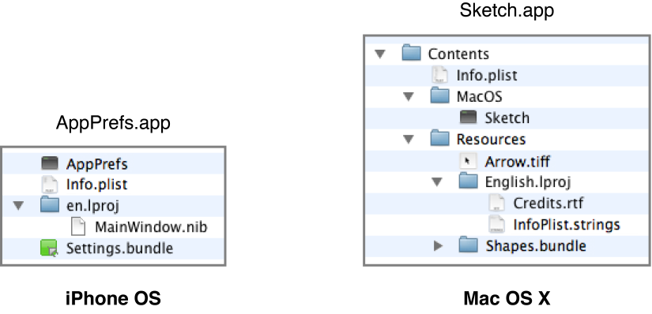

= Bundle

> 이 글은 개인 학습의 목적으로 번역하였기 때문에 잘못된 번역이나 의역이 포함되어 있습니다. 잘못된 부분은 메일로 보내주시면 감사하겠습니다 :)

=== 원문 

===== Description
* A bundle is a directory in the file system that groups executable code and related resources such as images and sounds together in one place. In iOS and OS X, applications, frameworks, plug-ins, and other types of software are bundles. A bundle is a directory with a standardized hierarchical structure that holds executable code and resources used by that code. Foundation and Core Foundation include facilities for locating and loading code and resources in bundles.

> Applications are the only type of bundle that third-party developers can create on iOS.

* Bundles bring several advantages to users and developers. They make it easy to install or relocate an application or other piece of software by simply moving it from one location to another. Bundles are also an important factor in internationalization. You store localized resources in specially named subdirectories of a bundle; programmatic facilities look for localized resources in the location that corresponds with a user’s language preferences.
* Most types of Xcode projects create a bundle for you when you build the executable. Therefore you rarely need to construct a bundle by hand. Even so, it is important to understand their structure and how to access the code and resources inside them.

===== Structure and Content of Bundles
* A bundle can contain executable code, images, sounds, nib files, private frameworks and libraries, plug-ins, loadable bundles, or any other type of code or resource. It also contains a runtime-configuration file called the information property list (Info.plist). Each of these items has its proper place in the bundle structure. Resources such as images, sounds, and nib files are deposited in the Resources subdirectory. They can be either localized or nonlocalized. Localized files (including strings files, which are collections of localized strings) are put in subdirectories of Resources that have the extension of lproj and a name corresponding to a language and possibly a locale.

=== 요약 

===== 설명
* Bundle은 실행할 수 있는 코드, 이미지, 사운드 같은 리소스를 저장하는 표준 계층구조가 있는 디렉토리
* iOS, OS X에서 어플리케이션, 프레임워크, 플러그인, 다른 유형의 소프트웨어도 번들임

> 어플리케이션은 Bundle 중에서 타사 개발자가 iOS에서 만들 수 있는 유일한 유형

* 어플리케이션을 다른 위치로 이동하기만 하면 어플리케이션이나 다른 소프트웨어를 쉽게 배치하거나 설치가 할 수 있음
* Bundle은 국제화할 때 중요한 요소임

* 대부분 XCode 프로젝트는 빌드될 때 Bundle을 만듬. 수동으로 할 필요가 없음
* 그러나, Bundle 구조, 코드, 파일 접근하는 방법에 대해 이해해야 함

===== Structure and Content of Bundles
* 실행할 수 있는 코드, 이미지, 사운드, Nib 파일, 라이브러리, 플러그인, 다른 프로젝트의 Bundle 등 포함되어 있음
* Runtime 구성 파일인 Info.plist도 포함되어 있음
* Bundle 디렉토리 구조에 따라 지역화 여부를 판단할 수 있음

