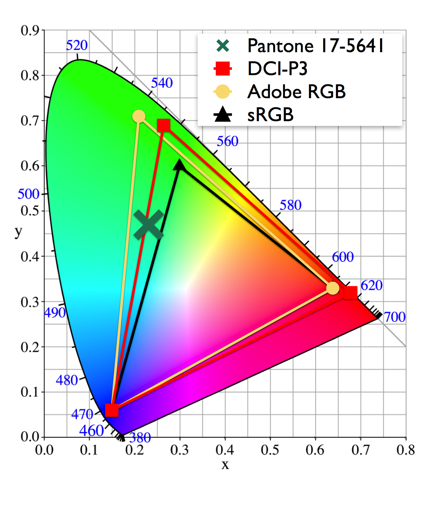

= Colors in XCode

===== XCode에서 색상 지정하는 방법
* Interface Builder
* Programmatically

[source, swift]
----
// sRGB IEC 61966-2-1 색 공간을 이용하여 색상을 만듦
let myCustomColor = UIColor(red: 38/255.0, green: 49/255.0, blue: 197/255.0, alpha: 1.0) 
----

===== 바른 색상을 선택하기 위해서 어떻게 해야 할까?
* 색상을 이해하기 위해서 2가지 요소를 이해해야 함
** Values
** 색상이 표현되는 색 공간 => RGBA (Red, Green, Blue, Alpha) -> Xcode에서 자주 사용함 / HSV (Hue, Saturation, Value) / HSL (Hue, Saturation, Lightness) 등

===== 색 공간
* 표현할 수있는 색의 범위를 정의하는 구성 요소
* iPhone 7 이전, sRGB IEC 61966-2-1 색상 공간 (sRGB)의 색상 만 표현함
* iPhone X 같은 최신 폰은 더 넓은 색 영역을 다루고 포함하고 있는 더 큰색 공간 인 Display-P3 표준(또는 간단히 P3만 사용함)

===== 색 공간이 RGBA 값에 어떻게 적합한가?
* RGBA 표기법은 최대 255 x 255 x 255 = 16,581,375 (유명한 1,600 만 가지 색상)를 표현할 수 있음. Alpha까지 포함하면(x 255) 더 많은 것을 표현할 수 있음. 40억 이상 표현할 수 있지만, 바꿔 말하면 이 이상 색상은 표현할 수 없다는 의미
* 만약, 이것보다 더 큰 색 공간에서 작업할 때 연속된 두 색(#A0A0A0, A0A0A1)이나 빨간색 같은 극명한 색상의 경우(P3 => #FF0000이 sRGB => #FF00000보다 훨씬 선명한 빨강임). 이러한 상황에서 내가 원하는 색상을 얻지 못할 수 있음
* sRGB에서 생성한 RGBA 색상 코드가 P3으로 나타내는 디스플레이로 전환하면 새로운 RGBA 색상 코드를 만들기 떄문에 색상이 달라질 수 있음
* 이러한 문제를 해결하기 위해서 sRGB에서 색깔을 선택하고 Xcode에서 동일한 RGBA 값을 써야함

===== 색상을 선택하는 방법 ?
* Photoshop이나 Sketch 같은 툴은 거의 sRGB가 표준이기 떄문에 이러한 툴의 스포이드 도구를 이용하여 sRGB 색깔을 뽑아냄
* Mac 스포이드 도구를 이용함

===== iOS 표준 색공간? 
* sRGB

===== P3은 사용하면 안되는가?
* Apple에서 강렬한 색상을 통해 사용자 경험을 향상시킬 수 있는 UI나 생생하게 느껴질 수 있는 이미지 등 특정 상황에서만 P3을 사용하길 권함
* 그래서, 아직까지 sRGB를 사용하는 것이 좋음

===== Color Assets
* Interface Builder, 코드에서 두 번 관리하는 것이 귀찮음
* Xcode 9 이상부터 사용할 수 있는 방법이 나옴. 그러나, 아직까지 버전 분기에 따라 코드를 호출할 수 있도록 작성해야 함

[source, swift]
----
let lime: UIColor

if #available(iOS 11.0, *) {
    lime = UIColor(named: "Lime")!
} else {
    lime = UIColor(red: 222/255.0, green: 254/255.0, blue: 50/255.0, alpha: 1.0)
}
----

===== 출처
* https://medium.com/@volbap/working-efficiently-with-colors-in-xcode-bc4c58b16f9a[Working efficiently with colors in Xcode]
