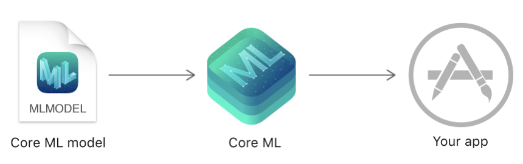
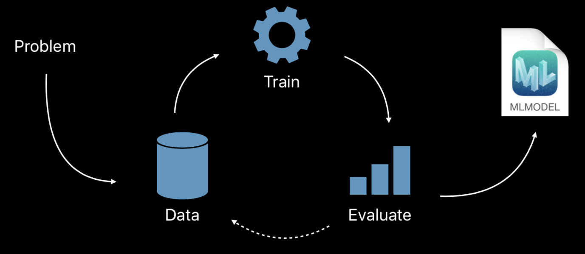
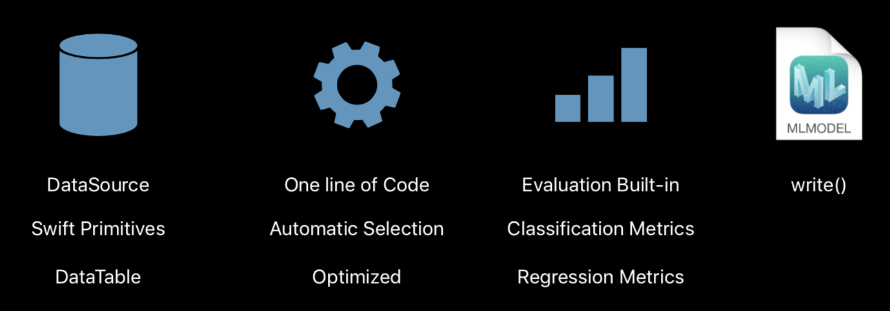

= CreateML

===== ML ?
* 어떤 입력을 받았을 때 주변 시냅스에게 어떤 영향을 주는가?
* 즉, 신경망을 따라 만드는 것

===== MLModel은 어디서 가져올 것인가?
* CoreML Tool이나 Converter를 제공함
* `Working with Core ML Models 링크 참고`

===== CreateML
* 얼마나 많은 데이터를 학습하게 하느냐가 중요함
* 도구, 논문이 많아지면서 공유하기 시작함. 입증을 위한 경쟁이 시작함. Apple의 ML은 물체 인식관련 모델이 많음

===== CreateML 작업 순서

* 이미지
** `Creating an Image Classifier Model 링크 참고`

[source, swift]
----
import Foundation
import CreateML

// Specify Data
let trainDirectory = URL(fileURLWithPath: “/Users/createml/Desktop/Fruits“)
let testDirectory = URL(fileURLWithPath: “/Users/createml/Desktop/TestFruits“)

// Create Model
let model = try MLImageClassifier(trainingData: .labeledDirectories(at: trainDirectory))

// Evaluate Model
let evaluation = model.evaluation(on: .labeledDirectories(at: testDirectory))
 
// Save Model
try model.write(to: URL(fileURLWithPath: “/Users/createml/Desktop/FruitClassifier.mlmodel“))
----

* 텍스트
** `Creating a Text Classifier Model 링크 참고`

[source, swift]
----
import CreateML
import Foundation

// Specify Data
let trainDirectory = URL(fileURLWithPath: “/Users/createml/Desktop/train”)
let testDirectory = URL(fileURLWithPath: “/Users/createml/Desktop/test”)

// Create Model
let classifier = try MLTextClassifier(trainingData: .labeledDirectories(at: trainDirectory))

// Evaluate Model
let evaluation = classifier.evaluation(on: .labeledDirectories(at: testDirectory))

// Save Model
let modelPath = URL(fileURLWithPath: “/Users/createml/Desktop/TextClassifier.mlmodel”)
try classifier.write(to: modelPath)
----

* 테이블 데이터(*.csv, *.xlsx)
** `Creating Data Tables for Training and Evaluation 링크 참고`

[source, swift]
----
import CreateML

// Specify Data
let trainingCSV = URL(fileURLWithPath: “/Users/createml/HouseData.csv”)
let houseData = MLDataTable(contentsOf: trainingCSV)
let (trainingData,testData) = houseData.randomSplit(by: 0.8, seed: 0)

// Create Model
let pricer = try MLRegressor(trainingData: houseData, targetColumn: “price")

// Evaluate Model
let metrics = try pricer.testingMetrics(on: testData)

// Save Model
try pricer.write(to: URL(fileURLWithPath: “/Users/createml/HousePricer.mlmodel”))
----

===== CreateML를 이용하여 만든 MLModel를 사용하는 방법
* MLModel를 사용하려는 프로젝트 실행시킨 후, 원하는 폴더에 MLModel 드래그하여 사용함

===== 참고
* https://developer.apple.com/videos/play/wwdc2018/703/[WWDC 2018 - Introducing Create ML]
* https://developer.apple.com/machine-learning/build-run-models/[Working with Core ML Models]
* https://developer.apple.com/documentation/coreml[Core ML]
* https://www.raywenderlich.com/196233/create-ml-tutorial-getting-started[Create ML Tutorial: Getting Started]
* https://www.slideshare.net/mobile/yongho/ss-79607172[자습해도 모르겠던 딥러닝, 머리속에 인스톨 시켜드립니다.]
* https://developer.apple.com/documentation/create_ml/creating_an_image_classifier_model[Creating an Image Classifier Model]
* https://developer.apple.com/documentation/create_ml/creating_a_text_classifier_model[Creating a Text Classifier Model]
* https://developer.apple.com/documentation/create_ml/creating_data_tables_for_training_and_evaluation[Creating Data Tables for Training and Evaluation]