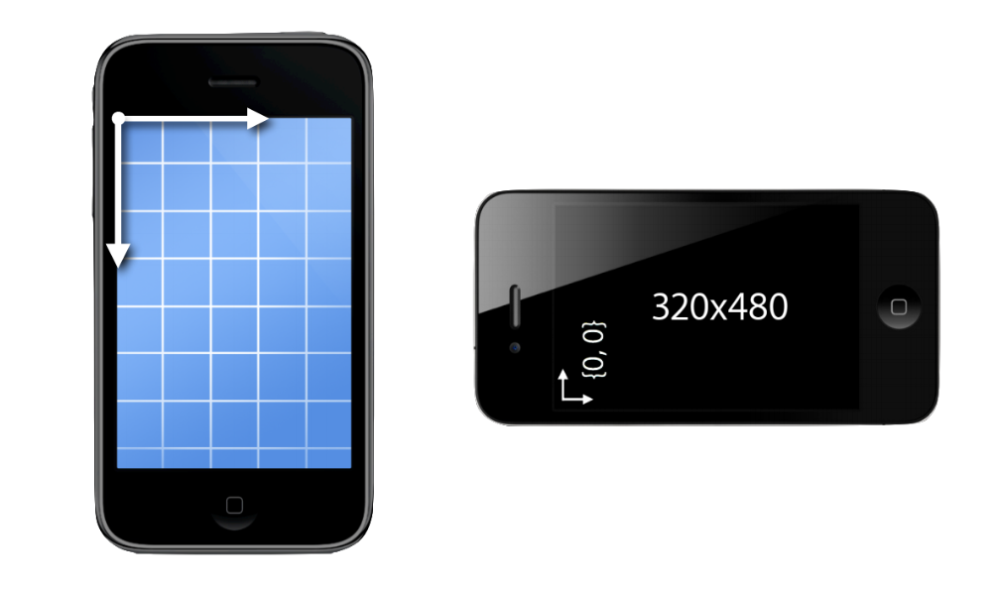
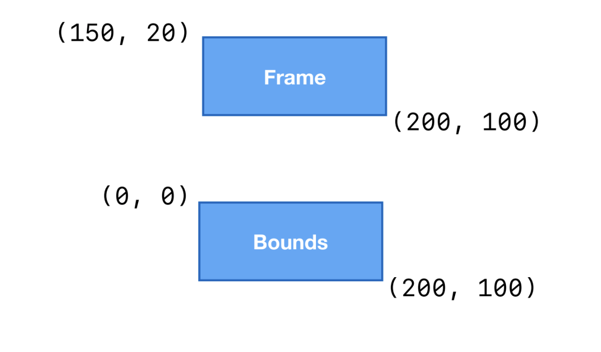
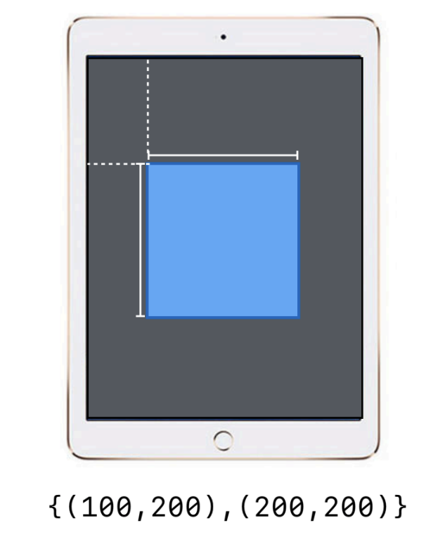
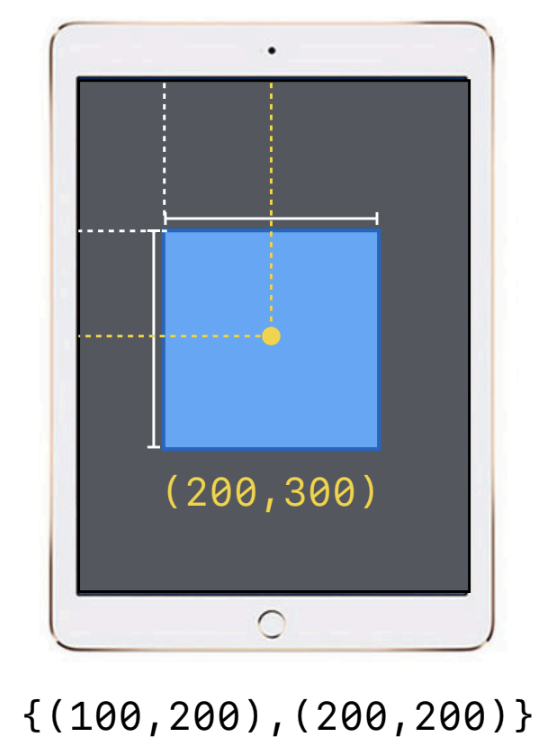
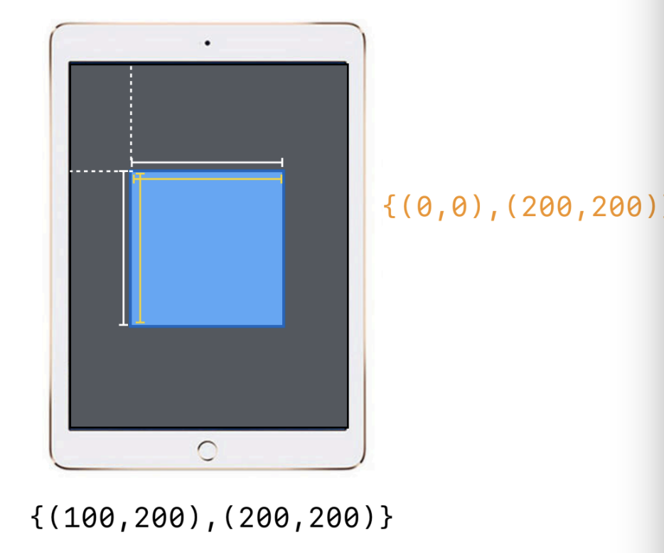
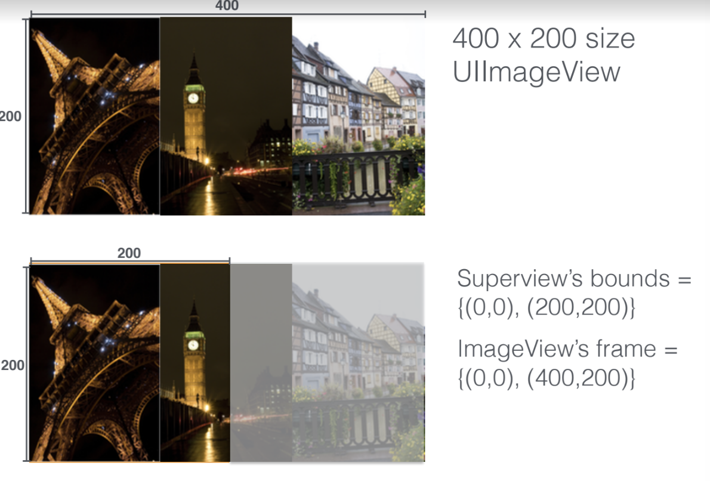

= Frame, Bounds

===== 좌표 기준

===== UIScreen's bounds
* _var bounds: CGRect_
* `UIScreen 링크 참고`

===== UIView Frame, Bounds
* Geometry
* Frame, Center
** Superview
* Bounds
** View 

===== Boundary Clipping
* _UIView => clipsToBounds_
* _CALayer => masksToBounds_
* 기능적으로 차이가 없음. 그러나, SubView나 SubLayer의 내용이 SuperView나 Root Layer의 경계를 무시하고 보여줄지, 맞춰 잘릴지 설정할 수 있음. true로 설정한다면 SuperView나 Root Layer에 경계에 맞춰 내용이 잘림

===== 참고
* https://developer.apple.com/documentation/uikit/uiview/1622580-bounds[bounds]
* https://developer.apple.com/documentation/uikit/uiview/1622621-frame?language=objc[frame]
* https://www.paintcodeapp.com/news/ultimate-guide-to-iphone-resolutions[The Ultimate Guide To iPhone Resolutions]
* https://developer.apple.com/documentation/uikit/uiscreen[UIScreen]