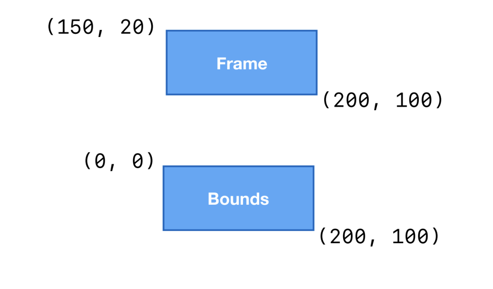
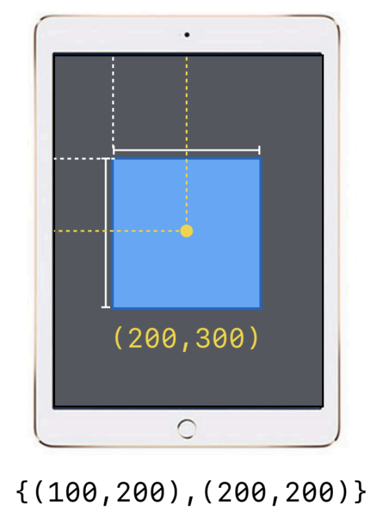
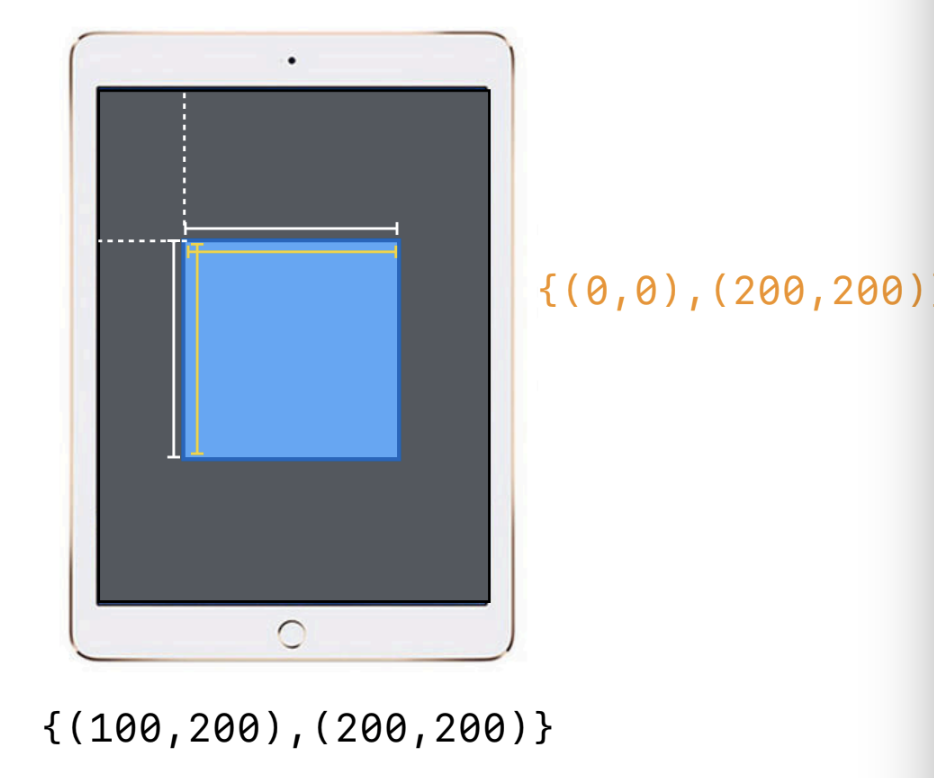
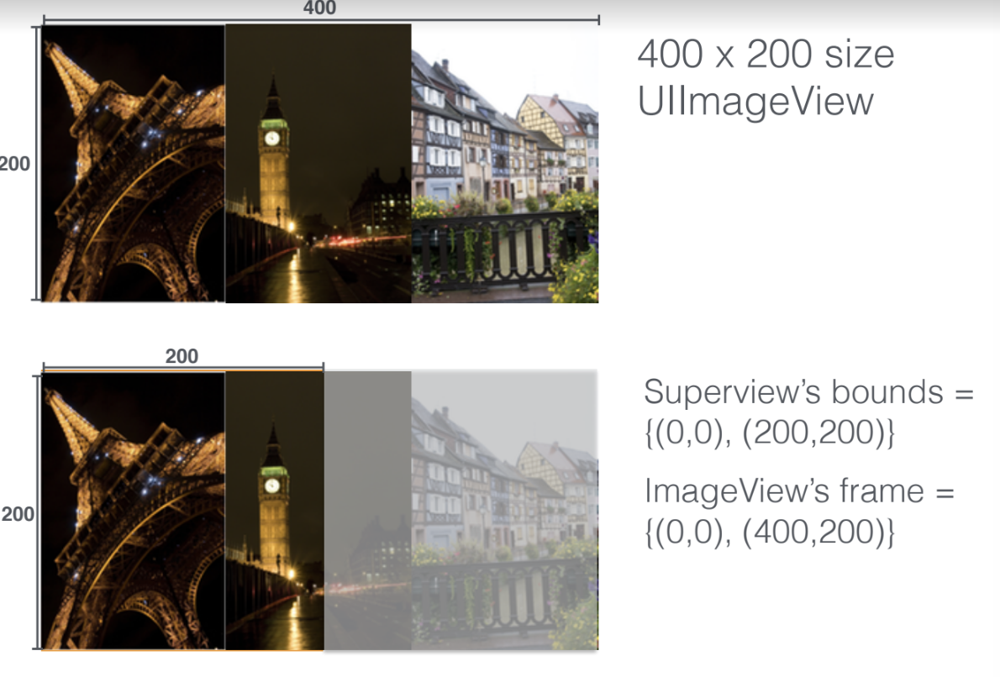

= Frame, Bounds

=== 좌표 기준

image:./image/coordinate-system.png[]

=== UIScreen's bounds
* _var bounds: CGRect_
* `UIScreen 링크 참고`

=== UIView Frame, Bounds
* Geometry
* Frame, Center
** Superview
* Bounds
** View 

image:./image/frame.png[30%, 30%]

===== Boundary Clipping
* _UIView => clipsToBounds_
* _CALayer => masksToBounds_

=== 참고
* https://developer.apple.com/documentation/uikit/uiview/1622580-bounds[bounds]
* https://developer.apple.com/documentation/uikit/uiview/1622621-frame?language=objc[frame]
* http://zeddios.tistory.com/203[Frame과 Bounds의 차이 (1/2)]
* https://www.paintcodeapp.com/news/ultimate-guide-to-iphone-resolutions[The Ultimate Guide To iPhone Resolutions]
* https://developer.apple.com/documentation/uikit/uiscreen[UIScreen]