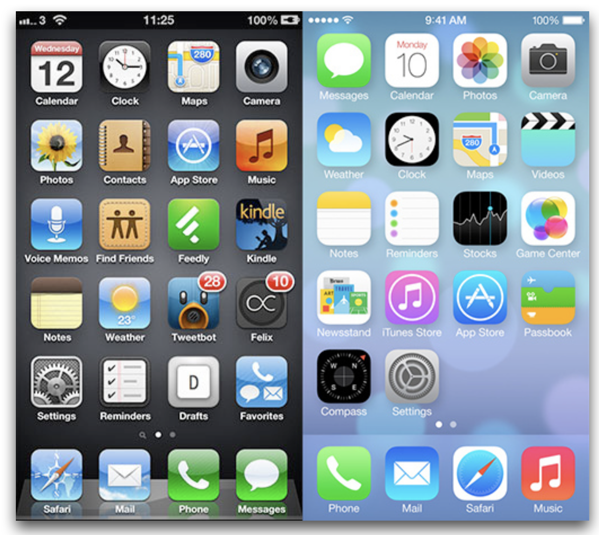
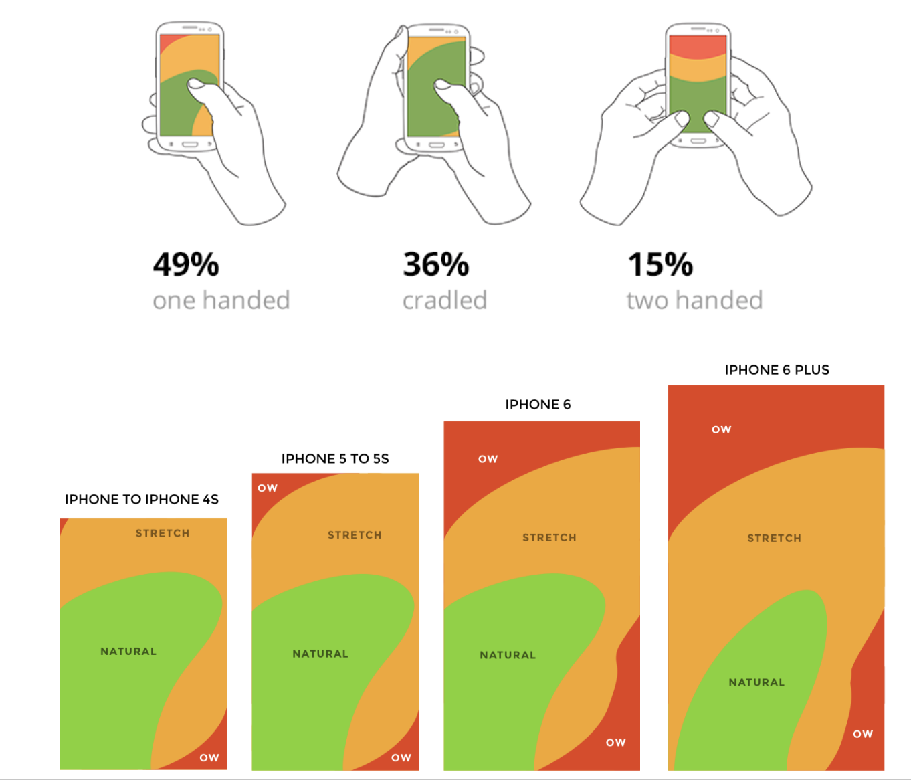

= iOS App Design

=== iOS SDK

===== 프레임워크
* 동적 라이브러리
* 리소스(헤더, 이미지 등)
* 의존성 역전(DIP)
** 프레임워크의 기능을 구현하기 위해서 하위 모듈 기능 구현이 필요함

===== XCode 개발환경
* 빌드 환경, 배포 환경이 다를 수 있음

===== 시뮬레이터

===== 아이폰 레퍼런스 라이브러리

=== iOS

===== Cocoa Touch

===== Media

===== Core Services

===== Core OS

=== Human Interface Guideline

===== Human-computer Interaction
* 인간과 컴퓨터 상호 작용(Human-computer interaction)은 인간(사용자)과 컴퓨터 간의 상호작용에 대해 연구하는 학문 분야
* HIG에 영향을 준 학문 분야
** `Drop and Drag` 는 문서를 잡고(= Drag) 휴지통에 넣는(= Drop) 실제 행동에서 반영됨
** `Copy and Paste` 는 문서를 복사하고(= Copy) 보드 붙이는(= Paste) 실제 행동에서 반영됨
** 실제 행동을 많이 반영함

===== 1985년 Human Interface Guidelines: The Apple Desktop Interface
* 책의 서문 인용
** `People aren't trying to use computers - they're trying to get their jobs done.` 

> 데스크탑 소프트웨어의 장점이 '일관성'을 유지해서 사용자가 쉽게 학습할 수 있게 하는 것이 최대 장점이므로 이 가이드라인을 통해서 일관성을 유지하도록하고, 예외적으로 이 가이드라인을 따르지 않으면서도 좋은 소프트웨어들이 있긴 하지만, 충분한 이유가 있을 때만 그러한 예외를 추종하도록 강조하고 있다.

===== HIG
* Mobile iOS, Mac OSX 버전 있음
* 버전 업그레이드가 돼서 애플 문서가 바뀐다면 애플 기본 앱 효과, UI 등 분석해봄
** 사진 앱이 복잡함
** 혼자 공부한다면 애플 기본 앱을 만들어 보는 것도 좋음

===== Evolution of the Desktop
* https://www.youtube.com/watch?v=uGI00HV7Cfw[Evloution of the desktop]

=== Multi-touch

===== Interaction Metaphors
* 1픽셀 단위가 아닌 최소 44x44 point 크기는 지킬 것 

=== iOS7 전, 후 디자인 비교

=== User eXperience

=== 참고
* http://story.pxd.co.kr/400[사용자의 80%만을 위해 디자인하라 - Apple Human Interface Guidelines의 역사]
* https://ko.wikipedia.org/wiki/HCI[HCI Wiki]
* http://wonwoo.ml/index.php/post/1717[의존성 역전(DIP)]
* https://developer.apple.com/ios/human-interface-guidelines/overview/themes/[Human Interface Guideline]