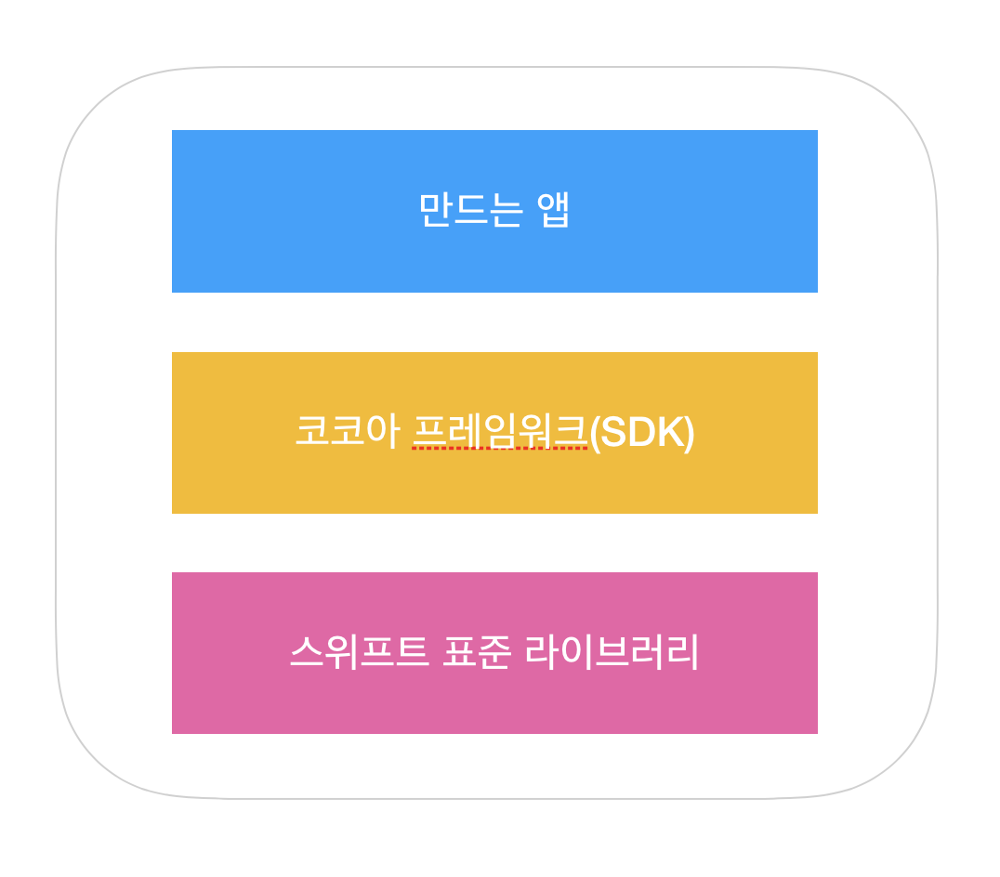
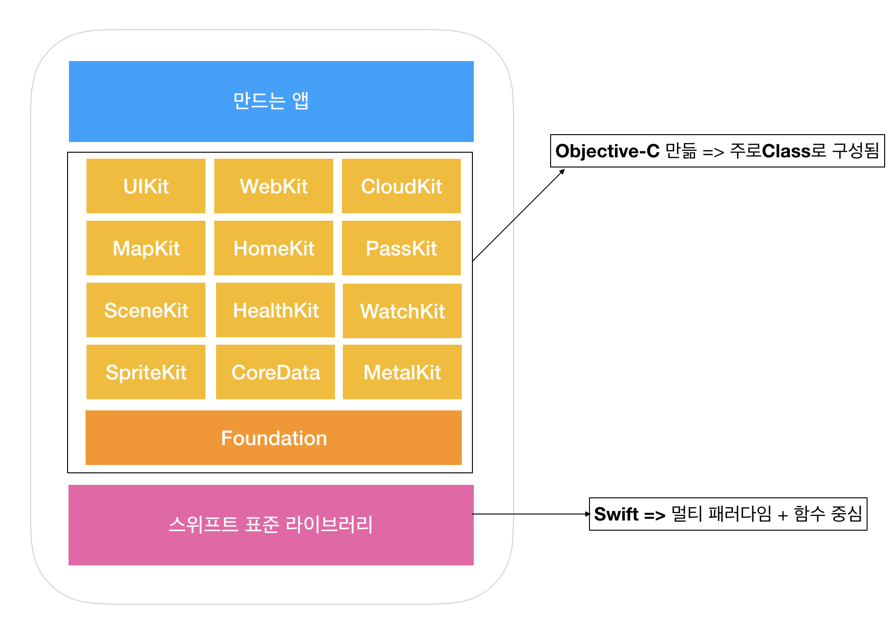
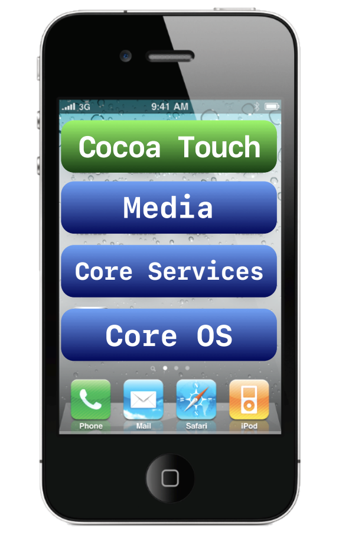

= iOS

=== iOS

===== Cocoa ?
* Cocoa Touch Framework 는 iOS 애플리케이션 개발 환경으로, 애플리케이션의 다양한 기능 구현에 필요한 여러 프레임워크를 포함하는 최상위 레벨의 프레임워크
* Cocoa Framework는 macOS 애플리케이션 제작에 사용하는 프레임워크
* _Cocoa_ 는 Objective-C 런타임을 기반으로하고, NSObject를 상속받는 모든 클래스 또는 객체를 가리킬 때 사용함
* _Cocoa Touch_ 는 핵심 프레임워크인 UIKit과 Foundation을 포함함

===== Framework
* 동적 라이브러리
* 리소스(헤더, 이미지 등)
* 의존성 역전(DIP)
** 프레임워크의 기능을 구현하기 위해서 하위 모듈 기능 구현이 필요함
* *Assets Library Framework*
** 사진앱이 관리하는 사진과 비디오(사용자가 앨범에 저장한 모든 사진과 비디오를 포함)에 접근함
** 새로운 사진이나 앨범을 추가할 수 있음
* *AV Foundation Framework*
** 오디오 컨텐츠를 재생하는데 필요한 클래스를 제공함
** 오디오 파일을 재생할 수 있으며 메모리에 로드된 사운드 특정 구간 임의 재생도 가능함
** 오디오 녹음, 오디오 세션 관리, 미디어 에셋 관리, 미디어 편집, 무비 캡처, 무비 재생, 트랙 관리, 미디어 아이템의 메타데이터 관리, 입체 음향 패닝, 사운드 간의 정확한 동기화, 사운드 파일의 데이터 형식, 샘플 레이터 등 인터페이스 제공 기능 있음
* *Core Audio Framework*
** C 기반 인터페이스
** 스트레오 기반 오디오 관리
** iOS에서 오디오 생성, 녹음, 믹스, 재생 할 수 있음
** 장치 진동 기능도 사용할 수 있음
*** CoreAudido.framework => 오디오 데이터 타입 정의
*** AudioToolbox.framework => 오디오 파일과 스트림 재생 및 녹음 서비스 제공함. 오디오 파일 관리, 시스템 경고 사운드 재생, 진동 기능을 제공함
*** AudioUnit.framework => 오디오 프로세싱 모듈인 내장 오디오 유닛을 사용할 수 있도록 함
* *Core Graphics Framework*
** Quartz 2D API를 위한 인터페이스
** Mac OS와 동일함
** 패스 기반 드로잉, 안티엘리어싱, 그레디언트, 이미지, 색상, 좌표 공간 변환, PDF 문서 생성, 보기 및 파싱 기능 제공
** C 기반. 그러나 추상화 바탕으로 설계됨
* *Core Text Framework*
** 텍스트 레이아웃과 폰트 처리를 위해 C 기반 인터페이스로 작성됨
** Core Text가 관리하는 Text 간 다른 폰트와 렌더링 속성을 가질 수 있음. 그래서 문서 편집기류 앱 제작 지원을 위해 만들어짐
* *Core Video Framework*
** Core Media를 위한 버퍼와 버퍼풀을 지원함. 그러나 대부분 앱은 직접적으로 사용할 필요가 없음
* *Image I/O Framework*
** 이미지 데이터, 메타데이터를 가져오거나 내보내는 인터페이스 제공
** Core Graphics 데이터 타입과 함수의 상위층으로 구성됨. iOS에서 사용가능한 표준 이미지 타입을 모두 지원함
* *Media Player Framework*
** 앱 내 포함된 Audio 및 Video 재생 및 사용자 아이튠즈 라이브러리에 접근 가능한 인터페이스를 제공함
** 뮤직 트랙 및 재생 목록을 재생하고 노래 검색 기능과 미디어 선택 인터페이스를 사용할 수 있음
** 비디오 재생을 위한 설정과 관리를 위한 인터페이스도 제공함
* *OpenAL Framework*
* Open Audio Library => 오디오 재생을 위한 크로스 플랫폼 표준 인터페이스
* 거리감, 공간감이 있는 음향 출력이 필요한 게임이나 프로그램에서 OpenAL를 사용하여 고성능, 고품질 음향 효과를 구현할 수 있음
* *OpenGL ES Framework*
** 2D 또는 3D 컨텐츠를 그리는 도구를 제공함
** C 기반. 프레임이 높은 풀스크린 게임 스타일 앱 제작에 사용하며 하드웨어 성능에 영향을 많이 받음
** EAGL 인터페이스와 결합하여 OpenGL을 사용함
* *Quartz Core Framework*
** Core Animation 인터페이스 포함
** Core Animation 
*** 복잡한 애니메이션과 비주열 효과를 구현하기 위해 사용함
*** iOS 많은 부분과 통합되어 있음. UIKit의 UIView는 시스템 행위를 위해 애니메이션 제공하거나 커스텀 애니메이션을 만들기 위해서 코어 애니메이션을 사용할 수 있음
* *Mobile Core Service Framework*
** 저수준 데이터 타입에 대한 고유 타입 식별자(UTI) 상수를 제공함
** UTI => 앱과 앱, 디바이스와 디바이스 간에 데이터 전송할 때 필요함
* *System Configuration Framework*
** 접근 가능성, 사용 가능성을 판단하는 인터페이스 제공하며 장치의 네트워크 구성을 결정할 수 있음
** 많이 사용하는 곳은 특정 호스트에 접근하는 Wi-Fi 또는 전화망을 사용할 수 있는지 판단 여부
* *AddressBook Framework*
** 사용자 장치에 저장되어 있는 연락처 정보를 접근할 수 있는 인터페이스
** 사용자의 연락처 정보를 접근하고 수정할 수 있음. 예를 들어 채팅 앱에서 연락 가능한 친구 목록을 만들기 위해 사용할 수 있음
* *QuickLook Framework*
** 앱이 지원하지 않는 파일의 미리보기 기능을 직접적으로 지원함
** 네트워크에서 받은 파일이나 출처를 알 수 없는 파일의 미리보기를 지원하기 위해 만듦. 미리보기 하려면 이것을 사용하여 파일 내용을 보여주는 View Controllerfmf 만들면 됨
* *StoreKit Framework*
** 앱 내 추가 컨텐츠나 서비스를 구매할 수 있는 인터페이스 제공
* *EventKit Framework*
** 사용자 장치에 저장되어 있는 캘린더 이벤트를 접근할 수 있는 인터페이스를 제공함
** 기존 이벤트 데이터에 접근할 수도 있고 새로운 이벤트를 캘린더에 추가하거나 알람 규칙을 설정할 수 있음
* *CFNetwork Framework*
** C 기반 인터페이스. 여러 네트워크 프로토콜을 사용하기 위한 추상화된 인터페이스를 제공함
** 프로토콜 스택의 미세한 컨트롤을 제공하고 BSD 소켓과 같은 저수준 구조를 쉽게 사용할 수 있게 함
** BSD 소켓 사용, SSL 또는 TLS 사용하여 암호화된 연결 생성, DNS 호스트 Resolve, HTTP 통신, FTP 통신, 봉쥬르 서비스 통신 기능을 제공함
* *Foundation Framework*
** Core Foundation Framework 기능을 Objective-C로 포장되어 있으며 아래 기능을 제공함
*** 데이터 컬렉션(배열, 집합, 사전 등)
*** 번들
*** 날짜 및 시간 연산
*** 원시 데이터 블록(Raw data block) 처리
*** 환경 설정 관리
*** URL 및 스트림 처리
*** 스레드와 런루프
*** 봉쥬르
*** 통신 포트 관리
*** 국제화
*** 정규 표현식 매칭
*** 캐쉬 지원
* *Core Telephony Framework*
** 전화망 서비스를 제공하는 제공자 정보를 얻거나 현재 전화망 정보를 얻는 인터페이스
** 서비스 제공자가 VoIP 서비스 지원 여부를 판단할 수 있음
* *Core Media Framework*
** AV Foundation이 사용하는 저수준 미디어 타입을 제공함. 대부분 필요하지 않지만 오디오나 비디오 컨텐츠를 정밀하게 다뤄야 할 때 필요함
* *Core Motion Framework*
** 앱이 장치 하드웨어로부터 움직임 데이터를 받고 처리할 수 있는 인터페이스 제공함
* *Core Location Framework*
** 디바이스 현재 위치와 경도를 알려줌
* *Core Foundation Framework*
** C 기반 인터페이스. iOS 앱의 기본 데이터 관리와 서비스를 제공함
*** 데이터 컬렉션(배열, 집합, 사전 등)
*** 번들
*** 문자열 연산
*** 날짜 및 시간 연산
*** 원시 데이터 블록 처리
*** 환경 설정 관리
*** URL 및 스트림 처리
*** 스레드 및 런루프
*** 포트와 소켓 통신
** Core Foundation은 Foundation Framework와 밀접한 관계를 가지고 있으며 Foundation 객체와 Core Foundation 데이터 타입을 조합해서 사용할 때 _툴프리 브릿징_ 기술을 사용함
* *Core Data Framework*
* Model, View, Controller 앱에서 데이터 모델을 관리하는 인터페이스를 제공함
* *UIKit*
** iOS 앱의 사용자 이벤트나 인터페이스를 관리함
*** View and Control : 화면에 콘텐츠 표시
*** View Controller : 사용자 인터페이스 관리
*** Animation and Haptics : 애니메이션과 햅틱을 통한 피드백 제공
*** Window and Screen : 뷰 계층을 위한 윈도우 제공
*** Touch, Press, Gesture: 제스처 인식기를 통한 이벤트 처리 로직
*** Drag and Drop: 화면 위에서 드래그 앤 드롭 기능
*** Peek and Pop: 3D 터치에 대응한 미리 보기 기능
*** Keyboard and Menu: 키보드 입력을 처리 및 사용자 정의 메뉴 표시
* *Swift Standard Library*

===== XCode 개발환경
* 빌드 환경, 배포 환경이 다를 수 있음

===== 시뮬레이터

===== 아이폰 레퍼런스 라이브러리

=== Human Interface Guideline

===== Human-computer Interaction
* 인간과 컴퓨터 상호 작용(Human-computer interaction)은 인간(사용자)과 컴퓨터 간의 상호작용에 대해 연구하는 학문 분야
* HIG에 영향을 준 학문 분야
** `Drop and Drag` 는 문서를 잡고(= Drag) 휴지통에 넣는(= Drop) 실제 행동에서 반영됨
** `Copy and Paste` 는 문서를 복사하고(= Copy) 보드 붙이는(= Paste) 실제 행동에서 반영됨
** 실제 행동을 많이 반영함

===== 1985년 Human Interface Guidelines: The Apple Desktop Interface
* 책의 서문 인용
** `People aren't trying to use computers - they're trying to get their jobs done.` 

> 데스크탑 소프트웨어의 장점이 '일관성'을 유지해서 사용자가 쉽게 학습할 수 있게 하는 것이 최대 장점이므로 이 가이드라인을 통해서 일관성을 유지하도록하고, 예외적으로 이 가이드라인을 따르지 않으면서도 좋은 소프트웨어들이 있긴 하지만, 충분한 이유가 있을 때만 그러한 예외를 추종하도록 강조하고 있다.

===== HIG
* Mobile iOS, Mac OSX 버전 있음
* 버전 업그레이드가 돼서 애플 문서가 바뀐다면 애플 기본 앱 효과, UI 등 분석해봄
** 사진 앱이 복잡함
** 혼자 공부한다면 애플 기본 앱을 만들어 보는 것도 좋음

===== Evloution of The Desktop
* `Evloution of The Desktop 링크 참고` 

=== Multi-touch

===== Interaction Metaphors
* 1픽셀 단위가 아닌 최소 44x44 point 크기는 지킬 것 

=== iOS7 전, 후 디자인 비교

image::./image/ios-7.png[]

===== User eXperience

image::./image/ios-ux.png[]

=== 참고
* http://story.pxd.co.kr/400[사용자의 80%만을 위해 디자인하라 - Apple Human Interface Guidelines의 역사]
* https://ko.wikipedia.org/wiki/HCI[HCI Wiki]
* http://wonwoo.ml/index.php/post/1717[의존성 역전(DIP)]
* https://developer.apple.com/ios/human-interface-guidelines/overview/themes/[Human Interface Guideline]
* https://www.youtube.com/watch?v=uGI00HV7Cfw[Evloution of The Desktop]
* https://developer.apple.com/library/content/documentation/MacOSX/Conceptual/OSX_Technology_Overview/CocoaApplicationLayer/CocoaApplicationLayer.html[Cocoa Framework]
* https://developer.apple.com/documentation/swift[Swift Standard Library]
* https://en.wikipedia.org/wiki/Cocoa_(API)[위키피디아 - Cocoa (API)]

