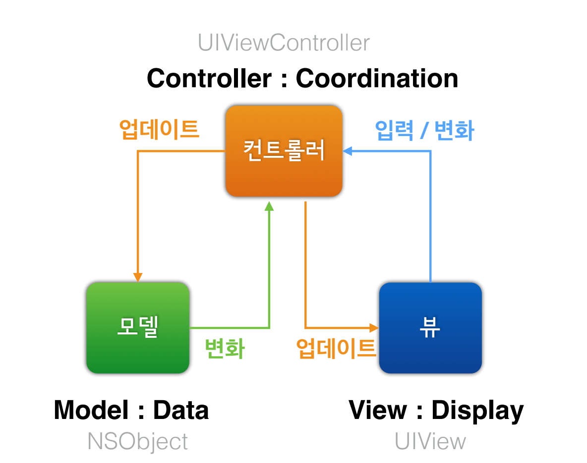
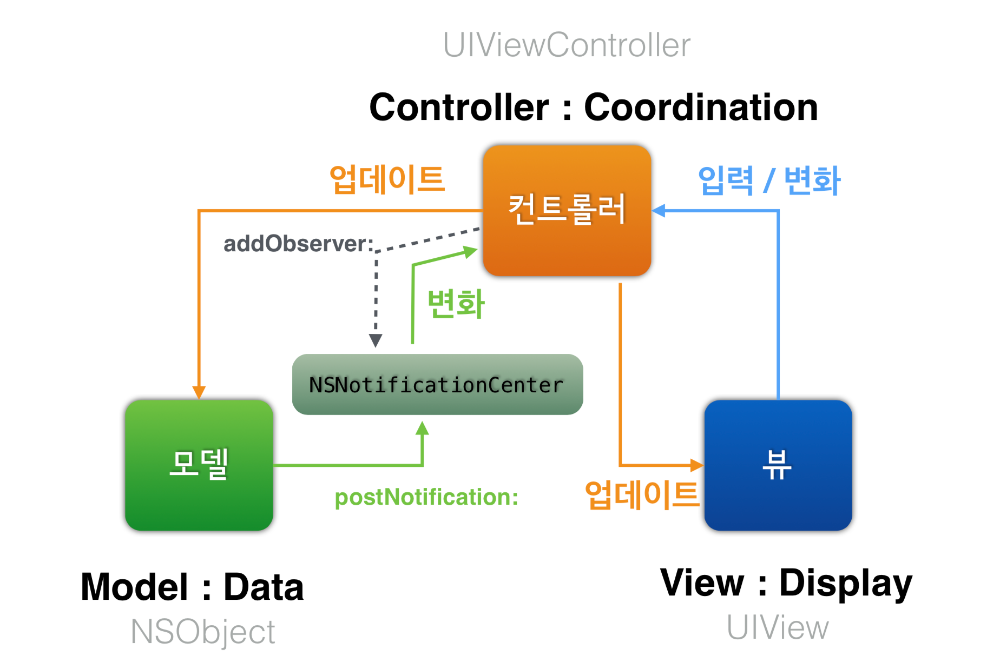
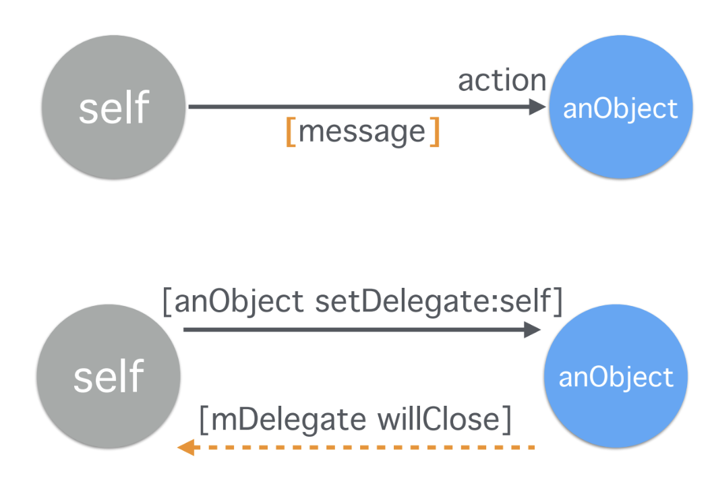
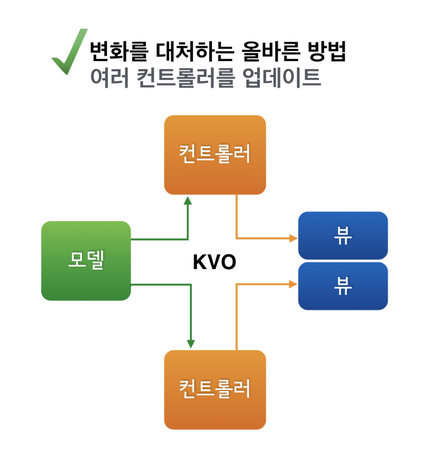

= Model-View-Controller

=== iOS를 위한 MVC

===== Target-Action
* _버튼이 눌리면 (타겟의) 이 메서드를 호출해 줘_
* `func addTarget(_ target: Any?, action: Selector, for controlEvents: UIControlEvents)`

===== Notification
* Observer Pattern

===== Delegation
* 사용자가 Return 키를 누르면 _UITextField가 UITextFieldDelegate에게 끝내도 되는건지 질문하고 UITextFieldDelegate가 답변을 줌_
* 여러 클래스가 Delegation을 가지고 있음 
** _will, did, should_

=== MVC 역할

===== Model
* 데이터
* 알고리즘
* 네트워킹
* DataSource, Storage, Proxy 등

===== View 
* 디스플레이
* 이벤트 캡쳐
* 비주얼 표현
* View-controll, Widget 등

===== Controller
* Composition
* Delegation
* 사용자 이벤트에 따라 전송되는 Action Message에 응답
* 특이한 작업 => 객체 간의 연결을 잇거나 기타 설정 작업을 수행
* 소유한 객체의 생명 주기 관리

===== MVC 구현할 때 Tips

===== Model 클래스 구현할 때, 다음 내용 고려해야 함
* 인스턴스 변수
* 접근자와 프로퍼티
* Key-Value 코딩 
* 초기화 및 할당 해제
* 객체 인코딩 => 모델 클래스 객체를 저장할 때, 해당 객체의 인스턴스 변수를 인코딩, 디코딩이 되어야 함
* 객체 복제 => 클라이언트가 모델 객체를 복제할 것이 예상되면 클래스에서 객체 복제를 구현해야 함

===== 프레임워크와 싸우지 마라 => 프레임워크의 존재 이유를 생각해라!
* UIViewController의 View는 제거하면 안됨
* 나눠진 View가 필요하면 UISplitViewController
* 빈약한 UIKit 서브클래스를 만들지 말 것 => Delegation이나 Notification을 사용함 

===== Loose Coupling 지향
* 데이터 모델 이해하기
* Controller 일을 분리하자
* 유연성이 중요. 의존성을 줄여야 함
** 메세지 보낼 때 Controller로 메세지를 조정할 수 있음
** 한 개 Object가 너무 많은 일을 하지 않도록 해야 함
** View 에서 모델 데이터를 선언하면 안됨. 중복 데이터는 피해야 함
* 메세지 관리
** 모델끼리 직접적인 양방향 데이터 전송을 하면 안됨
** Controller를 건너뛰면 안됨

=== 참고
* https://developer.apple.com/library/archive/documentation/General/Conceptual/DevPedia-CocoaCore/MVC.html[Cocoa Core Competencies - MVC]
* https://developer.apple.com/library/archive/documentation/General/Conceptual/CocoaEncyclopedia/Model-View-Controller/Model-View-Controller.html[Concepts in Objective-C Programming]
* https://www.edwith.org/boostcourse-ios/lecture/16877/[부스트코스: Model-View-Controller]
