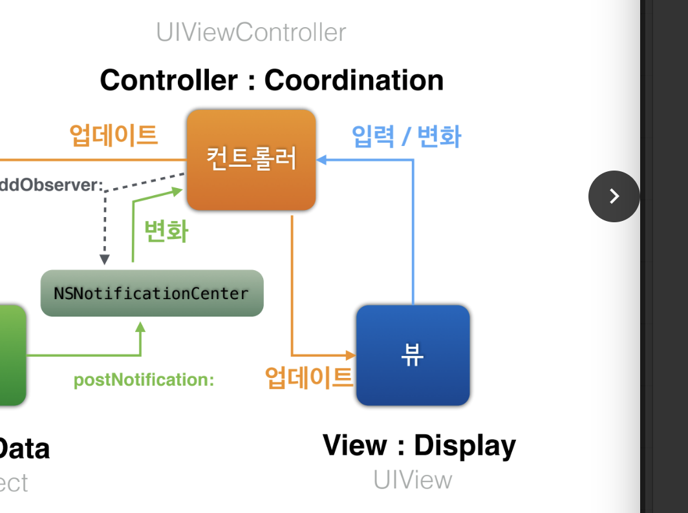

= Model-View-Controller

* The Model-View-Controller (MVC) design pattern assigns objects in an application one of three roles: model, view, or controller. The pattern defines not only the roles objects play in the application, it defines the way objects communicate with each other. Each of the three types of objects is separated from the others by abstract boundaries and communicates with objects of the other types across those boundaries. The collection of objects of a certain MVC type in an application is sometimes referred to as a layer—for example, model layer.
* MVC is central to a good design for a Cocoa application. The benefits of adopting this pattern are numerous. Many objects in these applications tend to be more reusable, and their interfaces tend to be better defined. Applications having an MVC design are also more easily extensible than other applications. Moreover, many Cocoa technologies and architectures are based on MVC and require that your custom objects play one of the MVC roles.

image:./image/model_view_controller.png[]

===== Model Objects
* Model objects encapsulate the data specific to an application and define the logic and computation that manipulate and process that data. For example, a model object might represent a character in a game or a contact in an address book. A model object can have to-one and to-many relationships with other model objects, and so sometimes the model layer of an application effectively is one or more object graphs. Much of the data that is part of the persistent state of the application (whether that persistent state is stored in files or databases) should reside in the model objects after the data is loaded into the application. Because model objects represent knowledge and expertise related to a specific problem domain, they can be reused in similar problem domains. Ideally, a model object should have no explicit connection to the view objects that present its data and allow users to edit that data—it should not be concerned with user-interface and presentation issues.\
* Communication: User actions in the view layer that create or modify data are communicated through a controller object and result in the creation or updating of a model object. When a model object changes (for example, new data is received over a network connection), it notifies a controller object, which updates the appropriate view objects.

===== View Objects
* A view object is an object in an application that users can see. A view object knows how to draw itself and can respond to user actions. A major purpose of view objects is to display data from the application’s model objects and to enable the editing of that data. Despite this, view objects are typically decoupled from model objects in an MVC application.
* Because you typically reuse and reconfigure them, view objects provide consistency between applications. Both the UIKit and AppKit frameworks provide collections of view classes, and Interface Builder offers dozens of view objects in its Library.
* Communication: View objects learn about changes in model data through the application’s controller objects and communicate user-initiated changes—for example, text entered in a text field—through controller objects to an application’s model objects.

===== Controller Objects
* A controller object acts as an intermediary between one or more of an application’s view objects and one or more of its model objects. Controller objects are thus a conduit through which view objects learn about changes in model objects and vice versa. Controller objects can also perform setup and coordinating tasks for an application and manage the life cycles of other objects.
* Communication: A controller object interprets user actions made in view objects and communicates new or changed data to the model layer. When model objects change, a controller object communicates that new model data to the view objects so that they can display it.

===== Prerequisite Articles
* https://developer.apple.com/library/content/documentation/General/Conceptual/DevPedia-CocoaCore/Message.html#//apple_ref/doc/uid/TP40008195-CH59-SW1[Message]

===== Related Articles
* https://developer.apple.com/library/content/documentation/General/Conceptual/DevPedia-CocoaCore/ModelObject.html#//apple_ref/doc/uid/TP40008195-CH31-SW1[Model Objects]
* https://developer.apple.com/library/content/documentation/General/Conceptual/DevPedia-CocoaCore/ControllerObject.html#//apple_ref/doc/uid/TP40008195-CH11-SW1[Controller Objects]

=== 요약 

===== iOS를 위한 MVC

image:./image/mvc-1.png[]

* Target-Action
** _버튼이 눌리면 (타겟의) 이 메서드를 호출해 줘_
** `func addTarget(_ target: Any?, action: Selector, for controlEvents: UIControlEvents)`

* Notification
** Observer Pattern

* Delegation
** 사용자가 Return 키를 누르면 _UITextField가 UITextFieldDelegate에게 끝내도 되는건지 질문하고 UITextFieldDelegate가 답변을 줌_
** 여러 클래스가 Delegation을 가지고 있음 
*** _will, did, should_

image:./image/delegation.png[]

===== MVC 역할

* Model
** 데이터
** 알고리즘
** 네트워킹
** DataSource, Storage, Proxy 등

* View 
** 디스플레이
** 이벤트 캡쳐
** 비주얼 표현
** View-controll, Widget 등

* Controller
** Composition
** Delegation
** 특이한 작업

===== Tip
* 프레임워크와 싸우지 마라 => 프레임워크의 존재 이유를 생각해라!
** UIViewController의 View는 제거하면 안됨
** 나눠진 View가 필요하면 UISplitViewController
** 빈약한 UIKit 서브클래스를 만들지 말 것 => Delegation이나 Notification을 사용함 
* 데이터 모델 이해하기
* Controller 일을 분리하자
* Loose Coupling 지향
** 유연성이 중요. 의존성을 줄여야 함
*** 메세지 보낼 때 Controller로 메세지를 조정할 수 있음
*** 한 개 Object가 너무 많은 일을 하지 않도록 해야 함
*** View 에서 모델 데이터를 선언하면 안됨. 중복 데이터는 피해야 함
** 메세지 관리
*** 모델끼리 직접적인 양방향 데이터 전송을 하면 안됨
*** Controller를 건너뛰면 안됨

image:./image/mvc-2.png[]