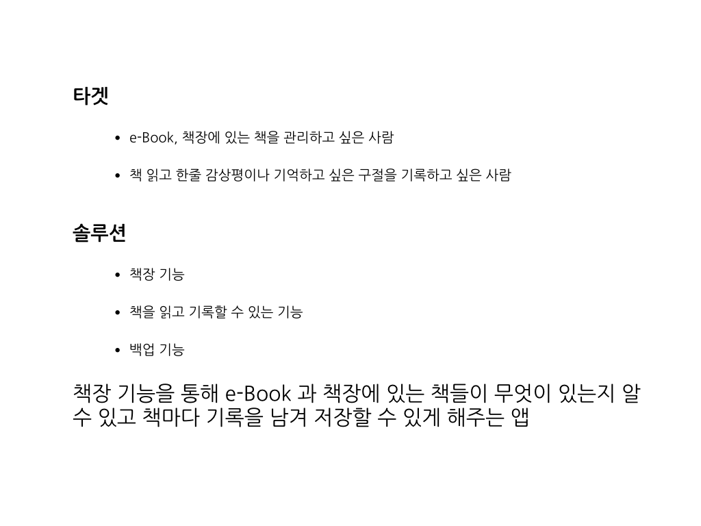
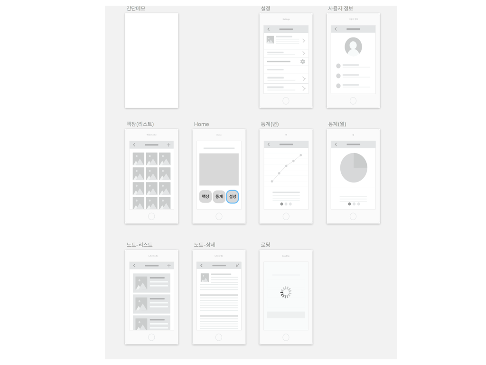
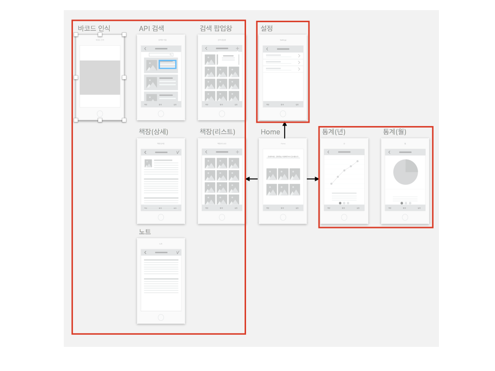
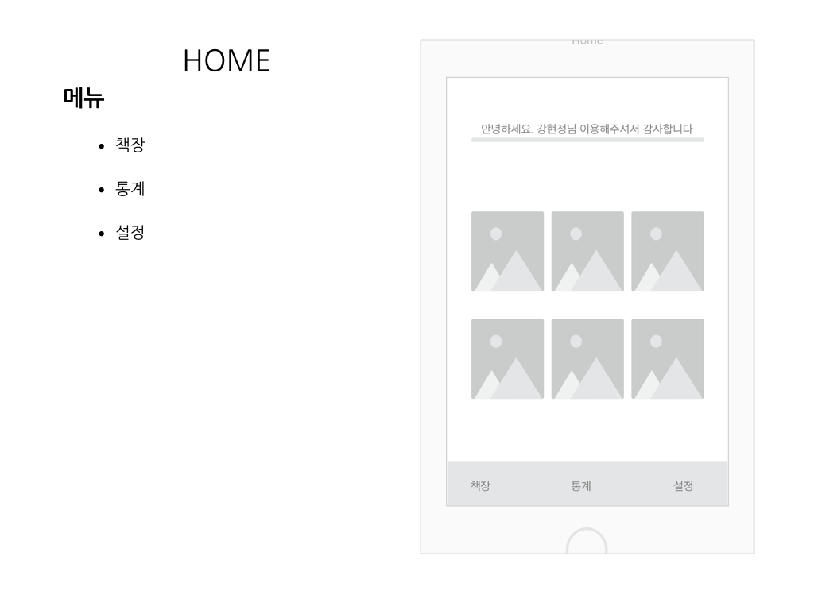
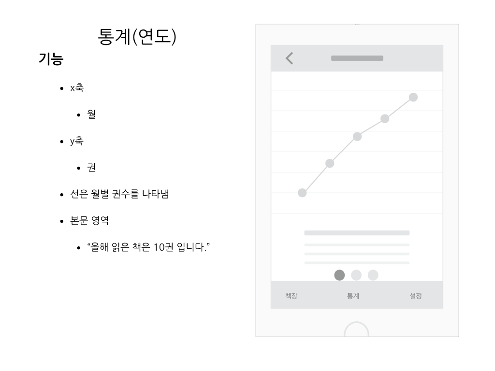
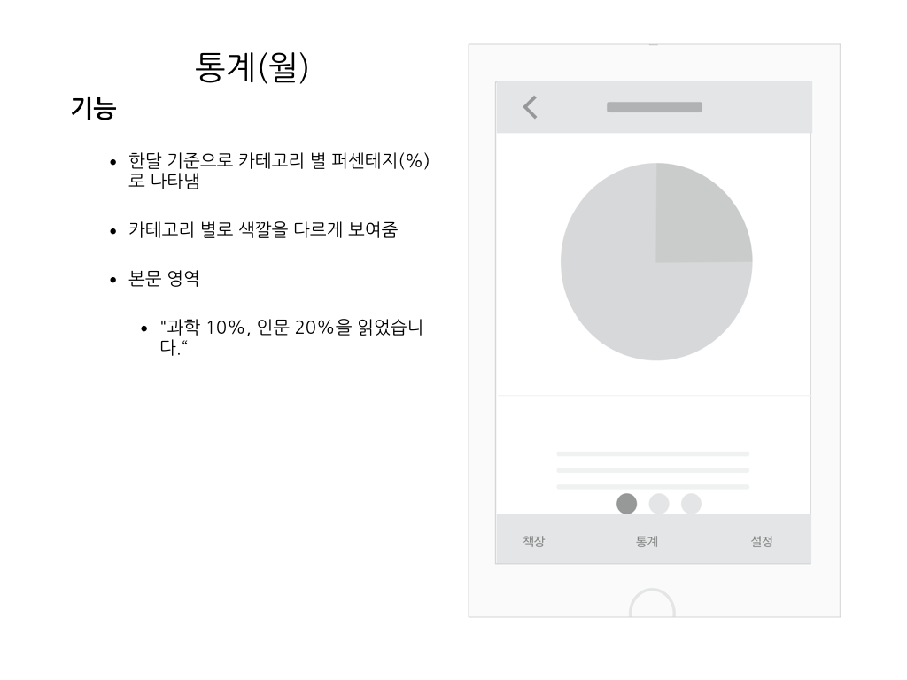
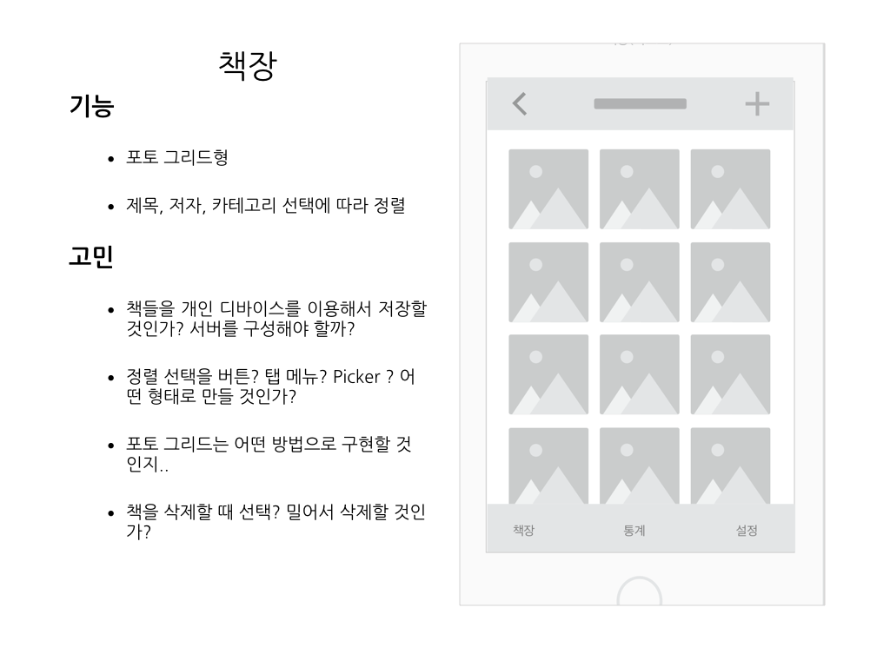
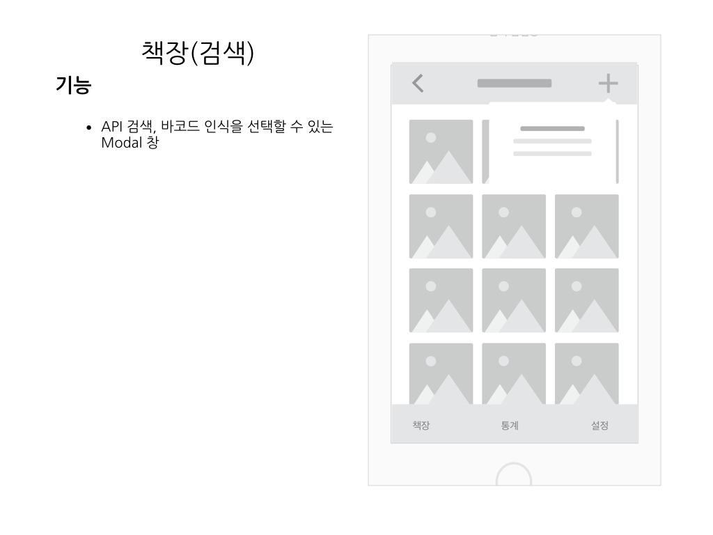
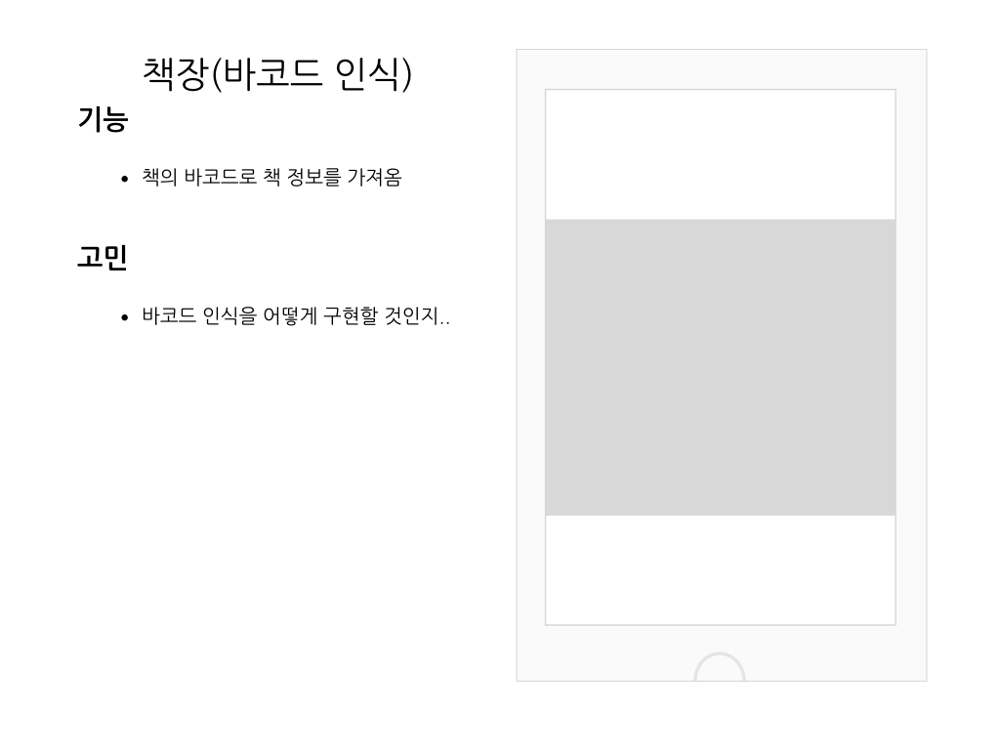
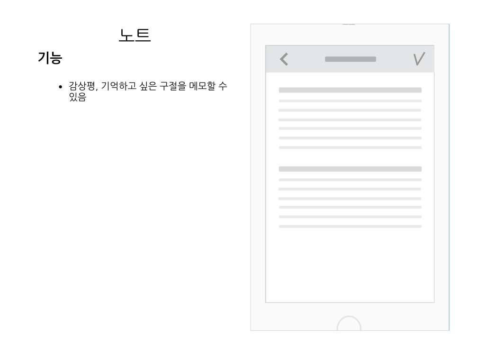

= 나의 앱: 첫 번째 기획

=== 첫 번째 Wireframe

=== 두 번째 Wireframe

=== 첫 번째 기획문서

image:./image/v1/1.007.png[45%, 45%]

image:./image/v1/1.010.png[45%, 45%]

image:./image/v1/1.012.png[45%, 45%]

=== 피드백

===== 사용성
* 동등한 수준의 화면이면 탭바로, 앞뒤로 더 세부적인 화면이면 내비게이션으로
* 메인 화면이 그 앱의 핵심 기능이어야 함
* 3화면 이상 들어가면 사용자들은 어려워 함
* 버튼 위치도 애플 앱이나 유명한 앱들처럼 익숙한 위치에 하는게 좋음

===== 기술
* 아이클라우드 백업은 앱내 Document 디렉토리는 백업 대상임. 거기에 파일을 만들면 자동 백업
* iCloud KeyValue 혹은 iCloud Document 기술도 사용함
* 백엔드가 필요한 경우는 내정보/혹은 다른사람 데이터를 서로 봐야하는가? 
* 서버가 없어도 iCloudKit 이나 firebase 같은 BaaS도 고려해볼 것
* 오픈 API 한계는 무엇인가? 얼마나 자주 보낼수 있나. 뭐가 되고 뭐가 안되는가..

===== 기타 
* 산책: 쳬계적 도서 관리 (제작사 별책) 
* 밀리의 서재 
* 교보문고 - 인식기가 가장 좋은 평가를 받음

===== 참고 예제
* https://itunes.apple.com/kr/app/%EC%A0%9C%EC%A3%BC%EB%8F%84%EA%B0%90/id1199806926?l=en&mt=8[제주도감 앱스토어]
* https://www.dropbox.com/s/auqmaiddy4l91kn/%EC%A0%9C%EC%A3%BC%EB%8F%84%EA%B0%90_%EA%B8%B0%ED%9A%8D%EC%84%9C.pdf?dl=0[기획서]
* https://www.dropbox.com/s/uum0wi62007nl0g/%EC%A0%9C%EC%A3%BC%EB%8F%84%EA%B0%90-%EC%8A%A4%ED%86%A0%EB%A6%AC%EB%B3%B4%EB%93%9C%201.0.pdf?dl=0[스토리보드]
* https://docs.google.com/spreadsheets/d/14sjp4gbyI7StNEYx4_8aYS-rWtv1YdOdw21loMVg_x0/edit#gid=0[개발일정표]

=== 피드백을 받고 고쳐야 할 부분

===== 사용성
* 각 화면에 대해 참고 앱을 보고 사용성에 대해 구체화 시킬 필요가 있음

===== 기술
* 시간이 날 때마다 필요한 기술에 대해 샘플 코드를 작성하고 익히는 과정이 필요함

===== 디자인
* 아직까지 화면에 대한 상세기획은 나오지 않았지만 외주를 맡길 것인가? 내가 만들 것인가? 에 대해 장, 단점을 생각해볼 필요가 있음