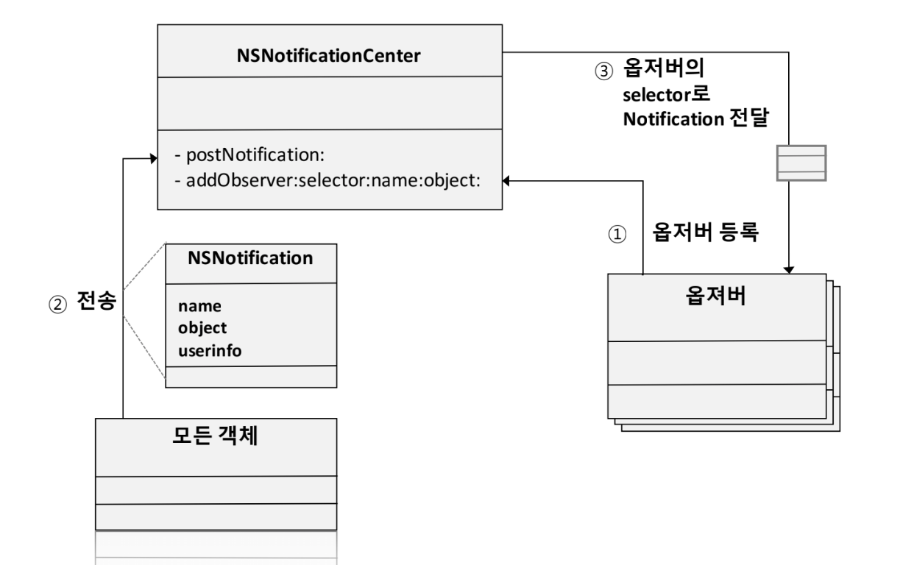
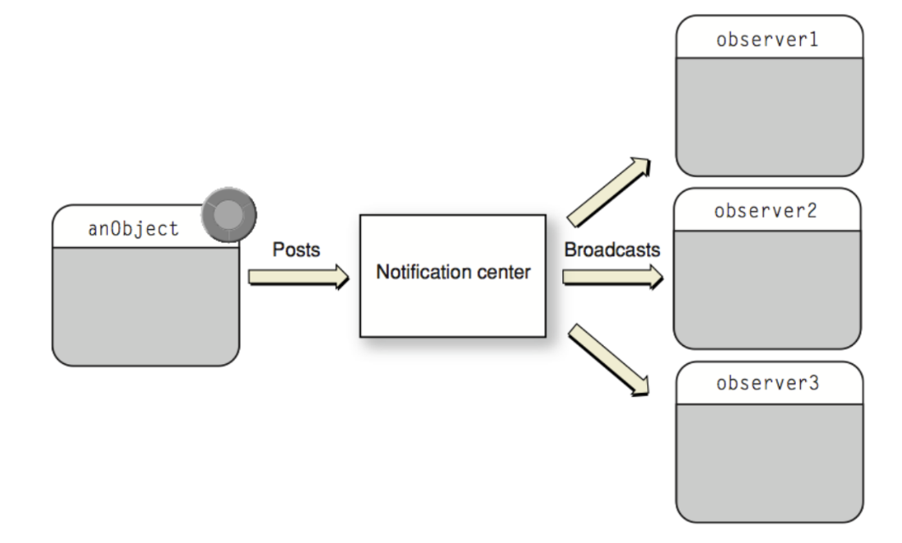

= NotificationCenter

===== 구성

image:./images/notification-1.png[]

===== 구현

[source, swift]
----
class ViewController: UIViewController {
    // ...

    override func viewDidLoad() {
        super.viewDidLoad()

        setup()
        // ...
    }
    
    fileprivate func setup() {
        NotificationCenter.default.addObserver(self, selector: #selector(refreshTableView(notification:)), name: Notification.Name.storeList, object: nil)
    }

    // ...

    @objc fileprivate func refreshTableView(notification: Notification) {
        guard let userInfo = notification.userInfo,
        let list = userInfo[Constants.list] as? [StoreItems] else { return }

        self.storeDataManager = StoreDataManager(list: list)    
    }

    deinit {
        NotificationCenter.default.removeObserver(self)
    }
}

class StoreDataManager {
    private var list: [StoreItems] = [] {
        didSet {
            NotificationCenter.default.post(name: .storeList, object: nil, userInfo: [Constants.list: list])
        }
    }

    // ...
}
----

===== @objc?
* Swift API에서 Objective-C가 필요할 때가 있음. @objc를 사용하면 클래스, 프로퍼티, 메서드, 열거형을 Objective-C 코드로 사용할 수 있음
* `Using Swift with Cocoa and Objective-C > Configuring Swift Interfaces in Objective-C 링크 참고`

===== Objective-C에서 dealloc 에서 removeObserver 를 사용하는데, Swift는 어디에서 사용하는가 ?
* _deinit_ 
* `iOS8: Where To Remove Observer for NSNotification in Swift 링크 참고`

===== 참고
* https://developer.apple.com/documentation/foundation/notification[Notification]
* https://developer.apple.com/documentation/foundation/notificationcenter[NotificationCenter]
* https://developer.apple.com/documentation/foundation/notificationqueue[NotificationQueue]
* https://developer.apple.com/library/content/documentation/Cocoa/Conceptual/Notifications/Introduction/introNotifications.html#//apple_ref/doc/uid/10000043i?language=objc[Notification Programming Topics]
* https://www.natashatherobot.com/ios8-where-to-remove-observer-for-nsnotification-in-swift/[iOS8: Where To Remove Observer for NSNotification in Swift]
* https://developer.apple.com/library/content/documentation/Swift/Conceptual/BuildingCocoaApps/InteractingWithObjective-CAPIs.html[Using Swift with Cocoa and Objective-C > Configuring Swift Interfaces in Objective-C]