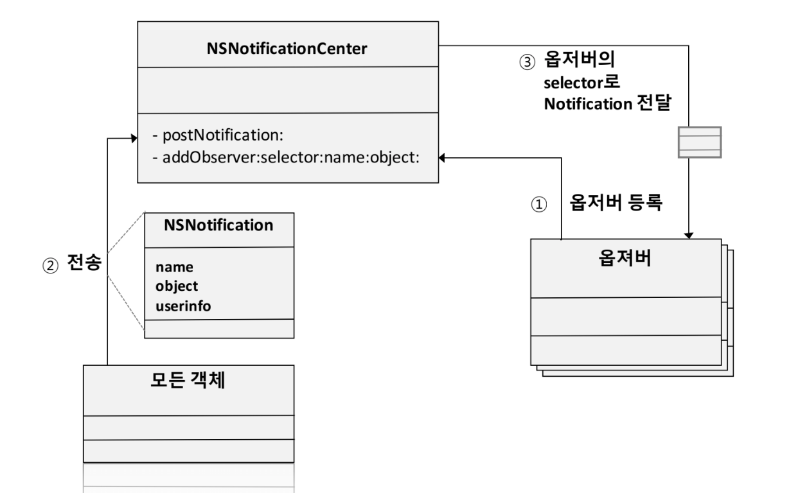
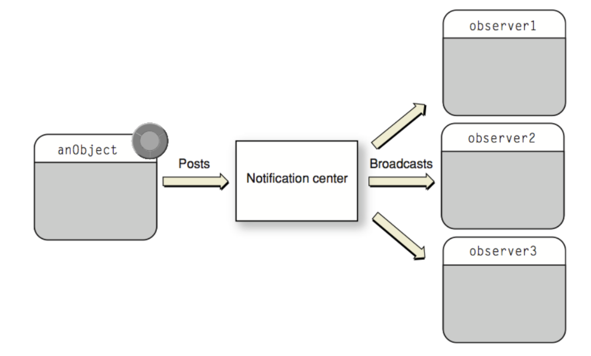

= NSNotificationCenter

=== NSNotificationCenter

===== 구성

image:./image/nsnotification.png[]

=== Adding and Removing Notification Observers

===== addObserver
* `func addObserver(_ observer: Any, selector aSelector: Selector, name aName: NSNotification.Name?, object anObject: Any?)`
* `func addObserver(forName name: NSNotification.Name?, object obj: Any?, queue: OperationQueue?, using block: @escaping (Notification) -> Void) -> NSObjectProtocol`
* `NSNotificationCenter 링크 참고`

===== @objc?
* Swift API에서 Objective-C가 필요할 때가 있음. @objc를 사용하면 클래스, 프로퍼티, 메서드, 열거형을 Objective-C 코드로 사용할 수 있음
* `Using Swift with Cocoa and Objective-C > Configuring Swift Interfaces in Objective-C 링크 참고`

===== removeObserver
* `func removeObserver(_ observer: Any)`
* `func removeObserver(_ observer: Any, name aName: NSNotification.Name?, object anObject: Any?)`
* `NSNotificationCenter 링크 참고` 

===== Objective-C에서 dealloc 에서 removeObserver 를 사용하는데, Swift는 어디에서 사용하는가 ?
* _deinit_ 
* `iOS8: Where To Remove Observer for NSNotification in Swift 링크 참고`

=== 참고
* https://developer.apple.com/documentation/foundation/nsnotification?language=objc[NSNotification]
* https://developer.apple.com/documentation/foundation/nsnotificationcenter[NSNotificationCenter]
* https://developer.apple.com/documentation/foundation/nsnotificationqueue?language=objc[NSNotificationQueue]
* https://developer.apple.com/library/content/documentation/Cocoa/Conceptual/Notifications/Introduction/introNotifications.html#//apple_ref/doc/uid/10000043i?language=objc[Notification Programming Topics]
* https://www.natashatherobot.com/ios8-where-to-remove-observer-for-nsnotification-in-swift/[iOS8: Where To Remove Observer for NSNotification in Swift]
* https://developer.apple.com/library/content/documentation/Swift/Conceptual/BuildingCocoaApps/InteractingWithObjective-CAPIs.html[Using Swift with Cocoa and Objective-C > Configuring Swift Interfaces in Objective-C]