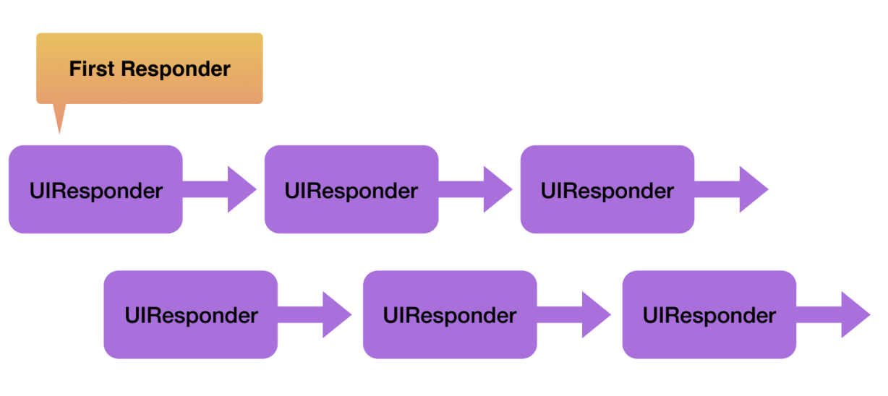
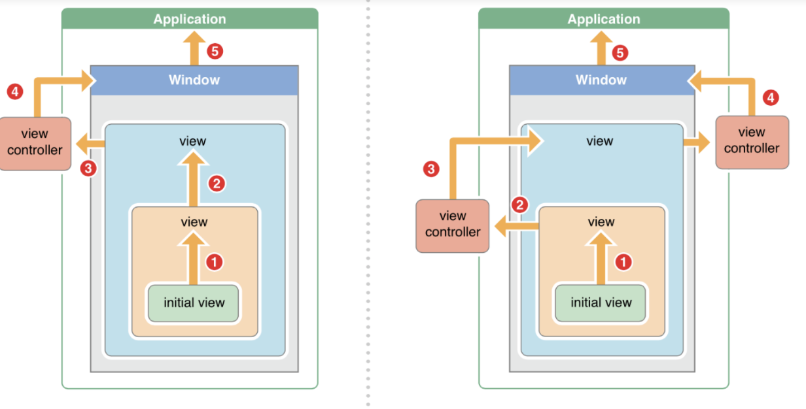

= Responder Chain

===== 설명
* UIResponder 상속받는 하위 클래스는 체인 형태를 만들 수 있음
* 이벤트가 처리할 때 특정 View 객체가 처리하지 않도록 해야 됨
* Responder Chain을 통해 이벤트 지정한 순서대로 이동함 => View Controller가 받을 수 있음. View에 따라서 좌표값이 다를 수 있음
* View Controller에서 처리하지 않으면 Window => Application으로 날아감(App Delegate)

===== 구현

[source, swift]
----
protocol CanFindTopView {
    func handleCertainView(from view: UIView, execute: (GameView) -> Void)
}

extension CanFindTopView {
    func handleCertainView(from view: UIView, execute: (TopView) -> Void) {
        var nextResponder = view.next
        while nextResponder != nil {
            if let view = nextResponder as? TopView {
                execute(view)
            }
            nextResponder = nextResponder?.next
        }
    }
}
----

===== 참고
* https://developer.apple.com/documentation/uikit/touches_presses_and_gestures/understanding_event_handling_responders_and_the_responder_chain[Understanding Event Handling, Responders, and the Responder Chain]
* https://medium.com/@audrl1010/event-handling-guide-for-ios-68a1e62c15ff[Event Handling Guide for iOS 번역]
