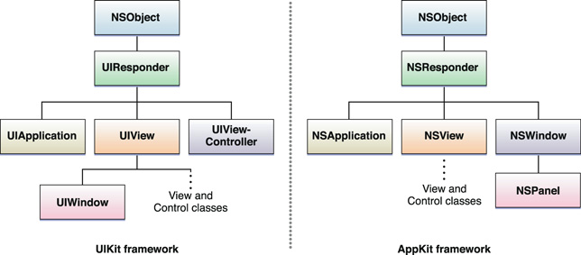
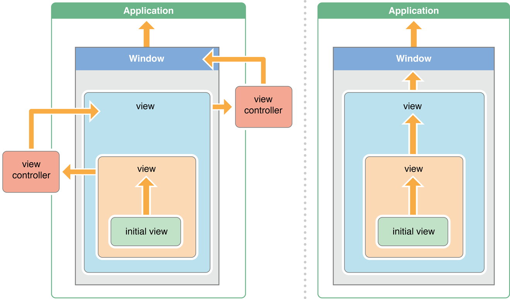

= Responder Obejct

* A responder is an object that can respond to events and handle them. All responder objects are instances of classes that ultimately inherit from UIResponder (iOS) or NSResponder (OS X). These classes declare a programmatic interface for event handling and define a default behavior for responders. The visible objects of an app are almost always responders—for example, windows, views, and controls—and the app object is a responder as well. In iOS, view controllers (UIViewController objects) are also responder objects.
* To receive events, a responder must implement the appropriate event-handling methods and, in some cases, tell the app that it can become the first responder.

===== The First Responder Receives Some Events First
* In an app, the responder object that first receives many kinds of events is known as the first responder. It receives key events, motion events, and action messages, among others. (Mouse events and multitouch events first go to the view that is under the mouse pointer or finger; that view might or might not be the first responder.) The first responder is typically the view in a window that an app deems best suited for handling an event. To receive an event, the responder must also indicate its willingness to become first responder; it does this in different ways for each platform
* In addition to receiving event messages, a responder can receive action messages that have no target specified. (Action messages are sent by controls such as buttons and controls when users manipulate them.)

----
// OS X
- (BOOL)acceptsFirstResponder { return YES; }
 
//iOS
- (BOOL)canBecomeFirstResponder { return YES; }
----

===== The Responder Chain Enables Cooperative Event Handling
* If the first responder cannot handle an event or action message, it forwards it to the “next responder” in a linked series called the responder chain. The responder chain allows responder objects to transfer responsibility for handling an event or action message to other objects in the app. If an object in the responder chain cannot handle the event or action, it passes the message to the next responder in the chain. The message travels up the chain, toward higher-level objects, until it is handled. If it isn't handled, the app discards it.

* _The path of an event._ The general path of an event up the responder chain starts with a view—the first responder or the view under the mouse pointer or finger. From there, it proceeds up the view hierarchy to the window object and then to the global app object. However, the responder chain for events in iOS adds a variation to this path: If a view is managed by a view controller and if the view cannot handle an event, the view controller becomes the next responder.

* _The path of an action message._ For action messages, both OS X and iOS extend the responder chain to other objects. In OS X, the responder chain for action messages differs for an app based on the document architecture, an app that uses window controllers (NSWindowController), and an app that fits neither of those categories. Additionally, if an app on OS X has both a key window and a main window, the responder chain along which an action message travels might involve the view hierarchies of both windows.
