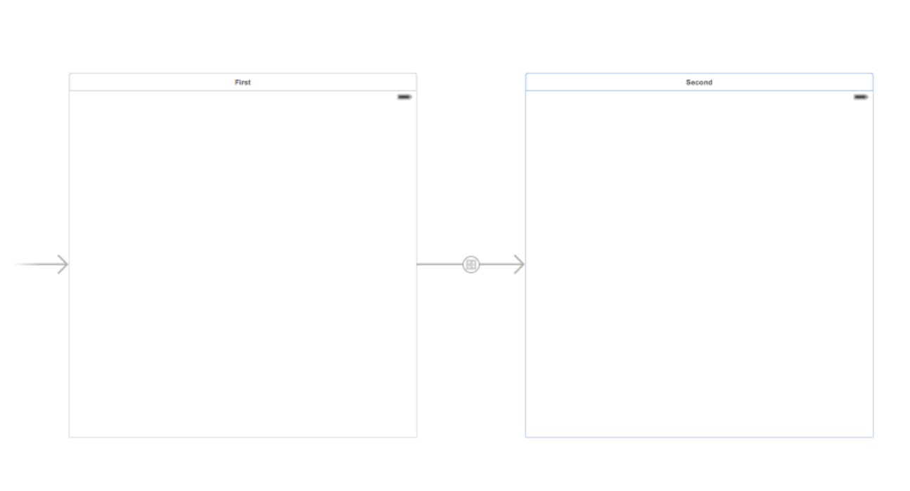

= Storyboard, Scene, Segue 개념

=== Storyboard

===== 원문
* A storyboard is a visual representation of the user interface of an iOS application, showing screens of content and the connections between those screens. A storyboard is composed of a sequence of scenes, each of which represents a view controller and its views; scenes are connected by segue objects, which represent a transition between two view controllers.
* Xcode provides a visual editor for storyboards, where you can lay out and design the user interface of your application by adding views such as buttons, table views, and text views onto scenes. In addition, a storyboard enables you to connect a view to its controller object, and to manage the transfer of data between view controllers. Using storyboards is the recommended way to design the user interface of your application because they enable you to visualize the appearance and flow of your user interface on one canvas.

===== 요약
* iOS 앱 UI를 시각적으로 보여줌
* 스토리보드는 Scene의 순서로 구성되어 있으며 각 Scene은 View, View Controller로 표현함
* 여러 Scene은 Segue로 연결되어 있고 Segue은 View Controller 간의 전환을 나타냄

=== Scene
* App UI를 만듬
* StoryBoard 안에 여러 개 Scene으로 구성되어 있음
* 두 개의 Scene 연결 관계를 담당하는 Segue가 있음

===== A Scene Corresponds to a Single View Controller and Its Views
* On iPhone, each scene corresponds to a full screen’s worth of content; on iPad, multiple scenes can appear on screen at once—for example, using popover view controllers. Each scene has a dock, which displays icons representing the top-level objects of the scene. The dock is used primarily to make action and outlet connections between the view controller and its views.
* As with all objects loaded from a story board, to finish initializing a view controller loaded from a storyboard you override awakeFromNib.

===== 요약 
* 화면(Screen)
* iPhone의 Scene은 전체 화면의 콘텐츠를 해당함
* iPad에서 한 화면에 여러 Scene을 표현할 수 있음(예를 들어 팝업보기)
* Scene은 Dock이 하나있음. 이 Dock은 View와 View Controller 사이에서 Outlet과 Action 연결하는데 사용함
* Storyboard에서 View Controller 초기화 작업을 완료하려면 awakeFromNib를 오버라이드 해야 함

=== Segue

===== A Segue Manages the Transition Between Two Scenes
* You can set the type of transition (for example, modal or push) on a segue. Additionally, you can subclass a segue object to implement a custom transition.
* You can pass data between scenes with the method prepareForSegue:sender:, which is invoked on the view controller when a segue is triggered. This method allows you to customize the setup of the next view controller before it appears on the screen. Transitions usually occur as the result of some event, such as a button being tapped, but you can programmatically force a transition by calling performSegueWithIdentifier:sender: on the view controller.

==== 요약
* Segue에서 Segue Action을 선택할 수 있음
* Segue를 커스텀할 수 있음
* View Controller에 있는 _prepareForSegue:sender:_ 메서드를 통해 Scene 간에 데이터를 전달할 수 있음
* 이 방법을 사용하면 Scene이 표시되기 전에 다음 호출되는 View Controller의 설정을 정의할 수 있음. _performSegueWithIdentifier:sender:_ 를 이용해 코드로 작성할 수 있음

===== Segue Action
* Show(Push)
** A navigation controller pushes the new view controller onto its navigation stack.
** `showViewController:sender:`
* Show Detail(Replace)
** Only using a iPad (Master-Detai)
** This segue is relevant only for view controllers embedded inside a UISplitViewController object. With this segue, a split view controller replaces its second child view controller (the detail controller) with the new content.
** `showDetailViewController:sender:`
* Present Modally
** This segue displays the view controller modally using the specified presentation and transition styles.
** The navigation stack has no effect.
* Present as Popover
** Show simple pop-up on iPhone
** In a horizontally regular environment, the view controller appears in a popover.

=== 참고 
* http://rshankar.com/storyboard-scene-and-segue/[Storyboard, Scene and Segue]