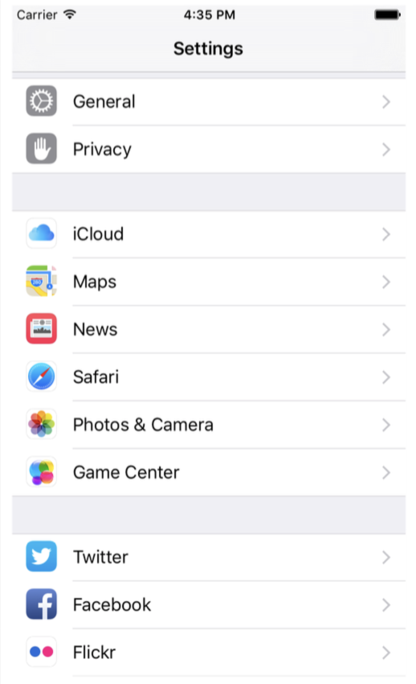
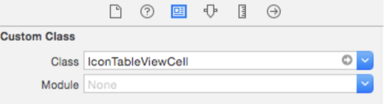
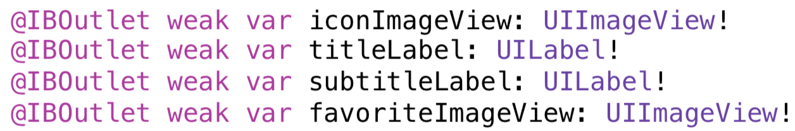
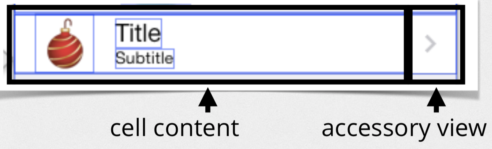
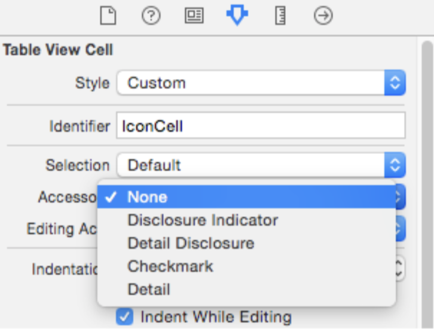

= UITableView, UITableViewController

===== iOS에서 TableView를 사용한 앱
* Itunes => Video
* 시스템 설정 
* 메일 박스 

image:./image/tableview-2.png[45%, 45%]

===== UITableViewDataSource
* TableView Data
* Table Section 개수
* Section 하나마다 가지고 있는 줄 개수
* 한 Row가 가지고 있는 Cell 정보

===== UITableViewDelegate
* TableView 관련 이벤트, 커스텀
* 어떤 Row를 선택할 때 발생하는 이벤트 
* 재정렬
* Table Header, Footer 커스텀 구현 지원

===== Index Path
* Index Path를 통해 Section, Row를 알 수 있음
* `NSIndexPath, IndexPath 링크 참고`

===== Multiple Sections
* `numberOfSectionsInTableView(_:)`
* `tableView(_:titleForHeaderInSection:):`

===== Deleting Rows
* Delete 버튼을 이용하여 Row 삭제
** `tableView(_:commitEditingStyle:forRow
 AtIndexPath:)`
** Model 객체를 삭제함
** 삭제한 정보를 Table View에 반영함

* Navigation Bar에 있는 Edit 버튼을 이용하여 줄 삭제
** `editButtonItem()`

===== Inserting Rows
* _Add New Row_ TableView에서 보여주기
** `tableView(_:numberOfRowsInSection:)` 
** `tableView(_:cellForRowAtIndexPath:)`
** `setEditing(_:animated:)`
** `tableView(_:commitEditingStyle:forRowAtIndexPath:)`
* 줄 추가 이벤트 다루기
** `tableView(_:commitEditingStyle:forRowAtIndexPath:)`
** `tableView(_:didSelectRowAtIndexPath:):`

===== Moving Rows
* `tableView(_:canMoveRowAtIndexPath:)`
* `tableView(_:moveRowAtIndexPath:toIndexPath:)`

===== Custom Cells
* _Attribute Inspector > Table View Cell > Style => Custom 선택, Identifier 설정_
* Subview Tag로 접근하면 안됨 => Runtime 에러 발생

[source, swift]
----
let label = cell.viewWithTag(1) as! UILabel
label.text = icon.title`
----

* Custom Cell 정의
** Subclass 만듦
** Custom class 정의함
** IconTableViewCell Outlet 연결함

* Custom Cell 높이 
[source, swift]
----
// 직접 설정
tableView.rowHeight = 44.0

// Delegate 이용하여 설정
func tableView(tableView: UITableView, heightForRowAtIndexPath indexPath: NSIndexPath) -> CGFloat {
    return 40 
}

// Auto Layout 이용하여 설정
tableView.rowHeight = UITableViewAutomaticDimension
tableView.estimatedRowHeight = 70.0
----

===== Static Cells
* View Controller에서 Cell이 가지고 있는 Outlet을 직접 연결하면 동작하지 않음

[source, swift]
----
class DetailViewController: UIViewController, UITextFieldDelegate,
      UIImagePickerControllerDelegate, UINavigationController {
    @IBOutlet weak var titleTextField: UITextField!
    @IBOutlet weak var subtitleTextField: UITextField!
    @IBOutlet weak var favoriteSwitch: UISwitch!
    @IBOutlet weak var iconImageView: UIImageView!

    // ...
}
----

===== Accessory View

[source, swift]
----
cell.accessoryType = .DetailDisclosureButton
----

===== Indexing
* 정렬 => _UILocalizedIndexedCollation_

[source, swift]
----
UILocalizedIndexedCollation.currentCollation().sectionTitles
 
let collation = UILocalizedIndexedCollation.currentCollation()
collation.sectionForObject(icon, collationStringSelector:
"title")
----

* Indexing
** Indices => `sectionIndexTitlesForTableView(_:)`
** Sections => `tableView(_:sectionForSection IndexTitle:atIndex:)`
** Index Titles => `UILocalizedIndexedCollation.currentCollation().sectionTitles`
** Index Title을 통해 Section 찾기 => `UILocalizedIndexedCollation.currentCollation().sectionForSectionIndexTitleAtIndex(index)``
 
=== 참고
* https://videos.raywenderlich.com/courses/22-table-views-in-ios/lessons/1[Table Views in iOS]
* https://developer.apple.com/documentation/foundation/nsindexpath[NSIndexPath]
* https://developer.apple.com/documentation/foundation/indexpath[IndexPath]