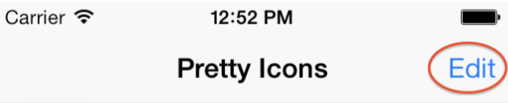
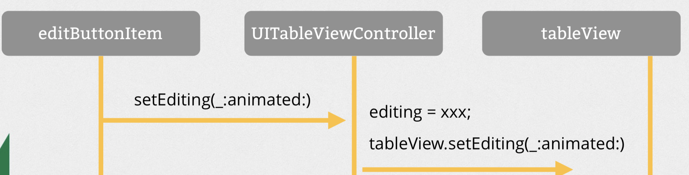
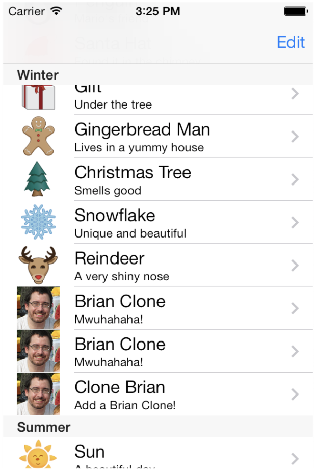
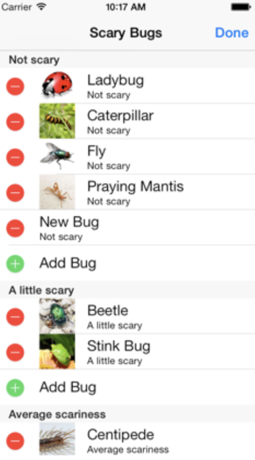

= UITableView, UITableViewController

===== iOS에서 TableView를 사용한 앱
* iTunes에서 Video
* 시스템 설정 
* 메일 박스 

image:./image/tableview-1.png[45%, 45%]
image:./image/tableview-2.png[45%, 45%]

===== UITableViewDataSource
* TableView Data
* Table Section 수
* Section 하나마다 가지고 있는 Row 수
* 한 Row가 가지고 있는 Cell 정보

===== UITableViewDelegate
* TableView 관련 이벤트, 커스텀
* Row를 선택할 때 발생하는 이벤트 
* 여러 Row 재정렬
* Table Header, Footer 커스텀 구현 지원

===== Index Path
* Index Path를 통해 Section, Row를 알 수 있음
* `NSIndexPath, IndexPath 링크 참고`

===== Multiple Sections
* `numberOfSectionsInTableView(_:)`
* `tableView(_:titleForHeaderInSection:):`

===== Row 삭제
* Delete 버튼을 이용하여 줄 삭제
** `tableView(_:commitEditingStyle:forRow
 AtIndexPath:)`
** Model 객체를 삭제함
** 삭제한 정보를 Table View에 반영함

* Navigation Bar에 있는 버튼을 이용하여 줄 삭제
** `editButtonItem()`

image:./image/tableview-4.png[45%, 45%]

===== Row 추가
* _Add New Row_ TableView에서 보여주기
** `tableView(_:numberOfRowsInSection:)` 
** `tableView(_:cellForRowAtIndexPath:)`
** `setEditing(_:animated:)`
** `tableView(_:commitEditingStyle:forRowAtIndexPath:)`
* Row 추가 이벤트 다루기
** `tableView(_:commitEditingStyle:forRowAtIndexPath:)`
** `tableView(_:didSelectRowAtIndexPath:):`

=== 참고
* https://videos.raywenderlich.com/courses/22-table-views-in-ios/lessons/1[Table Views in iOS]
* https://developer.apple.com/documentation/foundation/nsindexpath[NSIndexPath]
* https://developer.apple.com/documentation/foundation/indexpath[IndexPath]