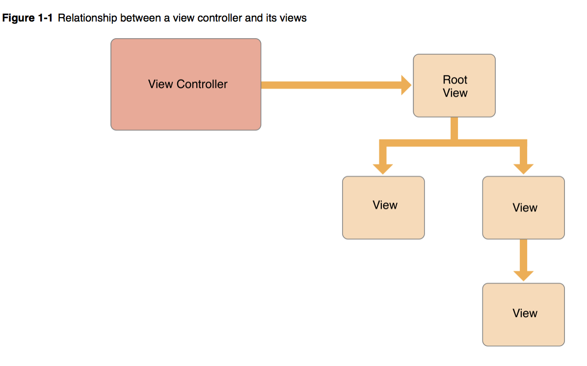
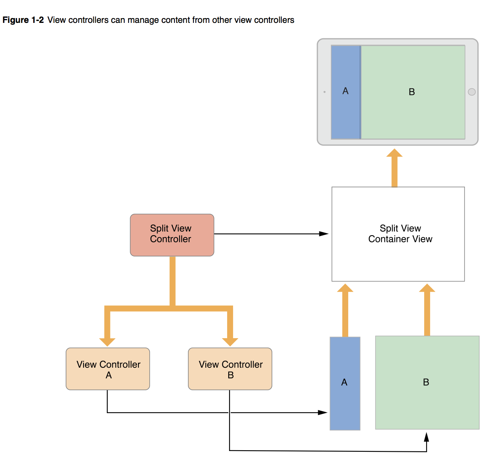
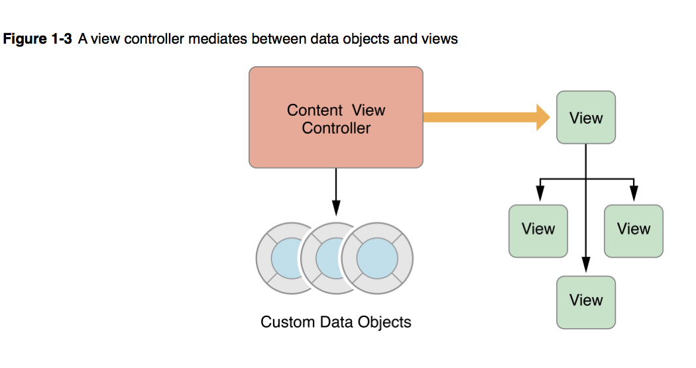
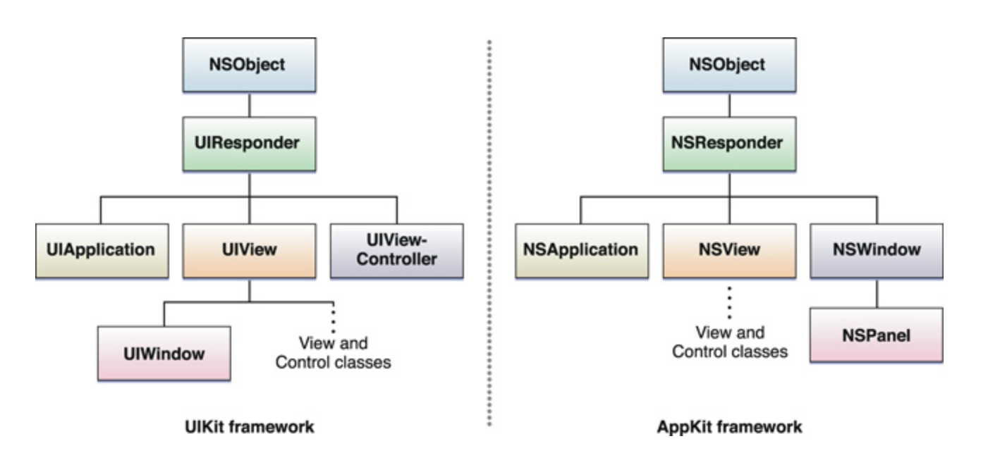
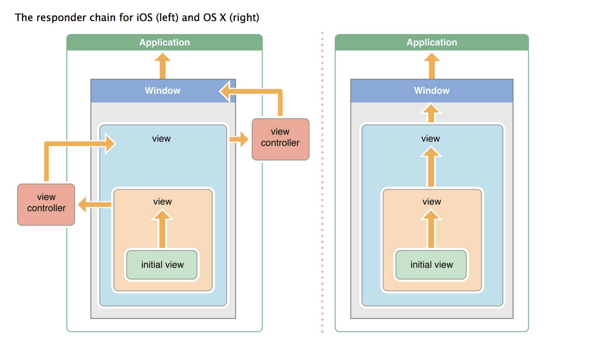
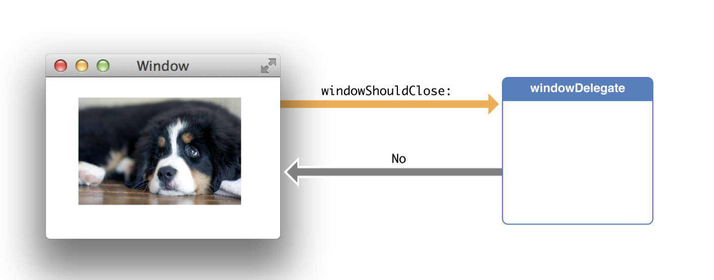
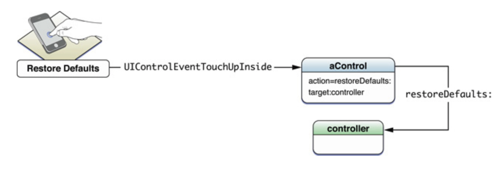
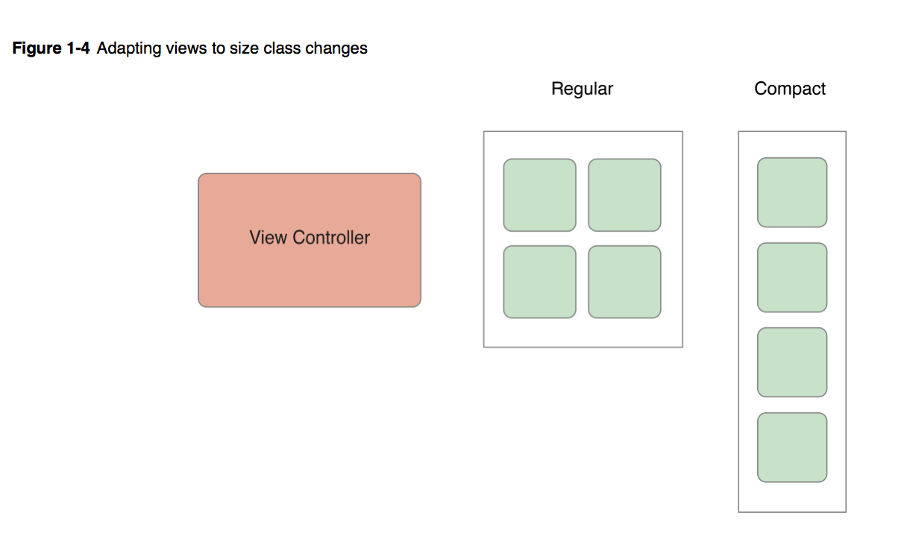

=  The Role of View Controllers

> 이 글은 https://developer.apple.com/library/content/featuredarticles/ViewControllerPGforiPhoneOS/index.html#//apple_ref/doc/uid/TP40007457-CH2-SW1[The Role of View Controllers] 을 
개인 학습의 목적으로 번역하였기 때문에 잘못된 번역이나 의역이 포함되어 있습니다. 잘못된 부분은 메일로 보내주시면 감사하겠습니다 :)

=== View

==== 정의 

> View objects are the main way your application interacts with the user, they have many responsibilities

==== 역할

===== Layout과 Subview 관리 
* View는 Parent View에 관련된 View의 기본 사이즈 동작을 정의함
* Subview 목록을 관리함
* View는 필요에 따라 Subview 크기와 위치를 재조정할 수 있음
* View는 다른 View나 다른 Window에 있는 View의 좌표를 조정할 수 있음

===== Drawing and animation
* View는 내용을 구성함
* View의 몇 가지 프로퍼티는 새로운 값에 대해 동작할 수 있음

> Property => Object modeling is the process of designing the objects or classes through which an object-oriented application examines and manipulates some service

===== Event handling
* Touch 이벤트에 반응할 수 있음
* View는 Responder Chain이랑 관계있음

=== View Controller

==== 정의
* View, Event들을 관리하고 하나의 View Controller에서 다른 View Controller의 전환을 핸들링하는 등 역할을 함
* View Controller는 2가지 타입이 존재함
** Content View Controller
*** 앱 내용을 보여주는 역할을 하는 View Controller. 우리가 가장 일반적으로 생각하는 View Controller를 뜻함
** Container View Controller
*** 다른 View Controller에 대한 정보를 가지고 있음
*** Navigation Controller, TabBar Controller 등이 여기 속함

==== 역할

===== View 관리
* View Controller의 가장 중요한 역할은 View의 계층을 관리하는 역할 
* 모든 View Controller는 Root View를 하나씩 가지고 있음
* *View Controller는 항상 Root View에 대한 강한 참조이며, 각 View도 자신의 SubView들에 대해 강한 참조 관계임*
* Content View Controller 
** 자기 자신의 모든 View를 관리함
* Container View Controlle 
** 자기 자신이 가지고 있는 모든 View, View Controller의 Root View까지 관리함   
** 자신이 포함하고 있는 Content View Controller의 Child View들을 간선하지 않음
** 단지 Container View Controller의 디자인에 따라 Root View들의 사이즈를 조절하고 배치함
* 두 번째 이미지에서 상위에는 Split View Controller 같은 Container View Controller가 있고, 그 안에는 A, B Content View Controller가 있음

===== View와 Data의 중계 역할
* View Controller는 앱의 데이터와 View 사이에서 중계 역할을 함
* _UIViewController의 메서드와 프로퍼티_ 를 사용하여 앱의 시각적인 표현을 관리할 수 있음
* 개발자는 항상 명확하게 View Controller가 해야 할 일과 데이터가 해야 할 일을 구분해야 함
* View Controller는 View로부터 들어오는 값에 대한 유효성 검사, 이 값을 데이터 객체에 알맞게 패키징 하는 역할을 함
* **View Controller에서 실제 데이터에 관한 컨트롤의 관여를 최소화해야 함. View Controller 역할은 데이터 컨트롤 하는 것이 아니라는 말**

* UIDocument 객체를 이용하는 것이 데이터와 View Controller 역할을 분리할 수 있는 방법의 하나임
* Document 객체는 어떻게 데이터를 읽고 쓰는지 알고 있는 객체임. 하위 클래스를 만들 때 원하는 로직과 메서드를 추가할 수 있으며 데이터를 추출하여 View Controller나 앱의 다른 부분으로 보낼 수 있음
* View Controller의 데이터는 Document 객체에 있는 데이터를 복사하여 View에 반영하는 역할만 함
* _실제 데이터는 Document가 가지고 있음_

===== User Interactions
* View Controller는 _Responder 객체_ 이며 _Responder Chain을 따라 내려오는 이벤트를 핸들링_ 할 수 있음

* View Controller가 Event를 직접 핸들링할 일이 거의 없음
* 대신 각 View에서 Touch 이벤트를 받으면 해당 이벤트를 처리하고 그것과 관련된 Delegate와 Target 객체의 메서드에게 결과를 알려줌
* 이때 이 역할을 종종 View Controller가 함
* View Controller의 이벤트는 Delegate에 관련된 메서드나 Action 메서드가 처리함
* ViewControllr에 있는 Action 메서드을 이용하는 방법은 `Handling User Interactions 링크 참고`
* 다른 이벤트는 다루는 방법은 `Event Handling Guide for iOS 링크 참고`

===== 리소스 관리
* View Controller는 View와 View Controller가 생성한 모든 객체의 책임을 가지고 있음
* _UIViewController_ 는 View 관리를 대부분 자동으로 처리함. 예를 들어 UIKit은 더 이상 필요하지 않은 View의 리소스를 해제함
** 사용 가능한 메모리가 적을 때 UIKit에서 더 필요하지 않은 모든 리소스에 대해 해제할 것을 앱에 요청함. 이 작업을 처리하는 방법의 하나는 View Controller에서 _didReceiveMemoryWarning_ 메서드를 호출하는 것
** 더 이상 사용하지 않거나 재사용하기 쉽게 객체 참조를 제거하는 용도로 이 메서드를 사용하면 됨
** 메모리 사용이 너무 많은 앱은 메모리를 확보하기 위해 앱을 종료시킬 때도 있음

===== Adaptivity
* View Controller는 View가 어떻게 보여줘야 할지에 대한 책임을 가지고 있음. 모든 iOS앱은 다양한 환경의 디바이스에서 실행되어야 함
* 다양한 환경의 기기를 위해 각각 다른 View Controller와 계층 구조를 제공하는 것보다 하나의 View Controller로 호환할 수 있게 대응하는 것이 좋음
* View Controller는 미세한 변화나 거친 변화 관계없이 변화에 대응해야 함
* AutoLayout을 사용하면 UIKit은 새로운 크기와 일치하게 View 크기와 위치를 자동으로 조정함
* Adaptivity에 대한 자세한 내용은 `The Adaptive Model 링크 참고`

=== 참고 
* https://developer.apple.com/library/content/documentation/WindowsViews/Conceptual/ViewPG_iPhoneOS/CreatingViews/CreatingViews.html#//apple_ref/doc/uid/TP40009503-CH5-SW1[Views]
* https://developer.apple.com/documentation/uikit/view_controllers[View Controllers] 
* https://developer.apple.com/library/content/featuredarticles/ViewControllerPGforiPhoneOS/index.html#//apple_ref/doc/uid/TP40007457-CH2-SW1[The Role of View Controllers]
* https://developer.apple.com/documentation/uikit/uidocument[UIDocument]
* https://developer.apple.com/library/content/documentation/General/Conceptual/Devpedia-CocoaApp/Responder.html#//apple_ref/doc/uid/TP40009071-CH1[Responder object]
* https://developer.apple.com/library/content/documentation/General/Conceptual/DevPedia-CocoaCore/Delegation.html#//apple_ref/doc/uid/TP40008195-CH14[Delegation]
* https://developer.apple.com/library/content/documentation/General/Conceptual/Devpedia-CocoaApp/TargetAction.html#//apple_ref/doc/uid/TP40009071-CH3[Target-Action]
* https://developer.apple.com/library/content/featuredarticles/ViewControllerPGforiPhoneOS/DefiningYourSubclass.html#//apple_ref/doc/uid/TP40007457-CH7-SW11[Handling User Interactions]
* https://medium.com/@audrl1010/event-handling-guide-for-ios-68a1e62c15ff[Event Handling Guide for iOS 번역본]
* https://developer.apple.com/library/content/featuredarticles/ViewControllerPGforiPhoneOS/TheAdaptiveModel.html#//apple_ref/doc/uid/TP40007457-CH19-SW1[The Adaptive Model]
