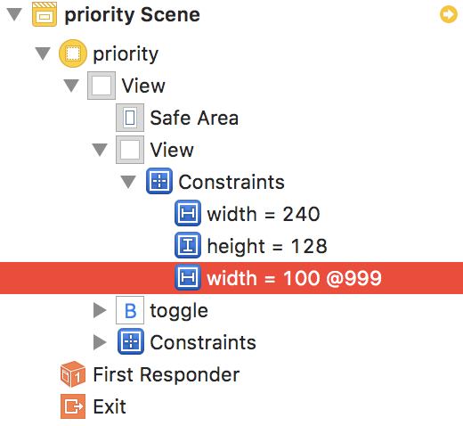

= Tips

===== Runtime Header
* `UIViewController.h, UIStoryboard.h, UIController.h 등` 구글에서 검색함
* Objective-C는 런타임 언어이기 때문에 private으로 선언하더라도 실제로 private으로 동작하지 않음
* Swift에서 꼼수로 사용 가능. 왜냐하면, Key-Value 형태이기 때문임

[source, swift]
----
func testJoinButton_push() {
    // given
    let storybaord = UIStoryboard(name: "Main", bundle: nil)
    let navigationController = storybaord.instantiateInitialViewController() as! UINavigationController
    let viewController = navigationController.topViewController as! LoginViewController
    UIApplication.shared.keyWindow?.rootViewController = navigationController
    _ = viewController.view
    
    let templates = viewController.value(forKey: "storyboardSegueTemplates") as? [AnyObject]
    let template = templates?.first as AnyObject
    
    let targetActions = viewController.joinButton.value(forKey: "_targetActions") as? [AnyObject]
    let buttonTarget = targetActions?.first?.value(forKey: "_target") as AnyObject
    
    XCTAssert(template === buttonTarget)

    // ...
}
----

===== Auto Layout Tips
* Content Hugging, Compression Resistance 안 쓴다는 생각을 버려라!
* translatesAutoresizingMaskIntoConstraints 아니면 Auto Layout
* Visual Format Language 사용함
* 제약을 적용 하기 위해서 두 객체의 x, y 좌표를 알아야 함
* 노락색 Indicator가 보인다면 Update Frames 메뉴를 선택함
* Copyright 같은 문구는 UILabel의 _AutoShrink_ 과 Add New Constraints의 _Constraint to margin 체크 박스, Bottom Margin의 Use Standard Value_ 를 이용하여 어느 기기에도 대응할 수 있음
* 고정된 너비와 높이 값은 피해야 함
* Subview들의 제약 조건을 개발자가 직접 관리하는 것보다 StackView를 이용할 수 있다면 이용하는 것이 좋음
* Multiplier의 비율은 정수로 계산하는 것이 좋음
* Priority가 1000은 필수 제약 조건, 1000보다 작으면 점선으로 표시되며 선택적 제약 조건

[source, swift]
----
/* 
    * 'NSInternalInconsistencyException', reason: 'Mutating a priority from required to not on an installed constraint (or vice-versa) is not supported.  You passed priority 1000 and the existing priority was 800.'
*/

// 아래 코드로 UI Crash가 발생함
@IBAction func togglePriority(_ sender: Any) {
    width1.priority = width1.priority.rawValue < 1000 ? UILayoutPriority(rawValue: 1000) : UILayoutPriority(rawValue: 800)
    width2.priority = width2.priority.rawValue < 1000 ? UILayoutPriority(rawValue: 1000) : UILayoutPriority(rawValue: 800)
}

// Priority는 구조체로 되어있기 때문에 아래와 같이 적용해야 함
// 첫 번째 길이 Size Inspector에서 Priority를 999으로 변경함
// 첫 번째 길이 Size Inspector에서 Priority를 800으로 변경함

@IBAction func togglePriority(_ sender: Any) {
    width1.priority = width1.priority.rawValue < 999 ? UILayoutPriority(rawValue: 999) : UILayoutPriority(rawValue: 800)
    width2.priority = width2.priority.rawValue < 999 ? UILayoutPriority(rawValue: 999) : UILayoutPriority(rawValue: 800)
}
---- 

===== 상태바 밝은 테마로 바꾸기

[source, swift]
----
override var preferredStatusBarStyle: UIStatusBarStyle {
    return UIStatusBarStyle.lightContent
}
----
