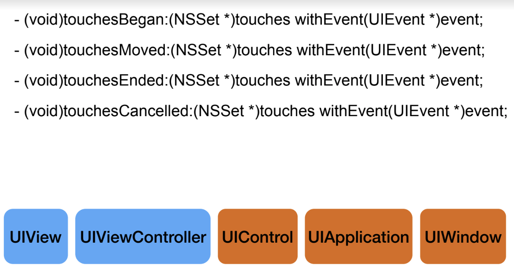
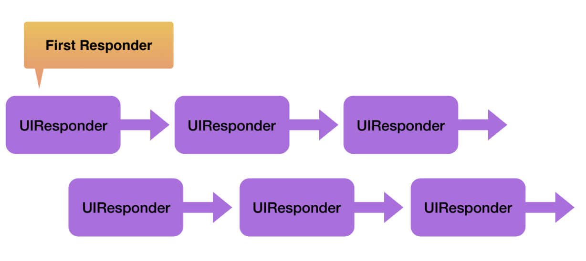
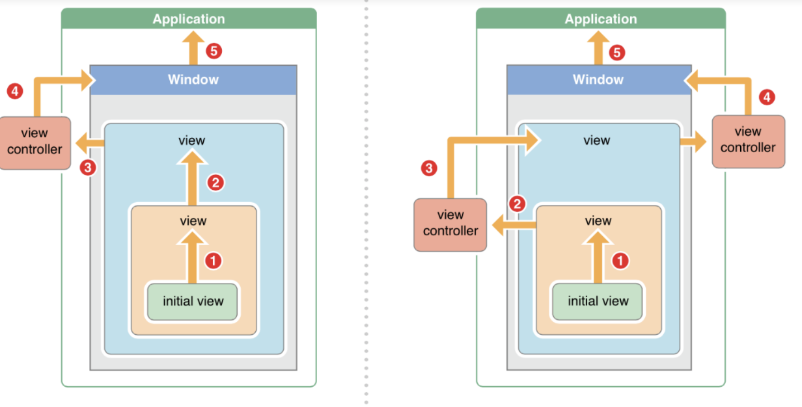

= Touch Event

=== UIEvent
* Event Type, Sub-type, Timestamp

===== UIEventType
* UIEventTypeTouches
* UIEventTypeMotion
* UIEventTypeRemoteControl

===== UIResponer
* UIView(콘텐츠 그리기) => UIResponder(이벤트 포워딩, Responder Chain) => NSObject

=== Single Touch 

===== 터치가 눌리면 
* UIApplication 객체가 하는 특별한 동작
** 뷰 계층 중에서 가장 깊이 터치가 눌린 View를 찾음
** First Responder를 사용 안함
* 터치 이벤트와 뷰는 연결됨(다시 만들 수 없음)

===== 터치가 눌렸음
* 이벤트 전달
** UIApplication, UIWindow => `sendEvent:`
** Hit-test View가 이벤트 받음
** `touchesBegan(_:with:)`

===== 터치가 움직임
* 동일한 방식으로 이벤트 전달
** `sendEvent:` 실행
** Hit-test View가 이벤트 받음
** `touchesMoved(_:with:)`

===== 터치가 떨어짐
* 동일한 방식으로 이벤트 전달
** `sendEvent:` 실행
** Hit-test View가 이벤트 받음
** `touchesEnded(_:with:)`

===== 터치가 취소됨
* 동일한 방식으로 이벤트 전달
** `sendEvent:` 실행
** Hit-test View가 이벤트 받음
** `touchesCancelled(_:with:)` 

===== 정리
* 터치가 시작할 때 Hit-test View를 찾음
* Hit-test View가 모든 메서드를 받음

=== Touch Event Handler

=== Gesture Recognizer

|===
| Gesture | UIKit Class
| Tapping(Any numbers of taps) | UITapGestureRecognizer
| Pinching in and out(For zomming a view) | UIPinchGestureRecognizer
| Panning or dragging | UIPanGestureRecognizer
| Swiping(In any direction) | UISwipeGestureRecognizer
| Rotating(Fingers moving in opposite directions) | UIRotationGestureRecognizer
| Long press(Also known as "touch and hold") | UILongPressGestureRecognizer
|===

[source, swift]
----
override func viewDidLoad() {
    super.viewDidLoad()

    let tapRecognizer = UITapGestureRecognizer(target: self, action: #selector(ViewController.responseToTapGesture))
    tapRecognizer.numberOfTapsRequired = 1
    tapRecognizer.numberOfTouchesRequired = 3
    self.view.addGestureRecognizer(tapRecognizer)
}

func responseToTapGesture(rec : UITapGestureRecognizer) {
    if (rec.state == .ended) {
        self.view.backgroundColor
    }
}
----

=== Responder Chain

=== Motion Event, Remote control
* UIDeviceOrientationDidChangeNotification
* Remote Control Event

=== 참고 
* https://developer.apple.com/documentation/uikit/touches_presses_and_gestures/understanding_event_handling_responders_and_the_responder_chain[Understanding Event Handling, Responders, and the Responder Chain]
* https://medium.com/@audrl1010/event-handling-guide-for-ios-68a1e62c15ff[Event Handling Guide for iOS 번역]