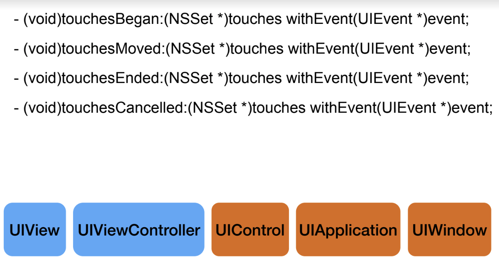

= Touch Event

=== UIEvent

===== 종류
* Event Type, Sub-type, Timestamp

===== UIEventType
* UIEventTypeTouches
* UIEventTypeMotion
* UIEventTypeRemoteControl

===== UIResponer
* UIView(콘텐츠 그리기) => UIResponder(이벤트 포워딩, Responder Chain) => NSObject

=== Single Touch 

===== 터치가 눌리면 
* UIApplication 객체가 하는 특별한 동작
** 뷰 계층 중에서 가장 깊이 터치가 눌린 View를 찾음
** First Responder를 사용 안 함
* 터치 이벤트와 뷰는 연결됨(다시 만들 수 없음)

===== 터치가 눌렸음
* 이벤트 전달
** UIApplication, UIWindow => `sendEvent:`
** Hit-test View가 이벤트 받음
** `touchesBegan(_:with:)`

===== 터치가 움직임
* 같은 방식으로 이벤트 전달
** `sendEvent:` 실행
** Hit-test View가 이벤트 받음
** `touchesMoved(_:with:)`

===== 터치가 떨어짐
* 같은 방식으로 이벤트 전달
** `sendEvent:` 실행
** Hit-test View가 이벤트 받음
** `touchesEnded(_:with:)`

===== 터치가 취소됨
* 같은 방식으로 이벤트 전달
** `sendEvent:` 실행
** Hit-test View가 이벤트 받음
** `touchesCancelled(_:with:)` 

===== 정리
* 터치가 시작할 때 Hit-test View를 찾음
* Hit-test View가 모든 메서드를 받음

=== Touch Event Handler

===== 종류

