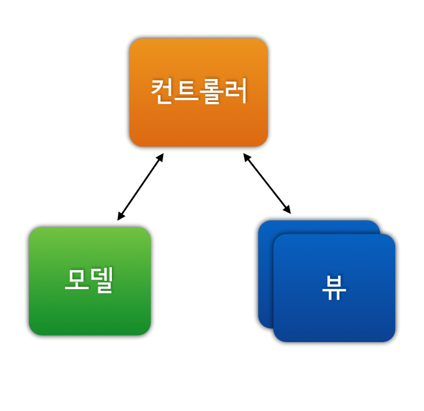
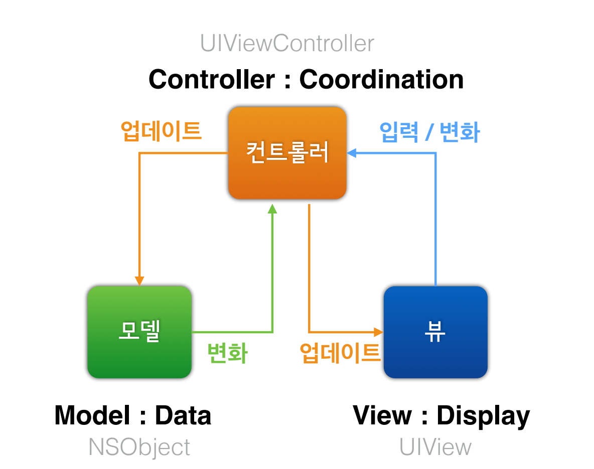
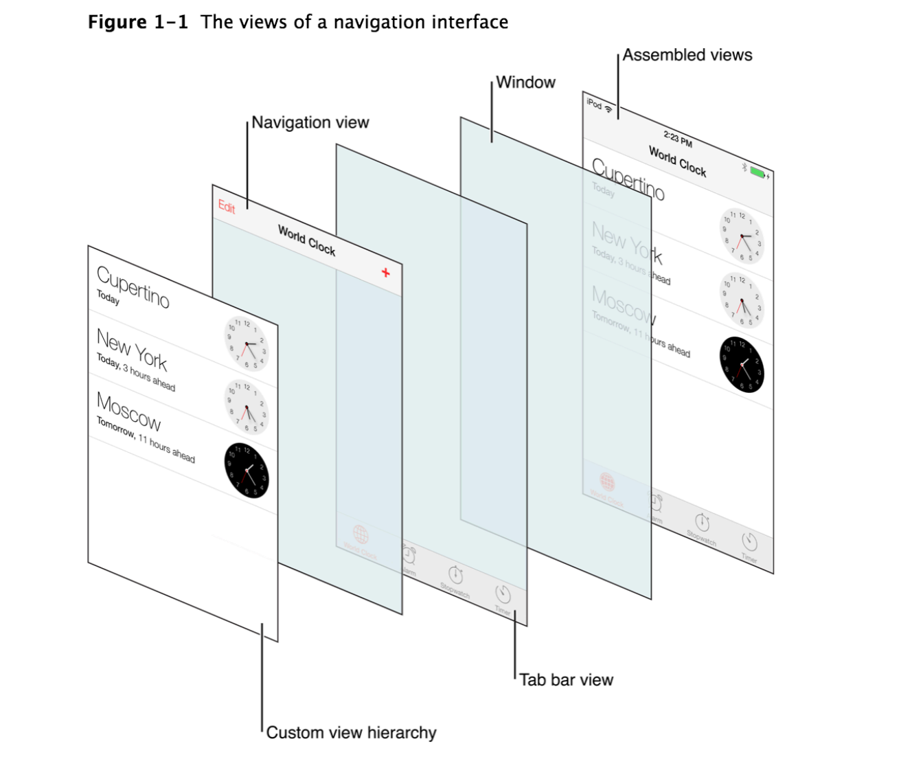
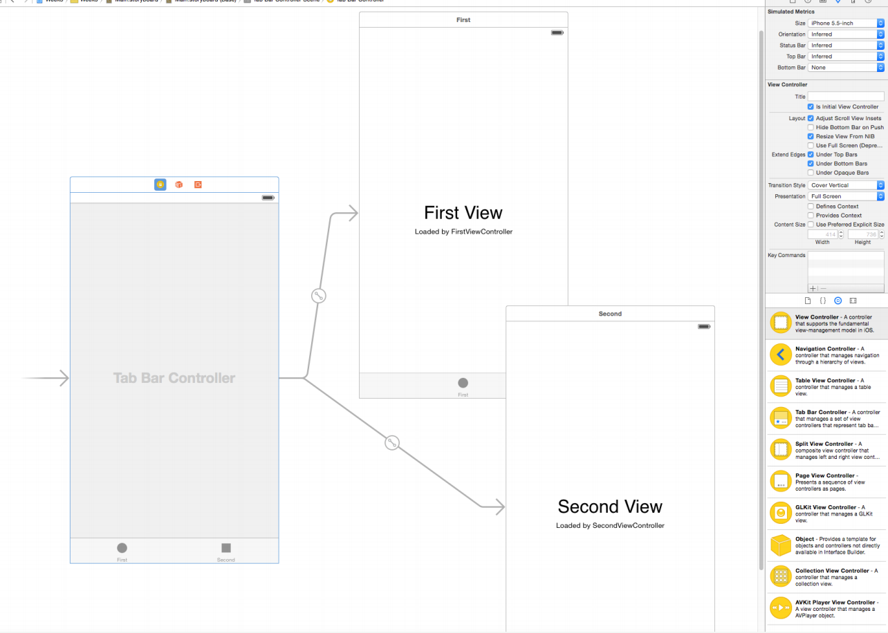
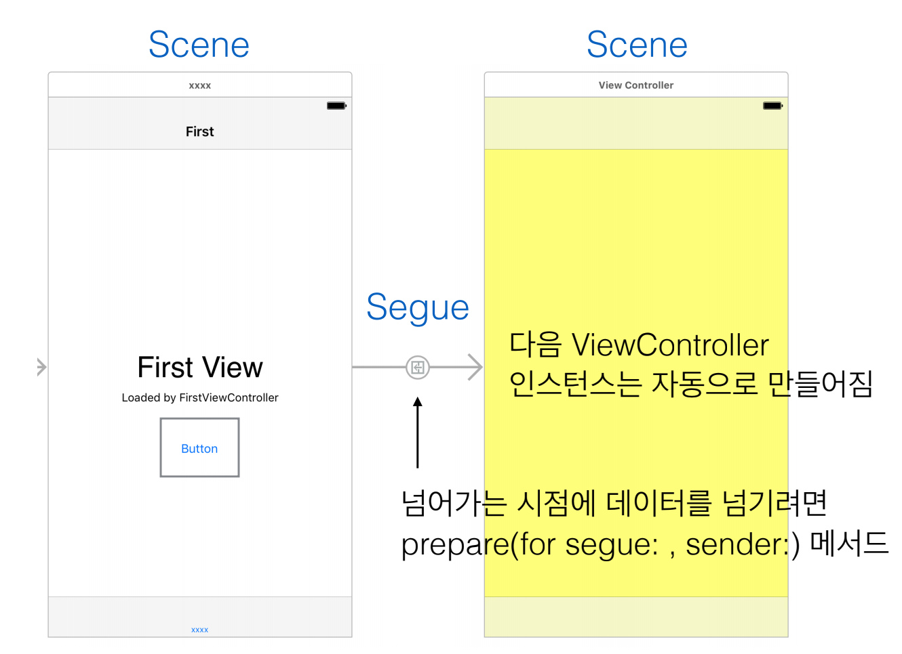
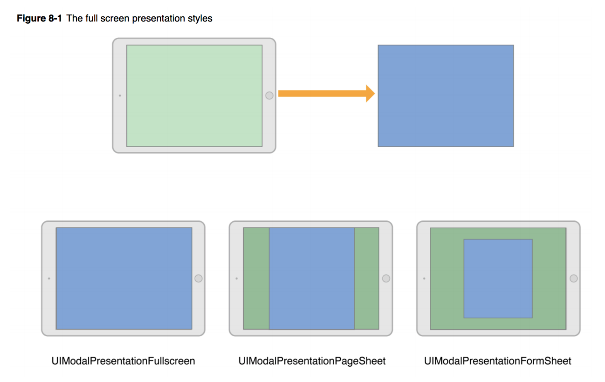
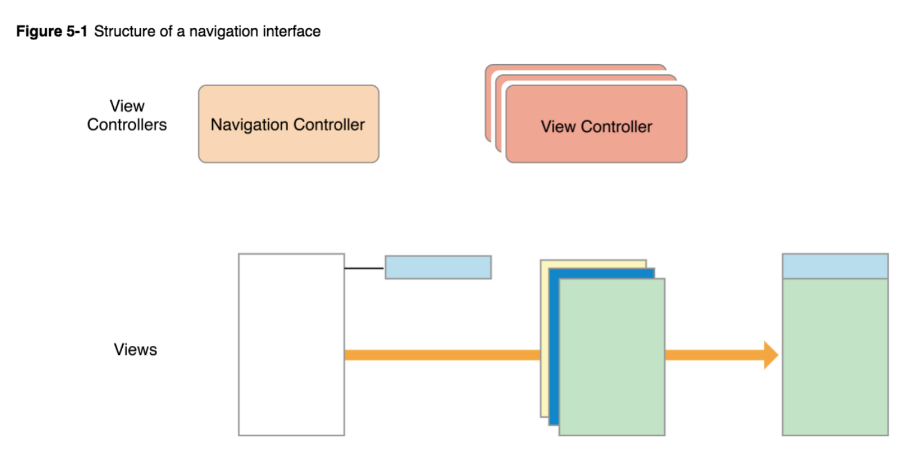

= UIViewController

=== UIViewController

===== 개념
* MVC 패턴에서 _C_
* 화면 전체 콘텐츠를 담당하거나 특정 영역을 담당
* 모델 객체를 내부 프로퍼티로 포함함
* 앱은 View Controller 간의 흐름으로 구성됨

===== 사용하는 목적, 이유
* 품질 좋은 앱을 간편하게 만들기 위해서
* 재사용 가능한 단위로 사용함

=== Custom View Controller

===== 정의
* UIViewController 서브 클래스
* View 게층에 맞춰 관련있는 View Controller 다루기
* 필요한 API 메서드 오버라이드 하기
* 자신만의 비즈니스 로직 추가
* 앱 동작 흐름에 맞추기

=== UIViewController 주요 콜백

===== 화면 관련
* _viewDidLoad_
* _viewWillAppear_
* _viewDidAppear_
* _viewWillDisappear_
* _viewDidDisappear_

===== 회전 관련
* _shouldAutorotate_
* _supportedInterfaceOrientations_
* _preferredInterfaceOrientationForPresentation_

=== View Controller 관련 용어

===== Root View Controller
* 화면을 가득 채우는 것
* `window.rootViewController = myViewController`

===== MVC

===== Storyboard
* _storyboardWithName_ => 번들에서 특정 스토리보드 파일 불러오기
* _instantiateInitialViewController_ => 스토리보드 객체에서 시작 지점의 뷰 컨트롤러 만들기
* _instantiateViewControllerWithIdentifier_ => 스토리보드 객체에서 특정 이름의 뷰 컨트롤러 객체 만들기

===== Scene, Segue

===== Presentation Style

===== 네비게이션 컨트롤러

=== 참고
* https://developer.apple.com/documentation/uikit/uiviewcontroller[UIViewController]