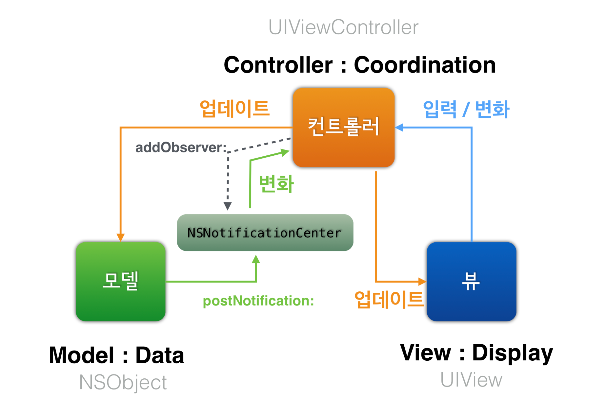
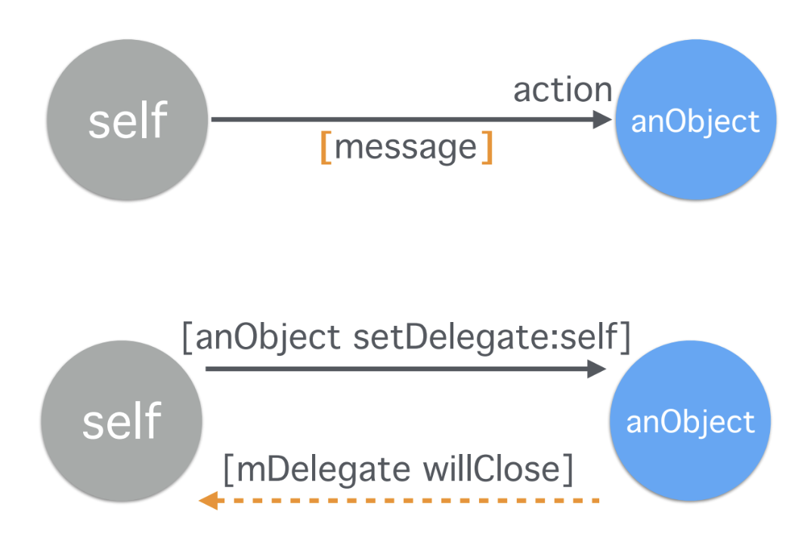

= iOS에서 사용하는 주요 패턴

===== MVC

image:./images/mvc-1.png[]

===== Target-Action
* _버튼이 눌리면 (타겟의) 이 메서드를 호출해 줘_

[source, swift]
----
class CustomButton: UIButton {
  convenience init() {
    self.init(frame: .zero)
  }
  
  required init?(coder aDecoder: NSCoder) {
    super.init(coder: aDecoder)
    self.setup()
  }
  
  override init(frame: CGRect) {
    super.init(frame: frame)
    self.setup()
  }
  
  deinit {
      self.removeTarget(self, action: Selector(("customButtonDidTap:")), for: .touchUpInside)
  }
}

extension CustomButton {
  func setup() {
    self.addTarget(self, action: Selector(("customButtonDidTap:")), for: .touchUpInside)
  }
  
  @IBAction func customButtonDidTap(btn: CustomButton) {
    print("Click :)")
  }
}
----

===== Notification
* Observer Pattern

===== Delegation
* 사용자가 Return 키를 누르면 _UITextField가 UITextFieldDelegate에게 끝내도 되는 것인지 질문하고 UITextFieldDelegate가 답변을 줌_
* 여러 클래스가 Delegation을 가지고 있음 
** _will-, did-, should-_

===== 참고
* https://developer.apple.com/library/archive/documentation/General/Conceptual/DevPedia-CocoaCore/MVC.html[Cocoa Core Competencies - MVC]
* https://developer.apple.com/library/archive/documentation/General/Conceptual/CocoaEncyclopedia/Model-View-Controller/Model-View-Controller.html[Concepts in Objective-C Programming]
* https://www.edwith.org/boostcourse-ios/lecture/16877/[부스트코스: Model-View-Controller]
