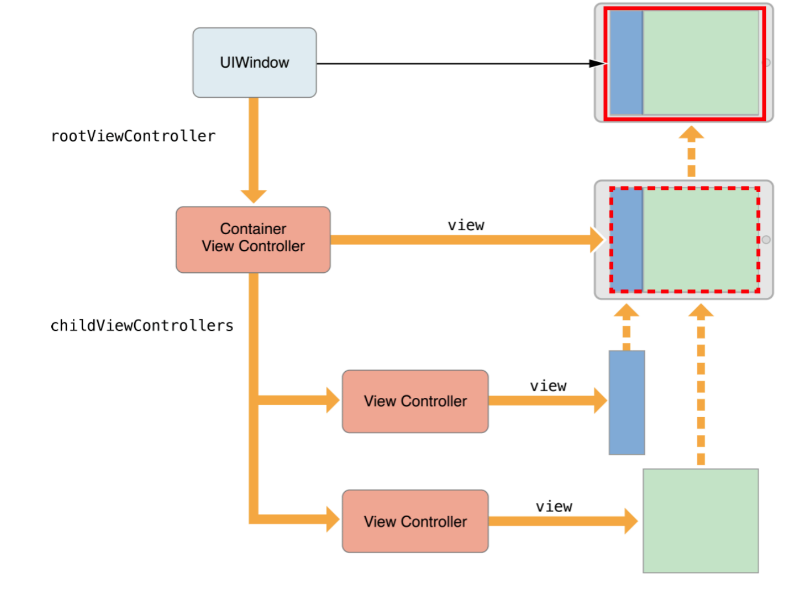
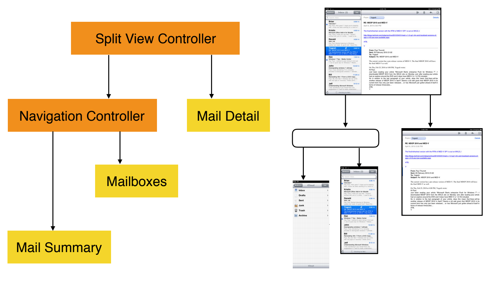
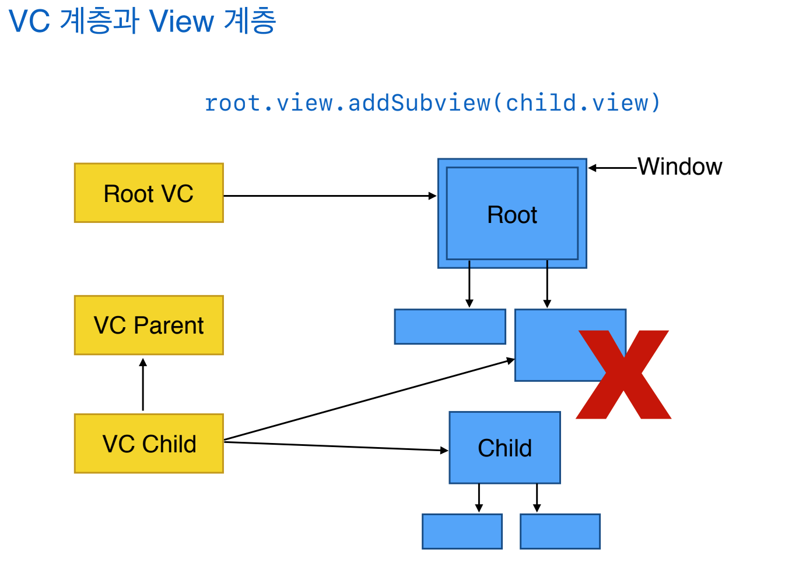
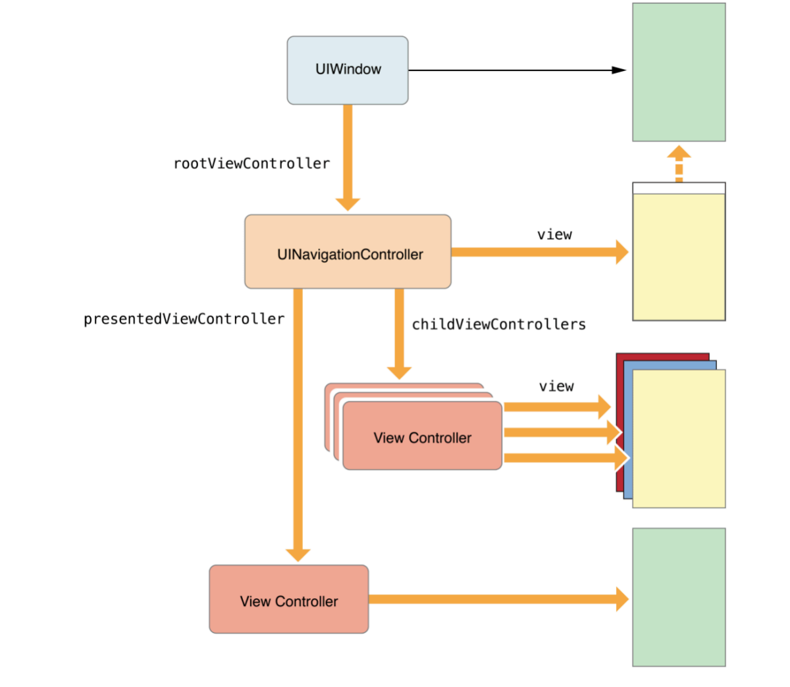

= View Controller Container

=== View Controller Container

===== 개념

 

 

===== 설명
* 서로 다른 View에서 View만 추가하지 말고
* SuperView, SubView의 View Controller가 다른 경우 View Controller도 관계를 만들어야 함 => Parent View Controller와 Child View Controller 관계로 만들어야 함
** Tabbar Controller, Navigation Controller
* View Controller에서 다른 View에서 추가할 때 Container View Controller를 하나 만들고 Array 자료구조에 넣었다가 뺐다가 View를 관리함
* View 중심이 아니라 View Controller 단위로 생각해라:)
** 하나의 View에 무조건 View Controller가 있어야 하나?
** View 입장에서 View Controller가 꼭 있어야 하는 것은 아니지만
** VIew Controller 입장에서 View가 꼭 하나 있어야 함
* _Editor -> Embed in -> .._ 을 통해서 View Controller Container를 만들 수 있음
* View Controller가 전환할 때마다 애니메이션 효과를 줄 수 있음
* View => 이벤트 전달
* Application이 시작할 때 Window가 깔리고 그 위로 View가 생김
* 하나의 Window 위에 여러 개 View가 있을 수 있음
* UIApplication, UiWindow가 실행되지만 Application에서 이벤트를 받고 Target으로 이동하거나
* Target에 지정되어 있지 않으면 Responder Chain에 의해 이벤트 처리할 곳을 찾아가거나 First Responder를 설정할 수 있음

=== Controller 계층 관련 API 

===== Subview 추가
* 하위 View Controller에서 상위 View를 추가하면 안됨

===== VC 계층과 View 계층 추가할 때
* 부모 컨트롤러에서 _addChildViewController_ 호출
* 자식 컨트롤러에서 Root View를 컨테이너에 추가함
* 자식 View에 대해 레이아웃, 크기, 제약 변경
* 자식 컨트로럴에서 _didMove_ 호출

===== VC 계층과 View 계층 제거할 때
* 자식 컨트롤러에서 _willMove_ 호출
* 자식 View에 대한 제약 제거
* 자식 컨트롤러 Root View를 컨테이너에서 제거함
* 자식 컨트롤러에서 _removeFromParentViwController_ 호출

===== 구현

[source, swift]
----
// BaseViewController
class BaseViewController: UIViewController {
  override func viewDidLoad() {
    super.viewDidLoad()
  }
  
  func addChildViewController(child: UIViewController) {
    self.addChildViewController(child)
    self.view.addSubview(child.view)
    child.didMove(toParentViewController: self)
  }
  
  func removeChildViewController(child: UIViewController) {
    child.willMove(toParentViewController: nil)
    child.view.removeFromSuperview()
    child.removeFromParentViewController()
  }
}

// TableauPilesViewController: BaseViewController를 상속받음
// 하위 View Controller를 추가하고 삭제하는 부분은 setUpTablePilesView(), setUpTablePilesView() 참고
class TableauPilesViewController: BaseViewController {
  var tableauPilesViewModel: TableauPilesViewModel! {
    didSet {
      initialize()
    }
  }
  
  override func viewDidLoad() {
    super.viewDidLoad()
  }
}

private extension TableauPilesViewController {
  func initialize() {
    removeAllViewControllers()
    setUpTablePilesView()
  }
  
  func removeAllViewControllers() {
    childViewControllers.forEach { self.removeChildViewController(child: $0) }
  }
  
  func setUpTablePilesView() {
    var tablePileViewController = TableauPileViewController()
    tableauPilesViewModel.setUp() { (cardViewModel, pileIndex, cardIndex) in
      tablePileViewController.addView(pileIndex: pileIndex, cardIndex: cardIndex, with: cardViewModel)
      self.addChildViewController(child: tablePileViewController)
      
      if pileIndex == cardIndex {
        tablePileViewController = TableauPileViewController()
      }
    }
  }
}
----

===== 자식 컨트롤러 사이 전환

[source, swift]
----
self.addChildViewController(note)
self.transition(from: recipe, to: note, duration: 3, options: .transitionFlipFromRight, animations: nil) { (finished) in 
    note.didMove(toParentViewController: self)
}
----

===== Presented View Controller, Presenting View Controller
* Presented View Controller => 자신
* Presenting View Controller => 호출한 주체

=== Built-in UIKit View Controller

===== 종류
* Image Picker
* Video Editor
* Document Browser, Previewing
* iCloude Sharing
* Shared Activities
* Printer Picker
* Word Lookup
* 이 외에도 여러가지 존재함

=== 참고 
* https://developer.apple.com/library/content/featuredarticles/ViewControllerPGforiPhoneOS/ImplementingaContainerViewController.html#//apple_ref/doc/uid/TP40007457-CH11-SW1[Implementing a Container View Controller]
* https://soulpark.wordpress.com/2012/07/10/ios5-parentviewcontroller-property-changed/[iOS5 parentViewController 프로퍼티 변경점]