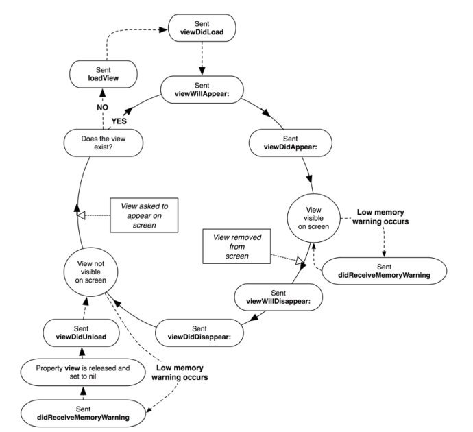

= View Life Cycle

=== 름도
image:./image/view-life-cycle.png[]

=== 개념

===== viewWillAppear

===== viewDidAppear

===== viewWillDisappear

===== viewDidDisappear

===== viewDidLoad

===== loadView

===== 참고
* https://rdkw.wordpress.com/2013/02/24/ios-uiviewcontroller-lifecycle/[iOS UIViewController Lifecycle]