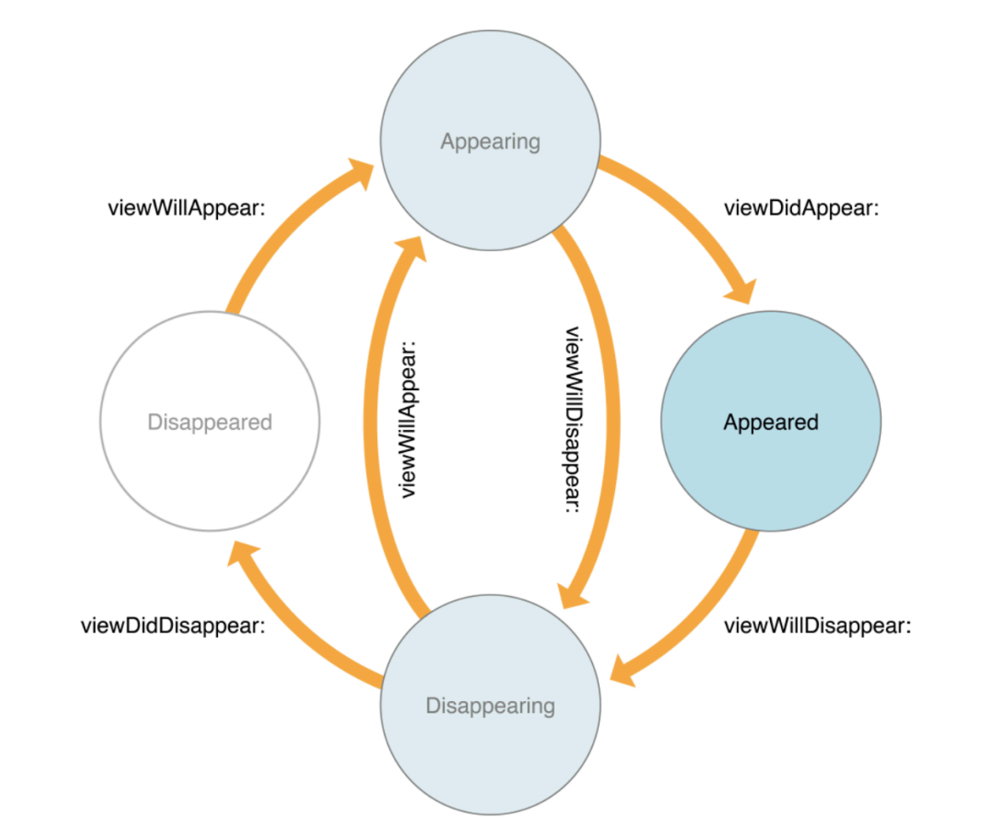
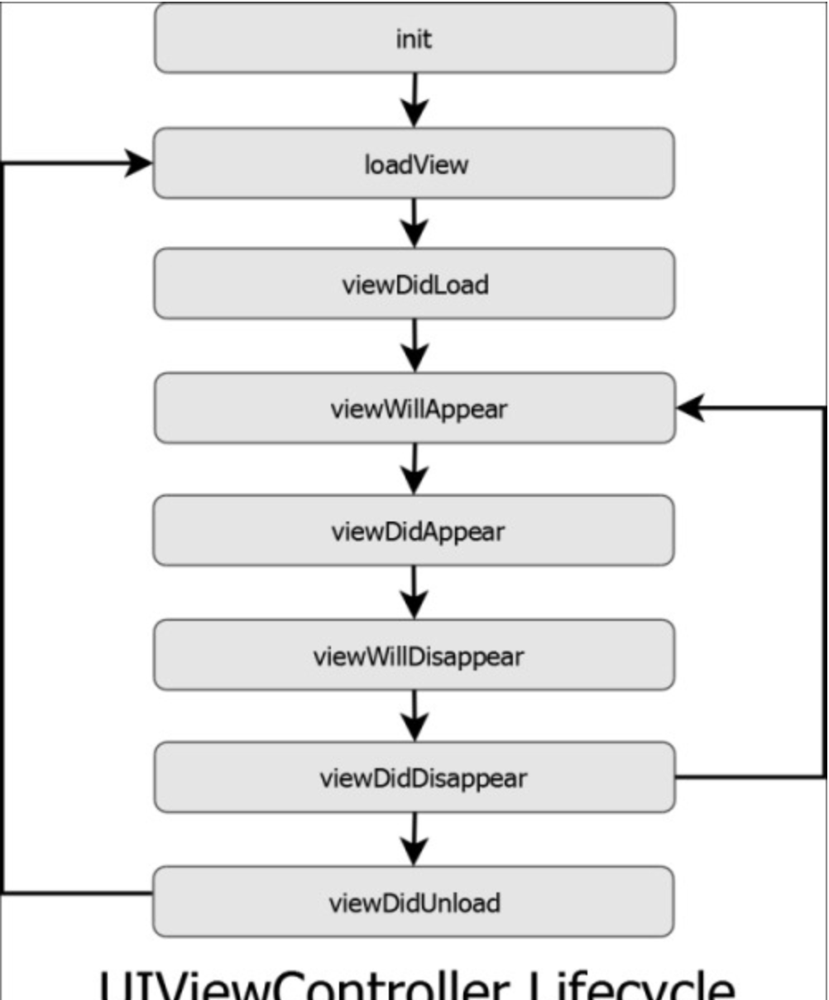

= View Life Cycle

===== viewWillAppear
* Window의 View 계층에 새로운 View가 추가되기 직전
* (필요하면) `vc.view.layoutSubviews()` 호출하기 직전

===== viewDidAppear
* View가 나타난 것을 Controller에게 알림
* Window의 View 계층에 새로운 View를 추가한 직후
* (필요하면) `vc.view.layoutSubviews()` 호출한 직후

===== viewWillDisappear
* Window의 View 계층에서 특정 View가 제거하기 직전
* View가 삭제되는 것을 View Controller에게 알림

===== viewDidDisappear
* Window의 View 계층에 특정 View를 제거한 직후
* View Controller에게 View가 제거되었음을 알림

===== viewDidLoad
* _viewWillAppear_ 호출하기 전에 실행함
* Low Memory와 같은 경우가 아니라면 딱 한번만 실행하기 때문에 초기화 할 때 사용함

===== loadView
* loadView를 직접 호출하면 안됨 => 오버라이드 하지 말라는 뜻이 아님
* 호출하면 검정색 화면만 뜸. 호출하기 위해서 `super.loadView()` 를 호출해야 함