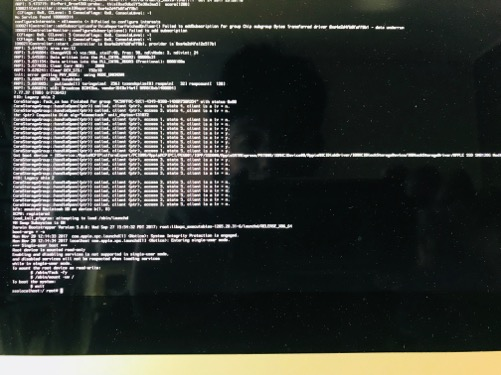
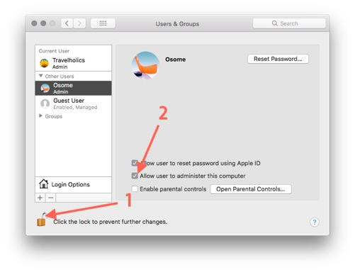

= 관리자 권한을 가진 계정 복구하기

===== Q.
* 하나뿐인 계정 설정 바꾸다가 관리자 권한을 가진 계정을 Staff으로 바꿈

===== A.
* Single User Mode로 부팅 => 맥북 재시작 후, `Command + S` 꾹 누름
* 하나뿐인 계정 로그인하면 아래와 같은 화면이 나오면, 다음 커맨드를 하나씩 차례로 입력함

[source, shell]
----
$ /sbin/mount -uw /
$ rm /var/db/.AppleSetupDone
$ reboot
----

* 리부팅 후, 관리자 권한을 가진 계정을 새로 생성할 수 있음. 그 후, 권한이 사라진 계정에다가 관리자 계정을 부여함

* 그 이후, 새로 만든 계정은 없애도 됨

===== 참고
* https://macinjune.com/all-posts/mac/tip/맥북-macos-관리자admin-계정이-사라진-경우-복구하기/[관리자(Administrator) 계정이 사라진 경우 복구하기]

