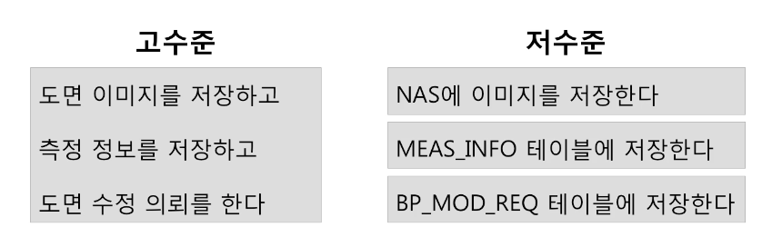
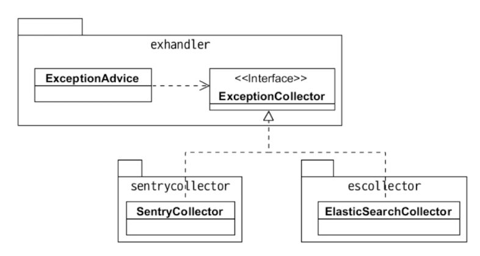
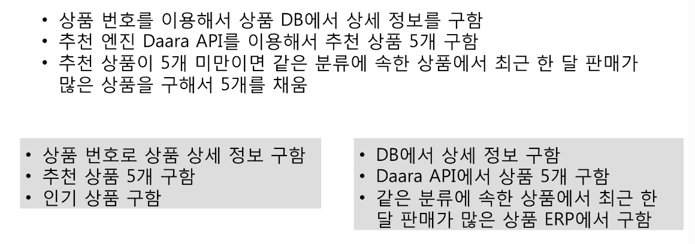

= DIP

===== 추가 학습
* Design Patterns
* TDD
* FP
* UML

===== 고수준 모듈, 저수준 모듈
* 고수준 모듈
** 의미 있는 단일 기능 제공
** 상위 수준의 정책 구현
* 저수준 모듈
** 고수준 모듈의 기능을 구현하기 위해 필요한 하위 기능을 실제 구현

* 고수준이 저수준에 직접 의존하면?
** 저수준 모듈 변경하면 고수준 모듈에 영향을 줌

===== 의존 역전 원칙
* 고수준 모듈이 저수준 모듈의 구현을 직접 의존하면 안됨
* 저수준 모듈이 고수준 모듈에서 정의한 추상 타입에 의존해야 함
* 예를 들어 고수준 모듈에서 정의한 인터페이스를 하나 두고 전략 패턴으로 접근할 수 있음
* 유연함을 높임. 고수준 모듈의 변경을 최소화하면서 저수준 모듈의 변경 유연함을 높임

[source, java]
----
class ExceptionAdvice {
    private ExceptionCollector exceptionCollector;
}

interface ExceptionCollector {
    public void getExceptions();
}

class ElasticSearchCollector implements ExceptionCollector {
    @Override
    public void getExceptions() {
        // ...
    }
}

class SentryCollector implements ExceptionCollector{
    @Override
    public void getExceptions() {
        // ...
    }
}
----

[source, swift]
----
struct ExceptionAdvice {
  var exceptionCollector: ExceptionCollector?
}

protocol ExceptionCollector {
  func getExceptions()
}

struct ElasticSearchCollector: ExceptionCollector {
  func getExceptions() {
    // ...
  }
}

struct SentryCollector: ExceptionCollector {
  func getExceptions() {
    // ...
  }
}
----

===== 부지런히 추상화 노력이 필요함
* 처음부터 바로 좋은 설계가 나오지 않음
* 요구사항 / 업무 이해도가 높아지면서 저수준 모듈을 인지하고 상위 수준 관점에서 저수준 모듈에 대한 추상화 시도

===== 연습

[source, swift]
----
// 고수준 모듈
class ProductDataService {
  private var productRepository: ProductRepository?
  private var productRecommander: ProductRecommander?
  private var popularProductService: PopularProductService?

//  init() {
//    self.productRepository = DBProductRepository()
//    self.productRecommander = DaaraRecommnder()
//    self.popularProductService = ErpPopularProductService()
//  }
  
  init(_ productRepository: ProductRepository, _ productRecommander: ProductRecommander, _ popularProductService: PopularProductService) {
    self.productRepository = productRepository
    self.productRecommander = productRecommander
    self.popularProductService = popularProductService
  }
  
  func getDetailInfo() {
    productRepository?.fetchDetailInfo()
  }
  
  func recommandItem() {
    productRecommander?.fetchItems()
  }
  
  func getTopItem() {
    popularProductService?.fetchTopItem()
  }
}

// 하위 기능을 추상화한 타입 1
protocol ProductRepository {
  func fetchDetailInfo()
}

// 하위 기능을 추상화한 타입 2
protocol ProductRecommander {
  func fetchItems()
}

// 하위 기능을 추상화한 타입 3
protocol PopularProductService {
  func fetchTopItem()
}

// 저수준 모듈
class DBProductRepository: ProductRepository {
  func fetchDetailInfo() {
    // ...
  }
}

class DaaraRecommnder: ProductRecommander {
  func fetchItems() {
    // ...
  }
}

class ErpPopularProductService: PopularProductService {
  func fetchTopItem() {
    // ...
  }
}
----

===== 참고
* 객체 지향 프로그래밍 입문: 최범균님