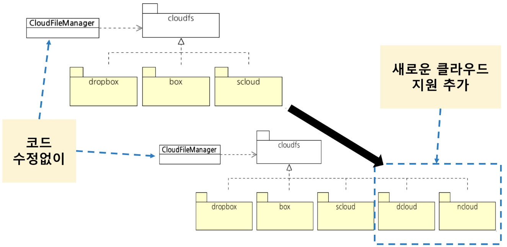

= 객체, 캡슐화, 다형성, 추상화

=== 들어가며

===== 비용
* 8번 출시하면서 비용은 기하급수적으로 늘어났지만, 5번 출시 이후 코드 줄 수는 변화가 없음. 결론은 한 줄 추가하는 것에 대한 비용이 얼마나 큰지 알 수 있음

===== 단순한 예
* NanoTime으로 시간을 바꾸면서 보통 이러한 코드들이 한 군데만 있는 것이 아니라 산재함. 그래서 고치기 위해서 비용이 많이 들어감 

[source, java]
----
// Before
long start = System.currentTimeMillies();

// ...

long end = System.currentTimeMillies();
long elapsed = end - start;

// After 
long start = System.nanoTime();

// ...

long end = System.nanoTime();
long elapsedNano = end - start;
----

* 개발자가 mode 20을 바꾸는 히스토리를 모를 경우 아래 코드를 분석하는 것에 시간, 비용이 많이 들어감

[source, java]
----
int mode = 10;

// Before
if (mode == 10) {
    // ...
}

if (mode != 10) {
    // ...
}

// After
if (mode == 10) {
    // ...

    if (조건 {
        mode = 20;
    }

    // ...
}

if (mode != 10) {
    // ...
}
----

* _if문에서 어떤 조건일 때 실행해라_  이 때, 어떤 조건을 주기 위해 조건문이 복잡해짐. 그래서 개발자가 읽기 힘듬

[source, java]
----
if (acc.getRegdata().isAfter(fiveDaysAgo)) {
    acc.setMembership(REGULAR);
}

// Before
if (acc.getMembership() == REGULAR && acc.getEmpData().isAfter(now)) {
    // ...
}

// After
if ( (acc.getMembership() == REGULAR || acc.getMembership() == PRO)
        && acc.getEmpData().isAfter(now) ) {
    // ...
}
----

* 이런 상황이 발생한 주요 원인 => *코드 분석 시간 증가, 코드 변경 시간 증가*

===== 소프트웨어 가치: 변화
* 소프트웨어가 얼마나 잘 변할 수 있는지가 소프트웨어가 가지는 가치
* Jessica Kerr => 소프트웨어를 유지보수한다는 것은 이전과 동일하게 동작하게 만드는 것이 아니라 변화하는 세계에서 여전히 유용해야 한다는 것
* 그래서, 소프트웨어를 바꾸는 것에 많은 비용과 시간을 쓴다면 자연히 도태될 것

===== 비용과 변화
* 낮은 비용, 빠른 시간으로 변화할 수 있어야 함
* 이를 위한 방법
** 패러다임 => 객체 지향, 함수형, 리액티브
** 코드, 설계, 아키텍처 => DRY, TDD, SOLID, DDD, 클린 아키텍처, MSA
** 업무 프로세스/문화 => 애자일, DevOps

=== 객체

===== 절차지향
* 프로시저들이 데이터를 공유함. 예를 들어 프로시저 A가 데이터 1, 2, 3을 공유하고 프로시저 B가 데이터 2, 4를 공유함. 시간이 흘러갈수록 데이터 공유하는 방식은 구조를 복잡하게 만듦. 수정이 어려움

[source, java]
----
// #1: 인증과 암호변경 로직에서 Account가 가지고 있는 State 공유함
// 인증 API
Account account = findOne(id);
if (account.getState() == DELETE) {
    // ...
}

// 암호변경 API
Account account = findOne(id);
if (account.getState() == DELETE) {
    // ...
}

// #2: 요구사항으로 인해 인증, 암호변경 로직에서 BlockCount 조건도 추가함
// 인증 API
Account account = findOne(id);
if (account.getState() == DELETE ||
    account.getBlockCount() > 0) {
    // ...
}

// 암호변경 API
Account account = findOne(id);
if (account.getState() == DELETE || 
    account.getBlockCount() > 0) {
    // ...
}

// #3: 추가 요구사항이 들어옴. 데이터를 사용하는 곳이 한 두군데가 아님
// 인증 API
Account account = findOne(id);
if (account.getState() == DELETE ||
    account.getBlockCount() > 0 ||
    account.getEmailVerifyStatus() == 0) {
    // ...
}

// 암호변경 API
Account account = findOne(id);
if (account.getState() == DELETE || 
    account.getBlockCount() > 0 ||
    account.getActiveStatus() == ENABLE) {
    // ...
}
----

===== 객체지향
* 프로시저와 데이터를 객체 단위로 묶음. 특정 객체가 가지고 있는 데이터는 그 객체의 프로시저가 접근할 수 있도록 함. 다른 객체에서 그 객체의 데이터에 바로 접근하지 못함
* 데이터를 직접적으로 주고 받지 않음. 객체와 다른 객체 사이에서 접근하는 방법은 객체가 가지고 있는 프로시저를 통해 접근함

===== 객체
* 객체 핵심 -> 기능 제공
** 객체는 제공하는 기능으로 정의. 내부적으로 가진 필드(데이터)로 정의하지 않음
* 회원 객체
** 암호 변경하기 기능
** 차단 여부 확인하기 기능
* 소리 제어기
** 소리 크기 증가하기 기능
** 소리 크기 감소하기 기능

===== 기능 명세
* 객체가 어떤 기능을 가지고 있는지 알아야 함. 객체는 *메서드를 이용해서 기능 명세*

===== 객체와 객체
* 객체와 객체는 기능을 사용해서 연결함. 기능을 사용한다는 것은 *기능 사용 = 메서드 호출*

===== 메세지
* 객체와 객체 상호 작용하는 것. 메세지를 주고 받음
* 메세드를 호출하는 메세지, 리턴하는 메세지, 익셉션 메세지
* UML 시퀀스 다이어그램에서 화살표 하나가 메세지 하나. 리턴하는 것조차도 메세지임

===== 객체?
* 이것은 객체일까? 아님. 아래 코드를 봤을 때 단순히 데이터만 접근하고 부가적인 기능이 없음. 데이터나 구조체 비슷함

[source, java]
----
public class Member {
    private String name;
    private String id;

    public void setName(String name) {
        this.name = name;
    }

    public String getName() {
        return name;
    }

    public void setId(String Id) {
        this.id;
    }

    public String getId() {
        return id;
    }
}
----

=== 캡슐화

===== 캡슐화(Encapsulation)
* 데이터 + 관련 기능 묶음
* 객체가 기능을 어떻게 구현했는지 외부에서 보이지 않도록 감춤. 구현에 사용된 데이터의 상세 내용을 외부에서 알 수 없음
* 정보 은닉 의미도 포함함
* 외부 영향 없이 객체 내부 구현 변경이 가능함

[source, java]
----
// 캡슐화를 하지 않으면
// - 요구사항의 변화가 데이터 구조/사용에 변화를 발생시킴. 데이터를 사용하는 여러 코드에서 수정이 발생함
// - 절차지향의 문제점. 데이터 공유하는 방식의 단점

// #1: 처음 작성한 코드
if (acc.getMembership() == REGULAR && acc.getExpData().isAfter(now())) {
    // 정회원 기능
}

// #2: 서비스가 몇 년동안 살아남음. 그래서 이벤트 해서 아래같이 고쳐야 하지만, 한 군데만 고쳐야 할게 아님
if (acc.getMembership() == && REGULAR &&
    (
        (acc.getServiceData().isAfter(fiveYearAgo) && acc.getExpData().isAfter(now())) ||
        (acc.getServiceData().isBefore(fiveYearAgo) && addMonth(acc.getExpData()).isAfter(now()))  
    ) {
    // 정회원 기능
}

// 캡슐화 하면
// 1. 기능 제공하고 구현 상세를 감춤
// 2. 연쇄적인 변경 전파를 최소화 할 수 있음
// 3. 캡슐화 기능
//      - 캡슐화 시도 -> 기능에 대한 의도(이해)를 높임. 아래 코드를 통해 멤버십이 REGULAR와 같은지 검사하는 이유가 실제로 무엇인지 생각을 가지게 됨

// #1: 처음 작성한 코드
if (acc.hasRegularPermission()) {
    // 정회원 기능
}

public class Account {
    private MemberShip memberShip;
    private Data expData;

    public boolean hasRegularPermission() {
        return membership == REGULAR &&
                expData.isAfter(now());
    }
}

// #2: 서비스가 몇 년동안 살아남음. 그래서 이벤트 해서 아래같이 고치지만, 결국 hasRegularPermission 메서드 한 곳만 고치면 됨
if (acc.hasRegularPermission()) {
    // 정회원 기능
}

public class Account {
    // ...

    public boolean hasRegularPermission() {
        return membership == REGULAR &&
                ( expData.isAfter(now()) ||
                    (
                        serviceData.isBefore(fiveYearAgo()) &&
                        addMonth(expData).isAfter(now())
                    )
                );
    }
}

// 4. 캡슐화를 위한 규칙
//      - 캡슐화가 저절로 되는 것이 아님. 2가지 규칙이 잇음
//      - Tell, Don't Ask -> 데이터를 달라고 하지 말고 해달라고 하기

// Before: 데이터를 가진 객체의 데이터를 직접 가져와서 판단하는 것이 아니라
if (acc.getMembership() == REGULAR) {
    // 정회원 기능
}

// After: 데이터를 가진 객체에게 데이터를 가지고 있는지 판단해달라는 기능으로 바꿔야 함
if (acc.hasRegularPermission()) {
    // 정회원 기능
}

//      - Demeter's Law
//          - 메서드에서 생성한 객체의 메서드만 호출
//          - 파라미터로 받은 객체의 메서드만 호출
//          - 필드로 참조하는 객체의 메서드만 호출

// Before
// #1
acc.getExpData().isAfter(now)

// #2
Data.data = acc.getExpData();
data.isAfter(now);

// After: 메서드 하나만 호출해야 함
// #1
acc.isExpired()

// #2
acc.isValid(now)
----

=== 캡슐화 연습

===== 첫 번째 예제

[source, java]
----
// Before
public AuthResult authenticate(String id, String pw) {
    Member member = findOne(id);

    if (member == null) return AuthResult.NO_MATCH;

    // 데이터를 가져오고 자기가 판단함. 멤버가 가지고 있는 기능으로 바꿈
    if (member.getVerificationEmailStatus() != 2) {
        return AuthResult.NO_EMAIL_VERIFIED;
    }

    if (passwordEncoder.isPasswordValid(member.getPassword(), pw, member.getId())) {
        return AuthResult.SUCCESS;
    }

    return AuthResult.NO_MATCH;
}

// After
public AuthResult authenticate(String id, String pw) {
    Member member = findOne(id);

    if (member == null) return AuthResult.NO_MATCH;

    // 데이터를 가져오고 자기가 판단함. 멤버가 가지고 있는 기능으로 바꿈
    if (member.isEmailVerified()) {
        return AuthResult.NO_EMAIL_VERIFIED;
    }

    if (passwordEncoder.isPasswordValid(member.getPassword(), pw, member.getId())) {
        return AuthResult.SUCCESS;
    }

    return AuthResult.NO_MATCH;
}

public class Member {
    private int verificationEmailStatus;

    // ...

    public boolean isEmailVerified() {
        return verificationEmailStatus() == 2;
    }
}
----

===== 두 번째 예제

[source, java]
----
// Before
public class Rental {
    private Movie movie;
    private int daysRented;

    // 데이터를 가져오고 자기가 판단함
    public int getFrequentRenterPoints() {
        if (movie.getPriceCode() == Movie.NEW_RELEASE &&
            daysRented > 1) {
            return 2;
        } else {
            return 1;
        }
    }
}

public class Movie {
    public static int REGULAR = 0;
    public static int NEW_RELEASE = 1;
    private int priceCode;

    public int getPriceCode() {
        return priceCode;
    }

    // ...
}

// After
public class Rental {
    private Movie movie;
    private int daysRented;

    // 데이터를 가져오고 자기가 판단함
    public int getFrequentRenterPoints() {
        return getFrequentRenterPoints(daysRented);
    }
}

public class Movie {
    public static int REGULAR = 0;
    public static int NEW_RELEASE = 1;
    private int priceCode;

    public int getFrequentRenterPoints(int daysRented) {
        if (priceCode == NEW_RELEASE && daysRented > 1) {
            return 2;
        } else {
            return 1;
        }
    }

    // ...
}
----

===== 세 번째 예제

[source, java]
----
// Before
Timer t = new Timer();

t.startTime = System.currentTimeMillis();

// ...

t.stopTime = System.currentTimeMillis();
long elaspedTime = t.stopTime - t.startTime;

public class Timer {
    public long startTime;
    public long stopTime;
}

// After
Timer t = new Timer();
t.start();

// ...

t.stop();

long time = t.elapsedTime(MILLISECOND);

public class Timer {
    private long startTime;
    private long stopTime;

    public void start() {
        this.startTime = System.currentTimeMillis();
    }

    public void stop() {
        this.stopTime = System.currentTimeMillis();
    }

    public long elapsedTime(TimeUnit unit) {
        switch(unit) {
            case MILLISECOND:
                return stopTime - startTime;
            
            // ...
        }
    }
}
----

===== 네 번째 예제

[source, java]
----
// Before
public void verifyEmail(String token) {
    Member member = findToken(token);

    if (member == null) throw new BadTokenException();

    // 데이터를 가져와서 판단하고 바꾸는 코드가 많음. 통으로 캡슐화 시도하는 것이 좋음
    if (member.getVerificationEmailStatus() == 2) {
        throw new AlreadyVerifiedException();
    } else {
        member.setVerificationEmailStatus(2);
    }

    // 수정사항 DB 반영
}

// After
public void verifyEmail(String token) {
    Member member = findByToken(token);

    if (member == null) throw new BadTokenException();

    member.verifyEmail();

    // 수정사항 DB 반영
}

public class Member {
    private int verificationEmailStatus;

    public void verifyEmail() {
        if (isEmailVerified()) {
            throw new AlreadyVerifitedException();
        } else {
            this.verificationEmailStatus = 2;
        }
    }

    public boolean isEmailVerified() {
        return verificationEmailStatus == 2;
    }
}
----

=== 다형성과 추상화

===== 다형성(Polymorphism)
* 여러(Poly) 모습(Morph)을 갖는 것
* 객체 지향에서 한 객체가 여러 타입을 갖는 것
** 한 객체가 여러 타입 기능을 제공함
** 타입 상속으로 다형성을 구현함. 하위 타입은 상위 타입도 됨

[source, java]
----
public class Timer {
    private void start() { // ... }
    private void stop() { // ... }
}

public interface Rechargeable {
    void charge();
}

public class IotTimer extends Timer implements Rechargeable {
    public void charge() {
        // ...
    }
}

IotTimer it = new IotTimer();
it.start();
it.stop();

Timer t = it;
t.start();
t.stop();

Rechargeable r = it;
r.charge();
----

===== 추상화(Abstraction)
* 데이터나 프로세스 등을 의미가 비슷한 개념이나 의미있는 표현으로 정의하는 과정
* 두 가지 방식 추상화
** 특정한 성질
** 공통 성질(일반화) => 다형성과 관계 있음
* 예
** DB의 User 테이블 => 아이디, 이름, 이메일
** Money 클래스 => 통화, 금액
** 프린터 => HP MXXX, 삼성 SL-M2XXXX

===== 서로 다른 구현 추상화
* SCP 파일 업로드, HTTP 데이터 전송, DB 테이블 삽입 => 추상화 => Push

===== 타입 추상화
* 여러 구현 클래스를 대표하는 상위 타입 도출
** 흔히 인터페이스 타입으로 추상화
** 추상화 타입과 구현은 타입 상속으로 연결
* 추상 타입
** 인터페이스로 주로 많이 구현함
** 공통적인 기능
** 기능에 대한 의미를 제공
** 구현을 제공하지 않음
* Concreate 클래스
** 필요한 기능에 대해 구현함

===== 추상 타입 사용
* 추상 타입을 이용하여 프로그래밍할 수 있음
* 추상 타입을 구현을 감춤. 기능 구현이 아닌 의도를 잘 드러남

===== 추상 타입을 사용하는 이유
* 사용 대상 변경에 대한 유연함

[source, java]
----
// Before: 콘크리트 클래스를 직접 사용하면?
// #1
private SmsSender smsSender;

public void cancel(String ono) {
    // 주문 취소 처리

    smsSender.sendSms( ... );
}

// #2: KakaoPush 추가
private SmsSender smsSender;
private KakaoPush kakaoPush;

public void cancel(String ono) {
    // 주문 취소 처리

    if (pushEnabled) {
        kakaoPush.push(...);
    } else {
        smsSender.sendSms(...);
    }
}

// #3: MailService 추가
private SmsSender smsSender;
private KakaoPush kakaoPush;
private mailService mailSvc;

public void cancel(String ono) {
    // 주문 취소 처리

    if (pushEnabled) {
        kakaoPush.push(...);
    } else {
        smsSender.sendSms(...);
    } 

    // 주문 취소 처리 로직이 바뀌지 않았지만 본질적인 요구사항이 아니라 단지 본질 외적인 요구 사항 변경에 따라 cancel 메서드 코드도 함께 변경됨. 이것은 잘못된 구조
    mailSvc.sendMail(...);
}

// After: 공통점을 도출하면?
// #1: 도출한 추상 타입 사용
public void cancel(String ono) {
    // 주문 취소 처리

    Notifier notifier = getNotifier(...);
    notifier.notify(...);
}

private Notifier getNotifier(...) {
    if (pushEnabled) {
        return new KakaoNotifier();
    } else {
        return new SmsNotifier();
    }
}

// #2: 사용할 대상 접근도 추상화. 주문 취소 로직은 유지하고 통지 방식을 바꾸는 것이 좋음
public void cancel(String ono) {
    // 주문 취소 처리

    Notifier notifier = NotifierFactory.instance().getNotifier(...);
    notifier.notify(...);
}

public interface NotifierFactory {
    Notifier getNotifier(...);

    static NotifierFactory instance() {
        return new DefaultNotifierFactory();
    }
}

public class DefaultNotifierFactory implements NotifierFactory {
    public Notifier getNotifier(...) {
        if (pushEnabled) {
            return new KakaoNotifier();
        } else {
            return new SmsNotifier();
        } 
    }
}
----

===== 추상화는 언제하냐?
* 추상화는 의존 대상이 변경하는 시점에서 해야 함
* 추상화 -> 추상 타입 증가 -> 복잡도 증가
** 클라이언트가 요구하지 않았음에도 '이런 기능이 생길 것이다!' 개발자가 임의대로 추측한 상태로 추상화하면 안됨
** 잘못된 추상화는 가능성, 복잡도만 증가함
** *실제 변경, 확장이 발생하는 경우 추상화해야 함*

===== 추상화를 잘하려면?
* 구현을 한 이유가 무엇 때문인지 생각해야 함

=== 추상화 연습

===== 예제
* 클라우드 파일 통합관리 기능 개발
* 대상 클라우드
** 드롭박스, 박스
* 주요 기능
** 각 클라우드 파일 목록 조회, 다운로드, 업로드, 삭제, 검색

===== 추상화하지 않은 구현
* 첫 번째 구현
** 목록 조회
** 파일 다운로드

[source, java]
----
public enum CloudId {
    DROPBOX,
    BOX;
}

public class FileInfo {
    private CloudId cloudId;
    private String fileId;
    private Strint name;
    private long length;

    // Get 메서드
}

public class CloudFileManager {
    // 목록 조회
    public List<FileInfo> getFileInfos(CloudId cloudId) {
        if (cloudId == CloudId.DROPBOX) {
            DropboxClient dc = ... ;

            List<DbFile> dbFiles = db.getFiles();
            List<FileInfo> result = new ArrayList<>();

            for (DbFile dbFile: dbFiles) {
                FileInfo fi = new FileInfo();
                fi.setCloudId(CloudId.DROPBOX);
                fi.setFileId(fi.getFileId());

                // ...

                result.add(fi);
            }

            return result;
        } else if (cloudId == CloudId.BOX) {
            BoxService boxSvc = ...;

            // ...
        }
    }

    // 파일 다운로드
    public void download(FileInfo file, File localTarget) {
        if (file.getCloudId() == CloudId.DropBox) {
            DropboxClient dc = ... ;
            FileOutputStream out = new FileOutputStream(localTarget);
            dc.copy(file.getFileId(), out);
            out.close();
        } else if (file.getCloudId() == CloudId.BOX) {
            BoxService boxSvc = ...;
            InputStream is = boxSvc.getInputStream(file.getId());
            FileOutputStream out = new FileOutputStream(localTarget);
            CopyUtil.copy(is, out);
        }
    }
}
----

* 이어지는 추가
** 클라우드 추가
*** S 클라우드
*** N 클라우드
*** D 클라우드
** 기능 추가
*** 클라우드 간 파일 복사

[source, java]
----
// 목록조회 뿐만 아니라 download(), upload(), delete(), search()도 유사한 구조가 됨
public List<FileInfo> getFileInfos(CloudId cloudId) {
    if (cloudId == CloudId.DROPBOX) {
        // ...
    } else if (cloudId == CloudId.Box) {
        // ...
    } else if (cloudId == CloudId.SCloud) {
        // ...
    } else if (cloudId == CloudId.NCloud) {
        // ...
    } else if (cloudId == CloudId.DCloud) {
        // ...
    }
}

// 클라우드 간 복사
public FileInfo copy(FileInfo fileInfo, CloudId to) {
    CloudId from = fileInfo.getCloudId();

    // 드롭박스에 한해서만 나타낸 if문임. BOX, SCloud, NCloud, DCloud도 똑같이 추가해줘야 함. 결국 코드가 복잡해지고 너무 길어짐. 만약 다른 클라우드가 추가되면 보기 힘듬
    // 코드 한 줄 만드는 비용이 점점 증가함
    if (to == Cloud.DROPBOX) {
        if (from == Cloud.BOX) {
            // ...
        } else if (cloudId == CloudId.SCloud) {
            // ...
        } else if (cloudId == CloudId.NCloud) {
            // ...
        } else if (cloudId == CloudId.DCloud) {
            // ...
        }
    }
}
----

* 개발 시간 증가 이유
** 코드 구조가 길어지고 복잡해짐
*** 새로운 클라우드 추가할 때 모든 메서드에 새로운 if 블록 추가
*** 중첩 if-else는 복잡도가 배로 증가함
*** if-else가 많을수록 진척이 더딤
** 관련 코드가 여러 곳에 분산되어 있음
*** 한 클라우드 처리와 관련된 코드가 여러 메서드 흩어짐
** 결과적으로 코드 가독성과 분석 속도 저하
*** 코드 추가에 따른 노동 시간 증가
*** 실수하기 쉽고 이로 인한 불필요한 디버깅 시간 증가

===== 추상화하면 ?
* DropBox, Box, SCloud, NCloud, DCloud -> CloudFileSystem

[source, java]
----
// DropBox 구현
public class DropBoxFileSystem implements CloudFileSystem {
    private DropBoxClient dbClient = new DropBoxClient(...);

    @Override
    public List<CloudFile> getFiles() {
        List<DbFile> dbFiles = dbClient.getFiles();
        List<CloudFile> results = new ArrayList<>(dbFiles.size());

        for (DbFile file: dbFiles) {
            DropboxCloudFile cf = new DropBoxCloudFile(file, dbClient);
            result.add(cf);
        }

        return results;
    }
}

public class DropBoxClientFile implements CloudFile {
    private DropBoxClient dbClient;
    private DbFile dbFile;

    public DropBoxCloudFile(DbFile dbFile, DropBoxClient dbClient) {
        this.dbFile = dbFile;
        this.dbClient = dbClient;
    }

    public String getId() {
        return dbFile.getid();
    }

    public boolean hasUrl() {
        return true;
    }

    public String getUrl() {
        return dbFile.getFileUrl();
    }

    public String getName() {
        return dbFile.getFileName();
    }

    public InputStream getInputStream() {
        return dbClient.createStreamOfFile(dbFile);
    }

    public void write(OutputStream out) {
        // ...
    }

    public void delete() {
        dbClient.deleteFile(dbFile.getId());
    }

    // ...
}

public class CloudFileManager {
    // ...

    public List<CloudFile> getFileInfos(CloudId cloudId) {
        CloudFileSystem fileSystem = CloudFileSystemFactory.getFileSystem(cloudId);
        return fileSystem.getFiles();
    }

    public void download(CloudFile file, File localTarget) {
        file.write(new FileOutputStream(localTarget));
    }   

    // ...
}
----

* BOX 지원 추가하더라라도 CloudFileManager가 변하지 않음
* 파일 복사 기능 추가

[souroce, java]
----
public class CloudFileManager {
    // ...
    public void copy(CloudFile file, CloudId target) {
        CloudFileSystem fileSystem = CloudFileSystemFactory.getFileSystem(target);
        fileSystem.copyFrom(file);
    }
}

// DropBoxFileSystem
// - Copy 기능은 각자 클라우드 시스템에 맞게 구현할 수 있음
public class DropBoxFileSystem implements CloudFileSystem {
    // ...
    
    public void copyFrom(CloudFile file) {
        // ...
    }
    
    // ...
}

// NCloudFileSystem
public class NCloudFileSystem implements CloudFileSystem {
    // ...
    
    public void copyFrom(CloudFile file) {
        // ...
    }
    
    // ...
}
----

===== 추상화 결과
* 추상화한 타입으로만 핵심 기능 구현이 가능함
* CloudFileManager가 바뀌지 않고 CloudFileManager가 사용하는 대상(CloudFileSystem)을 바꿀 수 있는 유연함을 얻음
* 관련 코드가 한 곳에 모이는 장점을 얻을 수 있음

===== 이것이 바로 OCP
* CloudFileManager가 바뀌지 않고 CloudFileManager가 사용하는 대상(CloudFileSystem)을 바꿀 수 있는 유연함을 얻음
* *CloudFileManager에 대한 수정은 닫혀있고 CloudFileManager가 사용하는 대상(CloudFileSystem)에 대한 확장은 열려 있음*

=== 참고
* 객체 지향 프로그래밍 입문: 최범균님 강의
