= React Native 기본

=== 개요

===== React Native?
* 크로스 플랫폼 모바일 앱 개발을 위한 프레임워크. 그러나, Native라고 생각하는 것이 좋음
* React 기반으로 코드 작성(JS + JSX)

===== 동작원리
* React Native으로 만든 데이터는 String 형태로 보내짐. 브릿지(Native Bridge)을 통해 네이티브(iOS, Android)로 파싱해서 가공함
* 네이티브에서 자바스크립트로 이벤트를 보내기 위해서 브릿지를 통해 콜백(비동기)를 전달함
* 네이티브 퍼포먼스를 내긴 하지만, JS는 싱글 쓰레드이기 때문에 네이티브와 비동기로 전송되는 횟수가 많아지면 성능이 안 좋아짐. 예를 들어 애니메이션이 많은 화면이 성능이 좋지 않음
* `리액트 네이티브 안을 들여다보기 링크 참고`

===== 왜 React Native 사용하는가?
* 네이티브 수준의 성능 제공
* 네이티브와 거의 동일한 UX 제공
** 그러나, 개발하다보면 네이티브와 미묘한 차이 있음
* *기존의 React, JavaScript 생태계의 확장*
** React로 만들어진 라이브러리를 React Native로 포팅하는 작업을 많이 함
* HMR 지원 등을 통해 개발 생산성 향상
* 필요하면 네이티브 기능을 확장할 수 있지만. 네이티브 기능을 알아야 함 
** _iOS, Android 의존성이 많이 걸린 앱이냐? 판단이 중요함_
** 순수하게 React Native로 개발하기 위해서 네이티브 의존성이 걸린 부분을 제거해야 함
** 네이티브로 개발하고 React Native을 끼워넣는 개발 방식도 있음

===== React vs. React Native
* Dom, Styling이 다름
** React => 
, 
, CSS
** React Native => <View>, <Text>, StyleSheet
** React와 React Native가 다르지만, 컴포넌트 셋을 하나만 만들고 공유해서 쓸 수 있음
** react-native-web도 있음. RN으로 작성하고 웹으로 바꿔줌
* Animation, Gesture, Navigation(react-router / react-navigtion => js로만 구성되어 있음. 커스텀마이징이 쉬움, react-native-navigation)이 다름

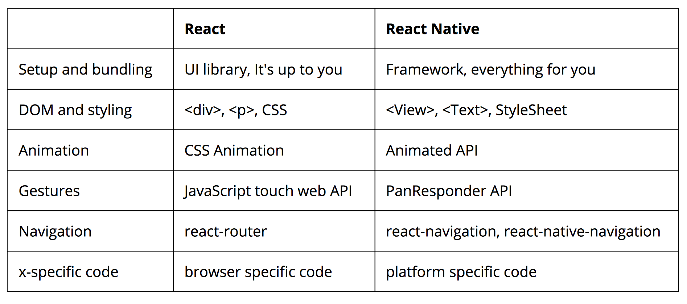

=== React Native 프로젝트 생성 및 설정

===== React Native 프로젝트 만들기
* react-native cli
** 웹에서 프로젝트 만들 수 있음. 배포만 못함
** iOS, Android 기본적인 셋팅을 가지고 있어서 어느정도 설정이 가능함
* create-react-native-app
** Native 앱 설정을 숨겨져 있음. 제공하는 Native 모듈말고 아무것도 사용할 수 없음
** 디바이스 연결이 쉬워서 프로토 타이핑을 빠르게 작성할 수 있음
** expo.io 활용해서 만든 프로젝트. SDK 관리함

===== react-native cli를 이용해 Android 설정
* Node 설치

[source, shell]
----
$ brew install watchman
$ brew install yarn

$ npm install -g react-native-cli react-native-git-upgrade
$ yarn global add react-native-cli react-native-git-upgrade
----

* Java 8 설치
* Android Studio SDK Manager 필요한 부분 설치하고 `vi ~/.bash_profile` 를 통해 안드로이드 Path 설정
** Gradle 업데이트 하면 안됨. SDK 버전 다시 맞춰야 함

[source, shell]
----
$ vi ~/.bash_profile

# ~/.bash_profile
# Java
export JAVA_HOME=/Library/Java/JavaVirtualMachines/jdk1.8.0_162.jdk/Contens/Home

# Android
export ANDROID_HOME=$HOME/Library/Android/sdk
export PATH=$PATH:$ANDROID_HOME/tools
export PATH=$PATH:$ANDROID_HOME/tools/bin
export PATH=$PATH:$ANDROID_HOME/platform-tools
----

* 프로젝트 생성

[source, shell]
----
$ react-native init Project
----

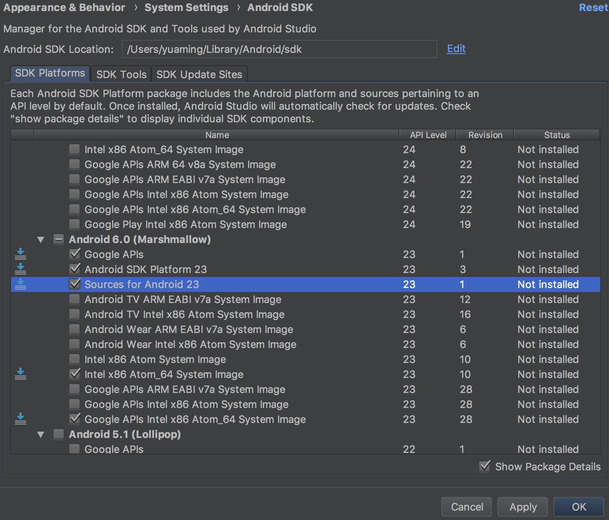
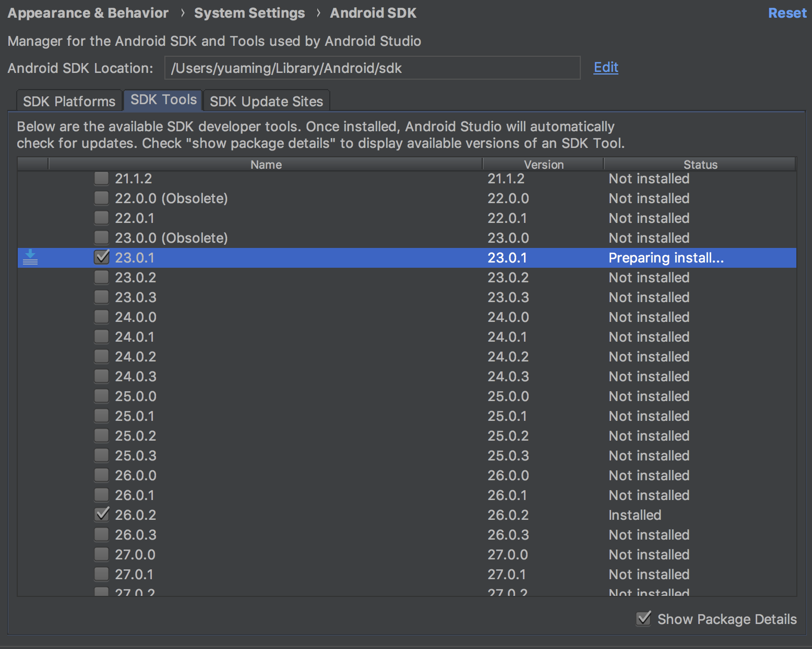

* Android는 에뮬레이터 먼저 띄운 상태에서 진행해야 함
** 안드로이드 장비가 있다면 run-android 진행하면 됨
** 에뮬레이터 없는 상태에서 진행한다면 설치할 장비가 없다는 메세지가 뜸
** 디바이스와 실제 장비는 두 개다 연결하면 안됨. 디바이스는 하나만 하는 것이 좋음

[source, shell]
----
$ react-native run-android
----

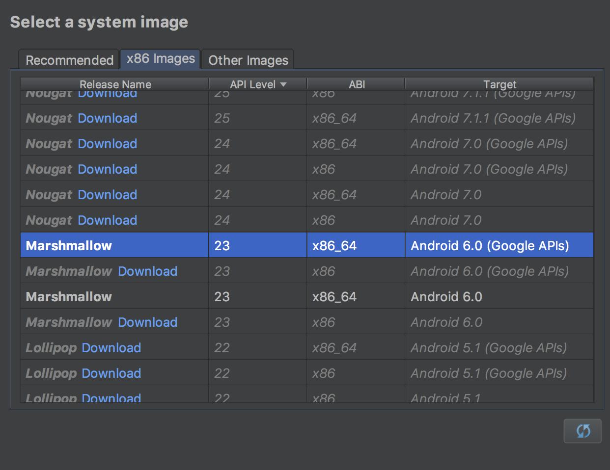
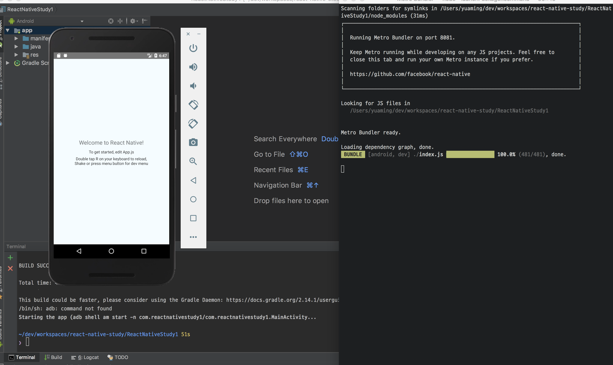

* _Command + D_ 단축키로 아래 화면을 확인할 수 있음
** http://10.0.2.2:8081/ => http://localhost:8081/ 변경
** 새로고침 단축키 _R R_

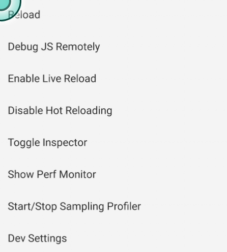

===== react-native cli를 이용해 iOS 설정
* XCode 설치

[source, shell]
----
# 장비 실행
# 같은 네트워크에 있어야 함
$ npm install -g ios-deploy

# 디바이스 연결
$ react-native run-ios --device

# 시뮬레이터 실행
$ react-native run-ios 
----

* _Command + D_
** 설정 메뉴
* _Command + R_
** 새로고침

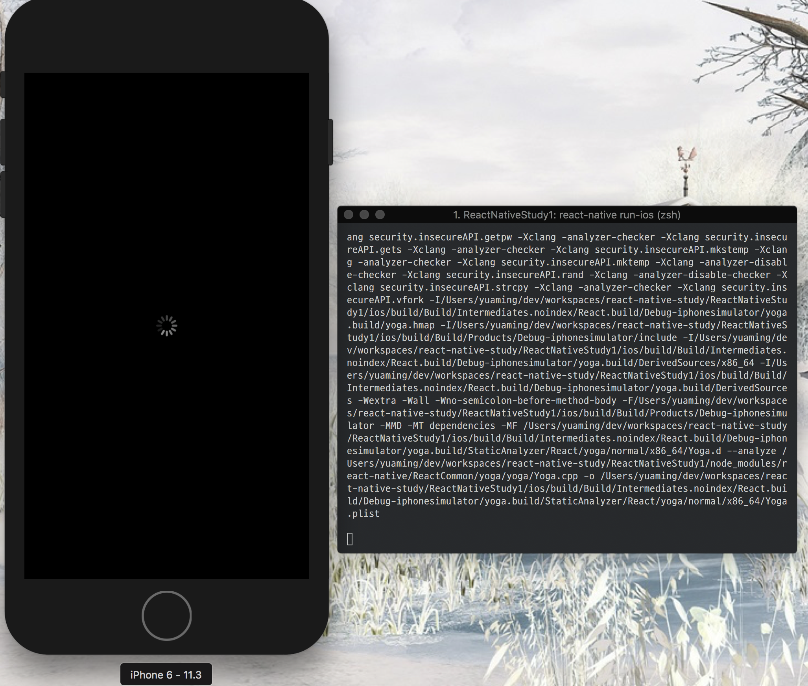

===== create-react-native-app 이용해서 프로젝트 생성
* 프로젝트 환경 설정 시간 최소화
* 디바이스를 이용한 개발이 용이
* XCode, Android Studio 설치 불필요
* 원한다면 "eject"를 통해 네이티브 수정 가능. 원래대로 돌아가지 못함

[source, shell]
----
$ npm install -g create-react-native-app

$ create-react-native-app my-app
$ cd my-app

$ npm run start 

# 시뮬레이터, 에뮬레이터 실행
# iOS는 터미널에서 i를 누름
# Android는 터미널에서 a를 누름
----

=== React Native를 위한 React

===== UI 라이브러리
* 웹에서만 사용한다면 단순한 UI 라이브러리

===== Virtual DOM
* `React and Virtul Dom 링크 참고`

===== 단방향 데이터 흐름
* `In React JS, data flows in one direction, from Parent to Child. This helps components to be simple and predictable 링크 참고`

===== JSX
* 자바스크립트 확장 문법(템플릿 언어가 아님)
* UI가 어떻게 보일지 대한 기술

[source, js]
----
const element = (
  <h1 className="greeting">
    Hello, world!
  </h1>
);

// Babel에 의한 컴파일
const element = React.createElement(
  'h1',
  {className: 'greeting'},
  'Hello, world!'
);

// 반환
const element = {
  type: 'h1',
  props: {
    className: 'greeting',
    children: 'Hello, world!'
  }
};
----

=== Components

===== 정의
* UI를 구성하는 기본 단위
* 독립적이고 재사용 가능한 조각
* 개념적으로는 자바스크립트 함수
* 입력을 받아서 리액트 엘리먼트 반환
* `React Native - Components 링크 참고`

===== 어떻게 동작하는지 집중
* Class Component
* Stateful Component
* Container Component
* Smart Component
* 비즈니스 로직이 들어가 있음

[source, js]
----
class Welcome extends Component {
  state = { data: [] }

  componentDidMount() {
    fetch(...).then(data => {
      this.setState({ data });
    });
  }

  render (
    <View>
      <FlatList data={this.state.data} />
    </View>
  )
}
----

===== 어떻게 보여는지 집중
* Functional Component
* Stateless Component
* Presentational Component
* Dumb Component
* 데이터를 받아서 처리하는 작업이 없음

[source, js]
----
const Welcome = (props) => {
  const { message } = props;
  return (
    <Text>{message}</Text>
  )
}
----

===== Pure Components
* 컴포넌트와 비슷한 점은 State를 가지고 처리함
* 차이점은 데이터를 받을 때(리스트 형태로 뿌려주는 상황) 어떻게 처리할 지 고민해야 함

=== Props, State

===== Props
* 부모에서 받은 데이터
* Immutable Data
* 부모에서 받은 데이터를 변경할 수 있지만, 문제가 발생함

===== State
* 컴포넌트 내부에서 관리되는 정보
* Mutable Data

=== React Life Cycle

===== 16.3 이전
* iOS View Life Cycle과 비슷함
* `React.JS 강좌 7편 Component LifeCycle API 링크 참고`

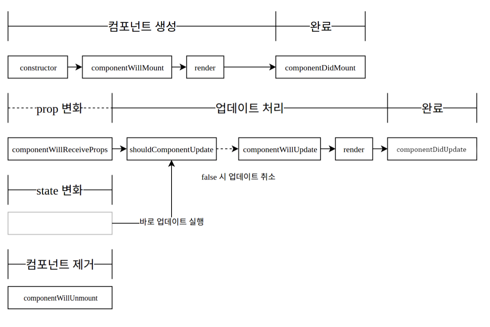

===== 16.3 이후 
* construct와 기능이 많이 겹쳐서 16.3 이후, componentWillAmount가 사라짐 
* `React v16.3.0: New lifecycles and context API 링크 참고`

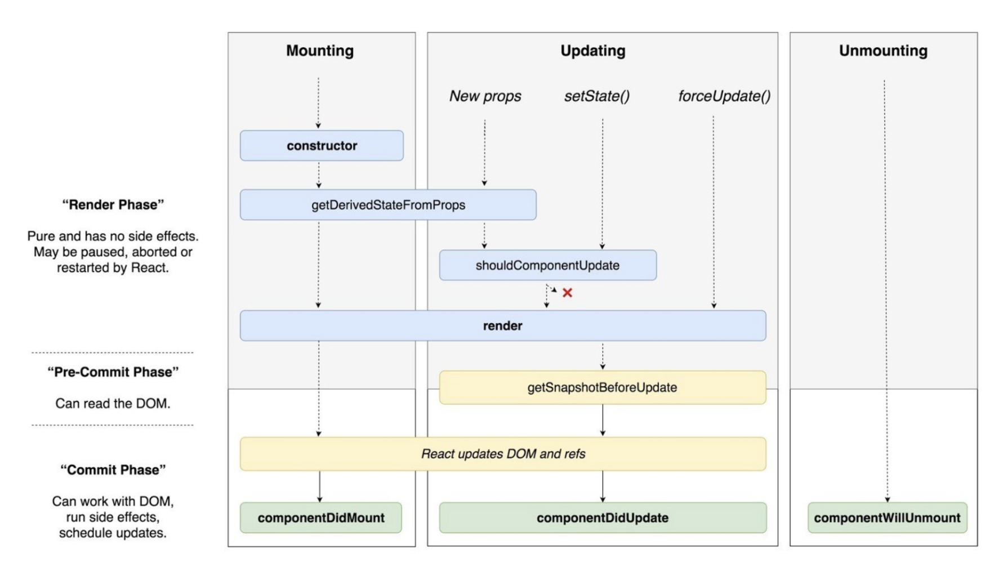

=== JavaScript for React

===== ES6
* `ES6 문법 링크 참고`

===== ES7, 8
* ES6에서 class안에서 static 함수 사용 가능
* ES7에서 class 안에 static 프로퍼티 선언 가능

[source, js]
----
class Cat {
  static legCount = 4
}

console.log(Cat.legCount);
----

* Class Instance Properties

[source, js]
----
// 클래스 인스턴스마다 프로퍼티 선언할 수 있음
class Cat {
  name = 'Tom'
  state = {
    running: true
  }

  constructor() {
    console.log(this.name, this.state.running)
  }
}

new Cat() // Tom true

// 함수가 클래스 인스턴스 프로퍼티에 할당되면 인스턴스에 바인딩 됨
class Cat {
  constructor(name) {
    this.name = name
  }
  printName = () => {
    console.log(this.name)
  }
}
----

* Async, Await
** ES8에서 제공되는 비동기 처리 방법
** 비동기 코드의 겉모습과 동작을 좀 더 동기 코드와 유사하게 만들어 줌
** promise 같이 Non-blocking 
** promise로 인해 빚어지는 비동기 콜백 지옥을 해결함

[source, js]
----
// Promise
const fetchData = () => {
  return fetch('https://localhost:8080/api/');
}

const printData = () => {
  fetchData()
  .then(json => {
    console.log(json);
  })
  .catch(e => {
    console.error("Problem", e);
  });
}

// Async, Await
const fetchData = async () => {
  return fetch('https://localhost:8080/api/')
}

const printData = async () => {
  try {
    const json = await fetchData()
    console.log(json)
  } catch(e) {
    console.error("Problem", e)
  }
}
----

=== Style

===== StyleSheet.create
* 스타일을 위해 특별한 언어나 문법 사용 없이 자바스크립트 이용함
* 웹과 다르게 클래스 개념을 사용하지 않음. 인라인 스타일만 사용함
* 스타일 이름과 값은 웹에서 쓰는 것과 비슷함
* 오브젝트나 스타일을 가진 배열을 전달할 수 있음
* 같은 스타일이 있다면 뒤로 배치된 것이 우선 순위가 높음

===== Flexbox
* main axis
** 컨테이너 주축은 플랙스 아이템들이 배치되는 기본 축
** flexDirection에 의해 결정됨
* main-start, main-end
** 플랙스 아이템들을 주축 시작점에서 주축 끝점으로 이동하여 배치됨
* cross axis
** 주축에 교차되는 축
* cross-start, cross-end
** 플랙스 라인 아이템으로 채워지고 컨테이너 시작점에서 시작하여 크로스 끝 점으로 이동하여 컨테이너를 배치함
* 자세한 내용은 아래 링크 참고
** `Flex 이해: 당신이 알아야 할 모든 것 링크 참고`
** `A Complete Guide to Flexbox 링크 참고`

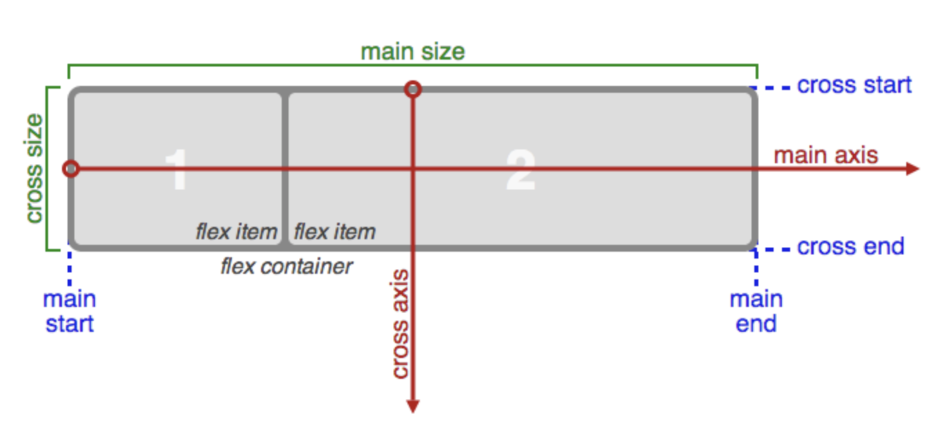

===== flexDirection

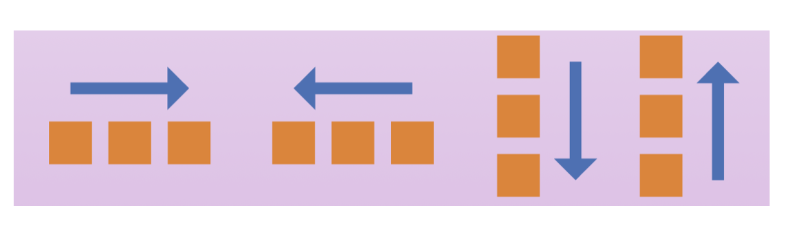

===== flexWrap

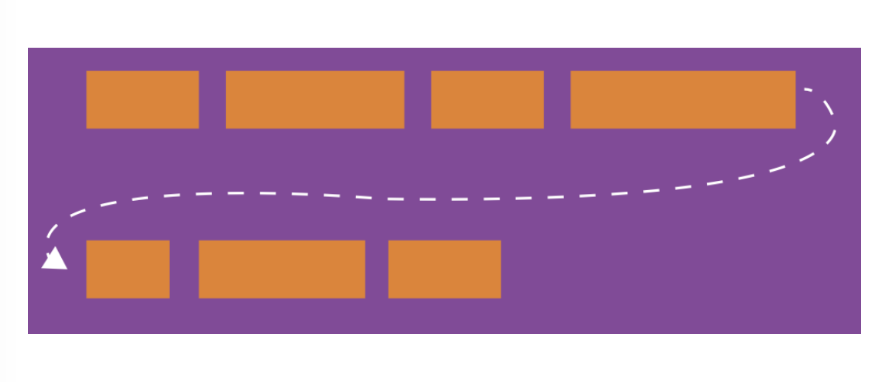

===== justifyContent
* 기본 축에서 flex 아이템을 배치하는 방법을 정의함

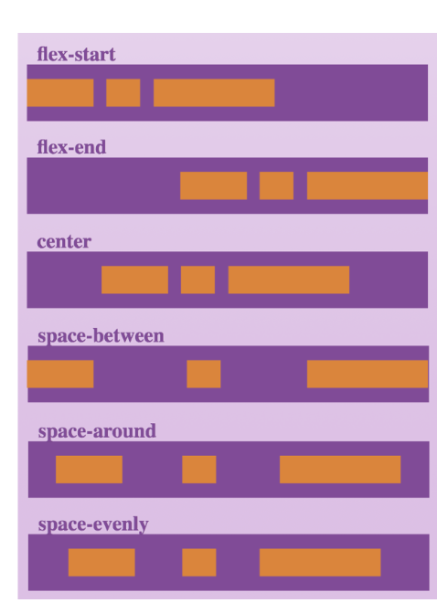

===== alignItems
* 교차축을 따라 어떻게 배치할 지 정의함. justifyContent와 반대되는 개념

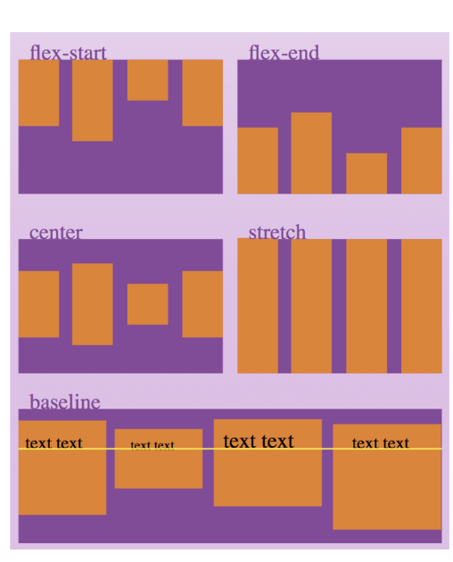

===== alignContent
* 교차 축에 있는 행들을 제어함. 여러 아이템이 한 줄로 배치되어 있다면 아무 효과 없음

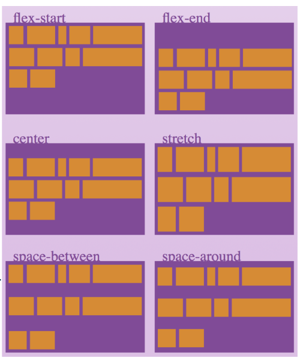

===== flex
* 주축으로 아이템이 배치되어 넘치게 되는 경우 wrap을 할지 결정
* Yoga 라이브러리 따라 동작함
* flex가 양수
** 컴포넌트 크기는 flex 값에 비례해서 사이즈 결정
* flex가 0
** width, height 따라 사이즈가 결정됨
* flex가 음수
** width, height 따라 사이즈가 결정되지만, 공간이 충분하지 않다면 minWidth와 minHeight까지 줄어듬

===== alignSelf

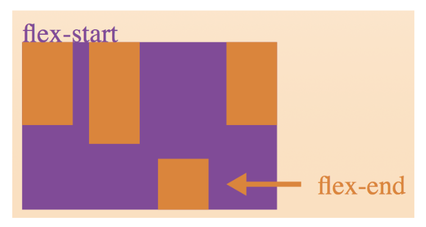

=== 참고
* https://medium.com/@kyo504/번역-잠깐-내가-만든-리액트-네이티브-앱이-시작하면-무슨일이-일어나는거지-리액트-네이티브-안을-들여다보기-2b4a9bce79a2[리액트 네이티브 안을 들여다보기]
* https://medium.com/@alexmngn/from-reactjs-to-react-native-what-are-the-main-differences-between-both-d6e8e88ebf24[What are the main differences between ReactJS and React-Native?]
* https://snack.expo.io
* https://www.youtube.com/watch?v=BYbgopx44vo[React and Virtul Dom]
* https://medium.embengineering.com/in-react-js-data-flows-in-one-direction-from-parent-to-child-841103ed3aed[In React JS, data flows in one direction, from Parent to Child. This helps components to be simple and predictable]
* https://velopert.com/1130[React.JS 강좌 7편 Component LifeCycle API]
* https://medium.com/@baphemot/understanding-react-react-16-3-component-life-cycle-23129bc7a705[Understanding React — React 16.3 + Component life-cycle]
* https://reactjs.org/blog/2018/03/29/react-v-16-3.html[React v16.3.0: New lifecycles and context API]
* https://poiemaweb.com[PoiemaWeb - ES6]
* https://www.vobour.com/1-flexbox-이해-당신이-알아야-할-모든-것-understa[Flex 이해: 당신이 알아야 할 모든 것]
* https://css-tricks.com/snippets/css/a-guide-to-flexbox/[A Complete Guide to Flexbox]
* https://facebook.github.io/react-native/docs/getting-started.html[React Native - Components]